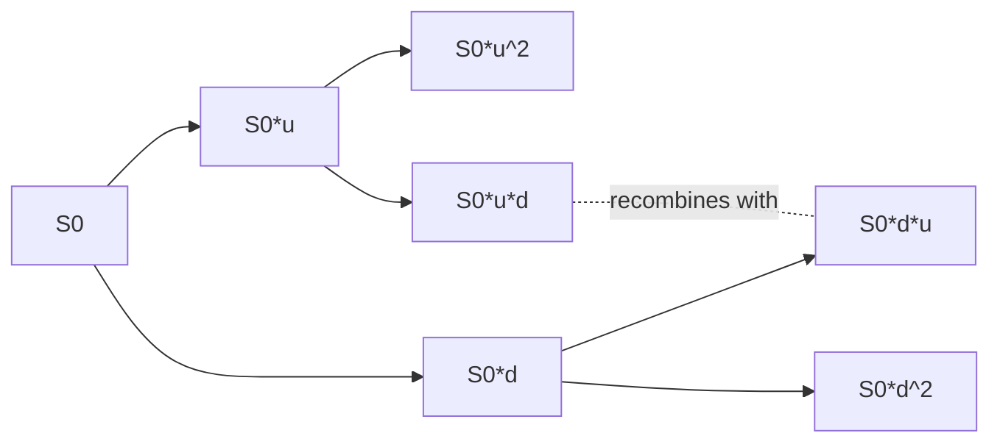

## One Step and Multi Step Binomial Trees


### Definition

The binomial tree model represents the evolution of an asset price over discrete time steps, where at each step the price can move to one of two possible values (up or down). It is a discrete-time analog of geometric Brownian motion and provides an intuitive, computationally tractable framework for derivative pricing based on no-arbitrage and risk-neutral valuation principles.

### One-Step Binomial Model

**Setup**: At $t=0$, the asset price is $S_0$. At $t = \Delta t$, the price moves to either:

$$S_u = S_0 u \quad \text{(up, with real-world probability } p\text{)}$$


$$S_d = S_0 d \quad \text{(down, with real-world probability } 1-p\text{)}$$

where $u > 1 > d > 0$ (no-arbitrage requires $d < e^{r\Delta t} < u$).

### No-Arbitrage Portfolio Replication

Construct a portfolio of $\Delta$ shares of stock and $B$ in the risk-free bond that replicates a derivative's payoff:

$$\Delta S_u + B e^{r\Delta t} = f_u$$


$$\Delta S_d + B e^{r\Delta t} = f_d$$

Solving:

$$\Delta = \frac{f_u - f_d}{S_u - S_d} = \frac{f_u - f_d}{S_0(u-d)}$$


$$B = e^{-r\Delta t}\left(\frac{u f_d - d f_u}{u - d}\right)$$

The derivative price is $f_0 = \Delta S_0 + B$.

### Risk-Neutral Valuation (Equivalent Derivation)

Define the risk-neutral probability $q$ such that the expected stock return under $q$ equals the risk-free rate:

$$q = \frac{e^{r\Delta t} - d}{u - d}$$

The derivative price is then:

$$f_0 = e^{-r\Delta t}\left[q f_u + (1-q) f_d\right]$$

**Key Points**

- $q$ is **not** the real-world probability $p$; it is a mathematical construct derived purely from no-arbitrage conditions.
- The formula for $f_0$ is identical whether derived via replication or via risk-neutral expectation — this equivalence is the discrete-time analog of the martingale pricing framework.
- The real-world drift $\mu$ (embedded in $p$) does not appear anywhere in the pricing formula — a manifestation of risk-neutral pricing's independence from investor risk preferences.

### Choice of $u$ and $d$: The CRR Parameterization

The **Cox-Ross-Rubinstein (CRR)** model sets:

$$u = e^{\sigma\sqrt{\Delta t}}, \qquad d = e^{-\sigma\sqrt{\Delta t}} = 1/u$$

This ensures the tree recombines (an up-then-down move returns to $S_0$) and that, as $\Delta t \to 0$, the discrete model converges to GBM with volatility $\sigma$.

Under CRR, the risk-neutral probability becomes:

$$q = \frac{e^{r\Delta t} - e^{-\sigma\sqrt{\Delta t}}}{e^{\sigma\sqrt{\Delta t}} - e^{-\sigma\sqrt{\Delta t}}}$$

### Multi-Step Binomial Trees

Extending to $n$ steps over total maturity $T$ (with $\Delta t = T/n$), the tree recombines: after $n$ steps, there are $n+1$ possible terminal prices:

$$S_{n,j} = S_0 u^j d^{n-j}, \quad j = 0, 1, \dots, n$$

where $j$ is the number of up-moves.

**Backward Induction Pricing Algorithm**:

1. Compute terminal payoffs $f_{n,j} = \Phi(S_{n,j})$ for $j = 0, \dots, n$.
2. Step backward: $f_{i,j} = e^{-r\Delta t}\left[q\, f_{i+1,j+1} + (1-q) f_{i+1,j}\right]$
3. Repeat until $f_{0,0}$ is obtained — the present value.

### Closed-Form for European Options (CRR Tree)

For a European option, backward induction collapses to a single binomial-distribution sum:

$$f_0 = e^{-rT} \sum_{j=0}^{n} \binom{n}{j} q^j (1-q)^{n-j} \, \Phi(S_0 u^j d^{n-j})$$

This is the discrete analog of the risk-neutral expectation $E^{\mathbb{Q}}[e^{-rT}\Phi(S_T)]$, and converges to the Black-Scholes price as $n \to \infty$.

### Pricing American Options: The Key Advantage

Binomial trees natively handle **early exercise** by comparing the continuation value to the intrinsic value at every node:

$$f_{i,j} = \max\left(\Phi(S_{i,j}), \; e^{-r\Delta t}\left[q\, f_{i+1,j+1} + (1-q) f_{i+1,j}\right]\right)$$

This is the primary reason binomial trees remain standard in practice for American-style equity options, despite closed-form solutions being unavailable in the Black-Scholes PDE framework directly.

### Implementation

```python
import numpy as np

def binomial_tree_price(S0, K, T, r, sigma, n, option_type='call', american=False):
    dt = T / n
    u = np.exp(sigma * np.sqrt(dt))
    d = 1 / u
    q = (np.exp(r * dt) - d) / (u - d)
    disc = np.exp(-r * dt)

    # Terminal stock prices
    j = np.arange(n + 1)
    S_T = S0 * u**j * d**(n - j)

    # Terminal payoffs
    if option_type == 'call':
        values = np.maximum(S_T - K, 0)
    else:
        values = np.maximum(K - S_T, 0)

    # Backward induction
    for i in range(n - 1, -1, -1):
        values = disc * (q * values[1:i+2] + (1 - q) * values[0:i+1])
        if american:
            j_i = np.arange(i + 1)
            S_i = S0 * u**j_i * d**(i - j_i)
            intrinsic = np.maximum(S_i - K, 0) if option_type == 'call' else np.maximum(K - S_i, 0)
            values = np.maximum(values, intrinsic)

    return values[0]
```

**Example**

```python
price_euro = binomial_tree_price(S0=100, K=100, T=1, r=0.05, sigma=0.2, n=500, 
                                    option_type='put', american=False)
price_amer = binomial_tree_price(S0=100, K=100, T=1, r=0.05, sigma=0.2, n=500, 
                                    option_type='put', american=True)
print(f"European put: {price_euro:.4f}")
print(f"American put: {price_amer:.4f}")
```

**Output** (approximate, $n=500$): European put ≈ 5.57 (converges toward Black-Scholes value ≈ 5.57), American put ≈ 6.09 — the early-exercise premium reflects the value of optimal early exercise for a put on a non-dividend-paying stock. [Unverified — exact values depend on `n` convergence and numerical precision]

### Convergence to Black-Scholes

As $n \to \infty$ (equivalently $\Delta t \to 0$), the CRR binomial tree price converges to the Black-Scholes closed-form price for European options. Convergence exhibits an oscillatory pattern (odd/even $n$ effects) common to CRR trees; **[Inference]** practitioners sometimes use averaging techniques (e.g., averaging prices at $n$ and $n+1$) or alternative parameterizations (Jarrow-Rudd, Leisen-Reimer) to smooth convergence and improve numerical efficiency for a given tree size.

### Alternative Parameterizations

| Model | $u$ | $d$ | Notes |
| --- | --- | --- | --- |
| CRR | $e^{\sigma\sqrt{\Delta t}}$ | $1/u$ | Symmetric in log-space; most common |
| Jarrow-Rudd | $e^{(r-\sigma^2/2)\Delta t + \sigma\sqrt{\Delta t}}$ | $e^{(r-\sigma^2/2)\Delta t - \sigma\sqrt{\Delta t}}$ | Real-world probability set to $1/2$ |
| Leisen-Reimer | Calibrated via inverse normal CDF | — | Faster, smoother convergence for European options |

### Diagram: Two-Step Recombining Tree



### Multi-Asset and Extensions

- **Trinomial trees**: add a "flat" middle branch, improving flexibility for barrier options and stability for certain parameter regimes.
- **Implied trees** (Derman-Kani, Rubinstein): calibrate local up/down probabilities at each node to match observed market option prices, capturing volatility smile effects.
- **Multi-dimensional trees**: extend to multiple correlated underlyings, though the node count grows exponentially with dimension (curse of dimensionality), limiting practicality beyond 2-3 assets.

### Limitations

- Computational cost grows as $O(n^2)$ for standard implementation (though vectorized as $O(n)$ per step, $O(n)$ steps).
- Path-dependent payoffs (Asian, lookback) generally break the recombining property (since payoff depends on full path, not just terminal node), requiring non-recombining trees or Monte Carlo instead.
- Constant $\sigma$ assumption inherited from the CRR/GBM limiting connection; does not natively capture volatility skew unless using implied-tree variants.

### Related Topics

- Cox-Ross-Rubinstein Model and Convergence to Black-Scholes
- Risk-Neutral Valuation and Replication Arguments
- American Option Pricing and Optimal Exercise
- Trinomial Trees and Implied Trees
- Geometric Brownian Motion
- Monte Carlo Methods for Derivatives Pricing
- Finite Difference Methods
- Volatility Smile and Local Volatility Models