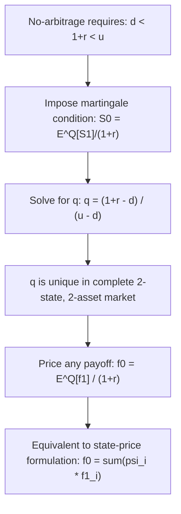

## Risk Neutral Probabilities in Discrete Time

### Definition

Risk-neutral probabilities are the mathematical probabilities under which the discounted price of every tradable asset in a market is a martingale. In discrete time, they are constructed directly from no-arbitrage conditions rather than from any statistical estimate of real-world likelihoods, and they form the theoretical foundation for pricing derivatives as discounted expected payoffs.

### Single-Period Setup

Consider a single-period market with one risky asset $S$ and a risk-free bond $B$. At $t=0$: $S_0$, $B_0=1$. At $t=1$, the asset takes one of $N$ possible states $S_1(\omega_i)$, $i=1,\dots,N$, and the bond grows to $B_1 = 1+r$ (or $e^{r\Delta t}$ in continuous compounding).

**No-Arbitrage Condition**: A set of risk-neutral probabilities $\{q_i\}$ exists (with $q_i \geq 0$, $\sum_i q_i = 1$) satisfying:

$$S_0 = \frac{1}{1+r} \sum_{i=1}^N q_i \, S_1(\omega_i) = E^{\mathbb{Q}}\left[\frac{S_1}{1+r}\right]$$

This is the discrete-time martingale condition: the discounted asset price equals its expected discounted future value under $\mathbb{Q}$.

### Derivation in the Binomial Case

For $S_1 \in \{S_0 u, S_0 d\}$ with $d < 1+r < u$ (no-arbitrage bounds), solve:

$$S_0 = \frac{1}{1+r}\left[q \cdot S_0 u + (1-q) \cdot S_0 d\right]$$


$$q = \frac{(1+r) - d}{u - d}$$

**Key Points**

- $q$ depends only on $u$, $d$, and $r$ — never on the real-world probability $p$ of an up-move, and never on investor risk preferences or the real drift $\mu$.
- $d < 1+r < u$ is both necessary and sufficient for $q \in (0,1)$, and is exactly the no-arbitrage condition for the market.
- If $1+r \leq d$ or $1+r \geq u$, arbitrage exists (borrowing/lending against the risk-free rate dominates or is dominated by the stock in all states).

### Relationship to the Fundamental Theorem of Asset Pricing (Discrete Version)

| Concept | Discrete-Time Statement |
| --- | --- |
| **First FTAP** | No arbitrage $\iff$ there exists at least one risk-neutral (equivalent martingale) measure $\mathbb{Q}$ |
| **Second FTAP** | Market is complete $\iff$ the risk-neutral measure is unique |

**Completeness in the binomial model**: With one risky asset and two states per period, the market is exactly complete (2 traded assets: stock + bond, spanning 2 states) — hence $q$ is unique. In a multi-state single-period model with $N>2$ states and only 2 traded assets, the market is **incomplete**, and infinitely many valid $\{q_i\}$ satisfy the no-arbitrage constraint — derivative prices are then not uniquely determined by no-arbitrage alone.

### General Pricing Formula

For any derivative with payoff $f_1(\omega_i)$ at $t=1$:

$$f_0 = \frac{1}{1+r} E^{\mathbb{Q}}[f_1] = \frac{1}{1+r}\sum_i q_i f_1(\omega_i)$$

This formula holds for **any** payoff, since $\mathbb{Q}$ is constructed to price the underlying correctly and, in a complete market, this pins down the price of every replicable claim consistently.

### State Prices (Arrow-Debreu Prices)

An equivalent formulation uses **state prices** $\psi_i$, defined as the price today of a security paying $1 in state $i$ and $0 otherwise:

$$\psi_i = \frac{q_i}{1+r}$$

Any payoff can then be priced as:

$$f_0 = \sum_i \psi_i \, f_1(\omega_i)$$

**Key Points**

- $\sum_i \psi_i = \frac{1}{1+r}$ (the price of a risk-free $1 payoff in every state, i.e., the discount factor).
- State prices are strictly positive if and only if the market is arbitrage-free.
- $q_i = \psi_i (1+r)$ normalizes state prices into probabilities summing to 1.

### Extension to Multi-Period Trees

In a multi-step recombining tree, risk-neutral probabilities are applied **locally** at each node, with the same $q$ typically reused at every step if $u$, $d$, $r$ are constant (as in the CRR framework):

$$f_{i,j} = \frac{1}{1+r}\left[q \, f_{i+1,j+1} + (1-q)\, f_{i+1,j}\right]$$

The unconditional risk-neutral probability of reaching a specific terminal node after $n$ up-moves in $n$ total steps follows a **binomial distribution**:

$$\mathbb{Q}(j \text{ up-moves in } n \text{ steps}) = \binom{n}{j} q^j (1-q)^{n-j}$$

This gives the closed-form European option pricing formula:

$$f_0 = \frac{1}{(1+r)^n}\sum_{j=0}^n \binom{n}{j} q^j(1-q)^{n-j} \Phi(S_0 u^j d^{n-j})$$

### Numerical Example

```python
def risk_neutral_prob(u, d, r):
    """Single-period risk-neutral up probability."""
    return (1 + r - d) / (u - d)

# Example
u, d, r = 1.2, 0.85, 0.05
q = risk_neutral_prob(u, d, r)
print(f"Risk-neutral probability q = {q:.4f}")

# Verify martingale property
S0 = 100
S_up, S_down = S0 * u, S0 * d
expected_discounted = (q * S_up + (1 - q) * S_down) / (1 + r)
print(f"E^Q[S1]/(1+r) = {expected_discounted:.4f} (should equal S0 = {S0})")
```

**Output**: $q \approx 0.5714$; $E^{\mathbb{Q}}[S_1]/(1+r) = 100.00$, confirming the martingale/no-arbitrage condition holds by construction.

### Contrast: Real-World vs. Risk-Neutral Probabilities

| Aspect | Real-world $p$ | Risk-neutral $q$ |
| --- | --- | --- |
| Source | Statistical estimation, historical data, investor beliefs | Derived algebraically from $u,d,r$ (no-arbitrage) |
| Use | Risk management (VaR, actual forecasting), physical-measure simulation | Derivative pricing exclusively |
| Relationship to $\mu$ | Embeds the true expected return $\mu$ | Embeds only $r$; independent of $\mu$ |
| Typical value vs. $p$ | — | Generally $q \neq p$; $q$ implicitly reflects risk aversion priced into $u,d$ |

**[Inference]** The gap between $p$ and $q$ is sometimes loosely described as reflecting the market price of risk, since the risk-neutral measure adjusts for the risk premium investors demand — analogous to the continuous-time Girsanov drift adjustment $\theta_t = (\mu-r)/\sigma$.

### Diagram: Construction of Risk-Neutral Probability



### Connection to Continuous Time

As $\Delta t \to 0$ in the CRR binomial framework, the discrete risk-neutral probability $q$ and the discrete martingale condition converge to the continuous-time risk-neutral measure $\mathbb{Q}$ constructed via Girsanov's Theorem, and the discrete pricing sum converges to the continuous risk-neutral expectation $E^{\mathbb{Q}}[e^{-rT}\Phi(S_T)]$ underlying Feynman-Kac and Black-Scholes.

### Practical Relevance

- **Calibration**: in incomplete or multi-state discrete models, $q_i$ are often calibrated to match observed market prices of liquid instruments (rather than derived purely from theory), analogous to implied-tree calibration in continuous time.
- **Consistency checks**: verifying $\sum_i \psi_i (1+r) = 1$ and $\psi_i > 0$ for all $i$ is a standard arbitrage-free sanity check in any discrete pricing model.
- **Incomplete markets**: when $q$ is not unique, practitioners typically select $\mathbb{Q}$ via a criterion such as minimal relative entropy or variance, since no-arbitrage alone underdetermines the price. [Unverified — the specific selection criterion used varies significantly by institution and asset class]

### Related Topics

- One-Step and Multi-Step Binomial Trees
- Fundamental Theorem of Asset Pricing
- State Prices and Arrow-Debreu Securities
- Girsanov's Theorem and Change of Measure (Continuous-Time Analog)
- Market Completeness and Incomplete Markets
- Cox-Ross-Rubinstein Model
- Martingales and Filtrations
- Implied Trees and Local Volatility Calibration