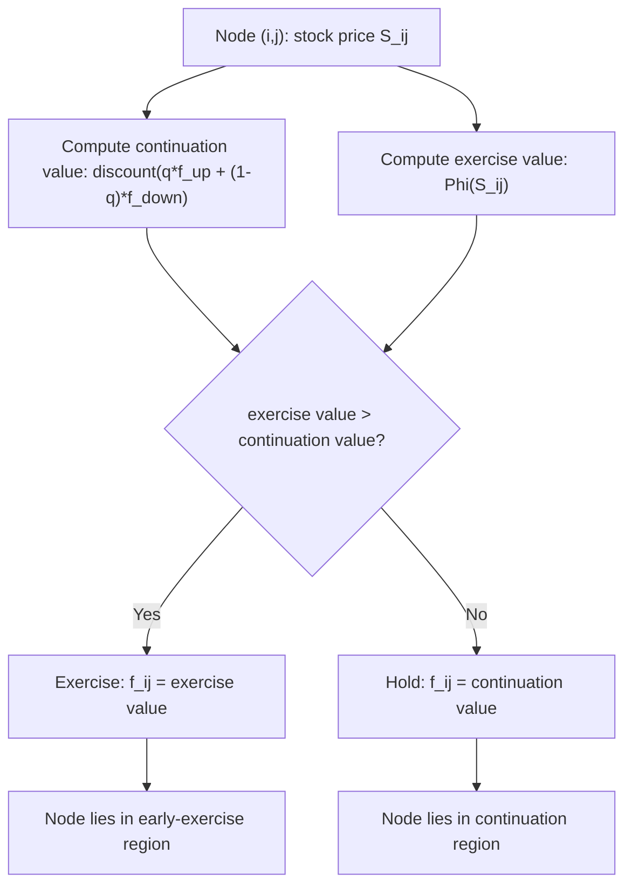

## Pricing American Options on Trees

### Definition

American options grant the holder the right to exercise at any time up to and including maturity, in contrast to European options exercisable only at maturity. Binomial (and trinomial) trees are the standard workhorse for pricing American options because the discrete-time, backward-induction structure naturally accommodates the optimal-stopping decision at every node — a feature that closed-form PDE solutions generally lack.

### The Optimal Stopping Problem

At each node, the holder compares the value of exercising immediately (intrinsic value) against the value of continuing to hold the option (continuation value, i.e., the discounted expected value of holding one more period):

$$f_{i,j} = \max\Big(\underbrace{\Phi(S_{i,j})}_{\text{exercise value}}, \; \underbrace{e^{-r\Delta t}\left[q\, f_{i+1,j+1} + (1-q) f_{i+1,j}\right]}_{\text{continuation value}}\Big)$$

where $\Phi(S) = \max(S-K,0)$ for a call or $\max(K-S,0)$ for a put.

**Key Points**

- This recursive comparison at every node is exactly a discrete-time **dynamic programming / optimal stopping** formulation.
- The early-exercise feature makes American options **path-independent in the tree sense** (the decision at each node depends only on the current state, not the path taken to reach it) — this is what preserves the tree's recombining structure and computational tractability.
- Unlike European options, no closed-form binomial-sum formula exists for American options in general — full backward induction is required.

### Backward Induction Algorithm

1. **Terminal nodes** ($i=n$): $f_{n,j} = \Phi(S_{n,j})$ for $j = 0,\dots,n$ (exercise value only, since maturity is the last exercise opportunity).
2. **Intermediate nodes** ($i = n-1, \dots, 0$): compute continuation value from the two successor nodes, discount, then take the max against the immediate exercise value.
3. **Root node** ($i=0$): $f_{0,0}$ is the American option price.

### Implementation

```python
import numpy as np

def american_option_tree(S0, K, T, r, sigma, n, option_type='put'):
    dt = T / n
    u = np.exp(sigma * np.sqrt(dt))
    d = 1 / u
    q = (np.exp(r * dt) - d) / (u - d)
    disc = np.exp(-r * dt)

    # Terminal stock prices and payoffs
    j = np.arange(n + 1)
    S = S0 * u**j * d**(n - j)
    if option_type == 'put':
        values = np.maximum(K - S, 0)
    else:
        values = np.maximum(S - K, 0)

    # Backward induction with early-exercise check at every node
    for i in range(n - 1, -1, -1):
        continuation = disc * (q * values[1:i+2] + (1 - q) * values[0:i+1])
        j_i = np.arange(i + 1)
        S_i = S0 * u**j_i * d**(i - j_i)
        exercise = np.maximum(K - S_i, 0) if option_type == 'put' else np.maximum(S_i - K, 0)
        values = np.maximum(continuation, exercise)

    return values[0]
```

**Example**

```python
put_amer = american_option_tree(S0=100, K=100, T=1, r=0.05, sigma=0.2, n=1000, option_type='put')
put_euro = american_option_tree(S0=100, K=100, T=1, r=0.05, sigma=0.2, n=1000, option_type='put')  # compare w/ European
print(f"American put: {put_amer:.4f}")
```

**Output** (approximate, $n=1000$): American put ≈ 6.09, versus the European put ≈ 5.57 at the same parameters — the difference (~0.52) is the **early-exercise premium**. [Unverified — precise values depend on `n` and floating-point convergence]

### Early Exercise Boundary

At each time step $i$, there exists a critical stock price $S^*_i$ separating the "exercise" and "continue" regions:

- **American put**: exercise when $S_{i,j} \leq S^*_i$ (deep in-the-money).
- **American call (with dividends)**: exercise when $S_{i,j} \geq S^*_i$ (deep in-the-money, just before a dividend).

The collection $\{S^*_i\}$ across time forms the **early-exercise boundary**, a curve that can be extracted from the tree by recording, at each level, the node closest to the exercise/continuation transition.

### American Calls: When Early Exercise Matters

**No dividends**: For a non-dividend-paying stock, an American call should **never** be exercised early — its value equals the European call value. This follows because the call's continuation value always exceeds its intrinsic value when there's no cost to holding (time value of money and insurance value against downside both favor waiting).

**With discrete dividends**: Early exercise can become optimal immediately before an ex-dividend date, since the dividend payment reduces the stock price (and hence the option's future value) without benefiting the option holder. Handling this in a tree requires adjusting node prices around dividend dates (see below).

**American puts**: Early exercise can be optimal even without dividends, because receiving the strike $K$ early has time value — this makes American puts strictly more valuable than European puts in general (excluding trivial cases).

### Incorporating Discrete Dividends

**Method 1 — Escrowed dividend model**: Reduce $S_0$ by the present value of future discrete dividends before building the tree; apply standard tree construction on the adjusted (dividend-free) price process.

**Method 2 — Direct dividend adjustment on the tree**: At the tree node corresponding to the ex-dividend date, subtract the dividend amount $D$ from each node's stock price, which breaks recombination (requires a non-recombining or piecewise-recombining tree, increasing computational cost).

**Proportional (dividend yield) model**: If dividends are modeled as a continuous yield $q_{div}$, simply replace $r$ with $r - q_{div}$ in the drift and risk-neutral probability — the tree remains recombining, since this is equivalent to a lower effective drift.

### Diagram: Exercise Decision at a Node



### Convergence and Accuracy

American option tree prices converge to the true (continuous-time) price as $n \to \infty$, similar to European options, but convergence can be slower and less smooth because the early-exercise boundary is only approximated at the discrete set of tree dates — the true optimal-stopping boundary is a continuous curve. **[Inference]** Richardson extrapolation and variance-reduction-style smoothing techniques are commonly applied in practice to accelerate convergence for a fixed computational budget, though the specific technique used varies by implementation.

### Comparison with Alternative American Pricing Methods

| Method | Approach | Trade-offs |
| --- | --- | --- |
| Binomial/trinomial tree | Backward induction with exercise check at every node | Simple, robust, standard for single-asset American options; slow for high dimensions |
| Finite difference (PDE) with free boundary | Solve Black-Scholes PDE as a variational inequality | More efficient for fine grids; handles Greeks smoothly |
| Least-Squares Monte Carlo (Longstaff-Schwartz) | Simulate forward paths, regress continuation value backward | Handles high-dimensional/path-dependent American-style payoffs (e.g., American basket options) where trees become infeasible |

### Practical Relevance

- **Standard for listed American equity options**: binomial trees remain a common industry benchmark for American equity option pricing given their simplicity and native handling of discrete dividends.
- **Greeks estimation**: Delta, Gamma, and Theta can be extracted directly from neighboring tree node values (finite-difference approximations built into the tree structure) without needing separate perturbation runs.
- **Barrier and American-barrier hybrids**: trees can be adapted (with node-placement adjustments) to price options combining early exercise and barrier knock-out features, though care is needed to align tree levels with the barrier for accuracy.

### Related Topics

- One-Step and Multi-Step Binomial Trees
- Risk-Neutral Probabilities in Discrete Time
- Free-Boundary Problems and Variational Inequalities
- Longstaff-Schwartz Least-Squares Monte Carlo
- Finite Difference Methods for American Options
- Dividend Adjustments in Option Pricing Models
- Greeks Estimation from Trees
- Optimal Stopping Theory