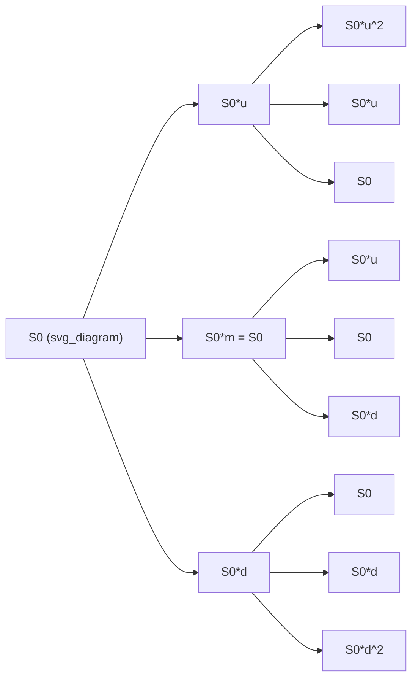

## Trinomial Tree Models

### Definition and Core Concept

A trinomial tree is a discrete-time lattice method for pricing derivatives in which the underlying asset price can move to one of three possible states — up, middle (stay/flat), or down — at each time step, in contrast to the binomial tree's two possible states. The additional degree of freedom (three nodes instead of two) allows the tree to match both the mean and variance of the underlying's continuous-time process more flexibly, and provides an extra parameter that can be used to improve numerical stability, convergence speed, or to align tree nodes with special features like barriers.

At each step of size $\Delta t$, the asset price $S$ moves to:

$$S_u = Su, \quad S_m = S, \quad S_d = Sd$$

with corresponding risk-neutral probabilities $p_u$, $p_m$, $p_d$ where $p_u + p_m + p_d = 1$.

### Standard Parameterization (Boyle's Model)

The most common construction (Boyle, 1986) sets:

$$u = e^{\sigma\sqrt{3\Delta t}}, \quad d = \frac{1}{u}, \quad m = 1$$

The probabilities are chosen to match the first two moments (mean and variance) of the risk-neutral asset return, plus the normalization condition:

$$p_u = \frac{1}{6} + \frac{(r - \tfrac{1}{2}\sigma^2)\sqrt{\Delta t}}{2\sigma\sqrt{3}}$$

$$p_d = \frac{1}{6} - \frac{(r - \tfrac{1}{2}\sigma^2)\sqrt{\Delta t}}{2\sigma\sqrt{3}}$$

$$p_m = \frac{2}{3}$$

where $r$ is the risk-free rate and $\sigma$ is the volatility of the underlying. This parameterization guarantees the discrete process converges to geometric Brownian motion as $\Delta t \to 0$, matching both drift and variance in the limit.

**Moment-matching conditions being solved:**

$$p_u u + p_m m + p_d d = e^{r\Delta t}$$

$$p_u u^2 + p_m m^2 + p_d d^2 = e^{(2r+\sigma^2)\Delta t}$$

$$p_u + p_m + p_d = 1$$

### Why Trinomial Over Binomial

**Key Points**

- **Extra degree of freedom**: With three parameters ($u$, $d$, and the probability split) instead of two, the tree has room to match more moments or impose additional constraints (e.g., placing a node exactly on a barrier level) without sacrificing convergence.
- **Faster convergence**: For the same number of time steps, trinomial trees generally converge to the Black-Scholes price faster and more smoothly than binomial trees, which exhibit characteristic oscillation (sawtooth pattern) in price versus number of steps.
- **Better handling of barriers and discontinuities**: Because node spacing can be tuned, trinomial trees can align lattice points with barrier levels, strike prices, or ex-dividend dates, avoiding the interpolation error that occurs when a binomial tree's nodes straddle a barrier.
- **Equivalence to explicit finite differences**: The standard trinomial tree is mathematically equivalent to the explicit finite-difference method applied to the Black-Scholes PDE, connecting lattice methods directly to PDE-based numerical schemes.

### Backward Induction Algorithm

**Step 1**: Build the tree forward from $S_0$ over $N$ time steps of size $\Delta t = T/N$, generating $2N+1$ terminal nodes at maturity (since each step can move up, stay, or down independently across the layers, though recombining trees reuse nodes).

**Step 2**: Compute terminal payoffs at each ending node, e.g., for a call: $\max(S_T - K, 0)$.

**Step 3**: Roll backward through the tree, discounting the risk-neutral expectation at each node:

$$V_{i,j} = e^{-r\Delta t}\left(p_u V_{i+1,j+1} + p_m V_{i+1,j} + p_d V_{i+1,j-1}\right)$$

where $i$ indexes the time step and $j$ indexes the node level.

**Step 4**: For American-style options, compare the continuation value against immediate exercise at each node and take the maximum:

$$V_{i,j} = \max\left(\text{Exercise Payoff}_{i,j},\ e^{-r\Delta t}\left(p_u V_{i+1,j+1} + p_m V_{i+1,j} + p_d V_{i+1,j-1}\right)\right)$$

**Step 5**: The root node value $V_{0,0}$ is the derivative's present value.

### Tree Structure Diagram

Note the recombining property: $S_{u,d} = S_{m,m} = S_{d,u} = S_0$, meaning the number of distinct nodes at time step $i$ is $2i+1$, not $3^i$ — this is essential for computational tractability.

### Worked Example: European Call Option

**Parameters:** $S_0 = 100$, $K = 100$, $r = 0.05$, $\sigma = 0.2$, $T = 1$, $N = 2$ steps, so $\Delta t = 0.5$.

**Step 1 — Compute tree parameters:**

$$u = e^{0.2\sqrt{3 \times 0.5}} = e^{0.2 \times 1.2247} = e^{0.2449} \approx 1.2775$$

$$d = 1/u \approx 0.7828$$

$$m = 1$$

**Step 2 — Compute probabilities:**

$$p_u = \frac{1}{6} + \frac{(0.05 - 0.02)\sqrt{0.5}}{2 \times 0.2 \times \sqrt{3}} = \frac{1}{6} + \frac{0.03 \times 0.7071}{0.6928} \approx 0.1667 + 0.0306 \approx 0.1973$$

$$p_d = \frac{1}{6} - 0.0306 \approx 0.1361$$

$$p_m = \frac{2}{3} \approx 0.6667$$

**Step 3 — Terminal asset prices (5 nodes at $N=2$):**

| Node | Price |
| --- | --- |
| $S_{uu}$ | $100 \times 1.2775^2 \approx 163.20$ |
| $S_{um}$ (=$S_u$) | $100 \times 1.2775 \approx 127.75$ |
| $S_{mm}$ (=$S_0$) | $100.00$ |
| $S_{md}$ (=$S_d$) | $100 \times 0.7828 \approx 78.28$ |
| $S_{dd}$ | $100 \times 0.7828^2 \approx 61.28$ |

**Step 4 — Terminal payoffs (call, $K=100$):**

$$63.20,\quad 27.75,\quad 0.00,\quad 0.00,\quad 0.00$$

**Step 5 — Backward induction (discount factor $e^{-0.05 \times 0.5} \approx 0.9753$):**

At the upper intermediate node ($S_u \approx 127.75$):

$$V_u = 0.9753 \times (0.1973 \times 63.20 + 0.6667 \times 27.75 + 0.1361 \times 0.00) \approx 0.9753 \times (12.47 + 18.50) \approx 30.25$$

At the middle node ($S_0 = 100$):

$$V_m = 0.9753 \times (0.1973 \times 27.75 + 0.6667 \times 0.00 + 0.1361 \times 0.00) \approx 0.9753 \times 5.47 \approx 5.34$$

At the lower node, all downstream payoffs are zero, so $V_d = 0$.

**Step 6 — Discount to root:**

$$V_0 = 0.9753 \times (0.1973 \times 30.25 + 0.6667 \times 5.34 + 0.1361 \times 0.00) \approx 0.9753 \times (5.97 + 3.56) \approx 9.29$$

The trinomial tree estimates the call price at approximately **$9.29**, consistent with the Black-Scholes closed-form value for these parameters (which is approximately $10.45 — the discrepancy here reflects the coarseness of only $N=2$ steps; convergence improves rapidly as $N$ increases). [Inference: exact numerical agreement depends on precise rounding through each step; production implementations should carry full floating-point precision rather than the rounded intermediate values shown for illustration.]

### Alternative Parameterizations

**Kamrad-Ritchken (1991) Model**

Introduces a stretch parameter $\lambda \geq 1$ controlling node spacing independently of the moment-matching conditions:

$$u = e^{\lambda\sigma\sqrt{\Delta t}}, \quad d = 1/u, \quad m = 1$$

$$p_u = \frac{1}{2\lambda^2} + \frac{(r - \tfrac{1}{2}\sigma^2)\sqrt{\Delta t}}{2\lambda\sigma}, \quad p_d = \frac{1}{2\lambda^2} - \frac{(r - \tfrac{1}{2}\sigma^2)\sqrt{\Delta t}}{2\lambda\sigma}, \quad p_m = 1 - \frac{1}{\lambda^2}$$

When $\lambda = \sqrt{3}$, this reduces to Boyle's standard parameterization. Larger $\lambda$ widens node spacing (useful for aligning with barriers further from the current price); $\lambda$ too close to 1 can produce negative probabilities, which is numerically invalid and must be avoided by parameter constraints.

**Barrier-Fitted Trinomial Trees**

For barrier options, the stretch parameter or time-step structure is adjusted so that a layer of tree nodes lies exactly on the barrier level, eliminating the interpolation bias that arises when the barrier falls between nodes (this bias is a well-documented source of pricing error in naive binomial barrier implementations).

### Comparison: Binomial vs. Trinomial Trees

| Feature | Binomial Tree | Trinomial Tree |
| --- | --- | --- |
| Branches per node | 2 | 3 |
| Nodes at step $N$ | $N+1$ | $2N+1$ |
| Convergence pattern | Oscillatory (sawtooth) | Smoother, generally faster |
| Barrier option accuracy | Prone to interpolation bias | Can align nodes exactly with barriers |
| Computational cost per step | Lower | Higher (roughly 1.5x more node evaluations) |
| Free parameters | 2 (u, d, or equivalently p) | 3 (u, d, and probability split, or stretch parameter) |
| PDE equivalence | Related to explicit FD under specific parameterization | Directly equivalent to explicit finite-difference scheme |

### Convergence and Stability Considerations

- **Probability positivity constraint**: All of $p_u, p_m, p_d$ must lie in $[0,1]$. For the standard Boyle parameterization, this requires $\Delta t$ not too large relative to $\sigma^2$; violating this produces negative probabilities, an invalid model state that signals the time step must be refined.
- **Stability vs. explicit finite differences**: Because the standard trinomial tree is equivalent to an explicit finite-difference scheme, it inherits that scheme's stability condition, roughly $\Delta t \leq \frac{(\Delta x)^2}{\sigma^2 S^2}$-type constraints in the underlying discretization; excessively large time steps relative to volatility can produce nonsensical or unstable output.
- **American options**: The early-exercise comparison at each node adds computational overhead but no fundamental algorithmic complexity; the same max-operator applied in binomial trees generalizes directly.
- [Unverified: the exact numerical thresholds at which a given implementation transitions from stable to unstable behavior are implementation- and precision-dependent, and should be validated empirically for any specific codebase rather than assumed from theoretical bounds alone.]

### Practical Implementation Notes

- Trinomial trees are typically implemented with vectorized array operations (rather than explicit node-by-node loops) in production pricing libraries, storing each time layer as an array of $2i+1$ values and applying the backward-induction recursion as a matrix or vector operation for performance.
- For path-dependent exotics beyond barriers (e.g., Asian options), trinomial trees alone are insufficient because each node represents a price level, not a price history; such payoffs typically require augmented state trees, forward-shooting grid methods, or Monte Carlo simulation instead.
- Calibrating a trinomial tree to a full volatility surface (rather than a single constant $\sigma$) leads to implied trees (Derman-Kani, Rubinstein), which adjust local transition probabilities node-by-node to match market option prices — a distinct but related methodology from the standard constant-volatility trinomial tree described above.

### Related Topics

- Binomial Option Pricing Model (Cox-Ross-Rubinstein)
- Implied Trees (Derman-Kani, Rubinstein)
- Explicit, Implicit, and Crank-Nicolson Finite-Difference Methods
- Barrier Option Pricing via Lattice Methods
- American Option Early-Exercise Boundaries
- Convergence Analysis of Discrete-Time Pricing Models
- Forward Shooting Grid Methods for Path-Dependent Options