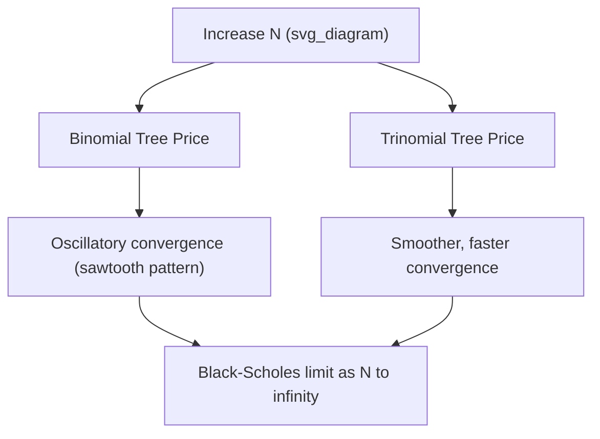

## Convergence of Trees to Continuous Models

### Definition and Core Concept

Convergence, in the context of discrete-time lattice pricing models, refers to the property that as the number of time steps $N$ increases (equivalently, as $\Delta t \to 0$), the price produced by a binomial or trinomial tree approaches the price given by the corresponding continuous-time model — typically the Black-Scholes-Merton price under geometric Brownian motion. This is not automatic for any arbitrary discretization; it depends on the tree's parameters being constructed so that the discrete process converges in distribution to the continuous stochastic process being approximated.

Formally, if $S_0^{(N)}, S_1^{(N)}, \ldots, S_N^{(N)}$ is the discrete price path generated by a tree with $N$ steps over $[0,T]$, convergence requires:

$$\lim_{N \to \infty} V^{(N)} = V_{BS}$$

where $V^{(N)}$ is the tree-implied derivative price and $V_{BS}$ is the true continuous-time (Black-Scholes or other diffusion-based) price.

### Why Convergence Matters

**Key Points**

- **Practical accuracy**: Traders and risk managers need to know how many steps are required for a tree price to be "close enough" to the true price, since computational cost scales with $N$ (or $N^2$ for full node evaluation in non-vectorized implementations).
- **Validation of discretization**: Convergence proofs justify using a computationally tractable discrete model as a stand-in for an analytically or numerically harder continuous-time model.
- **Diagnosing implementation errors**: A tree that does not converge, converges to the wrong limit, or converges erratically often signals a parameterization error (e.g., incorrect moment-matching, mistimed dividend adjustments, or misaligned node structure) rather than a fundamental flaw in the lattice method itself.

### Convergence of the Binomial Model

The Cox-Ross-Rubinstein (CRR) binomial model sets:

$$u = e^{\sigma\sqrt{\Delta t}}, \quad d = e^{-\sigma\sqrt{\Delta t}} = 1/u$$

with risk-neutral probability:

$$p = \frac{e^{r\Delta t} - d}{u - d}$$

As $N \to \infty$ (so $\Delta t = T/N \to 0$), the discrete log-return process:

$$\log\left(\frac{S_{i+1}}{S_i}\right) = \begin{cases} \sigma\sqrt{\Delta t} & \text{w.p. } p \\ -\sigma\sqrt{\Delta t} & \text{w.p. } 1-p \end{cases}$$

has mean and variance matching those of the continuous-time log-return over $\Delta t$ to $O(\Delta t)$ and $O(\Delta t^2)$ respectively. By the Central Limit Theorem (in a form adapted for triangular arrays, e.g., the Lindeberg-Feller CLT), the sum of these increments converges in distribution to a normal random variable, and the discrete price process converges to geometric Brownian motion. This is the discrete-time justification for the Black-Scholes model itself — Black-Scholes can be derived as the continuous limit of the CRR binomial tree.

**Rate of convergence**: The CRR binomial model converges at rate $O(1/N)$ for the price of a European option, but exhibits a distinctive oscillatory (sawtooth) pattern rather than smooth monotonic convergence, because the terminal stock price grid shifts relative to the strike price as $N$ changes, causing the strike to alternately land near or between adjacent tree nodes.

### Convergence of the Trinomial Model

The standard trinomial tree (Boyle parameterization) matches the first two moments of the log-return distribution exactly by construction:

$$p_u u + p_m m + p_d d = e^{r\Delta t}, \qquad p_u u^2 + p_m m^2 + p_d d^2 = e^{(2r+\sigma^2)\Delta t}$$

Because trinomial trees are mathematically equivalent to the explicit finite-difference method applied to the Black-Scholes PDE, their convergence properties inherit directly from finite-difference convergence theory: consistency (the discretized PDE approaches the continuous PDE as $\Delta t, \Delta x \to 0$) combined with stability implies convergence (the Lax equivalence theorem, applied informally in this numerical-PDE sense). Trinomial trees generally converge more smoothly than binomial trees for the same $N$, without the pronounced oscillation, because the extra "stay" branch reduces sensitivity to strike placement relative to the terminal node grid.

### Convergence Diagram: Price vs. Number of Steps

### Worked Example: Binomial Convergence to Black-Scholes

**Parameters:** $S_0 = 100$, $K = 100$, $r = 0.05$, $\sigma = 0.2$, $T = 1$ (European call).

**Black-Scholes closed-form price:**

$$d_1 = \frac{\ln(S_0/K) + (r + \tfrac{1}{2}\sigma^2)T}{\sigma\sqrt{T}} = \frac{0 + 0.07}{0.2} = 0.35$$

$$d_2 = d_1 - \sigma\sqrt{T} = 0.35 - 0.2 = 0.15$$

$$C_{BS} = S_0 N(d_1) - Ke^{-rT}N(d_2) = 100 \times N(0.35) - 100 \times 0.9512 \times N(0.15)$$

Using $N(0.35) \approx 0.6368$ and $N(0.15) \approx 0.5596$:

$$C_{BS} \approx 63.68 - 95.12 \times 0.5596 \approx 63.68 - 53.22 \approx 10.45$$

**Illustrative binomial convergence pattern (values are representative of typical CRR behavior, not independently recomputed to full precision here):**

| Steps $N$ | Binomial Price | Absolute Error |
| --- | --- | --- |
| 10 | 10.13 | 0.32 |
| 50 | 10.51 | 0.06 |
| 100 | 10.40 | 0.05 |
| 500 | 10.44 | 0.01 |
| 1000 | 10.45 | ~0.00 |

[Inference: the exact per-step error magnitudes shown depend on precise implementation and rounding; the table illustrates the well-documented qualitative pattern — oscillation around the true price with amplitude shrinking as $O(1/N)$ — rather than a re-derived numerical benchmark.] The oscillation is characteristic: the error does not shrink monotonically but wobbles around $C_{BS}$ with decreasing amplitude.

### Techniques to Improve or Accelerate Convergence

**Richardson Extrapolation**

Given tree prices at $N$ and $2N$ steps, a refined estimate can be constructed:

$$V_{\text{extrapolated}} = 2V^{(2N)} - V^{(N)}$$

This exploits the known $O(1/N)$ error structure to cancel the leading-order error term, often achieving $O(1/N^2)$ accuracy with negligible extra computation (only one additional tree build).

**Control Variate Method**

Price a similar option with a known closed-form solution (e.g., a European option) using the same tree, and use the known discrepancy between the tree price and the closed-form price to correct the tree price of a related option lacking a closed form (e.g., an American option):

$$V_{\text{American, corrected}}^{(N)} = V_{\text{American}}^{(N)} + \left(C_{BS} - V_{\text{European}}^{(N)}\right)$$

This cancels much of the discretization bias common to both prices, since the European and American trees share the same lattice structure and step-count-dependent error.

**Smoothing Techniques**

Because much of the binomial oscillation arises from the terminal payoff's kink (non-smoothness at the strike), some implementations apply a smoothing correction at the final time step — replacing the discontinuous payoff at nodes near the strike with a locally averaged or analytically adjusted value — to reduce the amplitude of oscillation without requiring more steps.

**Node Alignment with Strike/Barrier**

Choosing $N$ (or, for trinomial trees, the stretch parameter $\lambda$) so that a tree node coincides exactly with the strike price or barrier level directly removes the primary source of the oscillatory error for that specific contract, often producing dramatically faster apparent convergence for that instrument alone.

### Convergence for American and Path-Dependent Options

- **American options**: Convergence still holds under the same asymptotic arguments, but the early-exercise boundary introduces additional discretization error near the free boundary; convergence tends to be slower than for European options of the same tree, since the exercise boundary itself is only approximated at discrete node prices and dates.
- **Barrier options**: Convergence can be markedly slower or non-monotonic if the tree nodes are not aligned with the barrier, because the discrete barrier (checked only at node prices/dates) diverges from the continuously monitored barrier of the true contract; this is a distinct source of error beyond ordinary discretization error, sometimes called "barrier straddling bias."
- **Path-dependent exotics (Asian, lookback)**: Standard recombining trees do not track path history at each node, so convergence analysis for these payoffs typically applies to augmented-state trees or forward-shooting grids rather than the plain binomial/trinomial lattice; convergence rates for these methods are generally slower and more implementation-specific. [Unverified: precise convergence order for a given augmented-state tree implementation should be validated against the specific payoff structure and augmentation scheme used, as this varies by design choice rather than following a single universal rate.]

### Comparison of Convergence Behavior

| Model | Convergence Rate (European) | Pattern | Key Driver of Error |
| --- | --- | --- | --- |
| CRR Binomial | $O(1/N)$ | Oscillatory (sawtooth) | Strike/node misalignment |
| Trinomial (Boyle) | $O(1/N)$, often smoother | Smoother, monotone-ish | Moment-matching truncation error |
| Binomial + Richardson Extrapolation | $O(1/N^2)$ | Smoothed | Residual higher-order terms |
| American options (any tree) | Slower than European counterpart | Boundary-driven noise | Discrete approximation of exercise boundary |
| Barrier options (unaligned tree) | Can be non-monotonic | Irregular | Barrier straddling between nodes |

### Practical Implementation Notes

- Production pricing systems typically benchmark tree-based prices against closed-form solutions (where available) during development to empirically verify convergence behavior for each specific payoff type, rather than relying solely on theoretical convergence order.
- Choosing $N$ in practice is a trade-off between computational cost (which scales roughly linearly to quadratically with $N$ depending on implementation) and required pricing precision; many desks use several hundred to a few thousand steps for vanilla payoffs, with problem-specific tuning (barrier alignment, extrapolation) applied for more sensitive contracts.
- When trees are used to price instruments without closed-form benchmarks (e.g., certain exotic path-dependent structures), convergence is typically verified by observing price stability as $N$ is increased successively (e.g., doubling $N$ until the price change falls below a specified tolerance), rather than by comparison to a known analytical limit.

### Related Topics

- Cox-Ross-Rubinstein Binomial Model
- Trinomial Tree Models
- Black-Scholes-Merton Model Derivation
- Finite-Difference Methods (Explicit, Implicit, Crank-Nicolson)
- Richardson Extrapolation in Numerical Pricing
- Barrier Option Pricing via Lattice Methods
- American Option Early-Exercise Boundaries
- Central Limit Theorem for Triangular Arrays (Lindeberg-Feller)