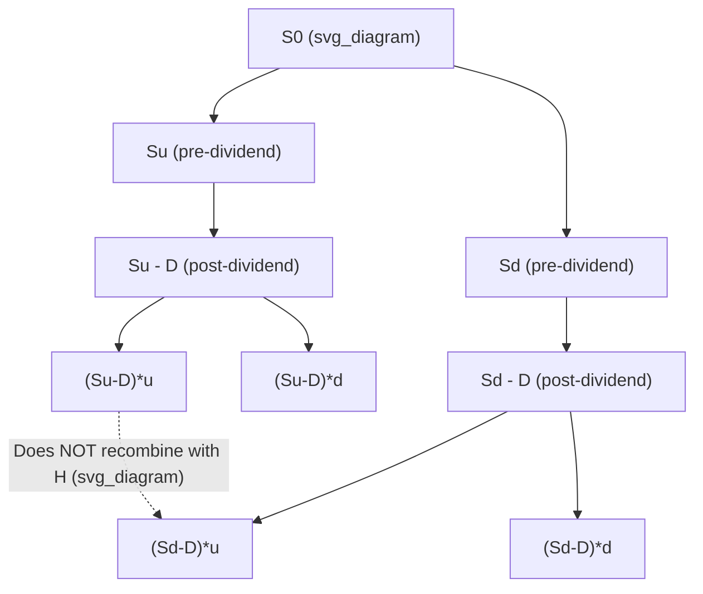

## Dividend Adjustments in Tree Models

### Definition and Core Concept

Dividend adjustments in tree models refer to the modifications required to binomial or trinomial lattice pricing methods to correctly account for the fact that an underlying stock's price drops (in expectation) by the amount of a dividend on the ex-dividend date. Without this adjustment, a tree calibrated purely to risk-free drift and volatility will systematically misprice options on dividend-paying stocks, since the standard risk-neutral drift $e^{r\Delta t}$ assumes no cash leakage from the asset. There are two broad classes of dividend treatment: **discrete (cash) dividends** and **continuous (proportional) dividend yields**, each requiring a different tree modification.

### Continuous Dividend Yield Adjustment

When dividends are modeled as a continuous yield $q$ (common for indices or as an approximation for stocks with frequent, roughly proportional payouts), the adjustment is straightforward: replace the risk-free rate $r$ with $r - q$ in the drift term used to compute risk-neutral probabilities, while the tree's multiplicative structure ($u$, $d$) remains unchanged.

For the CRR binomial model:

$$u = e^{\sigma\sqrt{\Delta t}}, \quad d = 1/u, \quad p = \frac{e^{(r-q)\Delta t} - d}{u - d}$$

For the standard trinomial (Boyle) model, the probability formulas retain their structure but with $r$ replaced by $r-q$ in the moment-matching conditions:

$$p_u u + p_m m + p_d d = e^{(r-q)\Delta t}$$

This is the simplest case because the tree's geometric (recombining) structure is fully preserved — the dividend yield only shifts the probability weights, not the node prices themselves.

### Discrete (Cash) Dividend Adjustment: The Core Challenge

Discrete dividends — a fixed cash amount $D$ paid at a known future date $t_D$ — are more problematic because they break the multiplicative recombining structure of a standard tree. If the stock price simply drops by $D$ at the ex-dividend date, the tree's up and down nodes before and after $t_D$ no longer recombine multiplicatively, since:

$$S(1+u)(1-D/S) \neq S(1-D/S)(1+u)$$

in general — subtracting a fixed dollar amount does not commute cleanly with multiplicative up/down moves. Three main approaches are used to handle this.

### Approach 1: Escrowed Dividend Model

The escrowed (or "prepaid forward") method separates the stock price into a dividend-paying and a "riskless" component. The present value of all future dividends up to option maturity is subtracted from the current stock price, and the tree is built on this adjusted, dividend-free price:

$$S_0^* = S_0 - \sum_{i} D_i e^{-r t_{D_i}}$$

The tree is then constructed on $S_0^*$ using standard volatility $\sigma$, and at each node, the actual stock price is recovered by adding back the present value of dividends remaining after that node's time:

$$S(t) = S^*(t) + \sum_{t_{D_i} > t} D_i e^{-r(t_{D_i}-t)}$$

**Key Points**

- Preserves the tree's recombining structure exactly, since all multiplicative moves are applied to $S^*$, which never has a discrete jump.
- The main criticism is that it implicitly assumes the volatility $\sigma$ applies to the dividend-adjusted (escrowed) price, not the actual observed stock price — a modeling approximation that can understate the effective volatility of the actual traded stock price, particularly when dividends are large relative to the stock price.

### Approach 2: Non-Recombining ("Bushy") Tree

The most direct approach applies the discrete dividend exactly: at the ex-dividend step, every node's price is reduced by $D$ (or by $D$ scaled appropriately), after which the tree continues its multiplicative evolution from the new, dividend-adjusted price levels.

$$S^+(t_D) = S^-(t_D) - D$$

where $S^-(t_D)$ is the pre-dividend node price and $S^+(t_D)$ is the post-dividend price used for subsequent branching.

**Key Points**

- Because subtracting a fixed $D$ from each node breaks the clean multiplicative recombination, the tree becomes "bushy" after the ex-dividend date — the number of distinct nodes grows non-trivially rather than staying at $2i+1$ (trinomial) or $i+1$ (binomial), since each pre-dividend node now generates its own distinct sub-lattice.
- This is the most accurate treatment of a genuine discrete cash dividend but is computationally expensive: node count can grow combinatorially with the number of discrete dividend dates within the option's life, since each dividend event effectively "resets" the lattice's recombining base at a different price level for nodes that were previously coincident.
- Commonly used when dividend amounts are large relative to the stock price or precision is paramount (e.g., single-stock American options around known dividend dates), where the escrowed model's approximation may be unacceptable.

### Approach 3: Curran / Interpolation Adjustment

To retain a recombining tree while approximating a discrete dividend, several interpolation-based methods adjust node prices at the dividend date and use interpolation across neighboring nodes for the backward-induction step, avoiding full non-recombining bushiness while achieving better accuracy than the escrowed model for the true stock volatility. These schemes apply the dividend subtraction directly to node prices at $t_D$, then interpolate option values from a value function evaluated at nearby, non-lattice-matching prices in the backward induction step immediately after the dividend date, restoring a recombining structure for all subsequent steps.

### Adjustment Comparison Table

| Method | Recombining? | Volatility Applies To | Computational Cost | Best Suited For |
| --- | --- | --- | --- | --- |
| Continuous yield ($q$) | Yes | Actual stock price | Low (no structural change) | Indices, ETFs, proportional payouts |
| Escrowed dividend model | Yes | Dividend-adjusted (escrowed) price | Low | Small/moderate discrete dividends |
| Non-recombining (bushy) tree | No | Actual stock price | High (combinatorial growth) | Large discrete dividends, high-precision needs |
| Curran-style interpolation | Yes (with interpolation) | Actual stock price (approximated) | Medium | Balance of accuracy and tractability |

### Tree Structure Diagram: Bushy Tree After a Discrete Dividend

Note that $(S_u - D)u \neq (S_d - D)d$ in general, so the two sub-trees emerging from different pre-dividend branches no longer share common nodes — this is the source of the "bushy" growth in node count.

### Worked Example: Escrowed Dividend Model

**Setup:** $S_0 = 100$, a single dividend $D = 3$ paid at $t_D = 0.25$ years, option maturity $T = 1$, $r = 0.05$, $\sigma = 0.25$.

**Step 1 — Compute present value of the dividend:**

$$PV(D) = 3 \times e^{-0.05 \times 0.25} = 3 \times 0.9876 \approx 2.963$$

**Step 2 — Compute the escrowed (dividend-adjusted) initial price:**

$$S_0^* = 100 - 2.963 = 97.037$$

**Step 3 — Build the standard tree on $S_0^* = 97.037$** using $u = e^{\sigma\sqrt{\Delta t}}$, $d = 1/u$, and risk-neutral probability $p = \frac{e^{r\Delta t}-d}{u-d}$, exactly as in a no-dividend tree, ignoring the dividend entirely in this step since it has already been removed from the starting price.

**Step 4 — At any node at time $t$, recover the actual (dividend-inclusive) stock price** by adding back the present value (as of that node's time) of any dividends not yet paid:

- For nodes at $t < 0.25$: $S(t) = S^*(t) + 3e^{-r(0.25-t)}$
- For nodes at $t \geq 0.25$: $S(t) = S^*(t)$ (dividend already paid, nothing to add back)

**Step 5 — Evaluate the option payoff at terminal nodes using the recovered actual stock price** $S(T) = S^*(T)$ (since $T=1 > t_D=0.25$, no addback needed at maturity), then proceed with standard backward induction using the same probabilities computed in Step 3.

This illustrates the escrowed method's core mechanic: the lattice's multiplicative structure operates entirely on $S^*$, and the actual dividend-paying stock price is reconstructed only when needed for payoff evaluation, never disturbing the tree's recombination.

### American Options and Dividends

Dividends materially affect early-exercise decisions for American options, particularly calls:

- **American calls on non-dividend-paying stocks** are never optimally exercised early (their value always exceeds intrinsic value, since holding preserves optionality with no cost), so American and European call prices coincide in that special case.
- **American calls on dividend-paying stocks** can become optimal to exercise immediately before an ex-dividend date, since the holder forfeits the dividend by holding the option rather than exercising into stock ownership before the ex-date. Trees must therefore check the early-exercise condition at nodes immediately preceding each discrete dividend date with particular attention, since this is where early exercise is most likely to be triggered.
- **American puts** generally see early-exercise incentive reduced by upcoming dividends (since dividends depress the stock price, which the put holder benefits from without needing to exercise early), the reverse effect relative to calls.

### Practical Implementation Notes

- For equities with a known discrete dividend calendar (typical for single-stock American options), the bushy tree or interpolation approach is generally preferred in professional pricing libraries despite higher computational cost, because the escrowed model's volatility approximation can introduce meaningful pricing error for dividend yields that are large relative to implied volatility.
- For index options or products referencing broad baskets, the continuous yield approximation $q$ is standard and computationally efficient, since aggregating many small, staggered constituent dividends closely approximates a smooth continuous payout.
- Some practitioners use a hybrid: continuous yield for the general dividend drift plus explicit adjustment for unusually large, known special dividends that would materially distort the continuous approximation. [Inference: the specific threshold at which a discrete dividend is "large enough" to warrant explicit treatment rather than yield approximation is a practitioner judgment call dependent on the option's strike, moneyness, and required pricing precision, rather than a fixed universal rule.]
- Multiple discrete dividends within a single option's life compound the bushy-tree node growth problem; production systems often impose a practical cap on the number of explicitly modeled discrete dividend dates, falling back to yield approximation or the escrowed model for dividends far from valuation-sensitive dates (e.g., far out-of-the-money strikes or long-dated low-sensitivity dividends).

### Related Topics

- Cox-Ross-Rubinstein Binomial Model
- Trinomial Tree Models
- American Option Early-Exercise Boundaries
- Black-Scholes-Merton Model with Continuous Dividend Yield
- Forward and Futures Pricing with Discrete Dividends
- Finite-Difference Methods for Dividend-Paying Underlyings
- Escrowed Dividend Model vs. Volatility Skew Implications