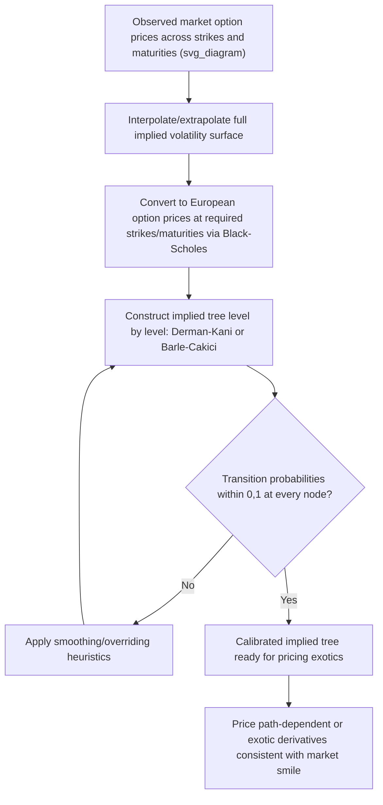

## Implied Trees and Tree Calibration

### Definition and Core Concept

An implied tree is a lattice pricing model whose local transition probabilities (and/or node prices) are calibrated directly from observed market option prices, rather than assumed constant from a single input volatility parameter. Standard binomial or trinomial trees use one volatility $\sigma$ throughout, which forces every option on the same underlying to be priced consistently with a single implied volatility — contradicted by the empirically observed volatility smile/skew, where implied volatility varies systematically with strike and maturity. Implied trees resolve this by allowing local volatility (and hence transition probabilities) to vary node-by-node, so the tree reproduces the entire observed market volatility surface exactly (or as closely as calibration permits) rather than a single flat volatility assumption.

The theoretical foundation is Dupire's local volatility framework: there exists a unique deterministic local volatility function $\sigma_{loc}(S,t)$ such that a diffusion process with that state- and time-dependent volatility reproduces all observed European option prices across strikes and maturities exactly. Implied trees are the discrete-lattice implementation of this idea, constructed so that option prices computed from the tree match market-quoted prices (or their Black-Scholes-implied volatilities) at every available strike and maturity.

### Motivation: The Volatility Smile Problem

**Key Points**

- A standard CRR or Boyle tree with constant $\sigma$ prices a European option consistently with Black-Scholes, which assumes a single volatility for all strikes and maturities — but market-observed implied volatilities typically differ by strike (skew/smile) and by maturity (term structure).
- Using a single tree with one $\sigma$ to price options across a range of strikes therefore systematically misprices out-of-the-money and in-the-money options relative to at-the-money options, since it cannot simultaneously match multiple different implied volatilities with one constant parameter.
- Implied trees address this directly at the pricing-engine level: rather than picking a single "representative" volatility, the tree's local structure is reverse-engineered from the full observed surface, so pricing and hedging outputs for exotic or path-dependent derivatives written on the same underlying are consistent with the market prices of liquid vanilla options used for calibration.

### Derman-Kani Implied Binomial Tree

The Derman-Kani (1994) method constructs an implied binomial tree level by level (forward induction), using the known market prices of European options at each maturity in the tree to solve for the local transition probabilities and node prices at that level, working outward from the current spot price.

**Construction procedure (forward induction, level by level):**

1. At time step $i$, the tree already has established (from previous steps) a set of node prices $S_{i,j}$ and their associated Arrow-Debreu prices (state prices) $\lambda_{i,j}$, representing the discounted risk-neutral probability of reaching each node.
2. For each node at the next level $i+1$, the up-move price $S_{i+1,j+1}$ and down-move price $S_{i+1,j}$, along with the transition probability $p_{i,j}$, are solved using the constraint that the tree must reproduce the market price of a European option struck at the current forward price with maturity at step $i+1$.
3. The key equation (for a "central" node, illustrative form) relates the known market call price $C(K, t_{i+1})$ to a sum over the tree's existing state prices and the unknown new node price:

$$C(K,t_{i+1}) = e^{-r\Delta t}\sum_j \lambda_{i,j}\left[p_{i,j}\max(S_{i+1,j+1}-K,0) + (1-p_{i,j})\max(S_{i+1,j}-K,0)\right]$$

4. Solving this equation (typically one node's price at a time, working from the center of the tree outward, using previously-solved neighboring nodes as knowns) yields both the new node price and the corresponding local transition probability.
5. This process repeats level by level until the full tree, spanning all maturities present in the calibration option data, is constructed.

**Key Points**

- Requires a continuum (or a smooth interpolation) of market option prices across strikes at each maturity in the tree, since the construction needs $C(K, t_{i+1})$ for specific strikes determined by the tree's own geometry — in practice, this means interpolating/extrapolating a full implied volatility surface from the finite set of liquid market quotes before tree construction begins.
- Known to be numerically unstable in regions where option prices are relatively insensitive to the underlying local volatility (deep out-of-the-money strikes, or when computed transition probabilities fall outside $[0,1]$), which can require ad hoc smoothing or overriding of the raw calibration output — a widely acknowledged practical limitation of the original Derman-Kani algorithm.

### Barle-Cakici Modification

The Barle-Cakici (1998) variant modifies the Derman-Kani construction to improve numerical stability, primarily by using the forward price (rather than the spot-derived central node) as the reference point in constructing each level's central node, and by adjusting the treatment of nodes to reduce the frequency of the probability-out-of-bounds problem that afflicts the original algorithm. It produces materially more stable trees in practice for the same input volatility surface, and is commonly cited as the preferred practical implementation of the implied-binomial-tree approach relative to the original Derman-Kani formulation. [Inference: which specific implementation variant a given trading system uses, and the exact numerical stabilization techniques layered on top, are implementation-specific choices not standardized across the industry.]

### Rubinstein's Implied Tree (Alternative Approach)

Rubinstein's (1994) implied binomial tree takes a different construction route: rather than solving level-by-level via forward induction, it works backward from an assumed risk-neutral terminal distribution at the tree's final maturity (fitted to match the smile at that single maturity), then infers a set of transition probabilities consistent with that terminal distribution using an optimization that also stays as close as possible to a prior (e.g., lognormal) distribution — commonly framed as a constrained optimization minimizing a weighted sum of squared deviations from prior probabilities subject to matching observed option prices at that maturity.

**Key Points**

- Better suited to single-maturity smile fitting; multi-maturity consistency (matching the full term structure of skew simultaneously) is a separate, more complex extension.
- The reliance on an optimization with a prior distribution makes it somewhat more robust to sparse or noisy option price data than the Derman-Kani forward-induction approach, since the optimization can regularize toward a sensible prior in regions with limited market information.

### Calibration Workflow Diagram

### Worked Example: Conceptual Single-Step Calibration

**Setup (simplified, single time step, illustrating the core equation):** Suppose the tree currently has a single node at $S_0 = 100$ with state price $\lambda_0 = 1$ (certainty of being here today), risk-free rate $r=0.05$, and $\Delta t = 0.25$. The market-quoted European call price for strike $K=100$ maturing at $\Delta t$ is $C(100, 0.25) = 4.50$.

**Step 1 — Set up the up/down node prices** using a specified centering convention (e.g., Derman-Kani's forward-based logarithmic spacing) — suppose this convention gives candidate nodes $S_u = 108$ and $S_d = 93$ (illustrative values consistent with a typical local volatility level for this example).

**Step 2 — Write the calibration equation** for the single-step case:

$$C(100, 0.25) = e^{-0.05 \times 0.25}\left[p \times \max(108-100,0) + (1-p)\times\max(93-100,0)\right]$$

Since $\max(93-100,0) = 0$, this simplifies to:

$$4.50 = e^{-0.0125} \times p \times 8 = 0.9876 \times 8p = 7.901p$$

**Step 3 — Solve for the implied transition probability:**

$$p = \frac{4.50}{7.901} \approx 0.5696$$

**Step 4 — Verify $p \in [0,1]$**: here $p \approx 0.57$, a valid probability, so the tree accepts this node configuration. If $p$ had fallen outside $[0,1]$, the node spacing ($S_u$, $S_d$) would need to be adjusted (this is precisely the numerical instability issue that motivates the Barle-Cakici modification), since an invalid probability signals the assumed node geometry is inconsistent with the market-quoted price at this strike and maturity.

This single-step illustration captures the essential calibration logic — solving for local probabilities from market prices — that Derman-Kani applies iteratively, node by node and level by level, across the full multi-step tree.

### Local Volatility Extraction from the Implied Tree

Once calibrated, the implied tree's transition probabilities at each node can be converted back into an implied local volatility surface $\sigma_{loc}(S,t)$, which is directly comparable to Dupire's continuous-time local volatility formula:

$$\sigma_{loc}^2(K,T) = \frac{\frac{\partial C}{\partial T} + rK\frac{\partial C}{\partial K}}{\frac{1}{2}K^2\frac{\partial^2 C}{\partial K^2}}$$

The implied tree's discrete local volatilities should converge to this continuous Dupire local volatility as the tree's time-step and node spacing shrink, providing a natural consistency check between the discrete lattice calibration and the continuous-time local volatility theory that motivates it.

### Comparison: Implied Trees vs. Constant-Volatility Trees vs. Stochastic Volatility Models

| Feature | Constant-Vol Tree | Implied Tree | Stochastic Volatility (e.g., Heston) |
| --- | --- | --- | --- |
| Matches full smile at calibration date | No (single $\sigma$) | Yes, by construction | Approximately (depends on parameter richness) |
| Captures smile dynamics over time | No | Not necessarily (static snapshot fit) | Yes, if dynamics are well-specified |
| Computational cost to calibrate | Trivial (one parameter) | Moderate to high (iterative level-by-level solve) | Higher (multi-parameter nonlinear optimization) |
| Numerical stability | High | Can be fragile (probability bounds) | Generally stable with proper constraints |
| Best suited for | Simple vanilla pricing | Exotic pricing consistent with today's smile | Pricing sensitive to volatility dynamics/forward smile |

### Known Limitations of Implied Trees

- **Static calibration**: An implied tree matches today's observed smile exactly, but does not necessarily produce realistic *dynamics* of the smile as time passes and the underlying moves — a well-documented critique is that local-volatility-based models (including implied trees) tend to imply a smile that flattens or evolves in ways inconsistent with typically observed market smile dynamics, which stochastic volatility models can sometimes capture more realistically. [Inference: whether this dynamic mismatch materially affects pricing/hedging performance depends on the specific exotic payoff and its sensitivity to forward-starting volatility assumptions, and should be assessed per instrument rather than assumed universally significant.]
- **Numerical fragility**: As illustrated above, the original Derman-Kani construction can produce invalid (out-of-bounds) probabilities, especially for sparse strike grids, highly skewed volatility surfaces, or far-from-the-money nodes, requiring careful smoothing, interpolation choices, and sometimes manual overrides in production use.
- **Interpolation sensitivity**: Because the tree calibration requires option prices at specific strikes/maturities dictated by the tree's own geometry (not necessarily strikes with liquid market quotes), the choice of volatility surface interpolation/extrapolation method can materially affect the resulting implied tree, especially in sparsely-quoted regions of the surface.

### Practical Implementation Notes

- Most modern derivatives desks use implied/local volatility trees primarily for exotic and path-dependent single-underlying equity or FX derivatives where consistency with the vanilla option market (used for hedging) is paramount, often alongside or blended with stochastic volatility models for products where smile dynamics matter more than a static snapshot fit.
- Because of the numerical fragility of node-by-node tree calibration, many practical implementations instead calibrate a continuous local volatility surface via Dupire's formula (using a smoothed/regularized implied volatility surface as input) and then build a standard trinomial or finite-difference grid using that local volatility function directly, rather than solving the discrete Derman-Kani equations node by node — this sidesteps much of the probability-bound instability while achieving a functionally similar smile-consistent pricing tool.
- Calibration quality is highly sensitive to the smoothness of the input implied volatility surface; raw market quotes are typically first fit to a parametric or semi-parametric smile model (e.g., SVI, SABR) to produce arbitrage-free, smooth implied volatilities before any tree or local-volatility-surface construction begins.

### Related Topics

- Dupire's Local Volatility Model and Formula
- Trinomial Tree Models
- Volatility Smile and Skew: Empirical Features and Causes
- Stochastic Volatility Models (Heston, SABR)
- Arbitrage-Free Volatility Surface Construction (SVI Parameterization)
- Convergence of Trees to Continuous Models
- Forward-Starting Options and Forward Smile Risk