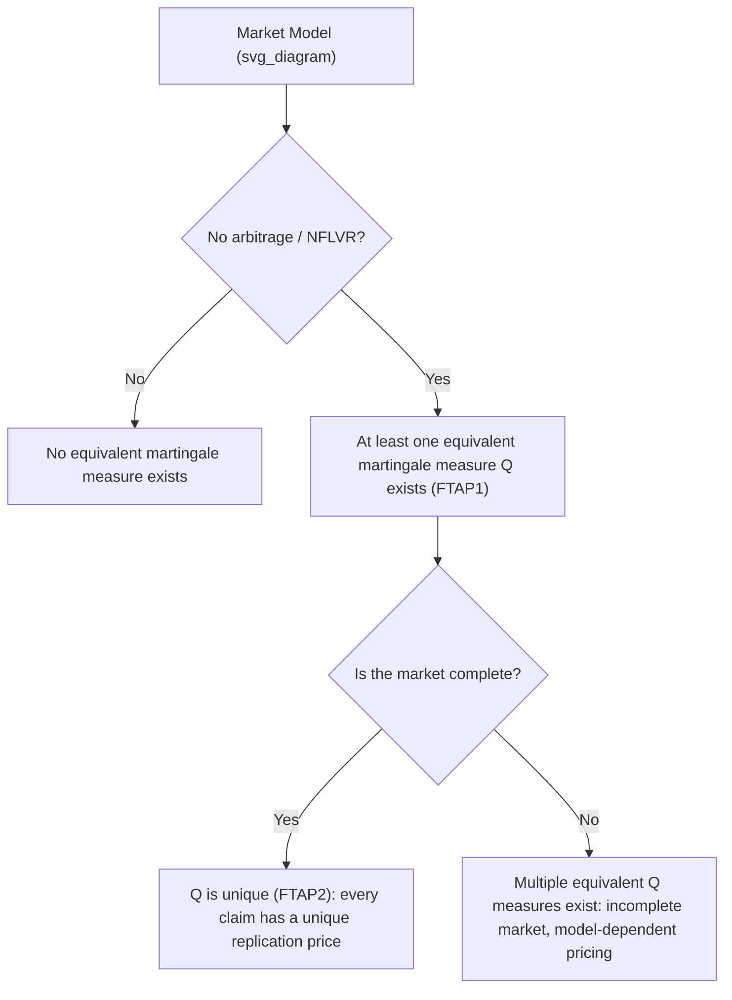

## The Fundamental Theorems of Asset Pricing

### Definition and Core Concept

The Fundamental Theorems of Asset Pricing (FTAP) are two foundational results that connect the economic concepts of arbitrage and market completeness to the mathematical existence and uniqueness of an equivalent martingale measure (also called a risk-neutral measure). They form the theoretical backbone justifying nearly all modern derivatives pricing: the reason a derivative's price can be computed as a discounted expectation under a "risk-neutral" probability measure — rather than requiring knowledge of investors' actual risk preferences — is a direct consequence of these theorems.

**First Fundamental Theorem of Asset Pricing (FTAP1):** A market model is free of arbitrage (more precisely, satisfies "no free lunch with vanishing risk," NFLVR, in continuous-time settings) if and only if there exists at least one equivalent martingale measure $\mathbb{Q}$ under which discounted asset prices are martingales.

**Second Fundamental Theorem of Asset Pricing (FTAP2):** Given an arbitrage-free market, the market is complete (every contingent claim can be replicated by a self-financing trading strategy) if and only if the equivalent martingale measure is unique.

### Why This Matters for Derivatives Pricing

**Key Points**

- FTAP1 is what licenses risk-neutral pricing at all: if a market has no arbitrage, there is guaranteed to exist some probability measure $\mathbb{Q}$ under which the discounted price process of every traded asset is a martingale, meaning the current price equals the $\mathbb{Q}$-expected discounted future price.
- FTAP2 is what determines whether that risk-neutral measure — and hence the derivative price computed under it — is unique. In an incomplete market, multiple equivalent martingale measures can exist, each giving a different (but each individually arbitrage-consistent) price for the same derivative, meaning the derivative cannot be perfectly replicated and hedged using only the traded underlying assets.
- Together, these theorems explain why Black-Scholes-style pricing works cleanly for options on liquidly tradeable underlyings (complete market, essentially unique price) but requires additional assumptions, model choices, or incompleteness premia for products written on non-tradeable or partially-hedgeable risk factors (e.g., volatility itself, in the absence of a liquid variance swap market).

### Equivalent Martingale Measures: Formal Definition

A probability measure $\mathbb{Q}$ is an **equivalent martingale measure** relative to a reference measure $\mathbb{P}$ (the "real-world" or "physical" measure) and a numeraire asset (typically the money-market account $B_t = e^{rt}$) if:

1. **Equivalence**: $\mathbb{Q}$ and $\mathbb{P}$ assign zero probability to exactly the same events (they agree on which outcomes are possible, differing only in the *likelihood* assigned to possible outcomes).
2. **Martingale property**: For every traded asset with price process $S_t$, the discounted price $\tilde{S}_t = S_t / B_t$ satisfies:

$$\mathbb{E}^{\mathbb{Q}}[\tilde{S}_T \mid \mathcal{F}_t] = \tilde{S}_t \quad \text{for all } t \leq T$$

This second condition is the mathematical essence of "risk-neutral pricing": under $\mathbb{Q}$, every traded asset's discounted price is expected, on average, to stay exactly where it is today — no asset is expected to outperform the risk-free rate under this measure, which is precisely why $\mathbb{Q}$ is called "risk-neutral."

### FTAP1: No Arbitrage ⟺ Existence of an Equivalent Martingale Measure

**Intuition**: Arbitrage means a trading strategy that requires zero (or negative) initial capital, has zero probability of loss, and positive probability of profit. If such a strategy existed, no equivalent martingale measure could exist, because under any measure equivalent to $\mathbb{P}$, a strategy with zero cost and non-negative payoff (with positive probability of strictly positive payoff) would have to have strictly positive expected discounted value — contradicting the requirement that self-financing trading strategies (which include the "do nothing" zero strategy) preserve the martingale property. Conversely, the deep mathematical result (due to Harrison, Kreps, and Pliska, with rigorous continuous-time treatment by Delbaen and Schachermayer) is that the absence of arbitrage is essentially *equivalent* to the existence of such a measure — not merely a necessary condition, but (with appropriate technical qualifications) a sufficient one too.

**Technical Note**: In discrete-time, finite-state models, the equivalence is exact: no arbitrage if and only if an equivalent martingale measure exists. In continuous-time and infinite-dimensional settings, the precise statement requires the technical condition of "no free lunch with vanishing risk" (NFLVR) rather than the simpler "no arbitrage," because in continuous time, sequences of trading strategies with vanishing risk can approximate arbitrage without technically achieving it — a subtlety formalized rigorously in the Delbaen-Schachermayer theorem (1994). [Unverified: the precise technical distinctions between NFLVR, NA (no arbitrage), and related no-arbitrage conditions in various continuous-time model classes involve mathematical subtleties that are the subject of a substantial specialized literature and should be consulted directly for rigorous treatment beyond this overview level.]

### FTAP2: Market Completeness ⟺ Uniqueness of the Equivalent Martingale Measure

**Market completeness** means every contingent claim (every derivative payoff) can be exactly replicated by a self-financing trading strategy using only the underlying traded assets and the risk-free asset. If this replication is possible, the derivative's price is uniquely pinned down by the no-arbitrage cost of the replicating portfolio — regardless of which equivalent martingale measure one might otherwise consider, because the replicating portfolio's cost is measure-independent (it is simply today's market price of the assets used to construct it).

**Why uniqueness of $\mathbb{Q}$ follows**: If two distinct equivalent martingale measures $\mathbb{Q}_1 \neq \mathbb{Q}_2$ both existed, they would generally assign different expected discounted payoffs to some contingent claim. But if the market is complete, that claim has a unique replication cost — so both measures must, in fact, assign the same expected discounted value to every replicable claim, which forces $\mathbb{Q}_1 = \mathbb{Q}_2$ (since a probability measure is fully determined by the expectations it assigns to a sufficiently rich set of claims).

**Converse direction**: If the equivalent martingale measure is unique, every bounded contingent claim's discounted $\mathbb{Q}$-expectation can be shown (via the martingale representation theorem, in a Brownian-motion-driven setting) to be replicable by a dynamic trading strategy in the underlying and risk-free asset, establishing market completeness.

### Illustrative Example: One-Period Binomial Model (Complete Market)

**Setup:** $S_0 = 100$, up state $S_u = 120$, down state $S_d = 90$, risk-free rate over the period $r$ such that $e^{r} = 1.05$ (5% over the period), so the risk-free asset grows from 1 to 1.05.

**Step 1 — Solve for the risk-neutral probability $q$** such that the discounted expected stock price equals today's price:

$$S_0 = e^{-r}\left[q \cdot S_u + (1-q) \cdot S_d\right]$$

$$100 = \frac{1}{1.05}\left[120q + 90(1-q)\right]$$

$$105 = 120q + 90 - 90q = 90 + 30q$$

$$q = \frac{15}{30} = 0.5$$

**Step 2 — Verify $q \in (0,1)$**: $q = 0.5$ is valid, confirming this two-state model with these specific parameters admits an equivalent martingale measure, and hence (by FTAP1) is arbitrage-free. If $S_u \leq S_0 e^r$ or $S_d \geq S_0 e^r$ held (i.e., if the risk-free return fell outside the range spanned by the stock's possible returns), no valid $q \in (0,1)$ would exist, signaling an arbitrage opportunity in the model as specified.

**Step 3 — Demonstrate completeness by replicating a call option** struck at $K=100$: the option pays $\max(120-100,0)=20$ in the up state and $\max(90-100,0)=0$ in the down state. A replicating portfolio holds $\Delta$ shares of stock and $B$ in the risk-free asset such that:

$$120\Delta + 1.05B = 20, \qquad 90\Delta + 1.05B = 0$$

Subtracting: $30\Delta = 20 \Rightarrow \Delta = 2/3$. Substituting back: $90(2/3) + 1.05B = 0 \Rightarrow 60 + 1.05B = 0 \Rightarrow B = -57.143$.

**Step 4 — Price the option as the cost of this replicating portfolio:**

$$C_0 = \Delta S_0 + B = \frac{2}{3}(100) - 57.143 = 66.667 - 57.143 = 9.524$$

**Verification via risk-neutral expectation:**

$$C_0 = e^{-r}\left[q \cdot 20 + (1-q) \cdot 0\right] = \frac{0.5 \times 20}{1.05} = \frac{10}{1.05} \approx 9.524$$

Both methods agree exactly, illustrating FTAP2 in action: because this one-period, two-state model is complete (exactly two traded assets — stock and bond — spanning exactly two possible future states), the replicating portfolio price and the risk-neutral expectation price coincide precisely, and the risk-neutral measure $q=0.5$ is the *unique* equivalent martingale measure for this model.

### Structural Diagram: The Two Theorems

### Incomplete Markets: When FTAP2 Fails to Give Uniqueness

**Example sources of incompleteness in derivatives markets:**

- **Stochastic volatility models** (e.g., Heston): volatility is itself a random, non-directly-tradeable risk factor, so a market consisting of only the underlying stock and a risk-free bond cannot replicate options exactly — there are more sources of randomness (two Brownian motions) than traded hedging instruments (one stock), so infinitely many equivalent martingale measures are consistent with no-arbitrage, each corresponding to a different assumed "market price of volatility risk."
- **Jump-diffusion models** (e.g., Merton jump-diffusion): a discontinuous jump risk cannot be perfectly hedged using only continuous trading in the underlying, again producing market incompleteness and non-uniqueness of the risk-neutral measure.
- **Transaction costs and trading constraints**: even in an otherwise complete model, frictions such as transaction costs, discrete trading times, or short-sale constraints can break the perfect replication argument underlying FTAP2's completeness direction.

In these incomplete-market settings, practitioners typically select a specific $\mathbb{Q}$ from among the many arbitrage-consistent choices via a model-specific calibration to observed market prices of liquidly traded options (effectively letting the market "reveal" its implicit choice of measure/risk premium), rather than deriving $\mathbb{Q}$ purely from no-arbitrage principles alone, since no-arbitrage alone under-determines the price in an incomplete market.

### Choice of Numeraire and Measure

The equivalent martingale measure is always defined *relative to a choice of numeraire* (the asset used to discount, or "deflate," other prices before taking expectations). Changing the numeraire changes the associated martingale measure via a Radon-Nikodym derivative transformation, though the resulting derivative *prices* are numeraire-invariant (a genuinely arbitrage-free price does not depend on which numeraire was used to compute it).

**Common numeraire choices:**

| Numeraire | Associated Measure | Typical Use |
| --- | --- | --- |
| Money-market account $B_t = e^{rt}$ | Risk-neutral measure $\mathbb{Q}$ | General equity/FX derivatives pricing |
| Zero-coupon bond $P(t,T)$ | $T$-forward measure $\mathbb{Q}^T$ | Interest-rate derivatives (removes stochastic discounting) |
| Underlying asset $S_t$ itself | Stock/share measure $\mathbb{Q}^S$ | Simplifying certain exchange-option or quanto pricing problems |
| Annuity (sum of discount factors) | Swap/annuity measure | Swaption pricing in interest-rate models |

This numeraire flexibility, formalized by the change-of-numeraire technique (Geman, El Karoui, Rochet, 1995), is a direct practical extension of the FTAP framework, allowing pricing problems to be transformed into whichever measure makes the relevant expectation computation most tractable.

### Common Pitfalls and Misconceptions

- **Confusing "risk-neutral" with "risk-free"**: The risk-neutral measure does not imply investors are actually risk-neutral in the real world (under $\mathbb{P}$); it is a mathematical construct under which pricing simplifies to a discounted expectation, entirely independent of actual investor risk preferences — this independence from preferences is precisely the theorem's power.
- **Assuming uniqueness applies universally**: FTAP2 only guarantees a unique price when the market is complete. Applying single-measure risk-neutral pricing logic naively to genuinely incomplete-market products (e.g., pricing an illiquid exotic purely off a single calibrated model without acknowledging model risk) can understate the true pricing uncertainty inherent in the incompleteness. [Inference: the practical magnitude of this model risk in any specific incomplete-market product depends heavily on the instrument and calibration approach used, and is typically addressed via reserving practices (e.g., model reserves, bid-offer around model price) rather than resolved by the theorem itself.]
- **Overlooking technical conditions in continuous time**: The clean discrete-time equivalence ("no arbitrage ⟺ EMM exists") requires the more technical NFLVR condition in continuous-time, infinite-state models; casual application of the discrete-time intuition to continuous-time models without acknowledging this technical gap can lead to subtly incorrect reasoning about edge cases (e.g., certain doubling strategies or unbounded trading strategies).

### Related Topics

- Martingale Representation Theorem
- Girsanov's Theorem and Change of Measure
- Change of Numeraire Technique
- Market Completeness and Replication Strategies
- Stochastic Volatility Models and Market Incompleteness
- Radon-Nikodym Derivative and Equivalent Measures
- Forward Measure and Interest-Rate Derivatives Pricing
- Arbitrage Pricing Theory in Discrete vs. Continuous Time