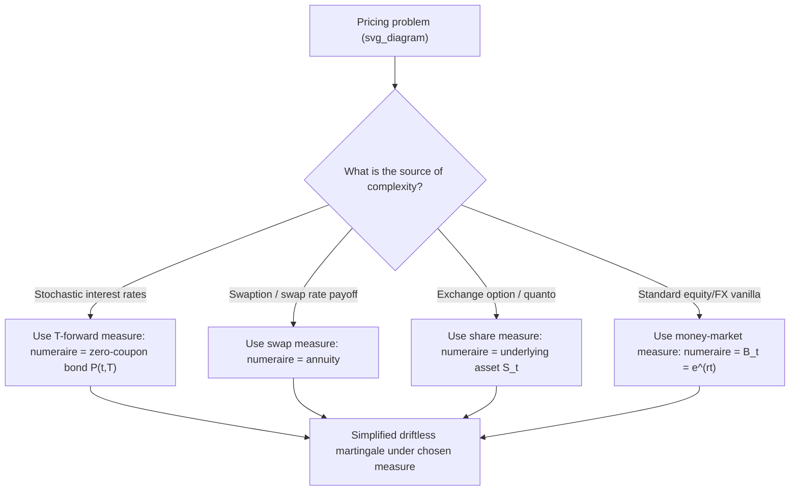

## Risk Neutral Measures and Numeraires

### Definition and Core Concept

A risk-neutral measure is a probability measure under which the price of every traded asset, when expressed in units of a chosen reference asset (the numeraire), behaves as a martingale — its expected future value, discounted appropriately, equals its current value. A numeraire is any strictly positive, tradeable asset used as the unit of account for expressing all other prices before computing expectations. The central insight linking the two is that the "risk-neutral measure" is never absolute — it is always defined *relative to* a specific numeraire choice, and switching numeraires requires switching to a correspondingly different, but related, probability measure.

Formally, given a numeraire asset with price process $N_t$, an **equivalent martingale measure relative to $N$**, denoted $\mathbb{Q}^N$, is a measure under which the $N$-deflated price of every traded asset $S_t$ is a martingale:

$$\frac{S_t}{N_t} = \mathbb{E}^{\mathbb{Q}^N}\left[\frac{S_T}{N_T} \,\middle|\, \mathcal{F}_t\right]$$

### The Money-Market Account Numeraire (Standard Risk-Neutral Measure)

The most common numeraire is the money-market account (continuously compounded risk-free bank account):

$$B_t = e^{\int_0^t r_s\,ds}$$

The associated measure $\mathbb{Q} = \mathbb{Q}^B$ is the standard "risk-neutral measure" referenced in Black-Scholes-style pricing. Under $\mathbb{Q}$, a derivative with terminal payoff $\Phi(S_T)$ is priced as:

$$V_0 = \mathbb{E}^{\mathbb{Q}}\left[e^{-\int_0^T r_s\,ds}\,\Phi(S_T)\right]$$

**Key Points**

- When interest rates are deterministic (constant or a known function of time), the discount factor $e^{-\int_0^T r_s ds}$ can be pulled outside the expectation, simplifying the pricing formula to $V_0 = e^{-rT}\mathbb{E}^{\mathbb{Q}}[\Phi(S_T)]$ — this is the form used in standard Black-Scholes derivations.
- When rates are stochastic, the discount factor and the payoff $\Phi(S_T)$ are generally correlated random variables under $\mathbb{Q}$, so they cannot be separated this way — this complication is precisely what motivates switching to a different numeraire (the forward measure, below) for interest-rate-sensitive products.

### Why Change the Numeraire? The Core Motivation

**Key Points**

- Pricing formulas often become dramatically simpler under a well-chosen numeraire, because the awkward stochastic discounting term can be "absorbed" into the measure change rather than left inside the expectation.
- The change-of-numeraire technique (formalized by Geman, El Karoui, and Rochet, 1995) shows that switching numeraire is equivalent to switching probability measure via a Radon-Nikodym derivative, and — critically — **the price of a derivative is invariant to the choice of numeraire**: any valid numeraire and its associated martingale measure will produce the identical, correct price. The technique is purely a tool for computational convenience, not a source of different "answers."

### Change of Numeraire: The Radon-Nikodym Derivative

Given two numeraires $N$ and $M$ with associated measures $\mathbb{Q}^N$ and $\mathbb{Q}^M$, the Radon-Nikodym derivative relating them is:

$$\frac{d\mathbb{Q}^M}{d\mathbb{Q}^N}\bigg|_{\mathcal{F}_t} = \frac{M_t/M_0}{N_t/N_0}$$

This relation allows an expectation computed under one measure to be rewritten as an expectation under another, and — combined with Girsanov's theorem — determines exactly how the drift of any driving Brownian motion changes when switching numeraires (the diffusion/volatility term is unaffected by a numeraire change; only the drift shifts).

### The T-Forward Measure

The **T-forward measure** $\mathbb{Q}^T$ uses the zero-coupon bond maturing at time $T$, $P(t,T)$, as numeraire. This is the standard tool for interest-rate derivatives pricing, because it eliminates the problematic stochastic discount factor from the pricing expectation entirely.

$$V_0 = P(0,T)\,\mathbb{E}^{\mathbb{Q}^T}\left[\Phi(S_T)\right]$$

**Key Points**

- Under $\mathbb{Q}^T$, the forward price $F(t,T) = S_t/P(t,T)$ of any asset (for delivery at $T$) is a martingale — this is the origin of the term "forward measure," and directly reflects the standard relationship that today's forward price equals the $T$-forward-measure expectation of the future spot price.
- This is the natural pricing measure for interest-rate caps, floors, and other products whose payoff is naturally expressed relative to a specific maturity, since it removes the need to jointly model the correlation between short rates and the payoff variable.

### The Swap (Annuity) Measure

For swaption pricing, the natural numeraire is the **annuity** (level payment stream), the present value of a stream of fixed cash flows corresponding to the fixed leg of the underlying swap:

$$A_t = \sum_{i=1}^n \tau_i P(t, T_i)$$

where $\tau_i$ are accrual fractions and $T_i$ are the fixed-leg payment dates. Under the associated **swap measure** $\mathbb{Q}^A$, the forward swap rate $R_{swap}(t)$ — defined as the fixed rate that makes the swap's value zero — is a martingale:

$$R_{swap}(t) = \mathbb{E}^{\mathbb{Q}^A}\left[R_{swap}(T_0)\,\middle|\,\mathcal{F}_t\right]$$

This martingale property is exactly why standard market models for swaptions (e.g., the lognormal or normal SABR-based swap-rate models underlying market-standard swaption pricing formulas) can treat the forward swap rate as a driftless diffusion under this measure, dramatically simplifying calibration to market-quoted swaption implied volatilities.

### The Stock/Share Measure

Using the underlying stock itself, $S_t$, as numeraire produces the **share measure** $\mathbb{Q}^S$. This is particularly useful for exchange options (options to exchange one asset for another, per Margrabe's formula) and for certain quanto adjustments, since expressing a European call payoff $\max(S_T - K, 0)$ relative to the stock numeraire converts it into a form resembling a put-like expression on $K/S_T$, which can simplify certain multi-asset pricing problems.

$$C_0 = S_0\,\mathbb{Q}^S(S_T > K) - K\,P(0,T)\,\mathbb{Q}^T(S_T > K)$$

This decomposition — writing the Black-Scholes call formula as a combination of a share-measure probability and a forward-measure probability — is precisely the origin of the two probability terms $N(d_1)$ and $N(d_2)$ in the Black-Scholes formula: $N(d_1) = \mathbb{Q}^S(S_T > K)$ and $N(d_2) = \mathbb{Q}^T(S_T > K)$ (with $\mathbb{Q}^T = \mathbb{Q}$ when rates are deterministic).

### Numeraire Selection Diagram

### Worked Example: Numeraire Invariance Check

**Setup:** $S_0 = 100$, $r = 0.05$ (constant, deterministic), $T = 1$, risk-neutral probability of finishing above $K=100$ under $\mathbb{Q}$ (money-market measure) is $\mathbb{Q}(S_T > 100) = 0.55$, and (for this illustration) suppose the analogous share-measure probability is $\mathbb{Q}^S(S_T > 100) = 0.60$.

**Step 1 — Price via the money-market (standard risk-neutral) measure**, assuming for this simplified illustration that the expected value conditional on finishing in-the-money, discounted appropriately, has already been computed to give a call price component. Using the decomposition:

$$C_0 = S_0 \cdot \mathbb{Q}^S(S_T > K) - K e^{-rT} \cdot \mathbb{Q}^T(S_T > K)$$

With $\mathbb{Q}^T = \mathbb{Q}$ here since rates are deterministic:

$$C_0 = 100 \times 0.60 - 100 \times e^{-0.05} \times 0.55 = 60 - 100 \times 0.9512 \times 0.55 = 60 - 52.32 = 7.68$$

**Step 2 — Confirm this matches the standard risk-neutral (money-market) computation.** Because $\mathbb{Q}^S(S_T > K)$ and $\mathbb{Q}^T(S_T > K)$ are precisely defined so that this decomposition reproduces the Black-Scholes-consistent price under any valid choice of numeraire, this equality holds by the FTAP2-guaranteed uniqueness of price in a complete market, regardless of which measure/numeraire pair was used to arrive at the two probability terms. [Inference: the specific illustrative probability values (0.55, 0.60) used here are chosen for pedagogical consistency with the decomposition formula rather than independently derived from a full Black-Scholes calculation; a rigorous numerical check would compute $d_1, d_2$ directly and verify $N(d_1), N(d_2)$ against these values.]

This example illustrates the core numeraire-invariance principle: the *same* derivative price ($7.68$ here) can be reached via computations under different measures, each simplifying a different aspect of the problem, precisely because switching numeraire never changes the underlying no-arbitrage price.

### Comparison Table: Common Numeraires and Their Measures

| Numeraire $N_t$ | Measure | Martingale Under This Measure | Primary Use Case |
| --- | --- | --- | --- |
| Money-market account $B_t = e^{\int r_s ds}$ | Risk-neutral $\mathbb{Q}$ | Discounted asset prices $S_t/B_t$ | General equity/FX/commodity derivatives |
| Zero-coupon bond $P(t,T)$ | $T$-forward $\mathbb{Q}^T$ | Forward price $F(t,T) = S_t/P(t,T)$ | Interest-rate caps/floors, bond options |
| Annuity $A_t = \sum \tau_i P(t,T_i)$ | Swap measure $\mathbb{Q}^A$ | Forward swap rate $R_{swap}(t)$ | Swaption pricing |
| Underlying asset $S_t$ | Share measure $\mathbb{Q}^S$ | $1/S_t$-deflated prices; e.g. $B_t/S_t$ | Exchange options, quanto adjustments |
| Foreign money-market account (FX-converted) | Foreign risk-neutral measure | Foreign-currency discounted prices | Cross-currency and quanto derivatives |

### Girsanov Drift Adjustment Under Numeraire Change

If $S_t$ follows $dS_t = \mu_t S_t\,dt + \sigma_t S_t\,dW_t^{\mathbb{Q}}$ under the money-market measure $\mathbb{Q}$, switching to the $T$-forward measure $\mathbb{Q}^T$ changes only the drift (via Girsanov's theorem), not the volatility:

$$dS_t = \left(\mu_t + \sigma_t \rho_{S,P}\,\sigma_P(t,T)\right)dt + \sigma_t S_t\,dW_t^{\mathbb{Q}^T}$$

where $\sigma_P(t,T)$ is the bond price's volatility and $\rho_{S,P}$ is the correlation between the asset and the bond price. When rates are deterministic, $\sigma_P(t,T) = 0$, so the drift adjustment vanishes and $\mathbb{Q}^T = \mathbb{Q}$ exactly — explaining why the forward-measure machinery is only genuinely necessary when interest rates are stochastic and correlated with the payoff-relevant asset.

### Practical Implementation Notes

- Interest-rate derivatives desks routinely price under the $T$-forward or swap measure specifically because it removes the need to explicitly simulate or integrate a stochastic discount factor jointly with the payoff-relevant rate, substantially simplifying both closed-form derivations and Monte Carlo implementations (fewer correlated stochastic factors to jointly simulate).
- Multi-currency and quanto products often require careful tracking of *which* currency's risk-neutral measure is being used at each stage of a calculation, since foreign and domestic risk-neutral measures differ by a Girsanov drift adjustment related to the FX rate's volatility and the correlation between FX and the underlying asset — a common source of pricing errors in cross-currency derivatives implementations if handled inconsistently.
- When computing sensitivities (Greeks) via Monte Carlo, care must be taken that all simulated paths and drift adjustments are computed consistently under a single chosen measure; mixing numeraire conventions partway through a single simulation is a documented source of subtle bugs in production pricing libraries. [Unverified: the specific frequency or nature of such implementation bugs across the industry is not something that can be generalized without reference to specific system audits; this is stated as a general caution rather than an empirically quantified claim.]

### Related Topics

- The Fundamental Theorems of Asset Pricing
- Girsanov's Theorem and Change of Measure
- Forward Rate Agreements and the Term Structure of Interest Rates
- Swaption Pricing and Market Models (SABR, Lognormal/Normal Swap Rate Models)
- Margrabe's Formula for Exchange Options
- Quanto Derivatives and Cross-Currency Drift Adjustments
- Black-Scholes-Merton Model Derivation via Measure Decomposition