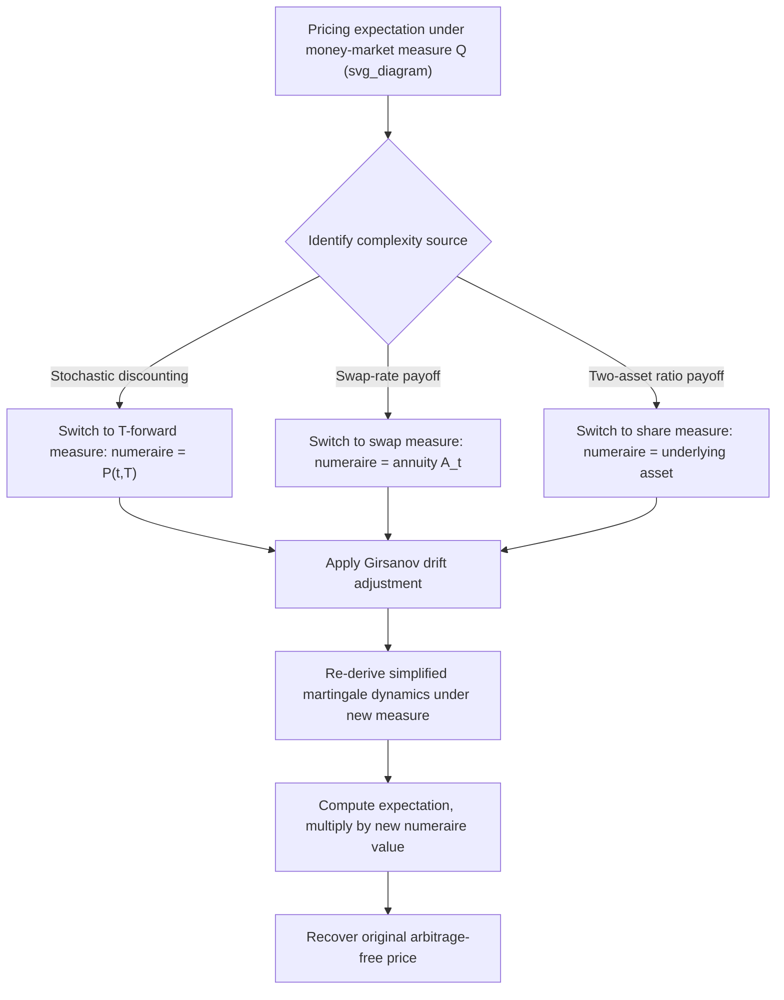

## Change of Numeraire Techniques

### Definition and Core Concept

The change of numeraire technique is a mathematical toolkit for re-expressing a derivative pricing expectation under one probability measure (associated with one numeraire asset) as an equivalent expectation under a different measure (associated with a different numeraire), without changing the underlying price. This is not merely a notational convenience — for many pricing problems, the correct choice of numeraire converts an intractable or highly complex expectation into a simple, closed-form-friendly one, by absorbing an awkward stochastic discounting or correlation term directly into the measure change itself.

The formal foundation was established by Geman, El Karoui, and Rochet (1995), building on the Harrison-Kreps-Pliska martingale pricing framework: for any two numeraires $N_t$ and $M_t$ (strictly positive, tradeable, non-dividend-paying assets, or their reinvested equivalents), there exists a Radon-Nikodym derivative process linking their associated equivalent martingale measures $\mathbb{Q}^N$ and $\mathbb{Q}^M$, and any arbitrage-free price computed under one measure/numeraire pair equals the price computed under any other valid pair.

### The Radon-Nikodym Derivative: Mechanics of the Change

Given numeraires $N$ and $M$ with associated measures $\mathbb{Q}^N$ and $\mathbb{Q}^M$, the Radon-Nikodym derivative process is:

$$\frac{d\mathbb{Q}^M}{d\mathbb{Q}^N}\bigg|_{\mathcal{F}_t} = \frac{M_t/M_0}{N_t/N_0}$$

This allows any expectation under $\mathbb{Q}^N$ to be rewritten as an expectation under $\mathbb{Q}^M$ via:

$$\mathbb{E}^{\mathbb{Q}^N}\left[\frac{X}{N_T}\,\middle|\,\mathcal{F}_t\right] \cdot N_t = \mathbb{E}^{\mathbb{Q}^M}\left[\frac{X}{M_T}\,\middle|\,\mathcal{F}_t\right] \cdot M_t$$

for any $\mathcal{F}_T$-measurable payoff $X$. Both sides equal the same time-$t$ price of the claim paying $X$ at $T$ — this identity is the operational heart of the technique: whichever numeraire makes the right-hand or left-hand expectation easier to compute is the one a practitioner should choose.

### Step-by-Step General Procedure

**Step 1**: Identify the source of computational difficulty in the pricing expectation under the current (typically money-market) measure — commonly a stochastic discount factor correlated with the payoff, or a payoff naturally expressed as a ratio of two asset prices.

**Step 2**: Select a numeraire $N$ that eliminates or simplifies that difficulty. Common choices include a zero-coupon bond (removes stochastic discounting for a fixed maturity), an annuity (simplifies swap-rate-based payoffs), or the underlying asset itself (simplifies certain ratio-based or exchange-option payoffs).

**Step 3**: Apply Girsanov's theorem to determine how the drift of each relevant driving Brownian motion changes under the new measure $\mathbb{Q}^N$ — the diffusion (volatility) coefficients are unaffected by a numeraire change; only drift terms shift.

**Step 4**: Re-derive the dynamics of the payoff-relevant variable(s) under $\mathbb{Q}^N$, exploiting the fact that ratios of tradeable assets to the chosen numeraire are, by construction, martingales under $\mathbb{Q}^N$.

**Step 5**: Compute the now-simplified expectation under $\mathbb{Q}^N$, then multiply by $N_0$ (or $N_t$, for a time-$t$ price) to recover the actual derivative price.

### Girsanov Drift Adjustment Formula

If an asset $X_t$ follows $dX_t = \mu_t X_t\,dt + \sigma_t X_t\,dW_t^N$ under measure $\mathbb{Q}^N$, and $\sigma_N(t)$ denotes the volatility of the numeraire $N_t$ (i.e., $dN_t/N_t = r_t\,dt + \sigma_N(t)\,dW_t^N$ in vector/diffusion form), switching to a new numeraire $M$ shifts the drift according to:

$$dW_t^N = dW_t^M - \left(\sigma_M(t) - \sigma_N(t)\right)dt$$

so that:

$$dX_t = \left[\mu_t + \sigma_t\left(\sigma_M(t)-\sigma_N(t)\right)\right]X_t\,dt + \sigma_t X_t\,dW_t^M$$

This single formula generalizes across every specific numeraire-change application below: the volatility term $\sigma_t$ never changes, only the drift, and the drift adjustment is always the product of the asset's own volatility and the *difference* between the new and old numeraire's volatilities (scaled by their correlation, in multi-dimensional settings).

### Application 1: Money-Market to T-Forward Measure

Switching from the money-market measure $\mathbb{Q}$ (numeraire $B_t = e^{\int r_s ds}$) to the $T$-forward measure $\mathbb{Q}^T$ (numeraire $P(t,T)$, the zero-coupon bond) removes the stochastic discount factor from interest-rate-sensitive pricing problems.

**Key Points**

- Under $\mathbb{Q}^T$, the forward price $F(t,T) = S_t/P(t,T)$ of any asset is a martingale, so $\mathbb{E}^{\mathbb{Q}^T}[S_T] = F(0,T)$ directly — no separate discounting step is needed inside the expectation.
- This is the standard technique for pricing caps, floors, and bond options, where jointly modeling the correlation between the discount factor and the payoff-relevant rate under the money-market measure would otherwise require a more complex joint distribution.
- When interest rates are deterministic, $P(t,T)$ has zero volatility, so the drift adjustment vanishes entirely and $\mathbb{Q}^T = \mathbb{Q}$ — this is why the forward-measure machinery is only strictly necessary in stochastic-rate settings.

### Application 2: Money-Market to Swap (Annuity) Measure

For swaption pricing, switching to the annuity numeraire $A_t = \sum_{i=1}^n \tau_i P(t,T_i)$ makes the forward swap rate $R_{swap}(t)$ a martingale under the associated swap measure $\mathbb{Q}^A$:

$$V_{swaption} = A_0 \cdot \mathbb{E}^{\mathbb{Q}^A}\left[\max(R_{swap}(T_0) - K, 0)\right]$$

**Key Points**

- This decomposition is precisely what allows market-standard swaption pricing formulas (e.g., the Black-76-style lognormal swap-rate model, or SABR-based extensions) to treat $R_{swap}$ as a simple driftless diffusion under $\mathbb{Q}^A$, sidestepping the need to model the full multi-curve discounting structure explicitly inside the expectation.
- The annuity itself is a portfolio of zero-coupon bonds, so its volatility (needed for the Girsanov drift adjustment when switching between the swap measure and other measures) is a weighted combination of the individual bond volatilities.

### Application 3: Money-Market to Share Measure

Using the underlying asset $S_t$ itself as numeraire produces the share measure $\mathbb{Q}^S$, valuable for exchange options and quanto-style adjustments. The classic application is decomposing the Black-Scholes call price:

$$C_0 = S_0\,\mathbb{Q}^S(S_T > K) - K\,P(0,T)\,\mathbb{Q}^T(S_T > K)$$

Here $N(d_1) = \mathbb{Q}^S(S_T > K)$ and $N(d_2) = \mathbb{Q}^T(S_T > K)$ — the two probability terms in the standard Black-Scholes formula are literally probabilities under two *different* measures (share measure and forward/risk-neutral measure respectively), a fact often obscured in introductory derivations that present both terms as if computed under a single measure.

**Margrabe's Formula (Exchange Option) via Share Measure**: For an option to exchange asset $Y$ for asset $X$ (payoff $\max(X_T - Y_T, 0)$), using $Y_t$ as numeraire converts the two-asset problem into a single-variable problem in the ratio $X_t/Y_t$:

$$V_0 = Y_0\left[\frac{X_0}{Y_0}N(d_1') - N(d_2')\right]$$

where $d_1', d_2'$ depend on the volatility of the ratio $X_t/Y_t$, which by Itô's Lemma and the correlation between $X$ and $Y$ equals $\sigma_{XY}^2 = \sigma_X^2 + \sigma_Y^2 - 2\rho\sigma_X\sigma_Y$. This single-variable reduction is only tractable because the numeraire choice eliminates the need to track $X$ and $Y$ as two separate stochastic drivers within the expectation.

### Numeraire Change Flow Diagram

### Worked Example: Deriving the Black-Scholes Formula via Numeraire Change

**Setup:** $dS_t = rS_t\,dt + \sigma S_t\,dW_t^{\mathbb{Q}}$ under the risk-neutral (money-market) measure, constant $r$ and $\sigma$, strike $K$, maturity $T$.

**Step 1 — Switch to the share measure $\mathbb{Q}^S$.** The numeraire is $S_t$ itself, with volatility $\sigma_N(t) = \sigma$ (since $S_t$'s own diffusion coefficient is $\sigma$). Applying the Girsanov drift adjustment to any other asset's dynamics under $\mathbb{Q}^S$ shifts drift by $+\sigma \times \sigma$ relative to the money-market measure (using the general formula with $\sigma_M - \sigma_N = \sigma - 0 = \sigma$ for the money-market-to-share-measure switch, then reversing sign appropriately per the direction of the change).

**Step 2 — Under $\mathbb{Q}^S$, the process $1/S_t$ (needed to express the strike-discounting term) follows a driftless-adjusted dynamic** such that $S_T/S_t$ remains lognormal with an adjusted drift consistent with $\mathbb{Q}^S$-martingale requirements for other assets, specifically shifting the effective drift used in $\mathbb{Q}^S(S_T > K)$ to $r + \tfrac{1}{2}\sigma^2$ instead of $r - \tfrac{1}{2}\sigma^2$.

**Step 3 — Compute the two probabilities:**

$$\mathbb{Q}^S(S_T > K) = N\left(\frac{\ln(S_0/K) + (r+\tfrac{1}{2}\sigma^2)T}{\sigma\sqrt{T}}\right) = N(d_1)$$

$$\mathbb{Q}^T(S_T > K) = N\left(\frac{\ln(S_0/K) + (r-\tfrac{1}{2}\sigma^2)T}{\sigma\sqrt{T}}\right) = N(d_2)$$

**Step 4 — Assemble the price:**

$$C_0 = S_0 N(d_1) - Ke^{-rT}N(d_2)$$

This is exactly the standard Black-Scholes formula, but derived entirely through the mechanics of numeraire change rather than by directly solving the Black-Scholes PDE — illustrating how the technique provides an alternative, often more transparent, derivation route for results that can also be obtained via PDE methods.

### Comparison: Direct PDE Approach vs. Change of Numeraire Approach

| Aspect | Direct PDE / Feynman-Kac Approach | Change of Numeraire Approach |
| --- | --- | --- |
| Core method | Solve parabolic PDE with terminal condition | Reformulate expectation under simpler measure |
| Handles stochastic rates naturally | Requires higher-dimensional PDE | Often reduces to single-factor expectation under forward measure |
| Handles multi-asset/exchange options | Requires multi-dimensional PDE | Reduces dimensionality via share/ratio measure |
| Typical use in practice | Finite-difference grid pricing, sensitivities | Closed-form derivations, Monte Carlo drift specification |
| Conceptual transparency for correlated payoffs | Can obscure the role of correlation | Makes correlation's role explicit via drift adjustment term |

### Application to Quanto Derivatives

Quanto products (payoffs in one currency based on an asset denominated in another) are a canonical use case for change of numeraire across currencies. Switching between the domestic and foreign risk-neutral measures introduces a Girsanov drift adjustment proportional to the correlation between the FX rate and the underlying asset:

$$\mu^{domestic} = \mu^{foreign} - \rho_{S,FX}\,\sigma_S\,\sigma_{FX}$$

This adjustment — often called the "quanto drift correction" or "quanto adjustment" — falls directly out of the standard Girsanov formula applied to the specific case of a currency-numeraire change, and is a widely used practical illustration of why the general change-of-numeraire machinery has direct pricing consequences beyond pure notational convenience.

### Practical Implementation Notes

- In Monte Carlo simulation frameworks, the choice of numeraire/measure determines which drift term is coded into the simulated SDE for each asset; production systems must ensure that every simulated factor (rates, FX, equity, volatility) uses drift terms consistent with a single, explicitly chosen measure throughout a given simulation, since inconsistent drift specifications across factors are a documented source of subtle mispricing bugs.
- Multi-curve interest-rate frameworks (post-2008, separating discounting curves from forwarding curves) require careful specification of which numeraire (often an overnight-indexed-swap-based discount curve) is used for the money-market/discounting measure, distinct from the forward curve used for rate projection — a practical complication layered on top of the classical single-curve change-of-numeraire theory. [Unverified: the precise conventions for multi-curve numeraire selection vary by institution and by the specific interest-rate benchmark regime in effect, and should be confirmed against current market practice and each institution's own model documentation.]
- Change-of-numeraire techniques underpin the LIBOR/SOFR market model (BGM model) framework, where each forward rate is modeled as a martingale under its own natural forward measure, requiring careful drift adjustments (via the technique described here) when simulating multiple forward rates jointly under a single common measure.

### Related Topics

- Risk Neutral Measures and Numeraires
- The Fundamental Theorems of Asset Pricing
- Girsanov's Theorem and Change of Measure
- Margrabe's Formula for Exchange Options
- Quanto Derivatives and Cross-Currency Pricing Adjustments
- LIBOR/SOFR Market Models (BGM Framework)
- Swaption Pricing and the Swap Market Model
- Multi-Curve Interest Rate Frameworks Post-2008