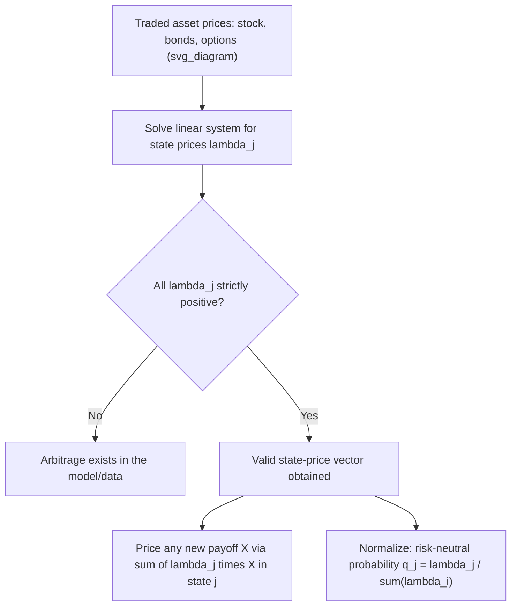

## State Prices and Arrow Debreu Securities

### Definition and Core Concept

An **Arrow-Debreu security** (also called a "pure state security" or "elementary security") is a hypothetical financial contract that pays exactly $1$ unit of currency if a specific state of the world occurs at a specific future date, and $0$ otherwise. The current price of such a security is called its **state price**, and the collection of all state prices across every possible future state constitutes the state-price system that underlies all arbitrage-free asset pricing. State prices are the discrete-state analog of the risk-neutral pricing kernel, and they provide perhaps the most direct and intuitive bridge between the abstract concept of an equivalent martingale measure and the concrete mechanics of valuing any payoff as a portfolio of elementary bets on future outcomes.

Formally, in a model with a finite set of possible states $\{\omega_1, \omega_2, \ldots, \omega_n\}$ at time $T$, the Arrow-Debreu price $\lambda_j$ is the time-0 price of a security paying $1$ if state $\omega_j$ occurs and $0$ otherwise. Given the full set of state prices, **any** payoff $X$ that pays $X(\omega_j)$ in state $\omega_j$ can be priced by simple linear combination:

$$V_0 = \sum_{j=1}^n \lambda_j \, X(\omega_j)$$

This is the discrete-state generalization of the risk-neutral discounted-expectation pricing formula, and in fact the two are directly related: $\lambda_j = e^{-rT} q_j$, where $q_j$ is the risk-neutral probability of state $\omega_j$ (assuming a constant risk-free rate $r$) — state prices are simply risk-neutral probabilities that have already been discounted.

### Relationship to Risk-Neutral Probabilities

**Key Points**

- The risk-neutral probability of state $\omega_j$ can be recovered from state prices by normalizing: $q_j = \lambda_j / \sum_i \lambda_i = \lambda_j \cdot e^{rT}$ (using that $\sum_i \lambda_i = e^{-rT}$, the price of a security paying $1$ regardless of which state occurs, i.e., a zero-coupon bond).
- Conversely, given risk-neutral probabilities and the discount factor, state prices follow immediately: $\lambda_j = e^{-rT}q_j$.
- This equivalence means that constructing a set of Arrow-Debreu prices and constructing an equivalent martingale measure are, in a finite-state model, mathematically the same exercise viewed from two angles — one emphasizes prices of elementary claims, the other emphasizes probabilities under a risk-neutral measure.

### No-Arbitrage Requires Strictly Positive State Prices

A crucial economic requirement is that **every** valid state price must be strictly positive: $\lambda_j > 0$ for all $j$. If any $\lambda_j \leq 0$ were consistent with the market's observed traded asset prices, an arbitrage opportunity would exist:

- If $\lambda_j < 0$: buying the Arrow-Debreu security for state $j$ would generate positive cash today while its payoff is either $0$ (if state $j$ doesn't occur) or $1$ (if it does) — never negative — a strict arbitrage (receive money today, never owe money later).
- If $\lambda_j = 0$: the security paying $1$ in state $j$ and $0$ elsewhere would be free, yet has a non-negative payoff, which is a "free lunch" in the weak arbitrage sense.

This positivity requirement is precisely the discrete-state, finite-dimensional version of the First Fundamental Theorem of Asset Pricing: a set of strictly positive state prices consistent with observed traded asset prices exists if and only if the market is arbitrage-free.

### Construction from Traded Asset Prices

In practice, Arrow-Debreu securities are not directly traded; state prices must be inferred (extracted) from the prices of traded assets that pay off differently across states — most naturally, options at different strikes.

**Breeden-Litzenberger Result**: For a continuum of states parameterized by the terminal underlying price $S_T$, the state-price density (the continuous analog of discrete state prices) can be extracted directly from the second derivative of European call option prices with respect to strike:

$$\lambda(K) = e^{-rT} \frac{\partial^2 C}{\partial K^2}\bigg|_{K}$$

This remarkable result (Breeden and Litzenberger, 1978) shows that the entire risk-neutral probability density function of the terminal stock price can be recovered purely from the observed market prices of European calls (or puts) across a continuum of strikes, without needing any assumption about the underlying's stochastic process — it follows directly from static replication arguments using butterfly spreads.

### Butterfly Spreads as Discrete Approximations to Arrow-Debreu Securities

A **butterfly spread** — long one call at $K-\Delta K$, short two calls at $K$, long one call at $K+\Delta K$ — approximates an Arrow-Debreu security paying off (approximately) only in a narrow range around $S_T = K$:

$$\text{Butterfly Payoff} \approx \Delta K \cdot \mathbb{1}_{\{S_T \approx K\}}$$

**Key Points**

- As $\Delta K \to 0$, the (normalized) butterfly spread payoff converges to a Dirac delta function centered at $K$, and its price converges to (a scaled version of) the state-price density at that point — this is the practical, replication-based intuition behind the Breeden-Litzenberger formula.
- This construction is directly used in practice to extract implied risk-neutral densities from observed options markets: computing discrete second differences of quoted call (or put) prices across a strike grid approximates $\partial^2 C/\partial K^2$, yielding an empirical estimate of the state-price density without needing to assume any particular model (e.g., Black-Scholes, Heston) for the underlying.

### Worked Example: Extracting State Prices in a Simple Multi-State Model

**Setup:** A single-period model with three possible states at $T=1$: $S_T \in \{80, 100, 120\}$, risk-free rate such that $e^{rT} = 1.05$. Suppose two traded assets exist: the stock itself ($S_0 = 100$) and a European call struck at $K=100$ trading at $C_0 = 5$.

**Step 1 — Set up the pricing equations.** Let $\lambda_1, \lambda_2, \lambda_3$ be the state prices for $S_T = 80, 100, 120$ respectively.

Stock pricing equation: $100 = 80\lambda_1 + 100\lambda_2 + 120\lambda_3$

Call pricing equation (payoff is $\max(S_T-100,0)$, so $0, 0, 20$ across the three states): $5 = 0 \cdot \lambda_1 + 0 \cdot \lambda_2 + 20\lambda_3$

Bond pricing equation (a security paying $1$ regardless of state has price $e^{-rT} = 1/1.05 \approx 0.9524$): $0.9524 = \lambda_1 + \lambda_2 + \lambda_3$

**Step 2 — Solve for $\lambda_3$ from the call equation:**

$$\lambda_3 = 5/20 = 0.25$$

**Step 3 — Substitute into the bond and stock equations:**

$$\lambda_1 + \lambda_2 = 0.9524 - 0.25 = 0.7024$$

$$80\lambda_1 + 100\lambda_2 = 100 - 120(0.25) = 100 - 30 = 70$$

**Step 4 — Solve the two-equation system.** From the first equation, $\lambda_1 = 0.7024 - \lambda_2$. Substituting:

$$80(0.7024 - \lambda_2) + 100\lambda_2 = 70$$

$$56.19 - 80\lambda_2 + 100\lambda_2 = 70$$

$$20\lambda_2 = 13.81 \implies \lambda_2 = 0.6905$$

$$\lambda_1 = 0.7024 - 0.6905 = 0.0119$$

**Step 5 — Verify all state prices are strictly positive:** $\lambda_1 \approx 0.0119 > 0$, $\lambda_2 \approx 0.6905 > 0$, $\lambda_3 = 0.25 > 0$ — this confirms the model (given these specific input prices) is arbitrage-free, since a valid positive state-price vector exists that reprices both traded assets consistently.

**Step 6 — Use these state prices to price a new payoff**, e.g., a put option struck at $K=100$ (payoff $20, 0, 0$ across the three states):

$$P_0 = 20\lambda_1 + 0 \cdot \lambda_2 + 0 \cdot \lambda_3 = 20 \times 0.0119 \approx 0.238$$

This illustrates the core power of state prices: once extracted from a sufficient set of traded instruments, they price *any* payoff defined over the same state space by simple linear combination — no further model assumptions, further calibration, or re-solving is needed.

### Diagram: State Price Extraction and Application

### Connection to the Pricing Kernel / Stochastic Discount Factor

In continuous-state, continuous-time settings, the discrete state-price vector generalizes to the **pricing kernel** (or stochastic discount factor) $M_t$, satisfying:

$$S_0 = \mathbb{E}^{\mathbb{P}}\left[M_T \cdot S_T\right]$$

for any traded asset, under the *real-world* measure $\mathbb{P}$ (in contrast to the risk-neutral formulation, which uses $\mathbb{Q}$ and a simple discount factor). The pricing kernel is related to state prices via $M_T(\omega_j) = \lambda_j / p_j$, where $p_j$ is the real-world (physical) probability of state $\omega_j$ — this connects the state-price framework directly to asset-pricing theory in economics and finance more broadly (e.g., the consumption-based capital asset pricing model, where the pricing kernel is tied to marginal utility of consumption). [Inference: the specific economic interpretation of the pricing kernel as marginal utility ratios is a modeling choice from consumption-based asset pricing theory, distinct from the model-free, purely no-arbitrage-based state-price extraction described in the sections above.]

### Applications in Derivatives and Structured Products

**Key Points**

- **Model-free density extraction**: Because Breeden-Litzenberger derives the state-price density purely from observed option prices via static replication, it provides a way to check whether a specific pricing model (e.g., Black-Scholes with a single volatility) is consistent with the market-implied distribution, independent of committing to any particular stochastic process for the underlying.
- **Exotic and path-independent payoff pricing**: Any payoff that depends only on the terminal value of the underlying (not on the path taken to get there) can, in principle, be priced directly from the extracted state-price density via integration, without needing a full dynamic model — useful for validating more complex model-based prices for European-style exotic payoffs.
- **Variance swap replication**: The model-free variance swap replication formula (which prices a variance swap as a weighted portfolio of European options across all strikes) is itself a direct application of state-price/Arrow-Debreu-style reasoning, decomposing a complex payoff into a continuum of elementary option positions.

### Limitations and Practical Considerations

- **Requires option prices across a continuum of strikes**: True Breeden-Litzenberger extraction needs prices at every strike, which is never available in practice — actual markets provide only a discrete, finite set of liquid strikes, so practical state-price/density extraction always involves some interpolation or smoothing across the available quotes, introducing model-dependence back into what is theoretically a model-free technique.
- **Numerical sensitivity of the second derivative**: Computing $\partial^2 C/\partial K^2$ from a small number of discrete, noisy market quotes is numerically sensitive to bid-ask spreads and quote sparsity; small pricing errors in the input option quotes can produce materially different implied state-price densities, particularly at strikes far from the money where liquidity is thin.
- **Only applies directly to path-independent payoffs**: State prices extracted this way describe the distribution of the terminal value only, and cannot, on their own, price path-dependent payoffs (Asian options, barriers, lookbacks) without additional assumptions about the underlying's dynamics between now and maturity. [Unverified: the specific numerical stability thresholds or smoothing techniques used to handle sparse strike grids vary by practitioner and system, and are not standardized across the industry.]

### Related Topics

- The Fundamental Theorems of Asset Pricing
- Risk Neutral Measures and Numeraires
- Breeden-Litzenberger Formula and Risk-Neutral Density Extraction
- Implied Trees and Tree Calibration
- Variance Swap Replication via Static Option Portfolios
- Stochastic Discount Factor and Consumption-Based Asset Pricing
- Volatility Smile and Skew: Empirical Features and Causes