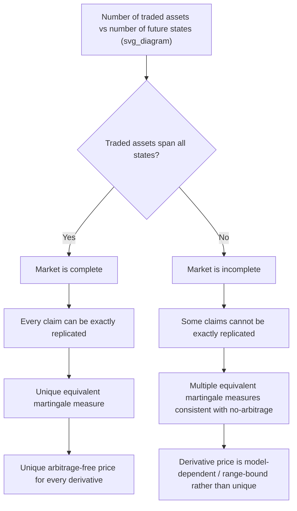

## Market Completeness and Replication

### Definition and Core Concept

**Market completeness** is the property that every contingent claim (every well-defined derivative payoff, measurable with respect to the information available at its payoff date) can be exactly replicated by a self-financing dynamic trading strategy using only the traded assets already available in the market (typically the underlying asset and a risk-free bond). **Replication** is the specific dynamic trading strategy — how much of the underlying and risk-free asset to hold at each point in time — that reproduces a derivative's payoff exactly, regardless of which future state occurs. Replication is not merely a theoretical construct: it is the practical foundation of derivatives hedging, since a market-maker who has sold an option and constructs the replicating portfolio has, by definition, perfectly offset their risk exposure to the option's payoff.

Market completeness is directly tied to the Second Fundamental Theorem of Asset Pricing: a market is complete if and only if its equivalent martingale measure is unique. This connects the abstract measure-theoretic uniqueness condition to the concrete, practically meaningful question of whether every derivative in that market can actually be hedged.

### The Replication Argument: Core Logic

**Key Points**

- If a portfolio of traded assets can be constructed today, at some known cost, that is guaranteed to exactly match a derivative's payoff in every possible future state, then — by the no-arbitrage principle — the derivative's price today must equal the cost of constructing that replicating portfolio. Any other price would create an arbitrage (buy the cheaper of the two, sell the more expensive, pocket the riskless difference).
- The replication argument is what allows derivatives to be priced *without* needing to know investors' subjective probabilities or risk preferences for the underlying's future states — the price is pinned down purely by the cost of replication, which depends only on today's prices of the assets used in the replicating portfolio.
- This is the deep reason risk-neutral pricing "works": the risk-neutral measure is precisely the measure under which the replication cost equals the discounted expected payoff, and this equivalence is guaranteed whenever replication is possible.

### Dynamic Replication in the Black-Scholes Framework

In the continuous-time Black-Scholes model, a European option can be replicated by continuously rebalancing a portfolio holding $\Delta_t = \partial V/\partial S$ shares of the underlying and the remainder in the risk-free asset, where $V(S_t, t)$ is the option's value as a function of the current stock price and time.

**Self-financing condition**: The replicating portfolio's value changes purely due to gains/losses on its existing holdings, with no external cash injected or withdrawn after the initial setup:

$$dV_t = \Delta_t\,dS_t + r(V_t - \Delta_t S_t)\,dt$$

This says the portfolio's value evolves from capital gains on the stock position ($\Delta_t\,dS_t$) plus interest earned (or paid) on the remaining cash/bond position ($V_t - \Delta_t S_t$, invested at the risk-free rate). Matching this dynamic exactly to the option's actual value process (via Itô's Lemma applied to $V(S_t,t)$) is precisely the derivation that produces the Black-Scholes PDE.

**Continuous rebalancing requirement**: Because $\Delta_t = \partial V/\partial S$ changes continuously as $S_t$ and $t$ evolve, exact replication in continuous time requires continuous (instantaneous) rebalancing of the hedge ratio — an idealization not literally achievable in practice, where trading occurs in discrete time and incurs transaction costs, a gap that is the source of well-documented hedging error (tracking error) in real-world derivatives desks relative to the idealized theoretical model.

### One-Period Binomial Replication (Discrete-Time Illustration)

**Setup:** $S_0 = 100$, up state $S_u = 120$, down state $S_d = 90$, gross risk-free return $e^{rT} = 1.05$, target payoff to replicate: a call option struck at $K=100$, paying $20$ in the up state and $0$ in the down state.

**Step 1 — Set up the replicating portfolio equations.** Let $\Delta$ = shares of stock, $B$ = amount invested in the risk-free asset (bond), such that the portfolio's value matches the option payoff in both states:

$$\Delta \cdot 120 + B \cdot 1.05 = 20 \quad \text{(up state)}$$

$$\Delta \cdot 90 + B \cdot 1.05 = 0 \quad \text{(down state)}$$

**Step 2 — Solve for $\Delta$** by subtracting the two equations:

$$\Delta(120-90) = 20 - 0 \implies \Delta = 20/30 = 2/3$$

**Step 3 — Solve for $B$** by substituting back into the down-state equation:

$$(2/3)(90) + 1.05B = 0 \implies 60 + 1.05B = 0 \implies B = -57.143$$

**Step 4 — Compute the replication cost (the option's no-arbitrage price):**

$$C_0 = \Delta S_0 + B = (2/3)(100) - 57.143 = 66.667 - 57.143 \approx 9.524$$

**Step 5 — Verify replication exactly reproduces the payoff in both states:**

- Up state: $(2/3)(120) + 1.05(-57.143) = 80 - 60 = 20$ ✓ (matches option payoff)
- Down state: $(2/3)(90) + 1.05(-57.143) = 60 - 60 = 0$ ✓ (matches option payoff)

This confirms exact replication: the portfolio of $2/3$ shares of stock financed partly by borrowing $57.143$ at the risk-free rate produces exactly the option's payoff in every possible future state, at a cost today of $9.524$ — which must therefore be the option's arbitrage-free price.

### Diagram: Replication and Market Completeness

### Conditions for Market Completeness

**Key Points**

- **Discrete-state models**: A one-period model is complete if and only if the number of linearly independent traded asset payoff vectors equals the number of possible future states. In the two-state binomial example above, two assets (stock and bond) exactly span two states, so the market is complete.
- **Continuous-time diffusion models**: A market driven by a single Brownian motion (like Black-Scholes) with one risky asset and the risk-free asset is complete — every contingent claim contingent on that single source of randomness can be replicated by continuously trading just those two assets, a consequence of the martingale representation theorem.
- **Multiple sources of randomness require matching traded assets**: If a model has $n$ independent sources of randomness (e.g., a stochastic volatility model has two: one driving the asset, one driving volatility), completeness generally requires at least $n$ independently traded risky assets whose payoffs are not redundant combinations of each other, to span the full space of possible claims.

### Sources of Market Incompleteness

**Stochastic volatility**: In the Heston model, two Brownian motions drive the system (one for the asset, one for variance), but typically only the underlying asset itself is directly traded — variance is not a directly tradeable asset (absent a sufficiently liquid variance swap market). This mismatch between sources of randomness (two) and traded hedging instruments (one) means options cannot be perfectly replicated using only the stock and risk-free bond; the market is incomplete, and multiple equivalent martingale measures (differing in their assumed "market price of volatility risk") are consistent with no-arbitrage.

**Jump risk**: In jump-diffusion models (e.g., Merton's model), a sudden discontinuous jump cannot be hedged by continuous trading in the underlying alone, since continuous trading strategies can only replicate continuous payoff changes — a discrete jump requires either additional traded instruments (e.g., other options) or acceptance of residual, unhedgeable jump risk.

**Trading constraints and frictions**: Even in an otherwise theoretically complete model, real-world frictions — transaction costs, discrete (non-continuous) trading times, borrowing constraints, or short-sale restrictions — can prevent the idealized replication strategy from being executed exactly, introducing practical incompleteness even when the underlying mathematical model would be complete under frictionless, continuous trading assumptions.

### Practical Hedging as Approximate Replication

**Key Points**

- In practice, exact continuous replication is impossible; real derivatives desks perform **discrete-time delta hedging**, rebalancing the replicating portfolio at finite intervals (e.g., daily) rather than continuously, which introduces hedging error relative to the theoretical continuous-replication ideal.
- **Higher-order hedging** (gamma hedging, vega hedging) supplements simple delta replication by additionally trading other options to offset second-order sensitivities (convexity in the underlying, sensitivity to volatility changes), partially compensating for the market's practical incompleteness with respect to volatility risk in particular.
- The gap between the theoretical replication cost (the "fair value" under a chosen model) and the actual realized cost of a discrete-time hedging strategy is a central concern of derivatives risk management, often analyzed through the lens of hedging error variance or the "P&L explain" framework used by trading desks to attribute realized profit and loss to specific risk factors.

### Comparison: Complete vs. Incomplete Market Pricing

| Aspect | Complete Market | Incomplete Market |
| --- | --- | --- |
| Equivalent martingale measure | Unique | Multiple measures consistent with no-arbitrage |
| Derivative price | Uniquely determined by replication cost | Model-dependent; typically calibrated to observed prices of liquid instruments |
| Hedging | Perfect replication possible (in continuous time, frictionless) | Perfect replication impossible; residual unhedgeable risk remains |
| Example model | Black-Scholes (single risky asset, one Brownian motion) | Heston (stochastic volatility), Merton jump-diffusion |
| Practical implication | Price is essentially a "mechanical" no-arbitrage computation | Price reflects both no-arbitrage bounds and a chosen market price of risk/model calibration |

### Practical Implementation Notes

- Derivatives pricing desks generally do not treat "market completeness" as a binary property to verify before pricing; instead, they select a model (Black-Scholes, local volatility, stochastic volatility, jump-diffusion) appropriate to the product's risk profile, with the understanding that any model incorporating more sources of randomness than directly tradeable hedging instruments implies residual, unhedgeable model risk that must be managed via reserves, bid-offer spreads, or supplementary hedges in correlated but imperfect instruments.
- Replication-based reasoning underlies static replication techniques for certain exotic payoffs (e.g., replicating a variance swap via a portfolio of vanilla options across strikes, or replicating certain barrier options via portfolios of vanilla options), which can achieve near-perfect hedges for specific payoff structures even in markets that are not fully dynamically complete in the classical sense.
- When evaluating a new pricing model for a trading desk, a standard due-diligence question is: "what additional instruments would be needed to hedge the risk factors this model introduces?" — directly operationalizing the completeness/replication framework as a practical risk-management checklist rather than a purely theoretical concern. [Inference: the specific instruments and hedging approach chosen in practice vary by desk, product, and available market liquidity, and are not dictated by the theory alone.]

### Related Topics

- The Fundamental Theorems of Asset Pricing
- Risk Neutral Measures and Numeraires
- Martingale Representation Theorem
- Delta Hedging and Dynamic Replication Error
- Stochastic Volatility Models and Market Incompleteness
- Static Replication of Exotic Payoffs (Variance Swaps, Barrier Options)
- State Prices and Arrow Debreu Securities