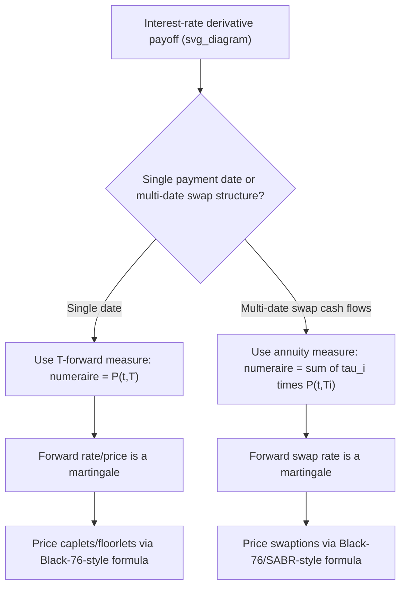

## Forward Measures and Annuity Measures

### Definition and Core Concept

The **forward measure** and **annuity (swap) measure** are two of the most practically important equivalent martingale measures in fixed-income derivatives pricing, each defined via a specific choice of numeraire that eliminates the awkward stochastic discounting problem inherent in interest-rate modeling. Both are direct applications of the change-of-numeraire technique, chosen specifically because they make the natural underlying variable of interest — a forward price/rate, or a forward swap rate — a driftless martingale, which dramatically simplifies both closed-form pricing formulas and the specification of market-standard models.

### The T-Forward Measure

**Definition**: The $T$-forward measure $\mathbb{Q}^T$ uses the zero-coupon bond price $P(t,T)$ (maturing at the option's payoff date $T$) as numeraire. Under $\mathbb{Q}^T$, the forward price of any traded asset for delivery at $T$,

$$F(t,T) = \frac{S_t}{P(t,T)}$$

is a martingale:

$$F(t,T) = \mathbb{E}^{\mathbb{Q}^T}\left[F(T,T)\,\middle|\,\mathcal{F}_t\right] = \mathbb{E}^{\mathbb{Q}^T}\left[S_T\,\middle|\,\mathcal{F}_t\right]$$

since $F(T,T) = S_T/P(T,T) = S_T/1 = S_T$ (a bond maturing at $T$ is worth $1$ at $T$ itself).

**Pricing formula**: A derivative with payoff $\Phi(S_T)$ at time $T$ is priced as:

$$V_0 = P(0,T)\,\mathbb{E}^{\mathbb{Q}^T}\left[\Phi(S_T)\right]$$

**Key Points**

- This formula separates the pricing problem cleanly into a deterministic-at-time-0 discount factor $P(0,T)$ multiplied by an expectation that no longer contains any explicit discount factor — the entire benefit of the forward-measure switch.
- Under the money-market (risk-neutral) measure $\mathbb{Q}$, by contrast, the analogous formula $V_0 = \mathbb{E}^{\mathbb{Q}}[e^{-\int_0^T r_s ds}\Phi(S_T)]$ requires jointly modeling the correlation between the stochastic discount factor and $\Phi(S_T)$ — a substantially harder computational problem when $\Phi$ depends on an interest-rate-sensitive payoff and rates are themselves stochastic.
- The forward measure is the natural pricing tool for **interest-rate caplets and floorlets**, since a caplet's payoff is naturally defined relative to a specific forward rate reset and payment date.

### Caplet Pricing Under the Forward Measure

A caplet paying $\tau \max(L(T_1,T_2) - K, 0)$ at time $T_2$ (where $L(T_1,T_2)$ is the LIBOR/forward rate set at $T_1$ for the period $[T_1,T_2]$, and $\tau$ is the accrual fraction) is priced under the $T_2$-forward measure as:

$$V_0 = \tau\,P(0,T_2)\,\mathbb{E}^{\mathbb{Q}^{T_2}}\left[\max(L(T_1,T_2)-K,0)\right]$$

Because $L(T_1,T_2)$ (suitably related to a forward bond price) is a martingale under $\mathbb{Q}^{T_2}$, this expectation, combined with an assumed lognormal or normal dynamic for $L$ under $\mathbb{Q}^{T_2}$, directly yields the market-standard Black-76 caplet pricing formula — one of the most direct and widely used practical payoffs of the forward-measure framework.

### The Annuity (Swap) Measure

**Definition**: The annuity measure $\mathbb{Q}^A$ uses the **annuity** — the present value of a stream of fixed-leg accrual-weighted discount factors corresponding to a specific underlying swap — as numeraire:

$$A_t = \sum_{i=1}^n \tau_i\,P(t,T_i)$$

where $T_1, \ldots, T_n$ are the fixed-leg payment dates of the underlying swap and $\tau_i$ are the corresponding accrual fractions.

**Key martingale property**: Under $\mathbb{Q}^A$, the forward swap rate $R_{swap}(t)$ — the fixed rate that would make the present value of the swap equal zero at time $t$ — is a martingale:

$$R_{swap}(t) = \mathbb{E}^{\mathbb{Q}^A}\left[R_{swap}(T_0)\,\middle|\,\mathcal{F}_t\right]$$

where $T_0$ is the swap's start date (typically also the swaption's exercise date).

**Swaption pricing formula**: A payer swaption (option to enter a swap paying fixed) with strike $K$ and exercise date $T_0$ is priced as:

$$V_0 = A_0\,\mathbb{E}^{\mathbb{Q}^A}\left[\max(R_{swap}(T_0)-K,0)\right]$$

**Key Points**

- This is the direct fixed-income analog of the Black-Scholes/Black-76 formula, but with the annuity replacing the simple discount factor — since a swap's payoff structure involves a stream of cash flows across multiple dates rather than a single payoff date, the annuity (a portfolio of discount factors) is the natural numeraire that makes the relevant underlying (the swap rate) a clean martingale.
- Market-standard swaption pricing (SABR-based or simple lognormal/normal Black-76-style models) relies entirely on this measure choice to justify treating the forward swap rate as a driftless stochastic process for calibration and pricing purposes.

### Relationship and Distinction Between the Two Measures

| Aspect | T-Forward Measure | Annuity (Swap) Measure |
| --- | --- | --- |
| Numeraire | Single zero-coupon bond $P(t,T)$ | Portfolio of bonds (annuity) $A_t = \sum \tau_i P(t,T_i)$ |
| Martingale variable | Forward price/rate for a single date $T$ | Forward swap rate (spanning multiple dates $T_1,\ldots,T_n$) |
| Natural product | Caplets, floorlets, single-period rate options, bond options | Swaptions, and other options on a swap rate |
| Payoff structure priced | Single payment date | Multi-payment-date stream (swap cash flows) |
| Underlying market model | Black-76 for caps/floors | Black-76 / SABR for swaptions |

The two measures are conceptually parallel — both remove stochastic discounting by choosing a numeraire matched to the payoff's natural cash-flow structure — but the annuity measure generalizes the single-bond forward measure to handle a multi-date cash flow stream, which is precisely what a swap (and hence a swaption) requires.

### Girsanov Drift Adjustment: Moving Between Measures

Switching from the money-market measure $\mathbb{Q}$ to the $T$-forward measure $\mathbb{Q}^T$ shifts drift by an amount proportional to the covariance between the asset's volatility and the bond's volatility $\sigma_P(t,T)$:

$$dS_t = \left[\mu_t + \sigma_t\rho_{S,P}\sigma_P(t,T)\right]S_t\,dt + \sigma_t S_t\,dW_t^{\mathbb{Q}^T}$$

Switching to the annuity measure $\mathbb{Q}^A$ requires the analogous adjustment using the annuity's volatility, which — since $A_t$ is itself a portfolio of bonds with different maturities — is a weighted combination of the individual bond volatilities in the annuity:

$$\sigma_A(t) = \frac{\sum_i \tau_i P(t,T_i)\sigma_{P_i}(t)}{\sum_i \tau_i P(t,T_i)}$$

**Key Points**

- When interest rates are deterministic, both $\sigma_P(t,T) = 0$ and $\sigma_A(t) = 0$, so both the forward measure and the annuity measure coincide with the money-market measure — the drift adjustments vanish entirely, and the forward/annuity machinery becomes unnecessary (which is why these measures matter specifically, and only, in stochastic-interest-rate settings).
- In practice, the annuity's volatility computation requires a full term-structure model (e.g., a short-rate model or a full LIBOR market model) to specify each individual bond volatility $\sigma_{P_i}(t)$ consistently.

### Worked Example: Simple Caplet Pricing Under the Forward Measure

**Setup:** Forward LIBOR rate $L_0 = 0.04$ (4%) for the period $[T_1, T_2] = [1, 1.25]$ years, accrual $\tau = 0.25$, forward-rate volatility $\sigma = 0.30$ (30%, typical for shorter-dated rate volatility), strike $K = 0.04$ (at-the-money), discount factor $P(0, T_2) = 0.95$.

**Step 1 — Apply Black-76 formula for the caplet** (lognormal $L$ under $\mathbb{Q}^{T_2}$, at-the-money so $d_1 = \sigma\sqrt{T_1}/2$, $d_2 = -\sigma\sqrt{T_1}/2$):

$$d_1 = \frac{0.30\sqrt{1}}{2} = 0.15, \qquad d_2 = -0.15$$

**Step 2 — Compute $N(d_1)$ and $N(d_2)$:** Using standard normal CDF values, $N(0.15) \approx 0.5596$ and $N(-0.15) \approx 0.4404$.

**Step 3 — Apply the Black-76 caplet formula:**

$$\text{Caplet} = \tau\,P(0,T_2)\left[L_0 N(d_1) - K N(d_2)\right]$$

$$= 0.25 \times 0.95 \times \left[0.04 \times 0.5596 - 0.04 \times 0.4404\right]$$

$$= 0.2375 \times \left[0.02238 - 0.01762\right] = 0.2375 \times 0.00477 \approx 0.001133$$

The caplet is worth approximately **0.1133%** of the relevant notional, illustrating the direct application of the forward-measure framework: the entire computation used only the forward rate's own volatility and the appropriate discount factor, without needing to separately model the joint dynamics of the discount factor and the rate — precisely the simplification the forward measure provides.

### Diagram: Choosing Between Forward and Annuity Measures

### Practical Implementation Notes

- Multi-curve frameworks (standard since the 2008 financial crisis, separating discounting curves from forward-rate-projection curves) require care in specifying exactly which curve's zero-coupon bonds define the forward or annuity numeraire versus which curve is used for forward-rate projection — a layer of complexity added on top of the classical single-curve forward/annuity measure theory. [Unverified: the precise conventions differ by institution, currency, and the specific benchmark rate regime (e.g., post-LIBOR transition to SOFR/€STR/SONIA), and should be verified against current market practice.]
- The LIBOR/SOFR market model (BGM framework) extends the forward-measure concept to model an entire family of forward rates simultaneously, each naturally a martingale under its own forward measure, requiring Girsanov drift adjustments (per the change-of-numeraire technique) whenever multiple forward rates are simulated jointly under a single common measure — this is a direct large-scale application of the concepts introduced here.
- SABR and other stochastic-volatility extensions to the basic Black-76 forward/swap-rate models retain the same underlying measure framework (forward or annuity measure) but replace the simple lognormal/normal dynamic assumption for the forward rate or swap rate with a richer stochastic volatility process, improving the fit to observed volatility smiles in caps/floors and swaption markets respectively.

### Related Topics

- Risk Neutral Measures and Numeraires
- Change of Numeraire Techniques
- Black-76 Model for Caps, Floors, and Swaptions
- LIBOR/SOFR Market Models (BGM Framework)
- SABR Model for Swaption and Cap Volatility Smiles
- Multi-Curve Interest Rate Frameworks Post-2008
- The Fundamental Theorems of Asset Pricing