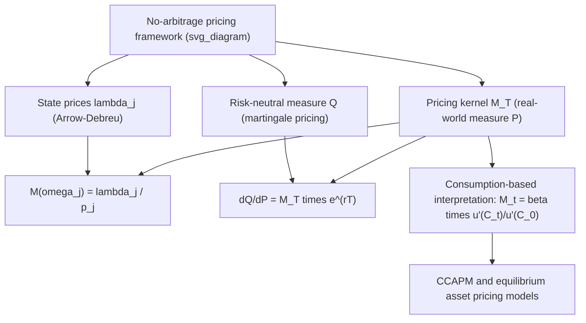

## Pricing Kernels and Stochastic Discount Factors

### Definition and Core Concept

A **pricing kernel** (also called a **stochastic discount factor**, SDF) is a stochastic process $M_t$ such that the price of any traded asset can be expressed as the *real-world* (physical measure $\mathbb{P}$) expectation of that asset's future payoff, multiplied by the pricing kernel:

$$S_0 = \mathbb{E}^{\mathbb{P}}\left[M_T \cdot S_T\right]$$

More generally, for any asset with dividends/cash flows $D_t$ paid over $[0,T]$:

$$S_0 = \mathbb{E}^{\mathbb{P}}\left[\int_0^T M_t\,dD_t + M_T S_T\right]$$

The pricing kernel is the single most general object in asset pricing theory: unlike risk-neutral pricing (which requires first changing from $\mathbb{P}$ to $\mathbb{Q}$), the pricing kernel approach prices everything directly under the real-world measure, folding all risk-adjustment into the single stochastic process $M_t$. This makes the SDF framework the natural bridge between the no-arbitrage/martingale pricing theory used in derivatives desks and the equilibrium, preference-based asset pricing theory used in academic financial economics (e.g., the Consumption Capital Asset Pricing Model, CCAPM).

### Relationship to Risk-Neutral Pricing and State Prices

**Key Points**

- The pricing kernel is directly related to state prices: in a finite-state model, $M_T(\omega_j) = \lambda_j/p_j$, where $\lambda_j$ is the Arrow-Debreu state price for state $\omega_j$ and $p_j$ is the *real-world* (physical) probability of that state. The pricing kernel is, in effect, the "exchange rate" between state prices and real-world probabilities.
- The relationship to the risk-neutral measure follows directly: $q_j = p_j \cdot M_T(\omega_j) \cdot e^{rT}$, meaning the risk-neutral probability of a state equals its real-world probability multiplied by the (normalized) pricing kernel value in that state.
- Equivalently, the Radon-Nikodym derivative that converts the real-world measure $\mathbb{P}$ into the risk-neutral measure $\mathbb{Q}$ is directly proportional to the pricing kernel: $\frac{d\mathbb{Q}}{d\mathbb{P}} = M_T \cdot e^{rT}$ (for constant $r$). This single relationship unifies the martingale-pricing (FTAP-based) approach and the pricing-kernel (SDF-based) approach as two languages describing the same underlying no-arbitrage structure.

### Economic Interpretation: The Consumption-Based Pricing Kernel

In consumption-based asset pricing theory (CCAPM), the pricing kernel is derived from a representative investor's marginal utility of consumption:

$$M_t = \beta \frac{u'(C_t)}{u'(C_0)}$$

where $\beta$ is the investor's subjective discount factor (time preference), $u(\cdot)$ is the utility function, and $C_t$ is consumption at time $t$. The intuition: a payoff received in a state where consumption (and hence marginal utility) is high is worth *less* in utility terms than the same payoff in a state where consumption is low and marginal utility is high — so the pricing kernel is high exactly in "bad" states (low consumption, high marginal utility, e.g., recessions) and low in "good" states (high consumption, abundant resources).

**Key Points**

- This economic interpretation explains *why* risky assets earn a risk premium over the risk-free rate: assets that pay off well precisely in "good" states (when the pricing kernel is low) receive less weight in their expected discounted payoff calculation, requiring a higher current expected return (lower current price relative to expected payoff) to compensate.
- This is a distinct layer of interpretation from the purely no-arbitrage-based state-price/martingale framework covered elsewhere: no-arbitrage pricing (FTAP) requires only that *some* valid pricing kernel/state-price system exists consistent with observed prices, without specifying its economic origin, whereas CCAPM and related equilibrium theories attempt to *derive* the specific form of that kernel from investor preferences and consumption dynamics.
- [Inference: whether any specific consumption-based utility specification (e.g., power utility, habit formation, recursive preferences) accurately describes real-world pricing kernels is an active area of empirical asset-pricing research and is not settled by the mathematical framework alone — this is a modeling and empirical question distinct from the no-arbitrage mathematics.]

### The Fundamental Pricing Equation

The single equation $S_0 = \mathbb{E}^{\mathbb{P}}[M_T S_T]$ can be decomposed (using the covariance identity $\mathbb{E}[XY] = \mathbb{E}[X]\mathbb{E}[Y] + \text{Cov}(X,Y)$) into:

$$S_0 = \mathbb{E}^{\mathbb{P}}[M_T]\,\mathbb{E}^{\mathbb{P}}[S_T] + \text{Cov}^{\mathbb{P}}(M_T, S_T)$$

Since $\mathbb{E}^{\mathbb{P}}[M_T] = P(0,T)$ (the pricing kernel applied to a sure payoff of $1$ recovers the risk-free discount factor), this can be rearranged to show the expected return on any asset equals the risk-free rate plus a risk premium proportional to the covariance between the asset's payoff and the pricing kernel:

$$\mathbb{E}^{\mathbb{P}}[R_i] - r_f = -\frac{\text{Cov}^{\mathbb{P}}(M_T, R_i)}{\mathbb{E}^{\mathbb{P}}[M_T]}$$

This is the general SDF-based derivation of the risk-return tradeoff underlying essentially all factor-based and equilibrium asset pricing models (CAPM, multi-factor models, consumption-based models) — each such model corresponds to a specific *choice* of how the pricing kernel $M_T$ is constructed or proxied (e.g., CAPM uses the market portfolio return as a proxy for the kernel's driving factor).

### Worked Example: Recovering the Pricing Kernel from State Prices

**Setup:** A three-state model (as in the Arrow-Debreu worked example): states $S_T \in \{80, 100, 120\}$ with state prices $\lambda_1 = 0.0119$, $\lambda_2 = 0.6905$, $\lambda_3 = 0.25$ (from the earlier state-price extraction). Suppose the *real-world* (physical) probabilities of these states, as estimated from historical data or a separate model, are $p_1 = 0.20$, $p_2 = 0.55$, $p_3 = 0.25$.

**Step 1 — Compute the pricing kernel value in each state** using $M(\omega_j) = \lambda_j/p_j$:

$$M(\omega_1) = 0.0119/0.20 = 0.0595$$

$$M(\omega_2) = 0.6905/0.55 = 1.2555$$

$$M(\omega_3) = 0.25/0.25 = 1.00$$

**Step 2 — Verify consistency**: The risk-free discount factor should equal $\mathbb{E}^{\mathbb{P}}[M_T] = \sum_j p_j M(\omega_j)$:

$$0.20(0.0595) + 0.55(1.2555) + 0.25(1.00) = 0.0119 + 0.6905 + 0.25 = 0.9524$$

This matches the earlier bond-price calculation of $e^{-rT} \approx 0.9524$ exactly, confirming internal consistency between the state-price extraction and the pricing-kernel recovery.

**Step 3 — Interpret the pattern**: The pricing kernel is *lowest* in the low-$S_T$ state ($\omega_1$, $M \approx 0.06$) and *highest* in the middle state ($\omega_2$, $M \approx 1.26$) in this particular numerical example — [Inference: interpreting this specific pattern in terms of "good" vs. "bad" economic states requires a mapping from the stock-price outcome to broader economic conditions (e.g., consumption), which this simplified single-stock, three-state example does not itself specify; a rigorous economic interpretation would require additional structure linking $S_T$ to aggregate consumption or another priced risk factor.] This illustrates that recovering a pricing kernel numerically from prices and probabilities is a purely mechanical exercise, while assigning it a deeper economic meaning is a separate, additional modeling step.

### Diagram: The Pricing Kernel as a Unifying Framework

### Comparison: Risk-Neutral Pricing vs. Pricing Kernel Approach

| Aspect | Risk-Neutral (Martingale) Approach | Pricing Kernel (SDF) Approach |
| --- | --- | --- |
| Measure used | Equivalent martingale measure $\mathbb{Q}$ | Real-world (physical) measure $\mathbb{P}$ |
| Core object | Risk-neutral probabilities / measure change | Stochastic process $M_t$ multiplying payoffs directly |
| Discounting | Implicit in the measure change (assets are martingales after deflation) | Explicit: $M_t$ directly discounts and risk-adjusts simultaneously |
| Primary use case | Derivatives desk pricing, hedging-consistent valuation | Academic asset pricing, risk premium decomposition, equilibrium models |
| Economic content | None required (pure no-arbitrage) | Can be tied to investor preferences (CCAPM) or left unspecified (as in derivatives pricing) |
| Requires estimating real-world probabilities | No | Yes, when using the SDF to explain risk premia (though not when merely reprising the martingale framework in kernel language) |

### Practical Relevance to Derivatives and Structured Products

**Key Points**

- Derivatives pricing desks work almost exclusively in the risk-neutral/martingale framework because it requires no estimation of real-world probabilities or investor preferences — a crucial practical advantage, since real-world return distributions and risk preferences are far harder to estimate reliably than a no-arbitrage-consistent risk-neutral measure calibrated to observed prices.
- The pricing kernel framework becomes practically relevant when a desk needs to reconcile derivatives pricing (risk-neutral, $\mathbb{Q}$-based) with risk management or performance attribution frameworks that operate under real-world probabilities (e.g., real-world scenario-based stress testing, or Value-at-Risk calculations that require the actual physical distribution of returns) — the pricing kernel is the formal bridge connecting the two worlds.
- Understanding the SDF connection also clarifies why risk-neutral drift ($r-q$ for equities, or $r-q$ analogs for other assets) differs from real-world expected drift: the difference between real-world expected return and the risk-free rate is exactly the risk premium implied by the covariance between the asset and the pricing kernel, as derived above.

### Related Topics

- The Fundamental Theorems of Asset Pricing
- State Prices and Arrow Debreu Securities
- Risk Neutral Measures and Numeraires
- Consumption Capital Asset Pricing Model (CCAPM)
- Radon-Nikodym Derivative and Equivalent Measures
- Risk Premium Decomposition and Factor Models
- Girsanov's Theorem and Change of Measure