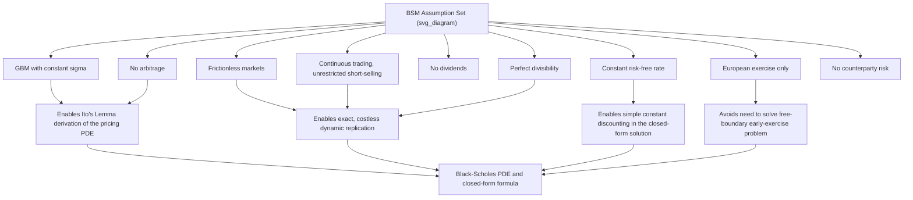

## Assumptions of the Black Scholes Merton Framework

### Definition and Core Concept

The Black-Scholes-Merton (BSM) framework rests on a specific set of idealized assumptions about the underlying asset's price behavior, the trading environment, and market structure. These assumptions are what allow the model to derive a closed-form pricing formula and a unique replicating hedge for European options; understanding them precisely is essential both for correctly applying the model and for understanding *why* real markets deviate from its predictions (giving rise to phenomena like the volatility smile). Each assumption below, when relaxed, corresponds to an entire branch of extended derivatives pricing models developed specifically to address that relaxation.

### The Complete List of Standard Assumptions

**1. The underlying asset follows geometric Brownian motion with constant volatility**

$$dS_t = \mu S_t\,dt + \sigma S_t\,dW_t$$

with $\sigma$ constant (not time- or state-dependent) and $\mu$ constant (though $\mu$ drops out of the final pricing formula under risk-neutral valuation). This implies log-returns are normally distributed with constant variance over any given horizon.

**2. No arbitrage opportunities exist in the market**

This is the foundational assumption underlying essentially all derivatives pricing theory (per the Fundamental Theorems of Asset Pricing), guaranteeing the existence of a consistent risk-neutral measure for valuation.

**3. Markets are frictionless: no transaction costs or taxes**

Trading the underlying and the risk-free asset incurs no bid-ask spread, no brokerage commission, and no differential tax treatment between instruments or trading strategies.

**4. The risk-free interest rate $r$ is constant and known**

The same constant rate applies for both borrowing and lending, over any horizon relevant to the option's life, with no term structure (no variation in rate by maturity).

**5. The underlying asset pays no dividends during the option's life**

(The original 1973 Black-Scholes paper assumes this; Merton's 1973 extension incorporates a continuous, known dividend yield $q$, and further extensions handle discrete dividends — but the "pure" BSM assumption set assumes no payouts.)

**6. Trading is continuous, and unlimited short-selling is permitted**

Market participants can trade continuously in time (no discrete trading intervals) and can short-sell the underlying asset without restriction or cost, receiving full use of the short-sale proceeds.

**7. Assets are perfectly divisible**

Any fractional quantity of the underlying or the risk-free asset can be bought or sold, permitting the exact replicating hedge ratios (typically non-integer share quantities) required by continuous delta hedging.

**8. The option is European-style**

Exercise can occur only at the single fixed maturity date $T$, not at any point prior to maturity — this assumption is essential because the original closed-form BSM derivation does not account for the early-exercise optionality present in American-style contracts.

**9. There is no counterparty/credit risk**

The option writer is assumed certain to fulfill the contract's obligations at maturity, with no probability of default.

### Diagram: Assumptions and Their Role in the Derivation

### Why Each Assumption Matters for the Derivation

**Key Points**

- **Constant volatility** is what allows the Black-Scholes PDE to have a single, well-defined coefficient $\tfrac{1}{2}\sigma^2 S^2$ throughout, making the PDE solvable in closed form via a change of variables to the heat equation. If $\sigma$ varied with $S$ or $t$, the PDE would generally require numerical solution (as in local or stochastic volatility models).
- **Frictionless markets, continuous trading, and unrestricted short-selling** together are exactly what make continuous dynamic replication (the delta-hedging argument) theoretically achievable at zero cost, which is the mechanism by which the replicating portfolio argument pins down a unique, preference-free option price.
- **No dividends** simplifies the risk-neutral drift to exactly $r$ (rather than $r-q$), and its relaxation (Merton's continuous-yield extension) is one of the most commonly used practical modifications to the base model, since most real-world equity and index options are written on dividend-paying underlyings.
- **European-style exercise** avoids the need to solve a free-boundary problem (determining the optimal early-exercise boundary), which is why the American option pricing problem generally lacks a simple closed-form solution and typically requires numerical methods (trees, finite differences) instead.

### Consequences of Relaxing Each Assumption

| Assumption Relaxed | Resulting Model/Extension | Key Consequence |
| --- | --- | --- |
| Constant volatility | Local volatility models (Dupire), stochastic volatility (Heston, SABR) | Captures volatility smile/skew; loses simple closed-form solution in general |
| No dividends | Merton's continuous dividend yield extension; discrete dividend tree adjustments | Adjusts drift to $r-q$; complicates tree recombination for discrete dividends |
| Constant interest rate | Stochastic short-rate models (Vasicek, CIR, Hull-White) | Requires forward-measure pricing techniques; adds a second source of randomness |
| European-only exercise | American option pricing via trees, finite differences, or Longstaff-Schwartz Monte Carlo | Introduces free-boundary problem; generally no closed-form solution |
| Frictionless markets | Transaction cost models (e.g., Leland's model) | Replication becomes imperfect or requires discrete rebalancing with cost trade-offs |
| Continuous trading | Discrete-time hedging analysis | Introduces hedging error (tracking error) relative to theoretical continuous hedge |
| No jumps in price | Jump-diffusion models (Merton jump-diffusion, Kou model) | Market becomes incomplete; jump risk generally cannot be fully hedged |

### The Volatility Smile as Evidence Against Constant Volatility

**Key Points**

- If the constant-volatility assumption held exactly, every option on the same underlying, regardless of strike or maturity, would imply the identical Black-Scholes volatility when market prices are inverted through the formula. Empirically, implied volatility instead varies systematically by strike (producing a "smile" or "skew" pattern) and by maturity (a term structure of implied volatility).
- This single, widely-documented empirical discrepancy is the most direct and commonly cited evidence that the constant-volatility assumption is violated in real markets, motivating the entire subsequent development of local volatility, stochastic volatility, and jump-diffusion extensions.
- [Inference: the specific shape and magnitude of the smile/skew vary by asset class, market regime, and time period, and are not fixed, universal quantities — practitioners typically calibrate whichever extended model they use to the currently observed market smile rather than relying on any single historical parameterization.]

### Practical Implications for Model Use

**Key Points**

- Despite its restrictive assumptions, the Black-Scholes formula remains extremely widely used in practice — not because its assumptions are believed to hold exactly, but because it serves as a common, standardized quoting convention: market participants often quote option prices directly in terms of "Black-Scholes implied volatility" even while using more sophisticated models internally for actual risk management and hedging.
- Practitioners typically address the framework's known limitations selectively, based on which assumption's violation matters most for the specific instrument being priced: dividend-yield adjustments for equity index options, stochastic-rate extensions for long-dated options or interest-rate derivatives, and stochastic/local volatility extensions for products sensitive to the volatility smile (e.g., barrier options, cliquets).
- Awareness of which specific assumptions are being relied upon (and which are known to be violated for a given product) is considered a core professional competency in derivatives pricing and risk management, since silently assuming the "textbook" BSM assumptions hold for a product where they clearly do not (e.g., pricing a long-dated American option on a dividend-paying stock with a naive European Black-Scholes formula) is a well-recognized source of material mispricing.

### Related Topics

- Black-Scholes-Merton Model Derivation via Measure Decomposition
- Dividend Adjustments in Tree Models
- Volatility Smile and Skew: Empirical Features and Causes
- Local Volatility Models (Dupire's Equation)
- Stochastic Volatility Models (Heston, SABR)
- Jump-Diffusion Models (Merton, Kou)
- American Option Early-Exercise Boundaries
- Transaction Cost Models in Option Replication (Leland's Model)