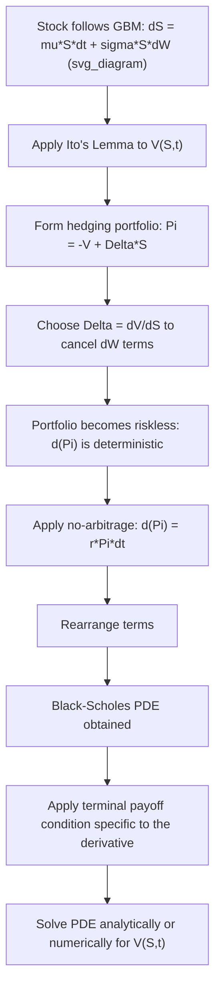

## Deriving the Black Scholes Partial Differential Equation

### Definition and Core Concept

The Black-Scholes partial differential equation (PDE) is the governing equation that any derivative's value $V(S,t)$, written on an underlying asset following geometric Brownian motion, must satisfy under the standard BSM assumptions. The derivation combines Itô's Lemma (to characterize how a smooth function of the stochastic underlying evolves) with a no-arbitrage replication/hedging argument (to eliminate the random term and produce a deterministic PDE). This derivation is one of the most important results in quantitative finance: it converts an asset-pricing problem involving randomness into a solvable deterministic PDE, and it is presented here via the classical hedging-portfolio approach (as opposed to the martingale/risk-neutral expectation approach covered under Feynman-Kac and change-of-numeraire topics).

The final PDE:

$$\frac{\partial V}{\partial t} + rS\frac{\partial V}{\partial S} + \frac{1}{2}\sigma^2 S^2\frac{\partial^2 V}{\partial S^2} - rV = 0$$

with a terminal (payoff) condition at $t=T$ specific to the derivative being priced (e.g., $V(S,T) = \max(S-K,0)$ for a European call).

### Step 1: Model the Underlying Asset

Assume the underlying stock price follows geometric Brownian motion under the real-world measure:

$$dS_t = \mu S_t\,dt + \sigma S_t\,dW_t$$

with $\mu$ the (real-world) expected return and $\sigma$ the (constant) volatility.

### Step 2: Apply Itô's Lemma to the Derivative's Value Function

Let $V(S,t)$ be the (as-yet-unknown) value of a derivative as a function of the current stock price and time. Applying Itô's Lemma:

$$dV = \left(\frac{\partial V}{\partial t} + \mu S\frac{\partial V}{\partial S} + \frac{1}{2}\sigma^2 S^2\frac{\partial^2 V}{\partial S^2}\right)dt + \sigma S\frac{\partial V}{\partial S}\,dW_t$$

This expresses how the derivative's value changes over an infinitesimal time step, decomposed into a drift term (deterministic) and a diffusion term (proportional to the same Brownian motion $dW_t$ driving the stock itself) — a crucial structural feature that is exploited in the next step.

### Step 3: Construct a Riskless Hedging Portfolio

Because both $dS_t$ and $dV$ are driven by the *same* source of randomness $dW_t$, it is possible to construct a portfolio combining the derivative and the underlying stock such that the random terms cancel exactly. Consider a portfolio $\Pi$ consisting of a short position in one derivative and a long position of $\Delta$ shares of stock:

$$\Pi = -V + \Delta S$$

The change in this portfolio's value over $dt$ is:

$$d\Pi = -dV + \Delta\,dS$$

Substituting the expressions for $dV$ and $dS$:

$$d\Pi = -\left(\frac{\partial V}{\partial t} + \mu S\frac{\partial V}{\partial S} + \frac{1}{2}\sigma^2 S^2\frac{\partial^2 V}{\partial S^2}\right)dt - \sigma S\frac{\partial V}{\partial S}\,dW_t + \Delta\left(\mu S\,dt + \sigma S\,dW_t\right)$$

### Step 4: Choose $\Delta$ to Eliminate Randomness (Delta Hedging)

Collecting the $dW_t$ terms:

$$\left(-\sigma S\frac{\partial V}{\partial S} + \Delta\sigma S\right)dW_t$$

Setting the coefficient of $dW_t$ to zero eliminates all randomness from the portfolio:

$$\Delta = \frac{\partial V}{\partial S}$$

This is precisely the option's **delta** — the hedge ratio that makes the combined portfolio instantaneously riskless. With this choice, the $\mu S \partial V/\partial S$ terms in the drift also cancel (they appear with opposite signs from the $-dV$ and $+\Delta\,dS$ contributions), leaving:

$$d\Pi = \left(-\frac{\partial V}{\partial t} - \frac{1}{2}\sigma^2 S^2\frac{\partial^2 V}{\partial S^2}\right)dt$$

**Key Points**

- The elimination of *both* the random $dW_t$ term and the real-world drift $\mu$ is the central mechanism of the entire derivation: because $\mu$ drops out entirely, the resulting PDE (and hence the option price) does not depend on the underlying's expected return — this is the classical, hedging-based route to the same preference-independence result that risk-neutral valuation delivers via the equivalent martingale measure.
- This is why Black-Scholes pricing does not require estimating $\mu$ (a notoriously difficult quantity to estimate accurately from historical data), while it does require $\sigma$ — a structurally important practical asymmetry that follows directly from this derivation step.

### Step 5: Apply the No-Arbitrage Condition

Because $d\Pi$ is now completely deterministic (riskless) over the infinitesimal interval $dt$, the no-arbitrage principle requires that the portfolio must earn exactly the risk-free rate — otherwise, an arbitrage would exist (borrow at $r$ to fund the portfolio if its return exceeds $r$, or short the portfolio and invest at $r$ if its return is below $r$):

$$d\Pi = r\Pi\,dt$$

Substituting $\Pi = -V + \Delta S = -V + S\frac{\partial V}{\partial S}$:

$$\left(-\frac{\partial V}{\partial t} - \frac{1}{2}\sigma^2 S^2\frac{\partial^2 V}{\partial S^2}\right)dt = r\left(-V + S\frac{\partial V}{\partial S}\right)dt$$

### Step 6: Rearrange to Obtain the Black-Scholes PDE

Dividing through by $dt$ and rearranging all terms to one side:

$$\frac{\partial V}{\partial t} + \frac{1}{2}\sigma^2 S^2\frac{\partial^2 V}{\partial S^2} + rS\frac{\partial V}{\partial S} - rV = 0$$

This is the **Black-Scholes partial differential equation**. It must be solved subject to a terminal condition (the payoff at maturity $T$) specific to the derivative contract being priced, and, for some products, boundary conditions at $S=0$ and $S \to \infty$.

### Derivation Flow Diagram

### Terminal and Boundary Conditions for Common Payoffs

| Derivative | Terminal Condition at $t=T$ | Notable Boundary Conditions |
| --- | --- | --- |
| European call | $V(S,T) = \max(S-K,0)$ | $V(0,t)=0$; $V(S,t) \to S - Ke^{-r(T-t)}$ as $S\to\infty$ |
| European put | $V(S,T) = \max(K-S,0)$ | $V(0,t) = Ke^{-r(T-t)}$; $V(S,t)\to 0$ as $S\to\infty$ |
| Digital (cash-or-nothing) call | $V(S,T) = \mathbb{1}_{\{S>K\}}$ | $V(0,t)=0$; $V(S,t)\to e^{-r(T-t)}$ as $S\to\infty$ |
| Forward contract | $V(S,T) = S - K$ | Linear in $S$; admits trivial closed-form solution |

### Worked Example: Verifying the Black-Scholes Call Formula Satisfies the PDE

**Setup:** Verify (by substitution, illustrating the derivation's consistency rather than deriving the formula itself here) that the Black-Scholes call price formula satisfies the PDE.

The Black-Scholes call formula is $C(S,t) = SN(d_1) - Ke^{-r(T-t)}N(d_2)$, with

$$d_1 = \frac{\ln(S/K) + (r+\tfrac{1}{2}\sigma^2)(T-t)}{\sigma\sqrt{T-t}}, \qquad d_2 = d_1 - \sigma\sqrt{T-t}$$

**Step 1 — Compute the required partial derivatives** (standard results from differentiating the formula, using $N'(d_1) = \frac{1}{\sqrt{2\pi}}e^{-d_1^2/2}$ and the identity $SN'(d_1) = Ke^{-r(T-t)}N'(d_2)$, which follows algebraically from the definitions of $d_1$ and $d_2$):

$$\frac{\partial C}{\partial S} = N(d_1), \qquad \frac{\partial^2 C}{\partial S^2} = \frac{N'(d_1)}{S\sigma\sqrt{T-t}}, \qquad \frac{\partial C}{\partial t} = -\frac{SN'(d_1)\sigma}{2\sqrt{T-t}} - rKe^{-r(T-t)}N(d_2)$$

**Step 2 — Substitute into the PDE** $\frac{\partial C}{\partial t} + \frac{1}{2}\sigma^2 S^2\frac{\partial^2 C}{\partial S^2} + rS\frac{\partial C}{\partial S} - rC = 0$:

$$\left[-\frac{SN'(d_1)\sigma}{2\sqrt{T-t}} - rKe^{-r(T-t)}N(d_2)\right] + \frac{1}{2}\sigma^2 S^2 \cdot \frac{N'(d_1)}{S\sigma\sqrt{T-t}} + rS \cdot N(d_1) - r\left[SN(d_1) - Ke^{-r(T-t)}N(d_2)\right]$$

**Step 3 — Simplify term by term.** The second term simplifies to $\frac{S\sigma N'(d_1)}{2\sqrt{T-t}}$, which exactly cancels the first term's $-\frac{SN'(d_1)\sigma}{2\sqrt{T-t}}$. The remaining terms are:

$$-rKe^{-r(T-t)}N(d_2) + rSN(d_1) - rSN(d_1) + rKe^{-r(T-t)}N(d_2) = 0$$

This confirms the Black-Scholes formula exactly satisfies the PDE derived above — the standard verification exercise showing the closed-form solution is consistent with the governing equation obtained from the hedging argument. [Inference: this step-by-step cancellation is the well-established standard verification found in most derivatives textbooks; the specific intermediate derivative expressions above are standard results, not independently re-derived from first principles in this summary.]

### Alternative Derivation Route: Risk-Neutral / Feynman-Kac Approach

**Key Points**

- The identical PDE can also be derived via the risk-neutral valuation approach: specify the stock's dynamics under the risk-neutral measure $\mathbb{Q}$ as $dS_t = rS_t\,dt + \sigma S_t\,dW_t^{\mathbb{Q}}$ (replacing $\mu$ with $r$), then apply the Feynman-Kac theorem, which directly states that $V(S,t) = e^{-r(T-t)}\mathbb{E}^{\mathbb{Q}}[\Phi(S_T)|S_t=S]$ solves exactly this PDE.
- The hedging-portfolio derivation shown here and the risk-neutral/Feynman-Kac derivation are two different routes to the *same* PDE — one grounded in a discrete, no-arbitrage replication argument, the other grounded in the abstract equivalent-martingale-measure machinery — and their agreement is not a coincidence but a direct manifestation of the Fundamental Theorems of Asset Pricing connecting replication and risk-neutral expectation.

### Practical Implementation Notes

- Numerical PDE solvers (finite-difference methods: explicit, implicit, Crank-Nicolson) solve this exact PDE directly for derivatives lacking closed-form solutions (e.g., American options, many exotics), using the terminal condition as the starting point for backward-in-time numerical integration — a direct computational descendant of the derivation shown here.
- The delta ($\partial V/\partial S$) derived as the key hedging parameter in Step 4 is not merely a derivation artifact — it is the actual, practically used Greek that trading desks compute and rebalance against continuously (in the idealized limit) or at discrete intervals (in practice) to hedge real option positions, directly connecting this theoretical derivation to day-to-day derivatives risk management.
- Extending this derivation to underlyings with dividends, stochastic interest rates, or stochastic volatility requires re-deriving the hedging-portfolio argument with additional traded instruments (e.g., a second option, to hedge a second source of randomness in stochastic volatility models) — the single-hedging-instrument argument shown here works specifically because the model has exactly one source of randomness matched to one traded risky asset (the complete-market condition discussed under Market Completeness and Replication).

### Related Topics

- Assumptions of the Black Scholes Merton Framework
- Itô's Lemma and Stochastic Calculus
- The Fundamental Theorems of Asset Pricing (Feynman-Kac connection)
- Market Completeness and Replication
- Finite-Difference Methods for Solving the Black-Scholes PDE
- The Greeks: Delta, Gamma, Theta, Vega, Rho
- American Option Early-Exercise Boundaries and Free-Boundary Problems