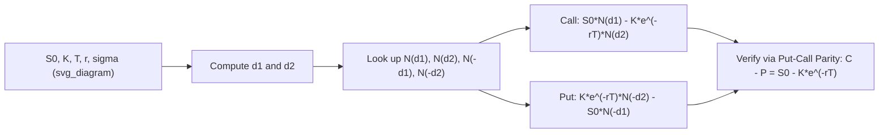

## The Black Scholes Formula for Calls and Puts

### Definition and Core Concept

The Black-Scholes formula provides closed-form pricing expressions for European call and put options on a non-dividend-paying underlying asset, obtained by solving the Black-Scholes PDE subject to the appropriate terminal payoff condition. These formulas remain the single most widely referenced starting point in derivatives pricing, both as a direct pricing tool for simple vanilla options and as the standard quoting convention (via implied volatility) across virtually all options markets.

### The Formulas

**European Call Option:**

$$C(S_0, K, T, r, \sigma) = S_0 N(d_1) - Ke^{-rT}N(d_2)$$

**European Put Option:**

$$P(S_0, K, T, r, \sigma) = Ke^{-rT}N(-d_2) - S_0 N(-d_1)$$

where:

$$d_1 = \frac{\ln(S_0/K) + \left(r + \tfrac{1}{2}\sigma^2\right)T}{\sigma\sqrt{T}}, \qquad d_2 = d_1 - \sigma\sqrt{T}$$

and $N(\cdot)$ denotes the standard normal cumulative distribution function.

### Variable Definitions

| Symbol | Meaning |
| --- | --- |
| $S_0$ | Current price of the underlying asset |
| $K$ | Strike price |
| $T$ | Time to maturity (in years) |
| $r$ | Continuously compounded risk-free rate |
| $\sigma$ | Volatility (annualized standard deviation of log-returns) |
| $N(x)$ | Standard normal CDF: probability that a standard normal random variable is less than $x$ |
| $d_1, d_2$ | Standardized moneyness terms incorporating drift and volatility over the option's life |

### Interpreting $d_1$ and $d_2$: Probabilistic Meaning

**Key Points**

- $N(d_2)$ is the risk-neutral probability that the option finishes in-the-money (i.e., $\mathbb{Q}(S_T > K)$), so the term $Ke^{-rT}N(d_2)$ represents the present value of paying the strike price, weighted by the probability that payment is actually required.
- $N(d_1)$ has a related but distinct interpretation: it equals $\mathbb{Q}^S(S_T > K)$, the probability of finishing in-the-money computed under the *share measure* (using the stock itself as numeraire, per the change-of-numeraire framework), and $S_0 N(d_1)$ represents the present value of receiving the stock conditional on exercise. This distinction — that the two $N(\cdot)$ terms are probabilities under two genuinely different measures — is often glossed over in introductory treatments but becomes essential once change-of-numeraire techniques are properly applied.
- $N(d_1)$ also equals the option's **delta** ($\partial C/\partial S_0$) for a European call — a convenient and widely used coincidence connecting the closed-form probability interpretation to a directly hedgeable Greek.

### Put-Call Parity: Consistency Check

Put-call parity provides a model-independent no-arbitrage relationship between European call and put prices on the same underlying, strike, and maturity:

$$C - P = S_0 - Ke^{-rT}$$

**Verification using the Black-Scholes formulas:**

$$C - P = \left[S_0N(d_1) - Ke^{-rT}N(d_2)\right] - \left[Ke^{-rT}N(-d_2) - S_0N(-d_1)\right]$$

$$= S_0\left[N(d_1)+N(-d_1)\right] - Ke^{-rT}\left[N(d_2)+N(-d_2)\right]$$

Since $N(x) + N(-x) = 1$ for any $x$ (a direct property of a symmetric probability distribution):

$$C - P = S_0(1) - Ke^{-rT}(1) = S_0 - Ke^{-rT}$$

This confirms the Black-Scholes call and put formulas are mutually consistent with the model-independent put-call parity relationship — a standard and important internal consistency check.

### Worked Example: Pricing a European Call and Put

**Parameters:** $S_0 = 100$, $K = 105$, $T = 0.5$ years, $r = 0.04$, $\sigma = 0.25$.

**Step 1 — Compute $d_1$:**

$$d_1 = \frac{\ln(100/105) + (0.04 + \tfrac{1}{2}(0.25)^2)(0.5)}{0.25\sqrt{0.5}}$$

$$\ln(100/105) = \ln(0.9524) \approx -0.04879$$

$$(0.04 + 0.03125)(0.5) = (0.07125)(0.5) = 0.035625$$

$$d_1 = \frac{-0.04879 + 0.035625}{0.25 \times 0.7071} = \frac{-0.013165}{0.17678} \approx -0.0745$$

**Step 2 — Compute $d_2$:**

$$d_2 = d_1 - \sigma\sqrt{T} = -0.0745 - 0.17678 \approx -0.2513$$

**Step 3 — Look up (or compute) the normal CDF values:**

$$N(d_1) = N(-0.0745) \approx 0.4703, \qquad N(d_2) = N(-0.2513) \approx 0.4008$$

**Step 4 — Compute the call price:**

$$C = 100 \times 0.4703 - 105 \times e^{-0.04 \times 0.5} \times 0.4008$$

$$e^{-0.02} \approx 0.9802$$

$$C = 47.03 - 105 \times 0.9802 \times 0.4008 = 47.03 - 41.26 \approx 5.77$$

**Step 5 — Compute the put price using $N(-d_1)$ and $N(-d_2)$:**

$$N(-d_1) = 1 - 0.4703 = 0.5297, \qquad N(-d_2) = 1 - 0.4008 = 0.5992$$

$$P = 105 \times 0.9802 \times 0.5992 - 100 \times 0.5297 = 61.71 - 52.97 \approx 8.74$$

**Step 6 — Verify put-call parity:**

$$C - P = 5.77 - 8.74 = -2.97$$

$$S_0 - Ke^{-rT} = 100 - 105 \times 0.9802 = 100 - 102.92 = -2.92$$

The two values agree closely (small residual attributable to rounding in the intermediate normal CDF lookups), confirming internal consistency between the two independently computed formula values. [Inference: production pricing systems compute $N(\cdot)$ to full floating-point precision using a rational or numerical approximation algorithm rather than the rounded table-lookup-style values used here for pedagogical clarity, so a precise implementation would show exact agreement rather than a small rounding residual.]

### Pricing Diagram: Inputs to Output

### Extension: Continuous Dividend Yield (Merton's Adjustment)

For an underlying paying a continuous dividend yield $q$, the formulas adjust to:

$$C = S_0 e^{-qT}N(d_1) - Ke^{-rT}N(d_2), \qquad P = Ke^{-rT}N(-d_2) - S_0e^{-qT}N(-d_1)$$

with

$$d_1 = \frac{\ln(S_0/K) + (r-q+\tfrac{1}{2}\sigma^2)T}{\sigma\sqrt{T}}, \qquad d_2 = d_1 - \sigma\sqrt{T}$$

The dividend yield enters in two places: discounting the spot price by $e^{-qT}$ (reflecting that the holder of the option does not receive dividends the stockholder would), and adjusting the drift inside $d_1$ from $r$ to $r-q$.

### Sensitivity of the Formula to Each Input (Qualitative Overview)

| Input Increases | Call Price | Put Price | Intuition |
| --- | --- | --- | --- |
| $S_0$ | Increases | Decreases | Higher spot increases call's intrinsic value potential, decreases put's |
| $K$ | Decreases | Increases | Higher strike is worse for a call holder, better for a put holder |
| $T$ | Generally increases (both) | Generally increases (both), with possible exceptions for deep ITM puts | More time increases optionality value in most cases |
| $r$ | Increases | Decreases | Higher discounting benefit for deferred strike payment favors calls, hurts the discounted value of a put's payoff |
| $\sigma$ | Increases | Increases | Higher volatility increases the value of optionality (asymmetric payoff) for both call and put |
| $q$ (dividend yield) | Decreases | Increases | Dividends reduce the forward price of the stock, hurting calls and helping puts |

This table is qualitative; the full quantitative sensitivities are formalized as the option Greeks (Delta, Vega, Theta, Rho), each derived as the corresponding partial derivative of these formulas.

### Common Pitfalls in Applying the Formula

- **Using annualized inputs inconsistently**: $\sigma$, $r$, and $T$ must all be expressed on a consistent time basis (typically annualized $\sigma$ and $r$ with $T$ in years); mixing conventions (e.g., a daily volatility with an annualized rate) is a common source of gross pricing errors.
- **Forgetting the dividend adjustment**: Applying the plain (no-dividend) formula to a dividend-paying stock systematically overprices calls and underprices puts, since it ignores the expected price drop on ex-dividend dates.
- **Applying the European formula to American options**: The Black-Scholes call/put formulas price European-style exercise only; applying them directly to American options (particularly puts, or dividend-paying calls) ignores the early-exercise premium and can materially misprice the contract, especially for deep in-the-money American puts.
- **Confusing historical and implied volatility**: The formula requires $\sigma$ as a forward-looking input; using a purely historical (backward-looking) volatility estimate without considering current market-implied volatility can produce prices inconsistent with where the option actually trades. [Unverified: the specific magnitude of pricing discrepancy from using historical versus implied volatility varies substantially by market conditions and asset class, and is not a fixed, generalizable quantity.]

### Related Topics

- Deriving the Black Scholes Partial Differential Equation
- Assumptions of the Black Scholes Merton Framework
- Put-Call Parity and Static Replication
- The Greeks: Delta, Gamma, Theta, Vega, Rho
- Implied Volatility and the Volatility Surface
- Dividend Adjustments in Tree Models
- American Option Early-Exercise Boundaries