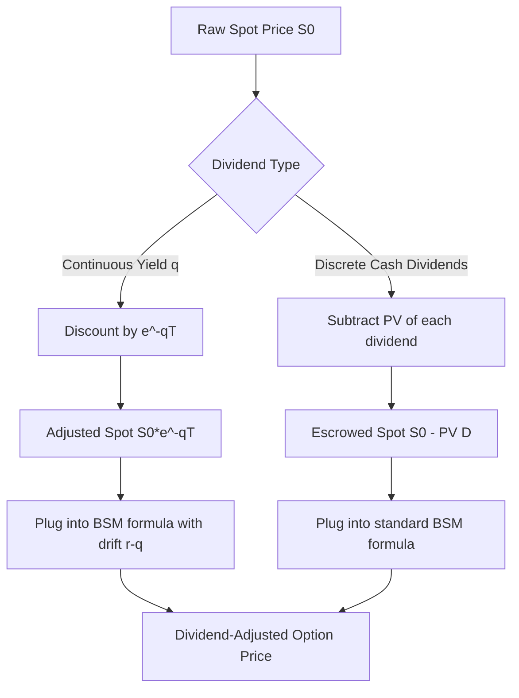

## Dividend Adjusted Black Scholes Pricing

### Overview

The standard Black-Scholes-Merton (BSM) model assumes the underlying asset pays no dividends during the option's life. When the underlying pays dividends, the option holder does not receive them, which reduces the expected forward value of the asset and therefore affects option pricing. Two principal adjustment methods exist: the **continuous dividend yield model** (Merton's extension) and the **discrete/escrowed dividend model**, used depending on the dividend structure of the underlying.

### Why Dividends Matter for Option Pricing

**Key Points**

- A dividend payment causes a predictable drop in the stock price on the ex-dividend date (approximately equal to the dividend amount, ignoring tax effects)
- Call options become less valuable as dividends increase (holder misses the dividend and the stock price is expected to fall)
- Put options become more valuable as dividends increase
- Ignoring dividends when they exist causes systematic overpricing of calls and underpricing of puts
- The dividend adjustment effectively lowers the cost-of-carry of holding the underlying asset

### Method 1: Continuous Dividend Yield (Merton Model)

Used when the underlying pays dividends continuously at a constant proportional rate $q$ (common approximation for indices, ETFs, or baskets of dividend-paying stocks).

#### Adjusted Formulas

$$C = S_0 e^{-qT} N(d_1) - K e^{-rT} N(d_2)$$

$$P = K e^{-rT} N(-d_2) - S_0 e^{-qT} N(-d_1)$$

where:

$$d_1 = \frac{\ln(S_0/K) + (r - q + \sigma^2/2)T}{\sigma\sqrt{T}}$$

$$d_2 = d_1 - \sigma\sqrt{T}$$

**Variable Definitions**

- $S_0$ — current spot price of underlying
- $K$ — strike price
- $r$ — risk-free interest rate (continuously compounded)
- $q$ — continuous dividend yield (annualized)
- $\sigma$ — volatility of the underlying's returns
- $T$ — time to expiration (in years)
- $N(\cdot)$ — standard normal cumulative distribution function

#### Intuition Behind the Adjustment

The term $S_0 e^{-qT}$ replaces $S_0$ everywhere in the original BSM formula. This represents the stock price discounted for the dividends the holder forgoes — effectively, the "growth" of the stock is reduced from $r$ to $r - q$ under the risk-neutral measure. This is mathematically equivalent to treating the dividend-paying stock like a currency (see Garman-Kohlhagen model) or a commodity with a convenience yield, where $q$ plays the role of the foreign interest rate or storage cost analog.

#### Greeks Under the Dividend-Adjusted Model

$$\Delta_{call} = e^{-qT} N(d_1)$$

$$\Delta_{put} = -e^{-qT} N(-d_1)$$

$$\Gamma = \frac{e^{-qT} N'(d_1)}{S_0 \sigma \sqrt{T}}$$

$$\text{Vega} = S_0 e^{-qT} N'(d_1) \sqrt{T}$$

$$\Theta_{call} = -\frac{S_0 N'(d_1) \sigma e^{-qT}}{2\sqrt{T}} + q S_0 N(d_1) e^{-qT} - rKe^{-rT}N(d_2)$$

All Greeks acquire an additional $e^{-qT}$ discount factor relative to the non-dividend BSM Greeks, and Delta and Theta include additional terms reflecting the yield drag.

### Method 2: Discrete (Escrowed) Dividend Model

Used for individual equities that pay known, discrete cash dividends at specific dates during the option's life (most common in practice for single-stock options).

#### The Escrowed Dividend Approach

The present value of all dividends expected to be paid before expiration is subtracted from the spot price, and the resulting "dividend-adjusted" spot price is used in place of $S_0$ in the standard (non-dividend) BSM formula.

$$S_0^{adj} = S_0 - \sum_{i=1}^{n} D_i e^{-r t_i}$$

where:

- $D_i$ — the $i$-th discrete dividend payment
- $t_i$ — time (in years) until the $i$-th ex-dividend date
- $n$ — number of dividends paid before expiration $T$

The standard BSM formula is then applied using $S_0^{adj}$ in place of $S_0$:

$$C = S_0^{adj} N(d_1) - K e^{-rT} N(d_2)$$

$$d_1 = \frac{\ln(S_0^{adj}/K) + (r + \sigma^2/2)T}{\sigma\sqrt{T}}$$

**Key Points**

- This method assumes dividend amounts and dates are known with certainty, which is a reasonable approximation for short-dated options on stable dividend payers
- The volatility $\sigma$ used should ideally be estimated on the dividend-adjusted (escrowed) price process, not on the raw stock price, since removing the dividend PV changes the return series slightly — in practice this distinction is often ignored for small dividend yields **[Inference]**
- This model can produce biased results for large dividends or long-dated options, since it treats the stock price process as if dividends were removed at time zero rather than at the actual ex-dividend dates

#### Comparison: Continuous vs. Discrete Adjustment

| Aspect | Continuous Yield Model | Escrowed Dividend Model |
| --- | --- | --- |
| Best suited for | Indices, ETFs, FX, commodities | Single-name equities |
| Dividend assumption | Constant proportional rate | Known discrete cash amounts |
| Adjustment applied to | Drift term ($r-q$) | Spot price directly |
| Volatility smile impact | Minimal distortion | Can distort skew near ex-div dates |
| Accuracy for large dividends | Lower (smooths out jumps) | Higher (captures discrete drop) |

### Worked Example: Continuous Yield Method

**Example**

Price a European call option with:

- $S_0 = \$100$
- $K = \$105$
- $r = 5\%$
- $q = 3\%$ (continuous dividend yield)
- $\sigma = 25\%$
- $T = 1$ year

Step 1 — Compute $d_1$:

$$d_1 = \frac{\ln(100/105) + (0.05 - 0.03 + 0.25^2/2)(1)}{0.25\sqrt{1}} = \frac{-0.04879 + 0.05125}{0.25} \approx 0.00984$$

Step 2 — Compute $d_2$:

$$d_2 = 0.00984 - 0.25 = -0.24016$$

Step 3 — Look up normal CDF values:

$N(d_1) \approx 0.5039$, $N(d_2) \approx 0.4051$

Step 4 — Compute call price:

$$C = 100 e^{-0.03}(0.5039) - 105 e^{-0.05}(0.4051)$$

$$C = 100(0.9704)(0.5039) - 105(0.9512)(0.4051)$$

$$C \approx 48.90 - 40.47 \approx \$8.43$$

**Output**

The dividend-adjusted call price is approximately **$8.43**, compared to roughly $9.20 if dividends were ignored (using $q=0$) — the dividend yield lowers the call value as expected.

### Worked Example: Discrete Dividend Method

**Example**

A stock trades at $S_0 = \$50$ and will pay two dividends before a 6-month option expires: $0.50 in 2 months and $0.50 in 5 months. $r = 4\%$.

$$S_0^{adj} = 50 - 0.50e^{-0.04(2/12)} - 0.50e^{-0.04(5/12)}$$

$$S_0^{adj} = 50 - 0.4967 - 0.4917 \approx \$49.01$$

This adjusted price of **$49.01** is then substituted for $S_0$ in the standard BSM formula to price the option.

### Put-Call Parity With Dividends

Put-call parity must also be adjusted to remain arbitrage-free:

**Continuous yield version:**

$$C - P = S_0 e^{-qT} - K e^{-rT}$$

**Discrete dividend version:**

$$C - P = S_0^{adj} - K e^{-rT} = S_0 - PV(D) - Ke^{-rT}$$

Violations of these relationships in observed market prices signal potential arbitrage opportunities or indicate that the market is pricing in dividend uncertainty not captured by the model.

### Practical Considerations and Limitations

**Key Points**

- Dividend yield $q$ is often estimated from trailing twelve-month dividends divided by spot price, but this is a backward-looking proxy and may not reflect forward expectations **[Inference]**
- Special/one-time dividends are typically handled with the escrowed method even for index components, since they violate the constant-yield assumption
- American-style options complicate dividend adjustment further: early exercise of calls may become optimal shortly before a large ex-dividend date, which neither adjustment method captures directly — this requires binomial/trinomial trees or other numerical methods that model the discrete price drop at each node
- Real-world dividend adjustment behavior can vary by broker/exchange conventions, dividend forecast sources, and whether special dividends are announced after model calibration

### Visualizing the Adjustment Mechanism

### American Options and the Dividend Adjustment Problem (svg_diagram)

<svg xmlns="http://www.w3.org/2000/svg" viewBox="0 0 700 260">
\<style\>
.lbl { font-family: sans-serif; font-size: 13px; fill: #1a1a1a; }
.small { font-family: sans-serif; font-size: 11px; fill: #444; }
.line { stroke: #1a1a1a; stroke-width: 2; fill: none; }
.divdrop { stroke: #c0392b; stroke-width: 2; stroke-dasharray: 4,3; }
\</style\>
<text x="230" y="20" class="lbl" font-weight="bold">Stock Price Path With Ex-Dividend Drop (svg_diagram)</text>
<line x1="50" y1="220" x2="650" y2="220" stroke="#888" stroke-width="1" />
<line x1="50" y1="220" x2="50" y2="40" stroke="#888" stroke-width="1" />
<text x="10" y="130" class="small">Price</text>
<text x="330" y="245" class="small">Time</text>
<path class="line" d="M50,120 C150,90 250,70 330,70" />
<line x1="330" y1="70" x2="330" y2="110" class="divdrop" />
<path class="line" d="M330,110 C420,95 500,80 580,60" />
<text x="335" y="130" class="small" fill="#c0392b">Ex-dividend drop ≈ D</text>
<circle cx="330" cy="70" r="3" fill="#c0392b" />
<circle cx="330" cy="110" r="3" fill="#c0392b" />
<text x="400" y="200" class="small">Early exercise of American calls may be optimal just before this drop</text>
<line x1="330" y1="180" x2="330" y2="115" stroke="#c0392b" stroke-width="1" marker-end="url(#arrow)" />
</svg>

### Numerical Methods for Discrete Dividends (Binomial Tree Adjustment)

For American options or when precision near ex-dividend dates matters, a binomial tree with discrete dividend jumps is preferred over closed-form adjustments:

$$S_{node} = S_{node,prior} - D_i \quad \text{at the tree step corresponding to } t_i$$

This directly models the price drop at the correct node rather than smoothing it across the whole tree lifetime, and it naturally supports early-exercise checks at each node — something neither closed-form method above can do.

**Conclusion**

Dividend adjustment is essential for accurate option pricing whenever the underlying pays dividends before expiration. The continuous yield model is appropriate for broad, diversified underlyings with stable payout ratios (indices, ETFs), while the escrowed/discrete model is more accurate for single-name equities with known dividend schedules. For American-style options, neither closed-form method fully captures early-exercise dynamics near ex-dividend dates, and numerical methods (binomial/trinomial trees with discrete dividend jumps) are the more robust choice.

**Related Topics**

- American Option Early Exercise Boundary Conditions
- Binomial and Trinomial Tree Models with Discrete Dividends
- Garman-Kohlhagen Model for FX Options (structural analog to continuous yield adjustment)
- Volatility Surface Construction Around Ex-Dividend Dates
- Dividend Risk in Equity Derivatives Trading Desks
- Put-Call Parity Arbitrage Detection
- Forward Pricing With Known Dividends (Cost-of-Carry Model)
- Merton's Jump-Diffusion Model (for modeling discrete price jumps more generally)