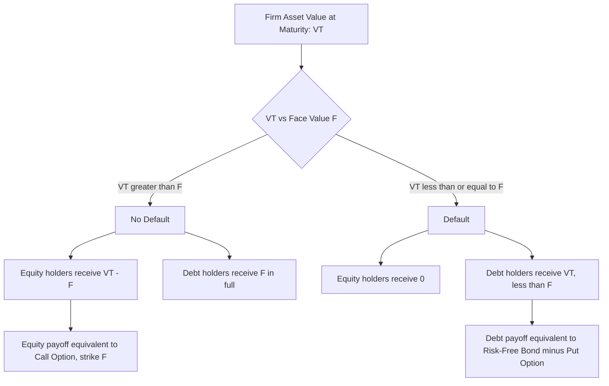

## The Merton Model and Structural Credit Risk

### Overview

The Merton Model (1974) is the foundational **structural model** of credit risk. It treats a firm's equity as a call option on the firm's assets, with the strike price equal to the face value of the firm's debt. This framework connects option pricing theory (Black-Scholes-Merton) directly to corporate default probability, credit spreads, and the valuation of risky debt, making it a bridge between derivatives pricing and credit risk modeling.

### Conceptual Foundation

**Key Points**

- A levered firm's asset value $V_t$ evolves stochastically over time, similar to a stock price in the BSM framework
- At debt maturity $T$, if $V_T > F$ (face value of debt), equity holders pay off debt and keep the residual value
- If $V_T \leq F$, the firm defaults; debt holders receive the firm's assets ($V_T$), and equity holders receive nothing
- This payoff structure is mathematically identical to a **European call option** on the firm's assets with strike price $F$
- Conversely, risky debt can be viewed as risk-free debt minus a put option on the firm's assets (the shareholders' limited-liability "put" against creditors)

### The Structural Setup

The firm's asset value is assumed to follow geometric Brownian motion:

$$dV_t = \mu V_t \, dt + \sigma_V V_t \, dW_t$$

where:

- $V_t$ — market value of firm assets at time $t$
- $\mu$ — expected return on firm assets
- $\sigma_V$ — asset volatility
- $W_t$ — standard Brownian motion

The firm has a simple capital structure: equity $E$ and a single zero-coupon debt tranche with face value $F$ maturing at time $T$.

**Balance sheet identity at maturity:**

$$V_T = E_T + D_T$$

$$E_T = \max(V_T - F, 0)$$

$$D_T = \min(V_T, F) = F - \max(F - V_T, 0)$$

### Equity as a Call Option

Applying the Black-Scholes-Merton formula directly, with $V_0$ (current asset value) playing the role of the stock price and $F$ playing the role of the strike:

$$E_0 = V_0 N(d_1) - F e^{-rT} N(d_2)$$

$$d_1 = \frac{\ln(V_0/F) + (r + \sigma_V^2/2)T}{\sigma_V \sqrt{T}}$$

$$d_2 = d_1 - \sigma_V \sqrt{T}$$

**Variable Definitions**

- $E_0$ — current market value of equity
- $V_0$ — current market value of firm assets
- $F$ — face value of debt (default threshold)
- $r$ — risk-free rate
- $\sigma_V$ — volatility of firm asset value
- $T$ — debt maturity (time horizon)

### Risky Debt as Risk-Free Debt Minus a Put

The value of risky debt today is:

$$D_0 = F e^{-rT} - P_0$$

where $P_0$ is the value of a put option on the firm's assets with strike $F$:

$$P_0 = F e^{-rT} N(-d_2) - V_0 N(-d_1)$$

This reflects that bondholders effectively hold risk-free debt but have implicitly sold shareholders a put option — shareholders can "put" the firm to creditors (default and walk away) if assets fall below the debt's face value, due to limited liability.

### Probability of Default

Under the risk-neutral measure, the probability that the firm defaults (i.e., $V_T < F$) is:

$$PD = N(-d_2)$$

This is the risk-neutral default probability, not the real-world (physical) default probability. To obtain the real-world probability, $\mu$ (the actual expected asset return) must replace $r$ in the $d_2$ calculation:

$$d_2^{physical} = \frac{\ln(V_0/F) + (\mu - \sigma_V^2/2)T}{\sigma_V\sqrt{T}}$$

$$PD_{physical} = N(-d_2^{physical})$$

**Key Points**

- Risk-neutral default probabilities embed a risk premium and are generally higher than real-world default probabilities, since they price in the market's risk aversion toward default losses **[Inference]**
- The distance between $V_0$ and $F$, scaled by asset volatility, is the core risk driver — this scaled distance is formalized as the **Distance to Default (DD)**

### Distance to Default (DD)

$$DD = \frac{\ln(V_0/F) + (\mu - \sigma_V^2/2)T}{\sigma_V \sqrt{T}} = d_2^{physical}$$

DD measures how many standard deviations the firm's asset value is away from the default threshold. It is widely used in practitioner models (e.g., Moody's KMV) as a credit risk metric, often converted to an **Expected Default Frequency (EDF)** via an empirically calibrated mapping rather than the theoretical normal CDF, since actual default rates diverge from the lognormal-diffusion assumption at the tails **[Unverified — empirical calibration specifics are proprietary to vendor implementations]**.

### Credit Spread Implied by the Model

The yield on the risky debt is:

$$y = -\frac{1}{T}\ln\left(\frac{D_0}{F}\right)$$

The credit spread over the risk-free rate is:

$$s = y - r = -\frac{1}{T}\ln\left(\frac{D_0}{Fe^{-rT}}\right) = -\frac{1}{T}\ln\left(N(d_2) + \frac{V_0}{Fe^{-rT}}N(-d_1)\right)$$

**Key Points**

- Credit spreads generated by the basic Merton model are typically much lower than observed market spreads for short-maturity investment-grade debt — this is a well-documented empirical shortfall known as the **credit spread puzzle**
- The model implies spreads should approach zero as $T \to 0$ for solvent firms (since diffusion processes need time to move asset value across the default threshold), but real markets show non-trivial short-term spreads due to jump risk, liquidity premia, and tax effects not captured by the model **[Inference]**

### Worked Example

**Example**

A firm has:

- $V_0 = \$100$ million (current asset value)
- $F = \$80$ million (face value of debt, due in 1 year)
- $\sigma_V = 30\%$
- $r = 4\%$
- $T = 1$ year

Step 1 — Compute $d_1$ and $d_2$:

$$d_1 = \frac{\ln(100/80) + (0.04 + 0.09/2)(1)}{0.30} = \frac{0.2231 + 0.085}{0.30} \approx 1.0271$$

$$d_2 = 1.0271 - 0.30 = 0.7271$$

Step 2 — Equity value:

$N(d_1) \approx 0.8478$, $N(d_2) \approx 0.7664$

$$E_0 = 100(0.8478) - 80e^{-0.04}(0.7664) \approx 84.78 - 58.85 \approx \$25.93 \text{ million}$$

Step 3 — Debt value:

$$D_0 = V_0 - E_0 = 100 - 25.93 = \$74.07 \text{ million}$$

Step 4 — Risk-neutral default probability:

$$PD = N(-d_2) = N(-0.7271) \approx 0.2336$$

**Output**

The firm's equity is valued at **$25.93 million**, risky debt at **$74.07 million**, and the risk-neutral probability of default over the 1-year horizon is approximately **23.4%**. The implied credit spread can then be computed from the yield on the $74.07M market value of debt versus the $80M face value discounted at the risk-free rate.

### Comparative Statics (Sensitivities)

| Input Increases | Equity Value | Debt Value | Default Probability | Credit Spread |
| --- | --- | --- | --- | --- |
| Asset value $V_0$ | ↑ | ↑ | ↓ | ↓ |
| Debt face value $F$ | ↓ | ↑ (up to a point) | ↑ | ↑ |
| Asset volatility $\sigma_V$ | ↑ | ↓ | ↑ | ↑ |
| Time to maturity $T$ | ↑ (usually) | Ambiguous | Ambiguous | Ambiguous |
| Risk-free rate $r$ | ↑ | ↓ | ↓ | Ambiguous |

**Key Points**

- Rising asset volatility increases equity value (option-like upside) while simultaneously increasing default risk and lowering debt value — this captures the classic **shareholder-bondholder conflict**: equity holders benefit from asset risk-shifting (e.g., undertaking riskier projects) at the expense of debt holders, since equity is a convex claim while debt is concave (short a put)

### Structural Model Family: Extensions Beyond Merton (1974)

**Key Points**

- **Black-Cox (1976)**: introduces a continuous default barrier, allowing default to occur *before* maturity if asset value breaches a threshold at any time (first-passage-time model), rather than only being assessed at maturity
- **Longstaff-Schwartz (1995)**: adds stochastic interest rates and allows for deviation from absolute priority in bankruptcy
- **Leland (1994) / Leland-Toft (1996)**: endogenizes the default barrier by having shareholders optimally choose when to default, and incorporates tax benefits of debt and bankruptcy costs to solve for optimal capital structure
- **CreditGrades / KMV**: industry implementations that extend Merton-style structural models with empirical calibration to bridge the gap between theoretical and observed default rates and spreads

### Key Limitations of the Basic Merton Model

**Key Points**

- Assumes a single, simple zero-coupon debt structure — real firms have complex, layered capital structures with multiple maturities and seniorities
- Assumes default can only occur at debt maturity $T$, ignoring the possibility of early default (addressed by Black-Cox and first-passage models)
- Assumes constant asset volatility, while actual firm asset volatility can shift, particularly as leverage or business risk changes
- Firm asset value $V_t$ is not directly observable in the market (unlike stock prices) — it must be inferred, typically by solving a system of two equations (the equity pricing equation and the equity volatility relationship) simultaneously for $V_0$ and $\sigma_V$
- Underestimates short-term credit spreads because continuous diffusion processes assign near-zero probability to sudden, large moves; incorporating jump-diffusion processes into the asset value dynamics is one common remedy **[Inference]**

### Inferring Unobservable Asset Value and Volatility

Since $V_0$ and $\sigma_V$ are not directly observable, they are typically backed out from observable equity data using two simultaneous equations:

$$E_0 = V_0 N(d_1) - Fe^{-rT}N(d_2) \quad \text{(equity pricing equation)}$$

$$\sigma_E E_0 = N(d_1)\sigma_V V_0 \quad \text{(Itô's lemma relationship between equity and asset volatility)}$$

where $\sigma_E$ is the observable equity volatility (from historical returns or implied volatility). These two equations are solved iteratively (or via numerical root-finding) for the two unknowns $V_0$ and $\sigma_V$.

### Visualizing the Structural Model Payoff Logic

### Equity as a Call Option on Firm Assets (svg_diagram)

<svg xmlns="http://www.w3.org/2000/svg" viewBox="0 0 700 300">
\<style\>
.lbl { font-family: sans-serif; font-size: 13px; fill: #1a1a1a; }
.small { font-family: sans-serif; font-size: 11px; fill: #444; }
.axis { stroke: #888; stroke-width: 1; }
.payoff { stroke: #2471a3; stroke-width: 2.5; fill: none; }
.debtpayoff { stroke: #c0392b; stroke-width: 2.5; fill: none; }
\</style\>
<text x="180" y="20" class="lbl" font-weight="bold">Equity and Debt Payoffs at Maturity (svg_diagram)</text>
<line x1="60" y1="250" x2="650" y2="250" class="axis" />
<line x1="60" y1="250" x2="60" y2="40" class="axis" />
<text x="340" y="275" class="small">Firm Asset Value V(T)</text>
<text x="15" y="145" class="small">Payoff</text>
<line x1="300" y1="250" x2="300" y2="240" stroke="#1a1a1a" />
<text x="280" y="268" class="small">F</text>
<path class="payoff" d="M60,250 L300,250 L650,60" />
<text x="500" y="90" class="small" fill="#2471a3">Equity payoff = max(V-F, 0)</text>
<path class="debtpayoff" d="M60,120 L300,120 L650,250" />
<text x="420" y="140" class="small" fill="#c0392b">Debt payoff = min(V, F)</text>
</svg>

**Conclusion**

The Merton Model reframes corporate default as an option-pricing problem: equity is a call option on firm assets, and risky debt is risk-free debt minus a put option granted to shareholders via limited liability. This structural insight underlies distance-to-default metrics, credit spread modeling, and much of modern structural credit risk practice, despite well-known empirical shortcomings (notably underestimating short-maturity spreads) that motivated first-passage, jump-diffusion, and endogenous-default extensions.

**Related Topics**

- Black-Cox First-Passage Time Model
- KMV Distance-to-Default and Expected Default Frequency Methodology
- Credit Default Swap Pricing and CDS-Bond Basis
- Reduced-Form (Intensity-Based) Credit Risk Models
- Leland-Toft Optimal Capital Structure Model
- The Credit Spread Puzzle and Jump-Diffusion Extensions
- Asset Volatility Estimation via Itô's Lemma (Equity-to-Asset Volatility Mapping)
- Basel Credit Risk Frameworks and Structural Model Applications