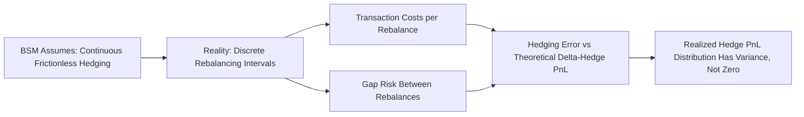

## Limitations of the Black Scholes Model

### Overview

The Black-Scholes-Merton (BSM) model provides an elegant closed-form solution for European option pricing, but it rests on a set of restrictive assumptions that frequently diverge from real market behavior. Understanding these limitations is essential for practitioners, since they directly explain observed phenomena like the volatility smile/skew, model risk in exotic pricing, and the need for more sophisticated frameworks (stochastic volatility, jump-diffusion, local volatility).

### The Core Assumptions and Their Breakdown

**Key Points**

- BSM makes seven core assumptions; nearly all are violated to some degree in real markets
- The severity of each violation depends on the asset class, market regime, and option type being priced
- Understanding *which* assumption is broken helps identify *which* extended model is appropriate as a remedy

### 1. Constant Volatility Assumption

The model assumes $\sigma$ is constant over the option's life and across all strikes. In reality, implied volatility varies systematically by strike and maturity.

**Key Points**

- The resulting **volatility smile/skew** — where out-of-the-money puts trade at higher implied volatility than at-the-money options (especially pronounced in equity index options since the 1987 crash) — is direct empirical evidence against constant volatility
- Realized volatility itself is not constant; it clusters (periods of high volatility follow high volatility) — a pattern BSM cannot capture since it assumes i.i.d. lognormal returns
- Remedies: **local volatility models** (Dupire), **stochastic volatility models** (Heston, SABR), and **jump-diffusion models** (Merton, Kou)

$$\text{Implied Volatility Skew: } \sigma_{imp}(K, T) \neq \text{constant}$$

### 2. Geometric Brownian Motion / Lognormal Returns

BSM assumes the underlying follows continuous geometric Brownian motion, implying returns are normally distributed (log-returns) and the price path has no jumps.

**Key Points**

- Real asset prices exhibit **jumps** (earnings surprises, macro announcements, flash crashes) that a continuous diffusion process cannot replicate
- Empirical return distributions display **fat tails (excess kurtosis)** and **negative skewness** for equities — extreme moves occur more frequently than a normal distribution predicts
- This mismatch is a primary driver of the volatility smile, since deep OTM options are effectively insurance against fat-tail events that BSM underprices under normality
- Remedies: **jump-diffusion models** (Merton 1976, Kou), **Lévy process models** (Variance Gamma, CGMY), **GARCH-based option pricing**

### 3. Constant Risk-Free Rate

BSM assumes a single, constant, known risk-free rate over the option's life.

**Key Points**

- In practice, interest rates are stochastic and the yield curve has term structure
- This limitation matters most for **long-dated options** (LEAPS, long-tenor OTC derivatives) and for **interest rate derivatives** themselves, where rate stochasticity is the primary risk factor
- Remedies: **Hull-White**, **Vasicek**, **CIR**, and other short-rate models; for equity options with long tenors, incorporating a stochastic discount factor

### 4. No Dividends (Base Model)

The original 1973 BSM formula assumes no dividends; this is typically addressed via extensions (continuous yield or discrete/escrowed adjustments — see prior chapter item) rather than being a fundamental flaw, but it remains a limitation of the *base* formula if used without adjustment.

### 5. No Transaction Costs or Taxes

BSM assumes frictionless markets — no bid-ask spreads, no commissions, no taxes, and continuous costless trading.

**Key Points**

- Real hedging incurs transaction costs every time the delta-hedge is rebalanced, which is theoretically continuous under BSM but must be done discretely in practice
- Transaction costs make **continuous delta-hedging prohibitively expensive**, forcing hedgers to rebalance at discrete intervals, which introduces **hedging error** relative to the theoretical continuous-hedge outcome
- Remedies: Leland's model (adjusts volatility upward to account for transaction costs in discrete hedging), utility-based/optimal hedging frameworks

### 6. Continuous Trading and Perfect Liquidity

BSM assumes the underlying can be traded continuously in any quantity without moving the market (infinite liquidity, no market impact).

**Key Points**

- Discrete hedging (rebalancing at fixed intervals rather than continuously) introduces **hedging slippage**, which grows with the size of the rebalancing interval and with volatility-of-volatility
- Market impact from large hedge trades violates the "price-taking" assumption, particularly for large positions or illiquid underlyings
- Gap risk (the underlying jumps past a hedge rebalancing point) is not captured, since BSM assumes hedges can always be adjusted before the price is Bill to move again

### 7. No Arbitrage / Complete Markets

BSM relies on the ability to perfectly replicate the option's payoff via continuous delta-hedging in a complete market. When volatility is stochastic or the underlying jumps, the market becomes **incomplete** — the option payoff can no longer be perfectly replicated using only the underlying and cash.

**Key Points**

- In incomplete markets, exact replication fails, and pricing requires a choice of a specific pricing kernel/market price of risk, meaning multiple "no-arbitrage consistent" prices can exist depending on model assumptions
- This is why practitioners must choose among competing models (Heston, SABR, local vol) that are all arbitrage-free but produce different exotic option prices from the same vanilla smile — **model risk** arises precisely from this non-uniqueness

### Summary Table of Assumptions vs. Reality

| BSM Assumption | Real Market Behavior | Primary Remedy Model(s) |
| --- | --- | --- |
| Constant volatility | Volatility smile/skew, clustering | Heston, SABR, Local Vol (Dupire) |
| Lognormal / continuous paths | Jumps, fat tails, skewness | Merton Jump-Diffusion, Kou, Lévy models |
| Constant risk-free rate | Stochastic rates, term structure | Hull-White, Vasicek, CIR |
| No dividends | Discrete/continuous dividend payments | Escrowed dividend / continuous yield BSM |
| No transaction costs | Real bid-ask spreads, commissions | Leland's adjusted-volatility model |
| Continuous costless trading | Discrete hedging, market impact | Discrete hedging simulation, utility-based hedging |
| Complete markets | Incomplete markets under stochastic vol/jumps | Multiple arbitrage-free models; model risk management |

### The Volatility Smile as Empirical Evidence

**Example**

Consider S&P 500 index options with the same expiration but different strikes. If BSM's constant volatility assumption held, implied volatility backed out from each option's market price (via inverting the BSM formula) would be identical across all strikes. In practice:

- Deep OTM puts (low strikes): implied volatility is high (crash protection premium)
- ATM options: implied volatility is at a local minimum
- OTM calls (high strikes): implied volatility is moderately elevated but typically less than OTM puts

**Output**

This produces the characteristic **volatility skew** (sometimes called the "smirk" for equities, versus a more symmetric "smile" in FX markets). This single empirical pattern simultaneously falsifies the constant-volatility and lognormal-distribution assumptions of BSM.

### Visualizing the Volatility Smile/Skew (svg_diagram)

<svg xmlns="http://www.w3.org/2000/svg" viewBox="0 0 700 320">
\<style\>
.lbl { font-family: sans-serif; font-size: 13px; fill: #1a1a1a; }
.small { font-family: sans-serif; font-size: 11px; fill: #444; }
.axis { stroke: #888; stroke-width: 1; }
.skew { stroke: #c0392b; stroke-width: 2.5; fill: none; }
.flat { stroke: #7f8c8d; stroke-width: 1.5; stroke-dasharray: 5,4; fill: none; }
\</style\>
<text x="150" y="20" class="lbl" font-weight="bold">Equity Index Implied Volatility Skew (svg_diagram)</text>
<line x1="60" y1="270" x2="650" y2="270" class="axis" />
<line x1="60" y1="270" x2="60" y2="40" class="axis" />
<text x="320" y="295" class="small">Strike (Low to High)</text>
<text x="15" y="150" class="small" transform="rotate(-90 15 150)">Implied Vol</text>
<line class="flat" x1="60" y1="150" x2="650" y2="150" />
<text x="560" y="145" class="small" fill="#7f8c8d">BSM assumption (flat)</text>
<path class="skew" d="M80,80 C200,140 350,175 500,190 C580,197 620,205 640,215" />
<text x="100" y="65" class="small" fill="#c0392b">OTM Puts: high IV</text>
<text x="480" y="230" class="small" fill="#c0392b">OTM Calls: moderate IV</text>
</svg>

### Discrete Hedging Error Illustration

### Practical Implications for Practitioners

**Key Points**

- Traders quote and trade in **implied volatility**, not price, precisely because BSM's flaws are well understood — the model is used as a quoting convention/interpolation tool rather than a literal description of the price process
- Exotic and path-dependent options (barriers, Asians, cliquets) are especially sensitive to model choice, since their payoffs depend on the *path* of volatility and jumps, not just the terminal distribution — this makes model risk a first-order concern for exotics desks
- Risk management practice compensates for BSM's shortcomings via **vega, vanna, and volga hedging** (i.e., hedging against volatility risk and volatility-of-volatility risk, not just delta), rather than assuming static, single-value volatility inputs suffice
- Behavior of hedging error and model mis-specification impact can vary meaningfully by asset class, tenor, and market regime; practitioners typically validate model choice against liquid vanilla instruments before relying on it for exotics pricing **[Inference]**

**Conclusion**

The Black-Scholes-Merton model's assumptions — constant volatility, lognormal continuous paths, constant rates, frictionless continuous trading, and market completeness — are systematically violated in real markets. These violations are not merely academic footnotes; they directly produce observable phenomena (volatility smile/skew, fat-tailed return distributions, hedging error) that motivate the entire subsequent development of derivatives pricing theory, from local and stochastic volatility models to jump-diffusion processes and modern model-risk management frameworks.

**Related Topics**

- The Volatility Smile and Skew: Empirical Patterns and Causes
- Local Volatility Models (Dupire's Equation)
- Stochastic Volatility Models: Heston and SABR
- Jump-Diffusion Models: Merton (1976) and Kou
- Discrete Hedging and Leland's Adjusted Volatility Model
- Model Risk Management in Derivatives Pricing
- Vega, Vanna, and Volga Hedging
- Incomplete Markets and the Market Price of Volatility Risk