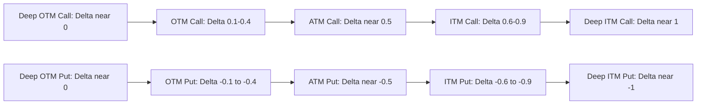

## Delta and Directional Risk

### Overview

Delta ($\Delta$) is the first-order sensitivity of an option's price to changes in the underlying asset's price. It is the most fundamental of the Greeks, representing both the instantaneous hedge ratio for delta-neutral hedging and an approximation of the option's "moneyness" or probability of finishing in-the-money. Directional risk management in derivatives trading is built primarily around monitoring and adjusting delta exposure.

### Mathematical Definition

Delta is the partial derivative of the option price with respect to the underlying price:

$$\Delta = \frac{\partial V}{\partial S}$$

where $V$ is the option value and $S$ is the underlying asset price.

### Delta Formulas Under Black-Scholes-Merton

**For a non-dividend-paying underlying:**

$$\Delta_{call} = N(d_1)$$

$$\Delta_{put} = N(d_1) - 1 = -N(-d_1)$$

**For a dividend-paying underlying (continuous yield $q$):**

$$\Delta_{call} = e^{-qT} N(d_1)$$

$$\Delta_{put} = e^{-qT}[N(d_1) - 1] = -e^{-qT}N(-d_1)$$

where:

$$d_1 = \frac{\ln(S_0/K) + (r - q + \sigma^2/2)T}{\sigma\sqrt{T}}$$

**Key Points**

- Call delta ranges from $0$ to $1$ (or $0$ to $e^{-qT}$ with dividends)
- Put delta ranges from $-1$ to $0$ (or $-e^{-qT}$ to $0$ with dividends)
- Deep ITM calls have delta approaching 1; deep OTM calls have delta approaching 0
- Deep ITM puts have delta approaching -1; deep OTM puts have delta approaching 0
- At-the-money options typically have delta near 0.5 (calls) or -0.5 (puts), though this is only approximate — true 50-delta occurs slightly away from the forward price due to the $\sigma^2/2$ drift term

### Delta as Hedge Ratio

**Key Points**

- Delta represents the number of shares of the underlying needed to hedge one option contract against small price movements
- A trader who has sold one call option with $\Delta = 0.60$ needs to buy 0.60 shares (or 60 shares per 100-share contract) to be **delta-neutral**
- This hedge is only valid for infinitesimally small price moves — delta itself changes as the underlying price moves, which is captured by **Gamma** (the rate of change of delta)
- Delta-hedging must be dynamically rebalanced as the underlying price moves and time passes, since delta is not static

### Delta as Approximate Probability

**Key Points**

- $N(d_1)$ is *not* exactly the risk-neutral probability of finishing in-the-money — that is $N(d_2)$ — but $N(d_1)$ is commonly used as a rough proxy for "moneyness" in practitioner shorthand
- $N(d_2)$ is the true risk-neutral probability that a call option expires in-the-money: $P(S_T > K)$ under the risk-neutral measure
- The distinction matters more for longer-dated or higher-volatility options, where $d_1$ and $d_2$ diverge more significantly (recall $d_2 = d_1 - \sigma\sqrt{T}$)
- In FX and OTC options markets, options are frequently quoted directly by their delta (e.g., "25-delta put") rather than by strike, since delta provides a moneyness-standardized way to compare options across different underlyings and volatility regimes

### Worked Example

**Example**

Compute the delta of a call and put option with:

- $S_0 = \$50$
- $K = \$50$
- $r = 3\%$
- $\sigma = 20\%$
- $T = 0.5$ years
- No dividends

Step 1 — Compute $d_1$:

$$d_1 = \frac{\ln(50/50) + (0.03 + 0.02)(0.5)}{0.20\sqrt{0.5}} = \frac{0 + 0.025}{0.1414} \approx 0.1768$$

Step 2 — Compute $N(d_1)$:

$$N(0.1768) \approx 0.5702$$

**Output**

$$\Delta_{call} = 0.5702, \quad \Delta_{put} = 0.5702 - 1 = -0.4298$$

A trader long 10 call contracts (each covering 100 shares) has a position delta of $10 \times 100 \times 0.5702 = 570.2$ — approximately equivalent in directional exposure to holding 570 shares of the underlying.

### Position Delta and Portfolio Aggregation

**Key Points**

- Delta is additive across positions in the same underlying: portfolio delta is simply the sum of each position's delta, weighted by contract size and quantity
- $\text{Portfolio Delta} = \sum_i (\text{quantity}_i \times \text{contract multiplier} \times \Delta_i)$
- This additivity allows traders to manage an entire book's directional exposure with a single aggregated number, rather than tracking each option individually
- Delta-neutral portfolios can still carry substantial risk from other Greeks (Gamma, Vega, Theta) even when net directional exposure is zero

### Delta Behavior Across Moneyness and Time

| Scenario | Call Delta Behavior | Put Delta Behavior |
| --- | --- | --- |
| Deep ITM | Approaches 1 | Approaches -1 |
| ATM | Near 0.5 | Near -0.5 |
| Deep OTM | Approaches 0 | Approaches 0 |
| As $T \to 0$ (ITM) | Approaches 1 rapidly | Approaches -1 rapidly |
| As $T \to 0$ (OTM) | Approaches 0 rapidly | Approaches 0 rapidly |
| As $T \to 0$ (ATM) | Delta becomes unstable, jumps toward 0 or 1 | Delta becomes unstable, jumps toward 0 or -1 |

**Key Points**

- As expiration approaches, delta for ATM options becomes highly unstable — small price moves can swing delta dramatically between near-0 and near-1, since the option's fate (ITM vs OTM) is being resolved
- This instability near expiration is a primary driver of **gamma risk** spiking for at-the-money, near-expiry options, requiring much more frequent hedge rebalancing

### Delta Sign Conventions by Position

**Key Points**

- Long call: positive delta (bullish)
- Short call: negative delta (bearish)
- Long put: negative delta (bearish)
- Short put: positive delta (bullish)
- Long underlying: delta of +1 per share
- Short underlying: delta of -1 per share
- A **covered call** (long stock + short call) has net delta of $1 - \Delta_{call}$, reducing but not eliminating upside exposure while retaining full downside exposure below the premium collected

### Delta-Neutral Strategies

**Key Points**

- **Delta-neutral hedging**: continuously adjusting the underlying position so aggregate portfolio delta remains at (or near) zero, isolating exposure to other Greeks (particularly gamma and vega) rather than outright direction
- **Straddles and strangles** near ATM have combined delta close to zero at inception (long call delta + long put delta ≈ 0 for symmetric strikes around the forward), making them primarily volatility plays rather than directional bets
- Market makers typically run large, diversified options books and continuously delta-hedge to isolate and monetize the bid-ask spread and volatility risk premium, rather than take directional views

### Delta Decay and Relationship to Other Greeks

**Key Points**

- Delta is related to Gamma via $\Gamma = \frac{\partial \Delta}{\partial S}$ — Gamma measures how quickly delta itself changes, making it the "delta of delta"
- Delta and Theta interact: as time passes, delta for OTM options drifts toward 0 and for ITM options drifts toward 1 (or -1), independent of price changes — this is sometimes called "delta bleed" or "charm" ($\frac{\partial \Delta}{\partial T}$)
- **Charm** (delta decay) is particularly relevant for hedgers who cannot rebalance continuously, since delta changes purely from time passing, not just from price moves

### Visualizing Delta Across Strikes

### Delta Curve Visualization (svg_diagram)

<svg xmlns="http://www.w3.org/2000/svg" viewBox="0 0 700 320">
\<style\>
.lbl { font-family: sans-serif; font-size: 13px; fill: #1a1a1a; }
.small { font-family: sans-serif; font-size: 11px; fill: #444; }
.axis { stroke: #888; stroke-width: 1; }
.callcurve { stroke: #2471a3; stroke-width: 2.5; fill: none; }
.putcurve { stroke: #c0392b; stroke-width: 2.5; fill: none; }
.zero { stroke: #aaa; stroke-width: 1; stroke-dasharray: 3,3; }
\</style\>
<text x="200" y="20" class="lbl" font-weight="bold">Call and Put Delta vs Underlying Price (svg_diagram)</text>
<line x1="60" y1="270" x2="650" y2="270" class="axis" />
<line x1="60" y1="270" x2="60" y2="40" class="axis" />
<line x1="60" y1="160" x2="650" y2="160" class="zero" />
<text x="20" y="55" class="small">1.0</text>
<text x="20" y="165" class="small">0</text>
<text x="10" y="270" class="small">-1.0</text>
<text x="330" y="295" class="small">Underlying Price (Strike at center)</text>
<line x1="355" y1="270" x2="355" y2="40" class="zero" />
<text x="335" y="290" class="small">K</text>
<path class="callcurve" d="M60,255 C200,250 300,180 355,155 C420,120 550,55 650,50" />
<text x="480" y="80" class="small" fill="#2471a3">Call Delta (0 to 1)</text>
<path class="putcurve" d="M60,55 C200,60 300,130 355,165 C420,200 550,265 650,270" />
<text x="480" y="245" class="small" fill="#c0392b">Put Delta (-1 to 0)</text>
</svg>

### Practical Trading Applications

**Key Points**

- **Delta hedging desks** use position delta to determine how many shares/futures to buy or sell to maintain neutrality, rebalancing as the market moves or on a scheduled basis
- **Directional traders** use delta to size positions with a target directional exposure (e.g., "I want $500,000 of delta-equivalent exposure to this stock")
- **Delta as moneyness convention** is standard in FX options markets, where a "25-delta risk reversal" refers to the difference in implied volatility between a 25-delta call and a 25-delta put — a key skew indicator
- Delta hedging behavior in practice can deviate from theoretical predictions during periods of high volatility, low liquidity, or large gap moves, since the assumption of continuous rebalancing at the theoretical delta breaks down **[Inference]**

**Conclusion**

Delta is the cornerstone Greek for directional risk management, quantifying both the hedge ratio needed to neutralize small underlying price moves and a rough approximation of an option's moneyness. Its dynamic nature — changing with price, time, and volatility — necessitates continuous monitoring and rebalancing in professional options trading, and its interaction with Gamma, Theta (via Charm), and portfolio-level aggregation makes it the foundation upon which the rest of the Greeks framework is built.

**Related Topics**

- Gamma: Rate of Change of Delta and Convexity Risk
- Charm (Delta Decay) and Time-Based Hedge Drift
- Delta-Neutral Trading Strategies and Market Making
- FX Delta Conventions and Risk Reversals
- Position Sizing Using Delta-Equivalent Exposure
- Gamma Scalping and Dynamic Hedging Costs
- Vega and Volatility Risk in Delta-Hedged Portfolios
- Pin Risk Near Expiration for ATM Options