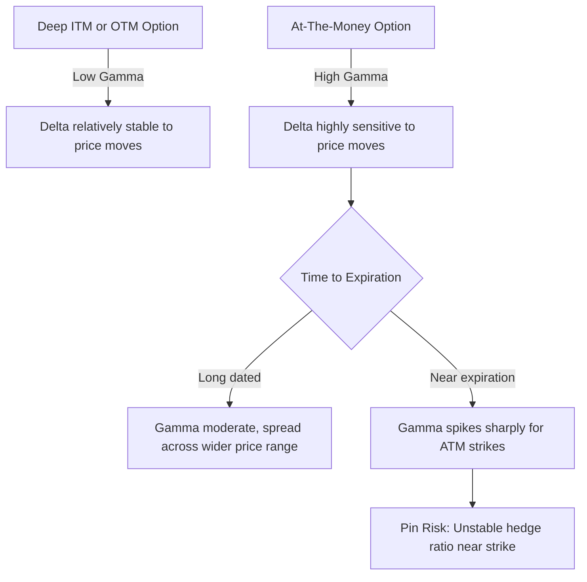

## Gamma and Convexity Risk

### Overview

Gamma ($\Gamma$) is the second-order sensitivity of an option's price to the underlying asset's price — the rate of change of Delta. It measures the **convexity** of an option's payoff, capturing how quickly a hedge ratio becomes outdated as the underlying moves. Gamma is central to understanding why delta-hedged options portfolios still carry risk, and it drives the cost and frequency of hedge rebalancing.

### Mathematical Definition

Gamma is the second partial derivative of option value with respect to the underlying price (equivalently, the first derivative of Delta):

$$\Gamma = \frac{\partial^2 V}{\partial S^2} = \frac{\partial \Delta}{\partial S}$$

### Gamma Formula Under Black-Scholes-Merton

**For a non-dividend-paying underlying:**

$$\Gamma = \frac{N'(d_1)}{S_0 \sigma \sqrt{T}}$$

**For a dividend-paying underlying (continuous yield $q$):**

$$\Gamma = \frac{e^{-qT} N'(d_1)}{S_0 \sigma \sqrt{T}}$$

where $N'(d_1)$ is the standard normal probability density function:

$$N'(d_1) = \frac{1}{\sqrt{2\pi}} e^{-d_1^2/2}$$

**Variable Definitions**

- $S_0$ — current underlying price
- $\sigma$ — volatility
- $T$ — time to expiration
- $d_1$ — as defined in the standard BSM formula

**Key Points**

- Gamma is **identical for calls and puts** at the same strike and expiration (a direct consequence of put-call parity, since $\Delta_{call} - \Delta_{put} = 1$, a constant, so their rates of change must be equal)
- Gamma is always **non-negative** for long option positions (both calls and puts), since option prices are convex functions of the underlying price
- Gamma is at its **maximum for at-the-money options** and decreases as options move deep ITM or deep OTM
- Gamma increases as time to expiration decreases for ATM options, and decreases as expiration approaches for ITM/OTM options — this divergence creates the characteristic "spike" in ATM gamma near expiry

### Gamma and the Second-Order Taylor Expansion

Delta alone only captures the linear (first-order) sensitivity to price changes. For larger moves, a second-order (Taylor series) approximation improves accuracy:

$$\Delta V \approx \Delta \cdot \Delta S + \frac{1}{2}\Gamma (\Delta S)^2$$

**Key Points**

- The Gamma term captures the **convexity benefit** of long options: for a long option position, an unexpectedly large move in either direction produces a P&L gain beyond what Delta alone would predict
- This asymmetric, convex payoff is precisely what a long-gamma position provides, and precisely what a short-gamma position is exposed to as a risk
- The larger the price move $\Delta S$, the more the quadratic Gamma term dominates the linear Delta term — Gamma effects are second-order but become increasingly important during large, fast market moves

### Long Gamma vs. Short Gamma

| Position | Gamma Sign | P&L Behavior on Large Moves | Typical Holder |
| --- | --- | --- | --- |
| Long calls/puts | Positive (long gamma) | Benefits from large moves in either direction | Option buyers, volatility longs |
| Short calls/puts | Negative (short gamma) | Losses accelerate on large moves in either direction | Option sellers, premium collectors |

**Key Points**

- **Long gamma** positions profit from realized volatility exceeding what was paid for (implied volatility at purchase), since large moves generate outsized P&L relative to the linear delta hedge
- **Short gamma** positions profit from time decay (Theta) as long as the underlying stays relatively still, but face accelerating losses if the underlying makes a large move — this is the classic "picking up nickels in front of a steamroller" risk profile of naked option-selling strategies
- Gamma and Theta have a structural, opposing relationship for most options: a position that is long gamma typically pays theta (time decay), while a position that is short gamma typically collects theta — this trade-off is fundamental to options market-making and volatility trading

### Worked Example

**Example**

Compute the gamma of an at-the-money call option with:

- $S_0 = \$100$
- $K = \$100$
- $r = 4\%$
- $\sigma = 25\%$
- $T = 0.25$ years (3 months)

Step 1 — Compute $d_1$:

$$d_1 = \frac{\ln(100/100) + (0.04 + 0.03125)(0.25)}{0.25\sqrt{0.25}} = \frac{0 + 0.01781}{0.125} \approx 0.1425$$

Step 2 — Compute $N'(d_1)$:

$$N'(0.1425) = \frac{1}{\sqrt{2\pi}} e^{-0.1425^2/2} \approx 0.3969 \times e^{-0.01015} \approx 0.3929$$

Step 3 — Compute Gamma:

$$\Gamma = \frac{0.3929}{100 \times 0.25 \times \sqrt{0.25}} = \frac{0.3929}{100 \times 0.25 \times 0.5} = \frac{0.3929}{12.5} \approx 0.03143$$

**Output**

$$\Gamma \approx 0.0314$$

This means for every $1 move in the underlying, delta changes by approximately 0.0314. For a $5 move, delta would shift by roughly $0.0314 \times 5 = 0.157$ (a first-order approximation, since Gamma itself changes as price moves).

### Position Gamma and Portfolio Aggregation

**Key Points**

- Gamma, like Delta, is additive across positions in the same underlying, scaled by quantity and contract multiplier
- $\text{Portfolio Gamma} = \sum_i (\text{quantity}_i \times \text{contract multiplier} \times \Gamma_i)$
- A portfolio can be simultaneously **delta-neutral and gamma-positive (or negative)** — delta-neutrality alone does not imply the absence of convexity risk
- Market makers frequently monitor gamma exposure by strike/expiration bucket to understand where large hedging flows might be triggered as spot approaches specific price levels (a phenomenon sometimes discussed as "gamma exposure" or "dealer gamma positioning" in market commentary)

### Gamma Scalping

**Key Points**

- **Gamma scalping** is a trading strategy where a long-gamma, delta-hedged position is continuously rebalanced: as the underlying rises, delta increases, requiring the trader to sell some underlying to return to delta-neutral; as the underlying falls, delta decreases, requiring the trader to buy back underlying
- This rebalancing process, done "buy low, sell high" style, generates trading profits when realized volatility is high — effectively monetizing the actual price movement of the underlying
- The profitability of gamma scalping depends on whether **realized volatility exceeds the implied volatility paid** for the option (adjusted for the theta decay cost of holding long gamma) — if realized vol is lower than implied vol, the scalping profits will not cover the theta bleed **[Inference — depends on hedging frequency and transaction costs, which affect realized scalping P&L relative to the theoretical breakeven]**

### Gamma's Relationship to Other Second-Order Greeks

**Key Points**

- **Vanna** ($\frac{\partial \Delta}{\partial \sigma} = \frac{\partial \text{Vega}}{\partial S}$) measures how delta changes with volatility (or equivalently, how vega changes with the underlying price)
- **Charm** ($\frac{\partial \Delta}{\partial T}$) measures how delta changes purely with the passage of time
- **Speed** ($\frac{\partial \Gamma}{\partial S}$) measures the rate of change of gamma itself — relevant for very large, fast underlying moves
- **Color** ($\frac{\partial \Gamma}{\partial T}$) measures how gamma decays or grows as time passes, holding the underlying price fixed — critical for understanding how gamma risk evolves into the final days before expiration

### Gamma Risk Near Expiration ("Pin Risk")

**Key Points**

- As expiration approaches, gamma for at-the-money options becomes extremely large (approaching infinity in the limit as $T \to 0$ for a strictly ATM option), since delta must transition sharply from near-0 to near-1 (or -1) in a very short time
- This creates **pin risk**: if the underlying price is very close to the strike as expiration nears, the hedge ratio becomes highly unstable, and hedgers may struggle to maintain an accurate delta hedge with normal-sized trades
- Pin risk is a well-known operational concern for options market makers around index rebalancing dates and monthly/quarterly expiration ("triple witching" in equity index markets), where large open interest concentrated near a single strike can amplify hedging flows **[Inference — magnitude of pin risk effects depends on open interest concentration and market liquidity conditions specific to each expiration]**

### Visualizing Gamma Across Strikes and Time

### Gamma Curve Across Moneyness and Time (svg_diagram)

<svg xmlns="http://www.w3.org/2000/svg" viewBox="0 0 700 320">
\<style\>
.lbl { font-family: sans-serif; font-size: 13px; fill: #1a1a1a; }
.small { font-family: sans-serif; font-size: 11px; fill: #444; }
.axis { stroke: #888; stroke-width: 1; }
.short_t { stroke: #c0392b; stroke-width: 2.5; fill: none; }
.long_t { stroke: #2471a3; stroke-width: 2; fill: none; }
\</style\>
<text x="180" y="20" class="lbl" font-weight="bold">Gamma vs Underlying Price by Time to Expiry (svg_diagram)</text>
<line x1="60" y1="270" x2="650" y2="270" class="axis" />
<line x1="60" y1="270" x2="60" y2="40" class="axis" />
<text x="330" y="295" class="small">Underlying Price</text>
<text x="15" y="150" class="small" transform="rotate(-90 15 150)">Gamma</text>
<line x1="355" y1="270" x2="355" y2="40" stroke="#aaa" stroke-dasharray="3,3" />
<text x="335" y="290" class="small">K (ATM)</text>
<path class="short_t" d="M60,265 C250,260 320,60 355,50 C390,60 460,260 650,265" />
<text x="440" y="70" class="small" fill="#c0392b">Near Expiration (sharp spike)</text>
<path class="long_t" d="M60,240 C220,220 300,160 355,150 C410,160 490,220 650,240" />
<text x="450" y="200" class="small" fill="#2471a3">Longer Dated (broad, lower peak)</text>
</svg>

### Practical Risk Management Implications

**Key Points**

- Options market makers actively manage gamma exposure as a distinct risk dimension from delta, since large negative gamma positions can produce disproportionate losses during volatile market conditions even when starting delta-neutral
- **Gamma limits** are commonly imposed by risk management desks alongside delta, vega, and theta limits, to cap the potential rebalancing cost and P&L volatility from convexity exposure
- During periods of large dealer short-gamma positioning (widely discussed in market commentary around index options), hedging flows can amplify underlying price moves (dealers must sell into declines and buy into rallies to stay hedged), a dynamic sometimes cited as a contributor to volatility clustering **[Speculation — the magnitude and consistency of this feedback effect across market regimes is debated among practitioners and researchers]**
- Gamma hedging in practice requires balancing rebalancing frequency against transaction costs — very frequent rebalancing reduces hedging error but increases costs, while infrequent rebalancing does the reverse; the theoretically optimal frequency depends on the specific cost structure and risk tolerance of the hedger **[Inference]**

**Conclusion**

Gamma quantifies the convexity risk embedded in options positions — the degree to which Delta itself is unstable and requires active rebalancing. It is the key driver of the long-gamma/short-gamma risk-reward trade-off with Theta, the mechanism behind gamma scalping profitability, and the source of pin risk near expiration. Effective options risk management requires monitoring Gamma alongside Delta, since delta-neutrality alone provides no protection against the P&L impact of large or rapid underlying price moves.

**Related Topics**

- Vanna and Volga: Cross-Sensitivities Involving Volatility
- Gamma Scalping Strategy Mechanics and Breakeven Analysis
- Theta Decay and the Gamma-Theta Trade-off
- Pin Risk and Expiration-Day Hedging Challenges
- Dealer Gamma Positioning and Market Volatility Dynamics
- Speed and Color: Third-Order Greeks
- Optimal Discrete Hedging Frequency (Leland's Model)
- Volatility Trading Strategies: Straddles, Strangles, and Delta-Hedged Options