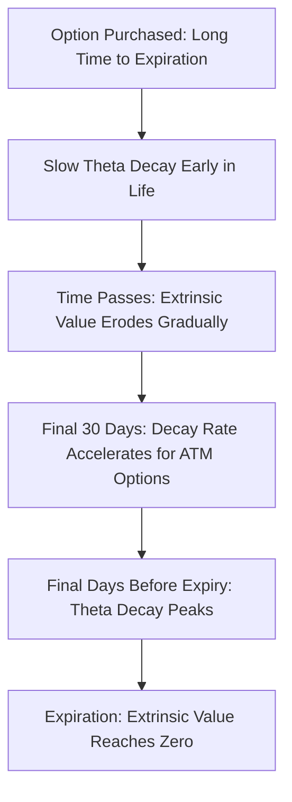

## Theta and Time Decay

### Overview

Theta ($\Theta$) measures the sensitivity of an option's price to the passage of time, holding all other variables constant. It quantifies **time decay** — the erosion of an option's extrinsic (time) value as expiration approaches. Theta is typically negative for long option positions, reflecting the fact that options are wasting assets, and it forms the structural counterpart to Gamma in the long-gamma/short-gamma risk-reward trade-off.

### Mathematical Definition

Theta is the partial derivative of option value with respect to time, typically expressed as the *negative* of the derivative with respect to time-to-expiration (since as calendar time moves forward, time-to-expiration shrinks):

$$\Theta = -\frac{\partial V}{\partial T}$$

By convention, Theta is usually quoted as the dollar decay per day (dividing the annualized formula by 365 or 252, depending on convention), representing how much value the option loses over one calendar or trading day, all else equal.

### Theta Formula Under Black-Scholes-Merton

**For a non-dividend-paying underlying:**

$$\Theta_{call} = -\frac{S_0 N'(d_1)\sigma}{2\sqrt{T}} - rKe^{-rT}N(d_2)$$

$$\Theta_{put} = -\frac{S_0 N'(d_1)\sigma}{2\sqrt{T}} + rKe^{-rT}N(-d_2)$$

**For a dividend-paying underlying (continuous yield $q$):**

$$\Theta_{call} = -\frac{S_0 N'(d_1)\sigma e^{-qT}}{2\sqrt{T}} - rKe^{-rT}N(d_2) + qS_0e^{-qT}N(d_1)$$

$$\Theta_{put} = -\frac{S_0 N'(d_1)\sigma e^{-qT}}{2\sqrt{T}} + rKe^{-rT}N(-d_2) - qS_0e^{-qT}N(-d_1)$$

**Variable Definitions**

- $S_0$ — current underlying price
- $K$ — strike price
- $r$ — risk-free rate
- $q$ — continuous dividend yield
- $\sigma$ — volatility
- $T$ — time to expiration
- $N'(d_1)$ — standard normal probability density function

**Key Points**

- The first term (common to both calls and puts) is always negative and represents the loss of extrinsic value due to the diffusion/uncertainty component shrinking as $T \to 0$
- The second term differs in sign between calls and puts because it reflects the time value of money on the strike price component of the replicating portfolio
- For dividend-paying underlyings, an additional term appears reflecting the forgone/received dividend yield on the stock position embedded in the replication

### Sign Convention and Interpretation

**Key Points**

- Theta is expressed as an **annualized rate**; dividing by 365 (calendar days) or 252 (trading days) converts it to a **daily decay** figure, which is the convention most commonly used in practitioner quoting
- For the vast majority of long option positions (both calls and puts), Theta is **negative** — the option loses value purely from the passage of time, holding the underlying price and volatility fixed
- Exceptions exist: deep ITM European puts on non-dividend-paying stocks can occasionally have **positive Theta**, because the time value of money on the eventual receipt of the strike price can outweigh the decay of extrinsic value **[Inference — this is a known edge case tied to the interest-rate term dominating; occurs primarily for deep ITM puts with high interest rates and long time to expiration]**
- Theta is **most negative (largest decay) for at-the-money options**, mirroring Gamma's shape — ATM options carry the most extrinsic value and thus the most to lose as time passes

### Worked Example

**Example**

Compute the theta of an at-the-money call option with:

- $S_0 = \$100$
- $K = \$100$
- $r = 4\%$
- $\sigma = 25\%$
- $T = 0.25$ years (3 months)
- No dividends

Step 1 — Compute $d_1$ and $d_2$ (reusing values from the Gamma example):

$$d_1 \approx 0.1425, \quad d_2 = 0.1425 - 0.25\sqrt{0.25} = 0.1425 - 0.125 = 0.0175$$

Step 2 — Compute $N'(d_1)$, $N(d_2)$:

$$N'(0.1425) \approx 0.3929, \quad N(0.0175) \approx 0.5070$$

Step 3 — Compute first term:

$$-\frac{100 \times 0.3929 \times 0.25}{2\sqrt{0.25}} = -\frac{9.8225}{1.0} = -9.8225$$

Step 4 — Compute second term:

$$-rKe^{-rT}N(d_2) = -0.04 \times 100 \times e^{-0.01} \times 0.5070 = -0.04 \times 100 \times 0.9900 \times 0.5070 \approx -2.0077$$

Step 5 — Sum (annualized theta):

$$\Theta_{call} \approx -9.8225 - 2.0077 = -11.8302 \text{ per year}$$

Step 6 — Convert to daily decay:

$$\Theta_{daily} = \frac{-11.83}{365} \approx -\$0.0324 \text{ per day}$$

**Output**

The option loses approximately **$0.0324 per day** (about 3.24 cents) from time decay alone, holding all else constant.

### Theta Decay Profile Over Time

**Key Points**

- Theta decay is **not linear** — it accelerates as expiration approaches, particularly for at-the-money options
- The commonly cited (though imprecise) heuristic is that theta decay follows roughly a $\sqrt{T}$ relationship, meaning the *rate* of decay increases as $T$ shrinks, with the most rapid decay occurring in the final 30 days before expiration for ATM options **[Inference — the exact acceleration pattern depends on moneyness; ITM/OTM decay profiles differ from ATM]**
- This accelerating decay is why option sellers often prefer shorter-dated options (to collect theta faster relative to gamma risk) while option buyers holding for a directional view often prefer longer-dated options (to minimize the daily theta cost)

### The Gamma-Theta Trade-off

**Key Points**

- Gamma and Theta have an inherent tension for most vanilla option positions: **long gamma positions pay theta**, and **short gamma positions collect theta**
- This relationship can be seen directly from the Black-Scholes PDE, which links Theta, Gamma, and the risk-free rate:

$$\Theta + rS\Delta + \frac{1}{2}\sigma^2 S^2 \Gamma = rV$$

- Rearranging this relationship shows that Theta and Gamma move in opposite directions for a given option value $V$ and delta-hedge position — a large positive Gamma is generally accompanied by a large negative Theta, and vice versa
- This is the mathematical foundation of the "theta pays for gamma" intuition: an option seller who is short gamma is compensated with positive theta income for bearing the convexity risk, while an option buyer who is long gamma pays theta as the cost of holding convexity

### Position Theta and Portfolio Aggregation

**Key Points**

- Theta, like Delta and Gamma, is additive across a portfolio, scaled by quantity and contract multiplier
- $\text{Portfolio Theta} = \sum_i (\text{quantity}_i \times \text{contract multiplier} \times \Theta_i)$
- Options market makers and volatility traders often monitor **theta-to-gamma ratios** or **theta-to-vega ratios** to assess whether a position's time-decay income adequately compensates for the convexity or volatility risk being carried
- A portfolio can have significant positive daily theta income while still being exposed to substantial tail risk from a single large move (a hallmark of short-volatility/short-gamma strategies)

### Theta Across Moneyness and Time to Expiration

| Scenario | Theta Magnitude | Notes |
| --- | --- | --- |
| Deep ITM | Small in magnitude | Option is mostly intrinsic value, little extrinsic value to decay |
| ATM | Largest in magnitude | Maximum extrinsic value at risk of decay |
| Deep OTM | Small in magnitude | Extrinsic value is already low; little left to decay |
| Long time to expiration | Small daily theta | Extrinsic value decays slowly early in the option's life |
| Near expiration (ATM) | Large daily theta | Rapid decay in final weeks, especially final days |

### Theta as "Rent" for Holding Convexity

**Key Points**

- A useful practitioner framing: Theta is the "rent" paid by a long option holder for the right to be long Gamma (convexity) and long Vega (volatility exposure)
- Whether this rent is "worth it" depends on whether the realized volatility and realized price moves over the holding period generate enough Gamma-driven P&L (via delta-hedging/rebalancing, i.e., gamma scalping) to offset the cumulative Theta cost paid
- This framing directly connects Theta to the broader volatility trading question: is implied volatility (the theta cost embedded in the option price) higher or lower than the realized volatility that will actually occur?

### Visualizing Theta Decay Acceleration

### Theta Decay Curve Over Time to Expiration (svg_diagram)

<svg xmlns="http://www.w3.org/2000/svg" viewBox="0 0 700 300">
\<style\>
.lbl { font-family: sans-serif; font-size: 13px; fill: #1a1a1a; }
.small { font-family: sans-serif; font-size: 11px; fill: #444; }
.axis { stroke: #888; stroke-width: 1; }
.curve { stroke: #c0392b; stroke-width: 2.5; fill: none; }
\</style\>
<text x="150" y="20" class="lbl" font-weight="bold">Extrinsic Value Decay as Expiration Approaches (svg_diagram)</text>
<line x1="60" y1="260" x2="650" y2="260" class="axis" />
<line x1="60" y1="260" x2="60" y2="40" class="axis" />
<text x="270" y="285" class="small">Time (Purchase to Expiration)</text>
<text x="15" y="150" class="small" transform="rotate(-90 15 150)">Extrinsic Value</text>
<path class="curve" d="M60,80 C250,90 400,110 500,150 C560,180 610,220 650,255" />
<text x="480" y="120" class="small" fill="#c0392b">Decay accelerates near expiry</text>
<line x1="620" y1="260" x2="620" y2="240" stroke="#1a1a1a" />
<text x="590" y="278" class="small">Expiration</text>
</svg>

### Practical Applications and Risk Management

**Key Points**

- **Premium-selling strategies** (covered calls, cash-secured puts, credit spreads, iron condors) are explicitly designed to harvest positive Theta, accepting negative Gamma/Vega exposure in exchange
- **Calendar spreads** exploit differential Theta decay rates between near-term and longer-term options at the same strike, profiting from the faster decay of the short-dated leg relative to the long-dated leg
- Traders monitoring an options book typically track **daily theta P&L** as a baseline expectation against which actual daily P&L is compared, isolating the portion of P&L attributable to delta/gamma effects from price moves versus pure time decay
- Behavior of theta near expiration for options with discrete dividends, corporate actions, or upcoming binary events (earnings announcements) can deviate from the smooth theoretical decay curve, since implied volatility itself may be elevated ahead of a known event and then decay sharply afterward (a distinct phenomenon from Theta itself, but often confused with it in practice) **[Inference]**

**Conclusion**

Theta quantifies the time-decay cost embedded in every option position, serving as the direct counterweight to Gamma in the fundamental risk-reward structure of options trading. Its acceleration as expiration approaches, its structural link to Gamma via the Black-Scholes PDE, and its role as "rent" for holding convexity make it essential for evaluating whether an option position — long or short — is economically justified given the volatility environment.

**Related Topics**

- The Gamma-Theta Trade-off and the Black-Scholes PDE
- Premium-Selling Strategies: Covered Calls, Iron Condors, Credit Spreads
- Calendar and Diagonal Spreads: Exploiting Differential Theta Decay
- Implied Volatility Crush Around Earnings and Binary Events
- Vega and the Volatility Risk Premium
- Theta-to-Gamma and Theta-to-Vega Ratios in Position Risk Assessment
- Positive Theta Anomalies in Deep ITM European Puts
- Options Market Making and Daily P&L Attribution