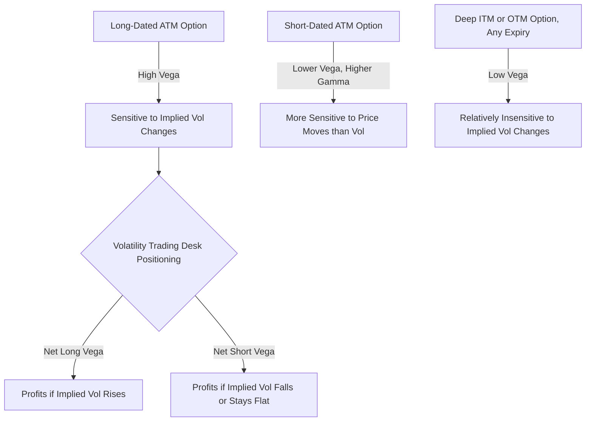

## Vega and Volatility Risk

### Overview

Vega ($\mathcal{V}$) measures the sensitivity of an option's price to changes in implied volatility. Unlike Delta, Gamma, and Theta, Vega is not technically a Greek letter (it is named after the star Vega, adopted informally into options terminology), but it is treated as a core member of the Greeks family. Vega captures a fundamentally different risk dimension than the underlying-price Greeks: exposure to changes in the market's expectation of future volatility itself.

### Mathematical Definition

Vega is the partial derivative of option value with respect to volatility:

$$\mathcal{V} = \frac{\partial V}{\partial \sigma}$$

### Vega Formula Under Black-Scholes-Merton

**For a non-dividend-paying underlying:**

$$\mathcal{V} = S_0 N'(d_1) \sqrt{T}$$

**For a dividend-paying underlying (continuous yield $q$):**

$$\mathcal{V} = S_0 e^{-qT} N'(d_1) \sqrt{T}$$

where $N'(d_1)$ is the standard normal probability density function.

**Variable Definitions**

- $S_0$ — current underlying price
- $\sigma$ — volatility (the variable Vega measures sensitivity to)
- $T$ — time to expiration
- $q$ — continuous dividend yield

**Key Points**

- Vega is **identical for calls and puts** at the same strike and expiration — a direct consequence of put-call parity, since the parity relationship $C - P = S_0e^{-qT} - Ke^{-rT}$ contains no volatility term, meaning both options must respond identically to changes in $\sigma$
- Vega is always **positive** for long option positions (both calls and puts) — higher volatility increases the value of optionality, since larger potential price swings increase the probability of favorable outcomes without a symmetric penalty for unfavorable ones (due to limited downside on long options)
- Vega is **highest for at-the-money options** and decreases as options move deep ITM or deep OTM, mirroring the shape of Gamma
- Vega increases with time to expiration — longer-dated options have more Vega because there is more time for volatility to manifest into price movement, giving the volatility assumption more "room to matter"

### Vega Quoting Convention

**Key Points**

- Vega is conventionally quoted as the dollar price change **per 1 percentage point (1 volatility point) change** in implied volatility (e.g., from 20% to 21%), rather than per unit change in the raw decimal $\sigma$
- This requires dividing the raw calculus-based Vega formula output by 100, since the formula above is derived with $\sigma$ as a decimal (e.g., 0.20)
- Practitioners refer to this scaled quantity simply as "vega" in trading conversation (e.g., "this position has $5,000 of vega," meaning a 1-point move in implied volatility changes the position value by $5,000)

### Worked Example

**Example**

Compute the vega of an at-the-money call option with:

- $S_0 = \$100$
- $K = \$100$
- $r = 4\%$
- $\sigma = 25\%$
- $T = 0.25$ years (3 months)
- No dividends

Step 1 — Reuse $d_1 \approx 0.1425$ and $N'(d_1) \approx 0.3929$ (from prior Greeks examples)

Step 2 — Compute raw Vega:

$$\mathcal{V} = 100 \times 0.3929 \times \sqrt{0.25} = 100 \times 0.3929 \times 0.5 = 19.645$$

Step 3 — Convert to per-volatility-point convention:

$$\mathcal{V}_{scaled} = \frac{19.645}{100} \approx 0.1965$$

**Output**

The option's price changes by approximately **$0.1965** for each 1-percentage-point change in implied volatility. If implied volatility rises from 25% to 26%, the option's value increases by roughly $0.20, holding all else constant.

### Vega Across Moneyness and Time

| Scenario | Vega Magnitude | Notes |
| --- | --- | --- |
| Deep ITM | Low | Option value is mostly intrinsic; less sensitive to volatility |
| ATM | Highest | Maximum extrinsic value at stake, most sensitive to volatility changes |
| Deep OTM | Low | Small extrinsic value base to be affected by volatility changes |
| Short time to expiration | Low | Little time for volatility to translate into price movement |
| Long time to expiration | High | More time for volatility's effect on the distribution of outcomes to matter |

**Key Points**

- Vega's shape across strikes closely mirrors Gamma's, but Vega's magnitude grows with $\sqrt{T}$ while Gamma actually *shrinks* with longer time to expiration — this divergence means long-dated ATM options are "vega-heavy but gamma-light," while short-dated ATM options are "gamma-heavy but vega-light" **[Inference — general pattern from the functional forms; exact crossover point depends on specific strike/vol/rate inputs]**

### Vega and the Term Structure of Volatility

**Key Points**

- Because Vega increases with $\sqrt{T}$, positions with different expirations have inherently different sensitivities to volatility changes across the term structure
- **Vega-weighted term structure exposure** matters because implied volatility does not move in perfect parallel across all maturities — short-dated implied volatility tends to be more reactive to near-term news and events, while long-dated implied volatility is comparatively stable
- **Calendar spreads and diagonal spreads** are explicitly used to isolate exposure to specific parts of the volatility term structure, since the long and short legs have different Vega sensitivities (as well as different Theta decay rates)

### Vega and the Volatility Smile/Skew

**Key Points**

- Because implied volatility differs by strike (the smile/skew), the "vega" of an option to a *parallel* shift in implied volatility (all strikes move together) can differ meaningfully from its sensitivity to a change in *skew* (relative strikes moving differently) — a distinction formalized by second-order volatility Greeks
- **Vanna** ($\frac{\partial \mathcal{V}}{\partial S} = \frac{\partial \Delta}{\partial \sigma}$) measures how Vega changes as the underlying price moves (or equivalently, how Delta changes as volatility moves) — critical for understanding skew risk in a portfolio
- **Volga (Vomma)** ($\frac{\partial \mathcal{V}}{\partial \sigma}$) measures the convexity of option value with respect to volatility itself — how Vega changes as volatility changes, relevant for exposure to volatility-of-volatility

### Position Vega and Portfolio Aggregation

**Key Points**

- Vega is additive across positions in the same underlying, scaled by quantity and contract multiplier, just like Delta, Gamma, and Theta
- $\text{Portfolio Vega} = \sum_i (\text{quantity}_i \times \text{contract multiplier} \times \mathcal{V}_i)$
- Unlike Delta and Gamma (which relate purely to the underlying's price), Vega exposure must be considered **per expiration bucket** in sophisticated risk systems, since a parallel-shift Vega number can mask significant term-structure or skew risk within the book
- Volatility trading desks often run books that are delta-neutral and even gamma-neutral, but carry substantial net Vega exposure as their primary intended risk — this is the essence of pure **volatility trading** (trading the difference between implied and expected realized volatility)

### Long Vega vs. Short Vega

**Key Points**

- **Long Vega**: benefits when implied volatility rises; typical of long option buyers, long straddle/strangle holders, and traders expecting volatility expansion (e.g., ahead of anticipated events)
- **Short Vega**: benefits when implied volatility falls; typical of option sellers, short straddle/strangle positions, and traders monetizing "volatility risk premium" (the empirical tendency for implied volatility to exceed subsequently realized volatility, on average, across many asset classes)
- The **volatility risk premium (VRP)** is the structural basis for systematic option-selling and variance-selling strategies: sellers are compensated (via elevated implied vol relative to realized vol) for bearing the tail risk of large volatility spikes, though this compensation is not guaranteed in any single period and can be overwhelmed during volatility shocks **[Inference — VRP existence and magnitude has substantial empirical support but is not a risk-free arbitrage; it can reverse sharply during crisis periods]**

### Vega Risk in Practice: Volatility Regime Shifts

**Key Points**

- Implied volatility itself is not static — it exhibits **volatility clustering** and can spike sharply during market stress (e.g., VIX behavior during equity market drawdowns), meaning short-Vega positions can experience simultaneous mark-to-market losses from both rising implied volatility and adverse Gamma/Delta effects during a crisis
- This correlation between falling asset prices and rising implied volatility (the well-documented negative correlation between equity returns and the VIX) means short-Vega, short-Gamma strategies on equity indices tend to lose money on both dimensions simultaneously during sharp selloffs — a key reason such strategies carry significant tail risk despite appearing low-risk in calm markets
- Vega risk management typically involves setting net Vega limits by expiration bucket, along with stress-testing the book against historical volatility spike scenarios, since standard parametric risk measures (like Value-at-Risk under normal distribution assumptions) can understate the tail risk of short-Vega strategies **[Inference]**

### Visualizing Vega's Relationship to Moneyness and Time

### Vega Curve Across Strikes and Maturities (svg_diagram)

<svg xmlns="http://www.w3.org/2000/svg" viewBox="0 0 700 320">
\<style\>
.lbl { font-family: sans-serif; font-size: 13px; fill: #1a1a1a; }
.small { font-family: sans-serif; font-size: 11px; fill: #444; }
.axis { stroke: #888; stroke-width: 1; }
.longdated { stroke: #2471a3; stroke-width: 2.5; fill: none; }
.shortdated { stroke: #c0392b; stroke-width: 2; fill: none; }
\</style\>
<text x="180" y="20" class="lbl" font-weight="bold">Vega vs Underlying Price by Maturity (svg_diagram)</text>
<line x1="60" y1="270" x2="650" y2="270" class="axis" />
<line x1="60" y1="270" x2="60" y2="40" class="axis" />
<text x="330" y="295" class="small">Underlying Price</text>
<text x="15" y="150" class="small" transform="rotate(-90 15 150)">Vega</text>
<line x1="355" y1="270" x2="355" y2="40" stroke="#aaa" stroke-dasharray="3,3" />
<text x="335" y="290" class="small">K (ATM)</text>
<path class="longdated" d="M60,255 C220,230 320,80 355,65 C390,80 490,230 650,255" />
<text x="440" y="90" class="small" fill="#2471a3">Long-Dated Option (higher peak)</text>
<path class="shortdated" d="M60,265 C240,255 330,180 355,165 C380,180 470,255 650,265" />
<text x="450" y="200" class="small" fill="#c0392b">Short-Dated Option (lower peak)</text>
</svg>

### Practical Applications and Risk Management

**Key Points**

- **Straddle and strangle traders** use Vega as their primary risk/reward lever, taking a view on whether implied volatility is mispriced relative to expected realized volatility
- **Volatility index products** (VIX futures/options, variance swaps) exist specifically to allow direct trading of volatility exposure without the Delta/Gamma entanglement present in vanilla option Vega exposure
- **Vega hedging** across an options book typically involves offsetting positions across different strikes and expirations to flatten net Vega exposure, since carrying large unhedged Vega is a deliberate, isolated bet on the direction of implied volatility
- Behavior of Vega during periods of extreme market stress can deviate from smooth theoretical patterns, since the volatility surface itself becomes highly dynamic (skew steepens, term structure can invert) in ways the constant-volatility Black-Scholes framework does not anticipate **[Inference]**

**Conclusion**

Vega isolates the volatility dimension of options risk, distinct from the price-based Greeks (Delta, Gamma) and the time-based Greek (Theta). Its peak at at-the-money strikes, growth with time to expiration, and central role in the long-vega/short-vega dichotomy make it the primary tool for understanding and trading pure volatility exposure — while its interaction with the volatility risk premium and the tendency of implied volatility to spike during market stress make it one of the most consequential risk dimensions in derivatives portfolio management.

**Related Topics**

- Vanna and Volga: Second-Order Volatility Greeks
- The Volatility Risk Premium and Systematic Option-Selling Strategies
- VIX Futures, Options, and Variance Swaps
- Calendar Spreads and Term-Structure Vega Exposure
- Volatility Surface Dynamics: Skew and Term Structure Under Stress
- Straddle and Strangle Trading Strategies
- Stochastic Volatility Models: Heston and SABR
- Tail Risk in Short-Volatility Strategies