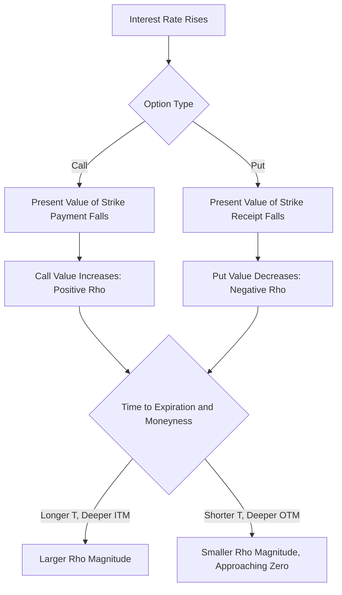

## Rho and Interest Rate Sensitivity

### Overview

Rho ($\rho$) measures the sensitivity of an option's price to changes in the risk-free interest rate. It is generally the least influential of the primary Greeks for short-dated equity options, but becomes materially important for long-dated options (LEAPS), interest rate derivatives, and in environments of significant rate volatility. Rho also plays a structural role in explaining why calls and puts respond asymmetrically to rate changes, tracing back to the cost-of-carry embedded in the Black-Scholes-Merton replication argument.

### Mathematical Definition

Rho is the partial derivative of option value with respect to the risk-free interest rate:

$$\rho = \frac{\partial V}{\partial r}$$

### Rho Formula Under Black-Scholes-Merton

**For a non-dividend-paying underlying:**

$$\rho_{call} = KTe^{-rT}N(d_2)$$

$$\rho_{put} = -KTe^{-rT}N(-d_2)$$

**For a dividend-paying underlying (continuous yield $q$), the formulas retain the same structure since $q$ does not enter the discounting of the strike term:**

$$\rho_{call} = KTe^{-rT}N(d_2)$$

$$\rho_{put} = -KTe^{-rT}N(-d_2)$$

**Variable Definitions**

- $K$ — strike price
- $T$ — time to expiration
- $r$ — risk-free rate
- $N(d_2)$ — as defined in the standard BSM formula

**Key Points**

- Rho is **positive for calls** and **negative for puts** — rising interest rates increase call values and decrease put values, all else equal
- This asymmetry arises because a higher risk-free rate reduces the present value of the strike price payment; for a call, the holder benefits from deferring payment of $K$ (paid only if exercised), so a lower PV of $K$ increases the call's value; for a put, the holder receives $K$ upon exercise, so a lower PV of that future receipt decreases the put's value
- Rho scales with both $K$ and $T$ — longer-dated options and higher-strike options have proportionally larger Rho, since the interest-rate effect compounds with both the size of the deferred/received cash flow and the time over which discounting matters

### Rho Quoting Convention

**Key Points**

- Like Vega, Rho is conventionally quoted as the dollar price change **per 1 percentage point (100 basis points) change** in the risk-free rate, requiring division of the raw calculus-based formula output by 100
- Practitioners refer to this scaled quantity as "rho" in trading conversation (e.g., "this position has $2,000 of rho," meaning a 1-percentage-point rate move changes the position's value by $2,000)

### Worked Example

**Example**

Compute the rho of an at-the-money call and put option with:

- $S_0 = \$100$
- $K = \$100$
- $r = 4\%$
- $\sigma = 25\%$
- $T = 1$ year (chosen longer-dated to illustrate Rho's magnitude more clearly)
- No dividends

Step 1 — Compute $d_1$ and $d_2$:

$$d_1 = \frac{\ln(100/100) + (0.04 + 0.03125)(1)}{0.25\sqrt{1}} = \frac{0.07125}{0.25} = 0.285$$

$$d_2 = 0.285 - 0.25 = 0.035$$

Step 2 — Compute $N(d_2)$ and $N(-d_2)$:

$$N(0.035) \approx 0.5140, \quad N(-0.035) \approx 0.4860$$

Step 3 — Compute raw Rho for the call:

$$\rho_{call} = 100 \times 1 \times e^{-0.04} \times 0.5140 = 100 \times 0.9608 \times 0.5140 \approx 49.39$$

Step 4 — Compute raw Rho for the put:

$$\rho_{put} = -100 \times 1 \times e^{-0.04} \times 0.4860 \approx -46.70$$

Step 5 — Convert to per-percentage-point convention:

$$\rho_{call,scaled} \approx 0.4939, \quad \rho_{put,scaled} \approx -0.4670$$

**Output**

For every 1-percentage-point increase in the risk-free rate, this call option's value increases by approximately **$0.494**, while the equivalent put option's value decreases by approximately **$0.467**, holding all else constant.

### Rho Across Moneyness, Time, and Option Type

| Scenario | Call Rho | Put Rho |
| --- | --- | --- |
| Deep ITM | Larger positive | Larger negative (in magnitude) |
| ATM | Moderate positive | Moderate negative |
| Deep OTM | Near zero | Near zero |
| Short time to expiration | Small magnitude | Small magnitude |
| Long time to expiration | Large magnitude | Large magnitude |

**Key Points**

- Deep ITM options have the largest Rho magnitude, since $N(d_2)$ approaches 1 (calls) or $N(-d_2)$ approaches 1 (puts), and the strike-discounting effect is most fully "in play" when exercise is highly likely
- Deep OTM options have Rho approaching zero, since $N(d_2) \to 0$ (calls) or $N(-d_2) \to 0$ (puts) — an option unlikely to be exercised is insensitive to how the eventual strike payment is discounted
- Rho's growth with $T$ (both from the explicit $T$ term and the compounding discount effect) is the primary reason Rho matters far more for LEAPS and long-dated OTC options than for short-dated listed options

### Rho's Relative Importance Compared to Other Greeks

**Key Points**

- For most short-dated (weeks to a few months) equity and index options, Rho is typically the **least economically significant Greek** in day-to-day P&L, since realistic short-term interest rate movements are small relative to the price and volatility movements that drive Delta, Gamma, Theta, and Vega P&L
- Rho becomes materially more important for: **long-dated equity options (LEAPS)**, **fixed income derivatives** (bond options, swaptions, caps/floors — where the underlying itself is rate-sensitive), and during **periods of significant central bank policy uncertainty or rate volatility**
- For interest rate derivatives specifically (options on bonds, swaptions), Rho-like sensitivities are typically decomposed further into **key rate durations** or **DV01/PV01** measures that isolate sensitivity to specific points on the yield curve, since a single parallel-shift Rho number is inadequate for capturing yield curve risk

### Rho and Put-Call Parity

Put-call parity provides a direct consistency check on Rho:

$$C - P = S_0 e^{-qT} - Ke^{-rT}$$

Differentiating both sides with respect to $r$:

$$\rho_{call} - \rho_{put} = KTe^{-rT}$$

**Key Points**

- This confirms that $\rho_{call} - \rho_{put}$ must always equal $KTe^{-rT}$ — a useful internal consistency check when computing Rho values, and a direct illustration of how the call-put Rho asymmetry is structurally tied to the discounting of the strike price in the replication argument

### Rho for Currency Options (Dual Rho)

**Key Points**

- Garman-Kohlhagen FX options have **two separate Rho sensitivities**: one to the domestic interest rate ($\rho_d$) and one to the foreign interest rate ($\rho_f$), since both rates independently affect the option's value
- $\rho_d$ behaves analogously to standard equity Rho (positive for calls, negative for puts, from discounting the strike)
- $\rho_f$ behaves analogously to a dividend-yield sensitivity (since $r_f$ plays the role of $q$) — for a call to buy foreign currency, rising foreign rates *decrease* the call value (since foreign currency yield reduces the drift benefit of holding the "dividend-paying" foreign asset from the option holder's perspective), while for a put, rising foreign rates increase value
- This "dual Rho" structure means FX options carry more nuanced interest rate risk than single-currency equity options, and FX options desks must manage both rate exposures independently

### Rho in Practice: Rate Environment Considerations

**Key Points**

- In prolonged low or near-zero interest rate environments, Rho's impact on option pricing is naturally muted for all option types, since the discounting effects driving Rho scale with the level of $r$ itself
- In higher-rate environments (such as periods of aggressive central bank tightening), Rho becomes a more economically significant factor, particularly for long-dated options and for the pricing of American-style options, where the early-exercise decision for puts becomes more sensitive to the interest-rate benefit of exercising early to earn interest on the received strike proceeds **[Inference — early exercise incentives for American puts are well-established theoretically; the practical magnitude depends on the specific rate level and time remaining]**
- Rho exposure in a derivatives book is typically less actively hedged than Delta, Gamma, or Vega on a day-to-day basis for equity derivatives desks, given its comparatively smaller contribution to short-term P&L variance, though this is not true for interest-rate-sensitive derivatives desks where rate risk is the primary business **[Inference]**

### Visualizing Rho's Sign and Magnitude Relationships

### Rho Across Moneyness for Calls and Puts (svg_diagram)

<svg xmlns="http://www.w3.org/2000/svg" viewBox="0 0 700 320">
\<style\>
.lbl { font-family: sans-serif; font-size: 13px; fill: #1a1a1a; }
.small { font-family: sans-serif; font-size: 11px; fill: #444; }
.axis { stroke: #888; stroke-width: 1; }
.callcurve { stroke: #2471a3; stroke-width: 2.5; fill: none; }
.putcurve { stroke: #c0392b; stroke-width: 2.5; fill: none; }
.zero { stroke: #aaa; stroke-width: 1; stroke-dasharray: 3,3; }
\</style\>
<text x="190" y="20" class="lbl" font-weight="bold">Rho vs Underlying Price for Calls and Puts (svg_diagram)</text>
<line x1="60" y1="270" x2="650" y2="270" class="axis" />
<line x1="60" y1="270" x2="60" y2="40" class="axis" />
<line x1="60" y1="160" x2="650" y2="160" class="zero" />
<text x="20" y="55" class="small">+</text>
<text x="20" y="165" class="small">0</text>
<text x="20" y="270" class="small">-</text>
<text x="330" y="295" class="small">Underlying Price (Strike at center)</text>
<line x1="355" y1="270" x2="355" y2="40" class="zero" />
<text x="335" y="290" class="small">K</text>
<path class="callcurve" d="M60,160 C200,160 300,110 355,90 C420,65 550,50 650,45" />
<text x="470" y="70" class="small" fill="#2471a3">Call Rho (positive, grows ITM)</text>
<path class="putcurve" d="M60,160 C200,160 300,210 355,230 C420,255 550,268 650,272" />
<text x="440" y="250" class="small" fill="#c0392b">Put Rho (negative, grows ITM)</text>
</svg>

### Practical Applications and Risk Management

**Key Points**

- **LEAPS traders and long-term options investors** should account for Rho when interest rate expectations shift materially, since the impact on option pricing over a multi-year holding period can be non-trivial
- **Fixed income options desks** (swaptions, caps/floors, bond options) treat rate sensitivity as the primary risk dimension, using more granular measures (key rate durations, PV01) rather than a single aggregate Rho figure
- **FX options desks** must manage dual Rho exposure ($\rho_d$ and $\rho_f$) as part of routine risk management, since both domestic and foreign rate curves move independently
- Rho's practical significance for a given book depends heavily on the specific mix of option maturities, moneyness, and underlying asset class; equity index options desks running short-dated books may reasonably treat Rho as a secondary risk, while portfolios of long-dated options or rate-linked instruments cannot **[Inference]**

**Conclusion**

Rho captures the often-overlooked interest-rate dimension of option pricing risk, arising from the discounting of the strike price within the Black-Scholes-Merton replication framework. While typically the least impactful Greek for short-dated equity options, its importance scales sharply with time to expiration and moneyness, and it becomes a first-order risk factor for long-dated options, fixed income derivatives, and currency options with their characteristic dual-rate exposure.

**Related Topics**

- Key Rate Duration and DV01/PV01 for Interest Rate Derivatives
- Dual Rho in Garman-Kohlhagen FX Options
- LEAPS and Long-Dated Option Pricing Considerations
- American Option Early Exercise and Interest Rate Effects
- Swaptions, Caps, and Floors: Black-76 Applications
- Put-Call Parity as a Greeks Consistency Check
- Interest Rate Risk Management in Options Portfolios
- Yield Curve Risk in Fixed Income Derivatives Books