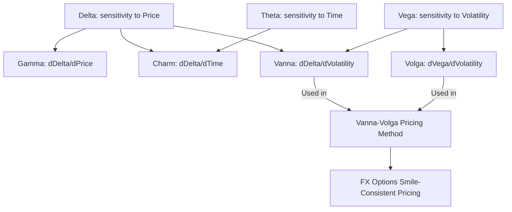

## Higher Order Greeks Vanna Volga and Charm

### Overview

Higher-order Greeks capture cross-sensitivities and second-order effects that the primary Greeks (Delta, Gamma, Theta, Vega, Rho) do not directly address. **Vanna**, **Volga (Vomma)**, and **Charm** are the three most practically important higher-order Greeks, each measuring how a first-order Greek changes with respect to a *different* risk factor than its own primary variable. These sensitivities become essential for accurately hedging books with significant volatility skew exposure, volatility-of-volatility risk, or time-decay drift in delta.

### Why Higher-Order Greeks Matter

**Key Points**

- Delta, Gamma, Theta, Vega, and Rho are all **first or second derivatives with respect to a single variable** (price, time, or volatility, taken alone)
- Higher-order Greeks are **cross-partial derivatives** — they measure how one Greek changes when a *different* underlying variable moves, capturing interaction effects the primary Greeks miss
- These cross-sensitivities matter most for portfolios with significant **skew risk** (Vanna), **volatility convexity risk** (Volga), or **time-based delta drift** (Charm) — situations common on exotic options desks, volatility arbitrage books, and FX options desks where the skew is often steep and actively traded

### Vanna

#### Definition

Vanna is the cross-sensitivity between Delta and volatility (equivalently, between Vega and the underlying price):

$$\text{Vanna} = \frac{\partial \Delta}{\partial \sigma} = \frac{\partial \mathcal{V}}{\partial S} = \frac{\partial^2 V}{\partial S \, \partial \sigma}$$

#### Formula Under Black-Scholes-Merton

$$\text{Vanna} = -e^{-qT} N'(d_1) \frac{d_2}{\sigma}$$

(for a non-dividend-paying underlying, set $q = 0$)

**Variable Definitions**

- $d_1, d_2$ — as defined in the standard BSM formula
- $N'(d_1)$ — standard normal probability density function
- $\sigma$ — volatility

**Key Points**

- Vanna is **identical for calls and puts** at the same strike and expiration, following the same put-call parity logic that makes Gamma and Vega symmetric
- Vanna measures how much a delta-hedge needs to be adjusted when implied volatility changes, without any change in the underlying price — critical for books with skewed volatility surfaces, since a shift in the overall volatility level can change the effective delta of every position even if spot hasn't moved
- Equivalently, Vanna measures how Vega changes as spot moves — relevant for understanding how a book's volatility exposure shifts as the underlying trends up or down
- Vanna changes sign around the strike: it is typically positive for OTM calls/ITM puts and negative for ITM calls/OTM puts (the exact sign pattern depends on the relationship between $d_1$ and $d_2$, i.e., on the sign of $d_2$)

#### Practical Application: Vanna and Skew Risk

**Key Points**

- FX options desks rely heavily on Vanna because FX implied volatility exhibits pronounced skew, and Vanna directly measures how that skew interacts with delta hedging as spot moves
- The **"Vanna-Volga" pricing method** used extensively in FX options markets adjusts Black-Scholes prices using market-observed prices of risk reversals (which isolate Vanna risk) and butterflies (which isolate Volga risk) to better match the observed volatility smile without requiring a full stochastic volatility model
- A position with significant negative Vanna can see its delta hedge become materially wrong if implied volatility spikes during a sharp market move — a common feature of crisis periods where both price and volatility move sharply together

### Volga (Vomma)

#### Definition

Volga (also called Vomma) is the second derivative of option value with respect to volatility — the convexity of Vega:

$$\text{Volga} = \frac{\partial \mathcal{V}}{\partial \sigma} = \frac{\partial^2 V}{\partial \sigma^2}$$

#### Formula Under Black-Scholes-Merton

$$\text{Volga} = \mathcal{V} \times \frac{d_1 d_2}{\sigma}$$

where $\mathcal{V}$ is the standard Vega (raw, non-scaled).

**Key Points**

- Volga is **identical for calls and puts** at the same strike and expiration, for the same put-call parity reasons as Gamma, Vega, and Vanna
- Volga is **positive for options away from the money** (both OTM and ITM, where $d_1 d_2 > 0$) and can be **negative near the money** (where $d_1$ and $d_2$ have opposite signs, i.e., the strike is between the two) — this creates a smile-shaped Volga profile across strikes, distinct from the single-peaked Gamma/Vega profile
- Volga measures sensitivity to **volatility-of-volatility** — a position with high Volga benefits from large swings in implied volatility in either direction, similar to how Gamma benefits from large price swings
- Positive Volga positions profit when realized volatility-of-volatility is high (implied volatility itself is unstable), independent of the direction of the volatility move

#### Practical Application: Volga and Smile Trading

**Key Points**

- Options traders use Volga to price and risk-manage the **convexity of the volatility smile itself** — essentially, Volga is to volatility what Gamma is to the underlying price
- **Butterfly spreads** in volatility trading (long wings, short body, calibrated to be Vega-neutral) are constructed specifically to isolate positive Volga exposure, profiting from the volatility smile steepening or volatility-of-volatility increasing
- The Vanna-Volga pricing methodology uses Volga-driven adjustments to properly price how the smile's curvature affects option values beyond what a flat-volatility Black-Scholes price would suggest

### Charm

#### Definition

Charm (also called Delta Decay or Delta Bleed) measures the rate of change of Delta with respect to the passage of time:

$$\text{Charm} = \frac{\partial \Delta}{\partial T} = \frac{\partial \Theta}{\partial S}$$

(conventionally expressed as $-\frac{\partial \Delta}{\partial t}$ where $t$ is calendar time, since $T$ decreases as calendar time advances)

#### Formula Under Black-Scholes-Merton

**For a non-dividend-paying underlying, for calls:**

$$\text{Charm}_{call} = -N'(d_1)\frac{2(r)T - d_2\sigma\sqrt{T}}{2T\sigma\sqrt{T}}$$

*(Note: exact formula presentation varies by textbook depending on sign/time conventions used; the essential quantity is the rate of change of Delta purely from time decay, holding price and volatility fixed.)*

**Key Points**

- Charm is generally **not identical for calls and puts** — unlike Gamma, Vega, and Vanna, Charm differs between calls and puts because Delta itself has different boundary behavior for calls (approaching 1 or 0) versus puts (approaching -1 or 0) as expiration nears
- Charm is most significant for **near-the-money options close to expiration**, where Delta is in the process of "resolving" toward 0 or ±1 rapidly as the outcome becomes more certain
- Charm matters practically for traders who **cannot rebalance continuously** — if a hedger sets a delta-hedge and does not rebalance for a day or more, Charm quantifies how much the "correct" hedge ratio will have drifted purely from time passing, even if the underlying price does not move at all

#### Practical Application: Charm and Weekend/Holiday Risk

**Key Points**

- Charm is particularly relevant around **weekends and holidays**, when significant calendar time passes without corresponding trading opportunities to rebalance — a position's delta can drift meaningfully over a weekend purely from time decay, requiring an adjustment at the next market open even if the underlying opens unchanged
- Market makers with large near-expiry ATM option positions monitor Charm closely in the final days before expiration, since delta hedge requirements can shift substantially day-to-day purely from time passing, compounding the gamma-driven hedging challenges already present near expiry (pin risk)

### Summary Table of Higher-Order Greeks

| Greek | Formal Definition | Calls = Puts? | Peak Location | Primary Use Case |
| --- | --- | --- | --- | --- |
| Vanna | $\partial\Delta/\partial\sigma = \partial\mathcal{V}/\partial S$ | Yes | Shifts sign around ATM | Skew risk, delta-hedge drift from vol changes |
| Volga | $\partial\mathcal{V}/\partial\sigma$ | Yes | Smile-shaped (higher away from ATM) | Vol-of-vol exposure, smile curvature trading |
| Charm | $\partial\Delta/\partial T$ | No | Largest near ATM close to expiry | Delta drift from time passing, weekend/holiday hedge risk |

### Worked Example: Vanna Calculation

**Example**

Compute the Vanna of an at-the-money call option with:

- $S_0 = \$100$, $K = \$100$, $r = 4\%$, $\sigma = 25\%$, $T = 0.25$ years, no dividends

Reusing $d_1 \approx 0.1425$, $d_2 \approx 0.0175$, $N'(d_1) \approx 0.3929$:

$$\text{Vanna} = -N'(d_1)\frac{d_2}{\sigma} = -0.3929 \times \frac{0.0175}{0.25} \approx -0.02750$$

**Output**

The Vanna is approximately **-0.0275**, meaning a 1-percentage-point increase in implied volatility would decrease this option's delta by roughly 0.000275 (scaling appropriately for the volatility point convention) — a small effect at this near-ATM, moderate-volatility example, but one that grows substantially for skewed, longer-dated, or more OTM/ITM positions.

### Visualizing the Higher-Order Greeks Relationships

### Vanna and Volga Profiles Across Strikes (svg_diagram)

<svg xmlns="http://www.w3.org/2000/svg" viewBox="0 0 700 320">
\<style\>
.lbl { font-family: sans-serif; font-size: 13px; fill: #1a1a1a; }
.small { font-family: sans-serif; font-size: 11px; fill: #444; }
.axis { stroke: #888; stroke-width: 1; }
.vanna { stroke: #2471a3; stroke-width: 2.5; fill: none; }
.volga { stroke: #c0392b; stroke-width: 2.5; fill: none; }
.zero { stroke: #aaa; stroke-width: 1; stroke-dasharray: 3,3; }
\</style\>
<text x="150" y="20" class="lbl" font-weight="bold">Vanna and Volga Profiles vs Strike (svg_diagram)</text>
<line x1="60" y1="270" x2="650" y2="270" class="axis" />
<line x1="60" y1="270" x2="60" y2="40" class="axis" />
<line x1="60" y1="170" x2="650" y2="170" class="zero" />
<text x="330" y="295" class="small">Strike (Low to High)</text>
<line x1="355" y1="270" x2="355" y2="40" class="zero" />
<text x="335" y="290" class="small">ATM</text>
<path class="vanna" d="M60,220 C200,240 320,175 355,170 C390,165 500,90 650,60" />
<text x="470" y="80" class="small" fill="#2471a3">Vanna (sign change near ATM)</text>
<path class="volga" d="M60,80 C200,140 320,220 355,225 C390,220 500,140 650,80" />
<text x="440" y="245" class="small" fill="#c0392b">Volga (dips near ATM)</text>
</svg>

### Practical Risk Management Applications

**Key Points**

- **Exotic options desks** (barriers, digitals, cliquets) rely heavily on higher-order Greeks because these products' payoffs are especially sensitive to skew and volatility-of-volatility dynamics that vanilla Delta/Gamma/Vega alone cannot capture
- **The Vanna-Volga method** is a widely used practitioner technique (particularly in FX options markets) for adjusting Black-Scholes prices to be consistent with the observed market smile, using the market prices of risk reversals (Vanna proxy) and butterflies (Volga proxy) as calibration inputs, without requiring a full stochastic volatility model calibration
- **Charm-adjusted hedging** is standard practice for desks holding large near-expiry positions over non-trading periods (weekends, holidays), where pre-emptively adjusting the hedge for expected charm-driven delta drift can reduce the size of the rebalancing trade needed at the next market open
- The practical magnitude and even sign of these higher-order Greeks can be sensitive to the specific volatility model used (Black-Scholes vs. local vol vs. stochastic vol), since Black-Scholes higher-order Greeks are derived under the flawed constant-volatility assumption — practitioners often use "smile-adjusted" or "sticky-strike/sticky-delta" variants of these Greeks that account for how implied volatility itself moves with the underlying **[Inference — the choice of smile dynamics assumption materially changes computed higher-order Greek values in practice]**

**Conclusion**

Vanna, Volga, and Charm extend the Greeks framework beyond first-order price, time, and volatility sensitivities into the cross-effects that matter most for skew risk, volatility convexity, and time-based delta drift. While often secondary to Delta, Gamma, Theta, and Vega for simple vanilla positions, these higher-order Greeks become essential risk management tools for FX options, exotic derivatives, and any book with meaningful exposure to the shape and dynamics of the volatility surface itself.

**Related Topics**

- The Vanna-Volga Pricing Method for FX Options
- Risk Reversals and Butterflies as Skew/Smile Trading Instruments
- Sticky Strike vs. Sticky Delta Volatility Smile Dynamics
- Exotic Options: Barriers, Digitals, and Path-Dependent Greeks
- Weekend and Holiday Theta/Charm Risk Management
- Speed and Color: Third-Order Price and Time Greeks
- Stochastic Volatility Models and Their Impact on Higher-Order Greeks
- Volatility Surface Calibration Using Market Skew Instruments