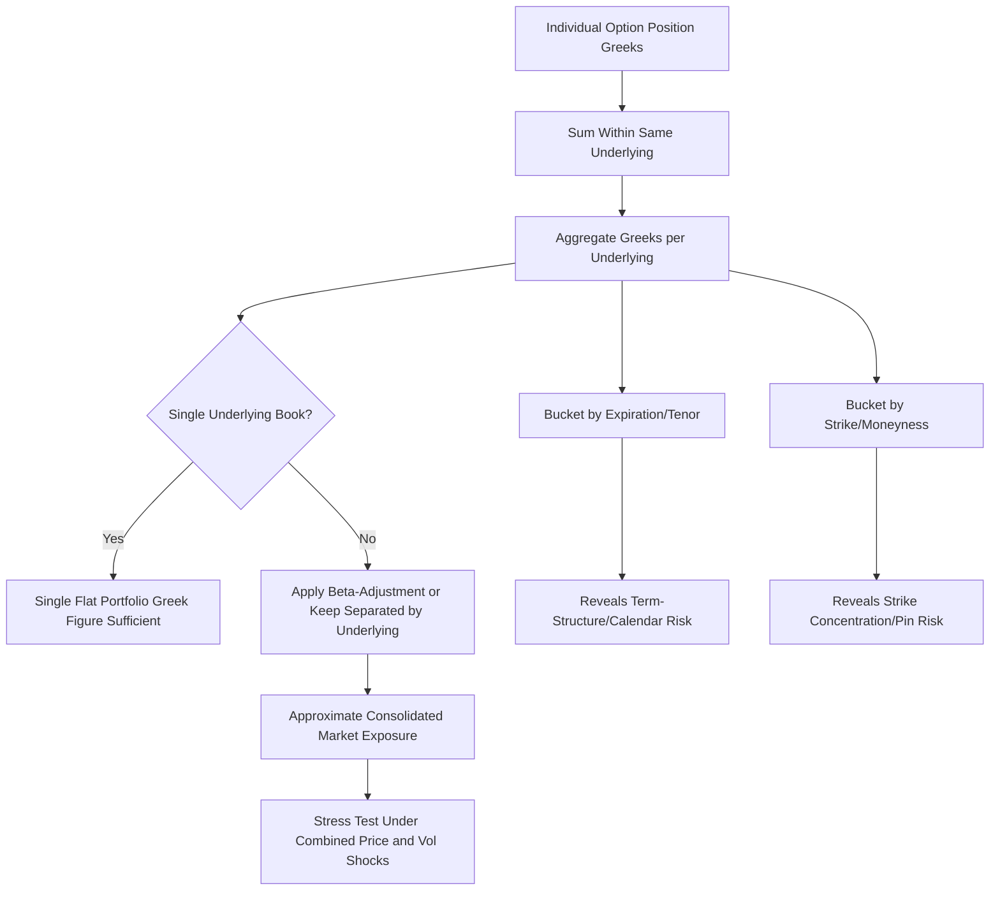

## Aggregating Greeks Across a Portfolio

### Overview

Portfolio-level Greeks aggregation is the practice of combining the risk sensitivities of individual option positions into a unified view of a book's total exposure to price, time, volatility, and rate movements. While each Greek is additive within the same underlying, real-world portfolios spanning multiple underlyings, expirations, and strikes require careful frameworks to avoid misleading netting effects and to surface concentrated risks that a single aggregate number can obscure.

### Why Aggregation Matters

**Key Points**

- Individual option Greeks are useful for pricing and hedging single positions, but risk managers and traders need to understand the **net exposure of an entire book** to make hedging and capital allocation decisions
- Naive aggregation (simply summing all Greeks across all positions) can be dangerously misleading when positions differ meaningfully in underlying, expiration, or strike, since offsetting Greeks can mask substantial risk concentrated in specific buckets
- Effective aggregation requires **multiple levels of granularity**: single-underlying aggregate, cross-underlying (correlated) exposure, and bucketed exposure by expiration/strike/tenor

### Basic Additivity Within a Single Underlying

**Key Points**

- For positions in the **same underlying asset**, each Greek is linearly additive across positions, scaled by quantity and contract multiplier:

$$\text{Portfolio Greek} = \sum_{i=1}^{n} (\text{quantity}_i \times \text{multiplier}_i \times \text{Greek}_i)$$

- This additivity holds because the Greeks are partial derivatives, and derivatives of a sum equal the sum of derivatives — the portfolio value is simply the sum of individual option values (for a given quantity), so differentiating the portfolio value with respect to any risk factor yields the sum of individual sensitivities
- This property holds for Delta, Gamma, Theta, Vega, and Rho, as well as all higher-order Greeks (Vanna, Volga, Charm), making portfolio-level Greek calculation computationally straightforward once individual position Greeks are known

### Worked Example: Simple Portfolio Aggregation

**Example**

A trader holds the following positions, all on the same underlying stock (each option contract represents 100 shares):

| Position | Quantity | Delta | Gamma | Theta (daily) | Vega |
| --- | --- | --- | --- | --- | --- |
| Long 10 calls | +10 | 0.55 | 0.031 | -0.032 | 0.196 |
| Short 5 calls (higher strike) | -5 | 0.30 | 0.025 | -0.028 | 0.170 |
| Long 20 shares of stock | +20 (shares, not contracts) | 1.00 | 0 | 0 | 0 |

Step 1 — Compute Delta contribution (contracts scaled by 100 shares, stock scaled by 1):

$$\Delta_{portfolio} = (10 \times 100 \times 0.55) + (-5 \times 100 \times 0.30) + (20 \times 1.00)$$

$$= 550 - 150 + 20 = 420$$

Step 2 — Compute Gamma contribution:

$$\Gamma_{portfolio} = (10 \times 100 \times 0.031) + (-5 \times 100 \times 0.025) + 0 = 31.0 - 12.5 = 18.5$$

Step 3 — Compute Theta contribution:

$$\Theta_{portfolio} = (10 \times 100 \times -0.032) + (-5 \times 100 \times -0.028) + 0 = -32.0 + 14.0 = -18.0$$

Step 4 — Compute Vega contribution:

$$\mathcal{V}_{portfolio} = (10 \times 100 \times 0.196) + (-5 \times 100 \times 0.170) + 0 = 196.0 - 85.0 = 111.0$$

**Output**

The portfolio has a net Delta of **+420** (equivalent to being long 420 shares directionally), positive Gamma of **18.5**, negative daily Theta of **-$18.00** (the book loses $18/day from time decay), and positive Vega of **$111** (the book gains $111 for each 1-point rise in implied volatility). This single set of numbers summarizes the portfolio's aggregate first-order risk exposure across three very different position types.

### The Limits of Simple Aggregation: Cross-Underlying Portfolios

**Key Points**

- When a portfolio spans **multiple underlyings**, Delta and Gamma cannot simply be summed into one meaningful number, since a Delta of +500 in Stock A and a Delta of -500 in unrelated Stock B do **not** net to a "flat" position — they represent two distinct directional bets, not an offsetting one
- Cross-underlying aggregation requires either: (a) keeping Greeks **separated by underlying**, or (b) converting to a common risk factor using **beta-adjusted delta** (scaling each position's delta by the underlying's correlation/beta to a reference index) to approximate net market exposure
- **Beta-weighted delta** is a common practitioner technique for equity portfolios: $\Delta_{beta-adjusted} = \Delta \times \frac{S_{stock}}{S_{index}} \times \beta_{stock}$, allowing deltas across different stocks to be expressed in index-equivalent terms for a rough aggregate market exposure figure — though this introduces basis risk since individual stocks do not move in perfect proportion to their historical beta **[Inference — beta is an estimated, time-varying parameter, so beta-adjusted aggregation is inherently approximate]**

### Bucketing by Expiration and Strike

**Key Points**

- Even within a single underlying, aggregating **Vega** into one flat number can obscure significant **term-structure risk** — a book might show zero net Vega while actually being long Vega in near-dated options and short Vega in far-dated options (a calendar spread structure), which behaves very differently than a genuinely flat-Vega book under a real-world volatility term-structure shift
- Similarly, aggregate **Gamma and Charm** can mask **strike concentration risk** — a book might show modest net Gamma while having enormous offsetting Gamma at two different strikes, creating "gamma cliffs" where the true hedging behavior changes sharply as spot approaches either strike
- Professional risk systems therefore report Greeks **bucketed by expiration** (e.g., 0-30 days, 30-90 days, 90-365 days, 365+ days) and often by **strike/moneyness band**, in addition to the single flat aggregate number, to reveal concentration risk that a single figure cannot show

### Portfolio-Level Risk Metrics Beyond Simple Sums

| Metric | What It Captures | Why Simple Sums Miss It |
| --- | --- | --- |
| Net Delta | Directional exposure | Sufficient if single underlying; misleading across correlated underlyings without beta adjustment |
| Net Gamma | Convexity exposure | Can mask offsetting strike-level concentration ("gamma cliffs") |
| Net Vega | Parallel volatility shift exposure | Masks term-structure (calendar) and skew (vanna/volga) risk |
| Net Theta | Aggregate time decay | Generally additive and reliable as a single figure |
| Vega by tenor bucket | Term-structure exposure | Reveals calendar-spread-like exposure hidden in flat Vega |
| Gamma/Delta by strike bucket | Concentration/pin risk | Reveals hedging cliffs near specific price levels |
| Cross-gamma (for multi-asset books) | Correlated convexity across underlyings | Not captured by single-underlying Greeks at all |

### Cross-Gamma and Correlation Risk

**Key Points**

- For portfolios involving options on **multiple correlated underlyings** (e.g., basket options, index options combined with single-stock options, or spread options), **cross-gamma** — the sensitivity of one underlying's delta to another underlying's price — becomes relevant and is not captured by summing single-asset Greeks at all
- Cross-gamma risk is especially important for **basket options, quanto options, and spread options**, where the payoff depends on the joint behavior of two or more underlyings, and correlation assumptions materially affect both pricing and hedging
- Standard single-asset Greeks frameworks do not natively address correlation risk; specialized multi-asset risk systems compute a full **Greeks matrix** (sensitivities to each pairwise combination of underlyings) for accurately hedging correlation-dependent products **[Inference — implementation specifics vary significantly by institution and product complexity]**

### Practical Portfolio Risk Management Workflow

**Key Points**

- **Step 1**: Calculate individual position Greeks for every option and underlying position in the book
- **Step 2**: Aggregate Greeks within each underlying (straightforward summation)
- **Step 3**: Bucket aggregated Greeks by expiration/tenor and by strike/moneyness to surface concentration risk
- **Step 4**: For multi-underlying books, either maintain separate per-underlying Greek reports or apply beta-adjustment/correlation-based methods for an approximate consolidated view
- **Step 5**: Set and monitor risk limits at multiple levels (single underlying, tenor bucket, portfolio aggregate) rather than relying solely on a single top-line number
- **Step 6**: Stress-test the portfolio under scenario shocks (e.g., a simultaneous spot move and volatility spike) to capture the second-order interaction effects (Gamma, Vanna, Volga) that simple linear Greek aggregation does not fully represent for large moves

### Visualizing the Aggregation Hierarchy

### Portfolio Greeks Dashboard Concept (svg_diagram)

<svg xmlns="http://www.w3.org/2000/svg" viewBox="0 0 700 340">
\<style\>
.lbl { font-family: sans-serif; font-size: 13px; fill: #1a1a1a; }
.small { font-family: sans-serif; font-size: 10px; fill: #444; }
.box { fill: #eef3f7; stroke: #2471a3; stroke-width: 1.5; }
.negbar { fill: #c0392b; }
.posbar { fill: #2471a3; }
\</style\>
<text x="180" y="20" class="lbl" font-weight="bold">Portfolio Greeks by Tenor Bucket (svg_diagram)</text>
<rect x="50" y="40" width="600" height="270" class="box" fill="none" />
<text x="60" y="60" class="small">Vega Exposure</text>
<line x1="60" y1="150" x2="640" y2="150" stroke="#888" />
<rect x="90" y="100" width="60" height="50" class="posbar" />
<text x="85" y="165" class="small">0-30d</text>
<rect x="200" y="150" width="60" height="40" class="negbar" />
<text x="195" y="205" class="small">30-90d</text>
<rect x="310" y="90" width="60" height="60" class="posbar" />
<text x="300" y="165" class="small">90-180d</text>
<rect x="420" y="150" width="60" height="70" class="negbar" />
<text x="405" y="235" class="small">180-365d</text>
<rect x="530" y="115" width="60" height="35" class="posbar" />
<text x="515" y="165" class="small">365d+</text>
<text x="150" y="290" class="small" fill="#444">Net Vega may appear near zero, but each bucket carries real term-structure risk</text>
</svg>

### Practical Applications and Institutional Practice

**Key Points**

- Investment banks and options market-making desks run real-time **Greeks aggregation dashboards** across thousands of positions, typically refreshed continuously as prices, volatilities, and time evolve
- Risk limits are commonly set at multiple layers: **desk-level** (aggregate across all traders), **trader-level** (individual book), and **strategy-level** (e.g., limits specific to a volatility arbitrage strategy within a larger book)
- Basel and other regulatory capital frameworks for market risk often require banks to compute and report aggregated Greeks-based sensitivities (or full revaluation-based stress measures) as part of standardized or internal-model capital calculations for their trading books **[Unverified — specific regulatory computation requirements vary by jurisdiction and framework version; consult current regulatory text for compliance purposes]**
- Behavior of aggregated Greeks during periods of market stress can diverge from calm-market expectations, since correlations between underlyings and between spot and implied volatility often shift (typically increasing) during crises, undermining the assumptions behind beta-adjustment and other approximate aggregation methods **[Inference]**

**Conclusion**

Aggregating Greeks across a portfolio extends the single-option Greeks framework into a practical risk management discipline. While Greeks are mathematically additive within a single underlying, meaningful multi-underlying and multi-tenor aggregation requires careful bucketing, beta-adjustment, or correlation-aware frameworks to avoid the false comfort of a flat aggregate number that masks concentrated directional, convexity, or term-structure risk.

**Related Topics**

- Beta-Weighted Delta and Cross-Asset Risk Aggregation
- Vega Term-Structure Risk and Calendar Spread Exposure
- Cross-Gamma and Multi-Asset Correlation Risk
- Basket Options, Quanto Options, and Spread Option Greeks
- Scenario Analysis and Stress Testing for Options Portfolios
- Value-at-Risk vs. Greeks-Based Risk Measures
- Regulatory Capital Frameworks for Trading Book Market Risk
- Real-Time Risk Systems Architecture for Options Market Making