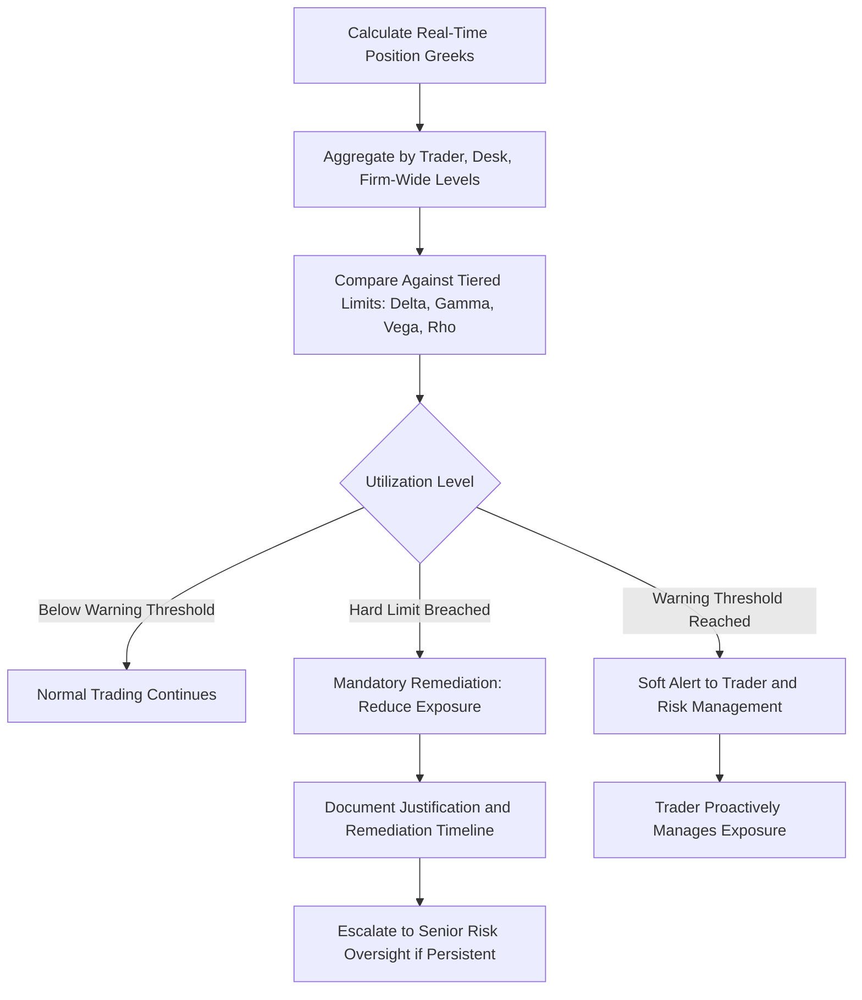

## Using Greeks to Set Risk Limits

### Overview

Risk limits built on the Greeks translate abstract sensitivity measures into concrete, enforceable boundaries on trading activity. Rather than relying solely on notional exposure or Value-at-Risk, options desks and risk management functions set explicit caps on Delta, Gamma, Theta, and Vega (and sometimes Rho and higher-order Greeks) to control the specific risk dimensions that matter most for derivatives portfolios. Effective limit-setting requires understanding both the mechanics of each Greek and the practical trade-offs between overly restrictive limits (which stifle legitimate market-making and trading activity) and overly loose limits (which permit dangerous risk concentration).

### Why Greeks-Based Limits Are Necessary

**Key Points**

- Notional exposure alone is a poor risk measure for options — a deep OTM option with $10 million notional carries far less risk than an ATM option with the same notional, since their Deltas, Gammas, and Vegas differ enormously
- Value-at-Risk (VaR) measures aggregate potential loss but can obscure the *specific* risk dimension driving that loss (price risk vs. volatility risk vs. time decay), making it harder to identify which position or risk factor to reduce when a limit breach occurs
- Greeks-based limits allow risk managers to control **each risk dimension independently** — a trader might be allowed significant Delta risk but tightly constrained Vega risk, reflecting a firm's specific risk appetite and the trader's mandate
- Greeks limits are also **forward-looking and instantaneous**, updating in real time as the market moves, unlike historical VaR measures that rely on backward-looking data

### Common Categories of Greeks-Based Limits

#### Delta Limits

**Key Points**

- Delta limits cap the **net directional exposure** a trader or desk can carry, typically expressed as a maximum dollar-equivalent or share-equivalent position (e.g., "no more than $5 million of net delta in Stock XYZ")
- Delta limits are usually the most intuitive and widely applied limit, since they map directly to a familiar concept: how much the position behaves like outright ownership (or short-selling) of the underlying
- Desks may set both **gross delta limits** (sum of absolute values across positions, capturing total directional "activity") and **net delta limits** (sum with sign, capturing actual directional bias), since a book can have large offsetting gross delta with small net delta

#### Gamma Limits

**Key Points**

- Gamma limits cap the **rate at which Delta can change**, controlling how quickly a position's directional exposure can shift with underlying price moves
- Gamma limits are critical for controlling **rebalancing risk** — a trader with excessive negative Gamma may find their hedges becoming rapidly inadequate during a fast market move, well before they can react
- Because Gamma spikes dramatically for at-the-money, near-expiry options, Gamma limits often become the **binding constraint** in the final days before expiration, even for positions that were comfortably within limits weeks earlier
- Gamma limits are commonly expressed per underlying and per expiration bucket, since aggregate Gamma across different tenors can mask concentration in a single near-dated expiration

#### Vega Limits

**Key Points**

- Vega limits cap exposure to changes in implied volatility, typically expressed as a dollar amount per volatility point (e.g., "no more than $50,000 of net Vega")
- Vega limits are especially important because implied volatility can move sharply and unpredictably during market stress, and unlike Delta (which can often be hedged relatively cheaply and continuously with the underlying), Vega exposure is harder to hedge precisely, since it requires other options rather than the underlying itself
- Vega limits are frequently set **by tenor bucket** in addition to an aggregate figure, to prevent a desk from running large offsetting long/short Vega positions across different expirations that net to a deceptively small aggregate number

#### Theta Limits

**Key Points**

- Theta is less commonly subject to hard limits in the same way as Delta, Gamma, and Vega, since positive Theta (time decay income) is often a desired outcome of market-making and premium-selling strategies rather than a risk to be capped
- However, **excessive negative Theta** (a book bleeding significant value purely from time decay) may trigger review, since it can indicate the desk is paying heavily for optionality that may not be justified by the trading thesis
- Theta is more often monitored as a **P&L attribution tool** (comparing actual daily P&L to expected Theta-driven decay) than as a hard limit in its own right

#### Rho Limits

**Key Points**

- Rho limits are typically only material for desks trading long-dated options, fixed income derivatives, or FX options with significant dual-rate exposure, and are often omitted entirely for short-dated equity options desks where Rho's impact on P&L is negligible
- When applied, Rho limits function analogously to Vega limits — capping dollar sensitivity per basis point or percentage-point change in the relevant interest rate

### Multi-Level Limit Structures

**Key Points**

- Risk limits are typically applied at **multiple organizational levels simultaneously**: individual trader, trading desk, and firm-wide aggregate, with limits generally tightening in relative terms at higher levels of aggregation (a firm-wide Vega limit is not simply the sum of all individual trader limits, since correlated risk-taking across traders is itself a risk to be managed)
- **Tenor-bucketed limits** (e.g., separate Vega limits for 0-30 day, 30-90 day, 90-365 day, and 365+ day expirations) prevent a trader from running large directional bets on the volatility term structure while appearing flat on an aggregate basis
- **Strike/moneyness-bucketed limits** for Gamma and Delta help control concentration risk near specific price levels, particularly important for large open-interest strikes near major expirations

### Worked Example: Limit Monitoring Scenario

**Example**

A trading desk has the following limits and current exposures on a single underlying:

| Greek | Limit | Current Exposure | Utilization |
| --- | --- | --- | --- |
| Net Delta | ±$10,000,000 | $7,200,000 | 72% |
| Net Gamma (per $1 move) | ±$500,000 | $410,000 | 82% |
| Net Vega (per vol point) | ±$300,000 | $295,000 | 98.3% |
| Net Theta (daily) | No hard limit (monitored) | -$45,000 | N/A |

**Output**

The desk is approaching its Vega limit (98.3% utilized) while having more headroom on Delta (72%) and Gamma (82%). A risk manager reviewing this dashboard would likely flag the Vega exposure as the binding constraint, potentially requiring the trader to reduce Vega-heavy positions (e.g., trim long-dated option positions) before adding new volatility exposure, even though Delta and Gamma capacity remain available. This illustrates why single-dimension monitoring (e.g., only tracking Delta) would have missed the actual binding risk constraint.

### Setting Limit Levels: Practical Considerations

**Key Points**

- Limit levels are typically calibrated based on: the desk's capital allocation, historical P&L volatility, the liquidity of the underlying and its options (affecting how quickly a position can be reduced if needed), and the firm's overall risk appetite
- **Stress-tested limits** incorporate scenario analysis — setting limits not just on current Greek exposure but on the *projected* Greek exposure and P&L impact under specified shock scenarios (e.g., a 10% price move combined with a 5-volatility-point spike), since linear Greek limits alone do not capture how Gamma and Vanna cause exposures to change under large moves
- Limits are typically **reviewed and recalibrated periodically** (quarterly or after significant market events) rather than treated as permanently fixed, reflecting changes in market conditions, desk mandate, and realized risk-taking patterns **[Inference — recalibration frequency and triggers vary substantially by institution and regulatory regime]**

### Breach Escalation and Governance

**Key Points**

- Limit breaches typically trigger **automated alerts** to both the trader and risk management, often with tiered severity (e.g., a "soft" warning at 90% utilization and a "hard" breach requiring immediate action at 100%+)
- Governance frameworks generally require **documented justification and remediation plans** for any limit breach, along with a defined timeline for returning to within-limit exposure (e.g., "reduce Vega to within limit by end of trading day")
- Persistent or repeated breaches typically escalate to more senior risk oversight and may result in **temporarily reduced limits** or increased margin/capital requirements for the trader or desk in question
- The specific governance process, escalation thresholds, and remediation timelines vary considerably across institutions and are generally governed by internal risk policy rather than a universal industry standard **[Unverified — internal risk governance frameworks are firm-specific and not standardized across the industry]**

### Interaction Between Greeks Limits and Trading Strategy

**Key Points**

- Market makers providing continuous two-sided quotes often require **looser Gamma and Vega limits relative to their notional flow**, since their business model inherently involves absorbing customer order flow and temporarily carrying resulting Greek exposures until they can be hedged or offset
- **Proprietary volatility trading desks** (running directional views on implied vs. realized volatility) typically operate under **tighter Delta limits** (since they aim to be primarily volatility-exposed, not direction-exposed) but may be allowed comparatively larger Vega limits reflecting their core mandate
- This differentiation illustrates that Greeks limits are not one-size-fits-all figures, but are tailored to each desk's specific risk-taking mandate and the risk dimensions central to its strategy

### Visualizing the Limit-Setting and Monitoring Framework

### Risk Limit Dashboard Concept (svg_diagram)

<svg xmlns="http://www.w3.org/2000/svg" viewBox="0 0 700 300">
\<style\>
.lbl { font-family: sans-serif; font-size: 13px; fill: #1a1a1a; }
.small { font-family: sans-serif; font-size: 11px; fill: #444; }
.barbg { fill: #eef3f7; stroke: #ccc; stroke-width: 1; }
.barfill_ok { fill: #2471a3; }
.barfill_warn { fill: #d68910; }
.barfill_breach { fill: #c0392b; }
\</style\>
<text x="200" y="20" class="lbl" font-weight="bold">Greeks Limit Utilization Dashboard (svg_diagram)</text>
<text x="60" y="55" class="small">Delta (72%)</text>
<rect x="150" y="42" width="450" height="18" class="barbg" />
<rect x="150" y="42" width="324" height="18" class="barfill_ok" />
<text x="60" y="95" class="small">Gamma (82%)</text>
<rect x="150" y="82" width="450" height="18" class="barbg" />
<rect x="150" y="82" width="369" height="18" class="barfill_warn" />
<text x="60" y="135" class="small">Vega (98%)</text>
<rect x="150" y="122" width="450" height="18" class="barbg" />
<rect x="150" y="122" width="441" height="18" class="barfill_breach" />
<text x="60" y="175" class="small">Theta (monitored)</text>
<rect x="150" y="162" width="450" height="18" class="barbg" />
<rect x="150" y="162" width="180" height="18" class="barfill_ok" />
<text x="150" y="220" class="small" fill="#444">Vega is the binding constraint despite Delta and Gamma headroom remaining</text>
</svg>

### Practical Applications and Institutional Practice

**Key Points**

- Real-time risk systems at options market-making firms and derivatives desks continuously recompute Greeks and compare against limits, often with dashboards refreshed on a sub-second to few-second basis for actively traded books
- Risk limits based on Greeks work in conjunction with, rather than as a replacement for, other risk measures like VaR, stress testing, and stop-loss P&L triggers — a comprehensive risk framework layers multiple complementary measures rather than relying on any single approach
- New trading strategies or newly listed instruments typically require **explicit limit approval** before significant position-building, ensuring risk management has assessed the relevant Greek sensitivities before large exposures accumulate
- The effectiveness of Greeks-based limits depends heavily on the accuracy of the underlying pricing model generating those Greeks — if the model materially misprices skew, term structure, or jump risk, the Greeks feeding the limit framework will understate true exposure, a form of **model risk within the risk-management process itself [Inference]**

**Conclusion**

Greeks-based risk limits translate the mathematical sensitivities of Delta, Gamma, Theta, Vega, and Rho into practical, enforceable controls on trading risk. By setting limits across multiple dimensions, tenor buckets, and organizational levels — rather than relying on a single aggregate measure — risk managers can identify the specific binding constraint on a book's risk-taking and ensure that concentrated exposures in any one dimension (directional, convexity, volatility, or rate risk) are caught and addressed before they produce outsized losses.

**Related Topics**

- Value-at-Risk and Its Relationship to Greeks-Based Limits
- Stress Testing and Scenario Analysis for Options Books
- Model Risk Management in Derivatives Pricing and Risk Systems
- Market-Making Risk Mandates vs. Proprietary Trading Mandates
- Tenor-Bucketed and Strike-Bucketed Risk Reporting
- Regulatory Capital Requirements for Trading Book Market Risk
- Real-Time Risk Systems Architecture for Derivatives Desks
- Governance and Escalation Frameworks for Limit Breaches