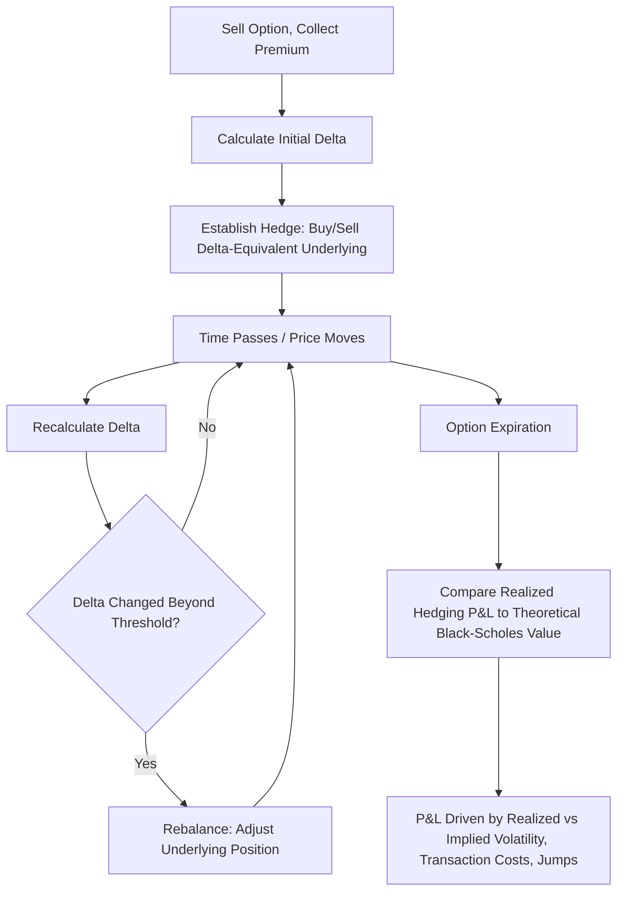

## Delta Hedging in Theory and Practice

### Overview

Delta hedging is the practice of offsetting an option position's directional exposure by holding an appropriately sized position in the underlying asset. In the idealized Black-Scholes-Merton world, continuous delta hedging allows an option writer to perfectly replicate the option's payoff, eliminating risk and earning exactly the risk-free rate. In practice, discrete rebalancing, transaction costs, and model imperfections mean delta hedging is an approximation that reduces but never fully eliminates risk.

### Theoretical Foundation: The Replication Argument

**Key Points**

- The Black-Scholes-Merton derivation itself rests on a delta-hedging argument: a portfolio consisting of a short option position and a long position of $\Delta$ shares of the underlying is instantaneously **riskless**, since small price changes in the option are exactly offset by small price changes in the hedge
- Because this hedged portfolio is riskless over an infinitesimal time interval, no-arbitrage requires it to earn exactly the risk-free rate — this condition, applied continuously, is what generates the Black-Scholes partial differential equation
- This is the theoretical basis for **dynamic replication**: by continuously trading the underlying according to the option's changing Delta, a trader can synthetically recreate the option's exact payoff without ever holding the option itself

### The Delta-Hedged Portfolio

For a trader who has **sold** a call option, the delta-hedged portfolio consists of:

$$\Pi = -C + \Delta \times S$$

where $\Delta = N(d_1)$ (for a non-dividend-paying underlying).

**Key Points**

- The trader is short the option (having sold it and collected the premium) and long $\Delta$ shares of stock as an offsetting hedge
- If the stock price rises, the loss on the short call position is offset by the gain on the long stock position (and vice versa if the stock falls) — for small moves, this offset is exact
- This hedge must be **continuously rebalanced** as $\Delta$ changes with the stock price and with the passage of time, since the option is short Gamma (a short call has negative Gamma) — meaning Delta itself is not static

### Continuous vs. Discrete Hedging

**Key Points**

- The Black-Scholes model assumes hedging occurs **continuously**, with the hedge ratio adjusted instantaneously as the underlying price moves — an idealization that is not achievable in real markets due to trading costs and operational constraints
- In practice, hedgers rebalance at **discrete intervals**: fixed calendar intervals (e.g., daily, hourly), price-triggered intervals (rebalance whenever Delta drifts beyond a threshold), or a hybrid of both
- The gap between continuous and discrete hedging introduces **hedging error** — the realized P&L of a discretely-hedged position will deviate from the theoretical Black-Scholes value, with the deviation driven by the interaction between Gamma and the size of the price moves between rebalancing points

### The Mechanics of Discrete Delta Hedging

**Key Points**

- At each rebalancing point, the hedger calculates the current Delta of the option position and adjusts the underlying holding to match
- If Delta has increased (e.g., the stock has risen for a short call position), the hedger must **buy more shares** to maintain the hedge
- If Delta has decreased (e.g., the stock has fallen), the hedger must **sell shares** to reduce the hedge
- For a short-option, long-underlying hedge (short Gamma position), this rebalancing pattern is **"buy high, sell low"** — the hedger is forced to buy after the price rises and sell after it falls, which is a source of cost/loss for the delta hedger and is the mirror image of "gamma scalping" profits earned by a long-gamma position

### Worked Example: Discrete Rebalancing

**Example**

A trader sells one call option (100 shares per contract) with initial Delta = 0.50, requiring an initial hedge of 50 shares long. Over the next day, the stock rises and the option's Delta increases to 0.58.

Step 1 — Initial hedge: Long 50 shares (against short 1 call contract)

Step 2 — New required hedge: $0.58 \times 100 = 58$ shares

Step 3 — Rebalancing trade: Buy $58 - 50 = 8$ additional shares

**Output**

The trader must buy 8 more shares to remain delta-hedged after the stock price increase. If the stock had instead fallen and Delta dropped to 0.42, the trader would need to sell $50 - 42 = 8$ shares. This buy-after-rise, sell-after-fall pattern is the structural cost embedded in hedging a short-gamma position, and it recurs at every rebalancing point throughout the option's life.

### Sources of Hedging Error and Cost

**Key Points**

- **Discrete rebalancing (Gamma-driven slippage)**: the primary source of hedging error, since Delta is only exactly correct at the moment of rebalancing and drifts between rebalances as the underlying moves — larger Gamma and larger price moves between rebalances both increase this error
- **Transaction costs**: every rebalancing trade incurs bid-ask spread costs and/or commissions, which accumulate over the life of the option and directly erode hedging P&L; more frequent rebalancing reduces Gamma-driven slippage but increases cumulative transaction costs, creating a fundamental **trade-off in choosing rebalancing frequency**
- **Volatility mis-estimation**: if the volatility used to compute Delta differs from the volatility that is subsequently realized, the hedge will be systematically miscalibrated — hedging with an incorrect implied volatility input produces a hedge ratio that does not match the "true" option sensitivity under the actual (different) volatility regime
- **Jumps and gaps**: sudden, discontinuous price moves (news events, gap opens after market closure) can move the underlying past the point where the existing hedge remains even approximately correct, producing hedging losses that no amount of discrete rebalancing frequency can fully prevent

### The P&L of a Delta-Hedged Position

**Key Points**

- The realized P&L of a delta-hedged short option position over a hedging interval can be decomposed (approximately) into:

$$\text{P\&L} \approx \Theta \, dt + \frac{1}{2}\Gamma (dS)^2 + \text{transaction costs}$$

- Since the hedger is short the option, $\Theta$ contribution is **positive** (theta income for the seller) while the $\Gamma$ term contribution is **negative** (the seller is short gamma, so realized price variance hurts them)
- This decomposition reveals the central mechanic of delta-hedged option selling: the seller earns Theta as compensation for bearing Gamma risk, and the position's overall profitability depends on whether **realized volatility** (embedded in the $(dS)^2$ term) comes in below the **implied volatility** that was used to price the option and set the Theta collected
- This is the same underlying principle discussed in the Gamma-Theta trade-off, but the delta-hedging P&L decomposition makes explicit how realized volatility (not just implied volatility level) determines actual hedging profitability

### Rebalancing Frequency Trade-offs

| Rebalancing Frequency | Hedging Error (Gamma slippage) | Transaction Costs | Practical Use Case |
| --- | --- | --- | --- |
| Continuous (theoretical) | Zero | Infinite (impractical) | Theoretical benchmark only |
| Very frequent (e.g., every few minutes) | Very low | High | High-frequency market-making desks with low per-trade costs |
| Daily | Moderate | Moderate | Standard practice for many options desks |
| Weekly or threshold-based | Higher | Lower | Cost-sensitive strategies, less liquid underlyings |

**Key Points**

- **Leland's model** formally addresses this trade-off by showing that discrete hedging with transaction costs can be approximated by using an **adjusted (higher) volatility** in the Black-Scholes formula, which compensates the option seller for the expected cost of discrete rebalancing
- **Threshold-based (band) rebalancing** — rebalancing only when Delta drifts beyond a specified band rather than at fixed time intervals — is a common practical alternative that can reduce unnecessary trading during low-volatility periods while still controlling maximum hedging error

### Delta Hedging with Other Instruments

**Key Points**

- While delta hedging is often described using the underlying stock, it can also be implemented using **futures, other options, or a combination of instruments**, particularly when direct trading in the underlying is costly, restricted, or less liquid than derivative alternatives
- **Cross-hedging** — hedging with a related but not identical instrument (e.g., hedging a single-stock option with index futures) — introduces **basis risk**, since the hedge instrument's price does not move in perfect lockstep with the actual underlying
- Hedging with other options (rather than the underlying) allows simultaneous management of both Delta and Gamma, since options carry their own Gamma exposure, unlike the underlying (which has zero Gamma) — this is the basis of **Gamma hedging** as a complement to Delta hedging

### Practical Challenges in Real-World Delta Hedging

**Key Points**

- **Liquidity constraints**: for large positions or illiquid underlyings, executing the required rebalancing trade without significant market impact can be difficult, effectively increasing the real transaction cost beyond the quoted bid-ask spread
- **Operational and system latency**: real-time Greek recalculation and trade execution require robust infrastructure; delays between calculating the required hedge and executing it introduce additional slippage, especially in fast-moving markets
- **Dividend and corporate action risk**: unexpected dividend changes, stock splits, or other corporate actions can require off-cycle hedge adjustments beyond routine rebalancing
- **Weekend and overnight gap risk**: since markets are not continuously open, positions carry unhedgeable gap risk over non-trading periods, which interacts with the Charm-driven delta drift discussed in the higher-order Greeks context
- Real-world hedging performance can deviate meaningfully from theoretical Black-Scholes P&L expectations, and the magnitude of this deviation depends on the specific combination of rebalancing frequency, transaction cost structure, and realized volatility and jump behavior of the underlying during the hedging period **[Inference]**

### Visualizing the Delta Hedging Cycle

### Discrete Hedging Error Illustration (svg_diagram)

<svg viewBox="0 0 700 320" xmlns="http://www.w3.org/2000/svg">
\<style\>
.lbl { font-family: sans-serif; font-size: 13px; fill: #1a1a1a; }
.small { font-family: sans-serif; font-size: 11px; fill: #444; }
.axis { stroke: #888; stroke-width: 1; }
.theoretical { stroke: #2471a3; stroke-width: 2; fill: none; stroke-dasharray: 5,3; }
.discrete { stroke: #c0392b; stroke-width: 2; fill: none; }
.point { fill: #c0392b; }
\</style\>
<text x="150" y="20" class="lbl" font-weight="bold">Continuous vs Discrete Delta-Hedge P&L Path (svg_diagram)</text>
<line x1="60" y1="270" x2="650" y2="270" class="axis"/>
<line x1="60" y1="270" x2="60" y2="40" class="axis"/>
<text x="300" y="295" class="small">Time</text>
<text x="15" y="150" class="small" transform="rotate(-90 15 150)">Hedge P&L</text>
<path class="theoretical" d="M60,200 C200,190 400,170 650,150"/>
<text x="500" y="130" class="small" fill="#2471a3">Theoretical continuous hedge P&L</text>
<path class="discrete" d="M60,200 L150,210 L150,195 L250,225 L250,205 L350,180 L350,165 L450,190 L450,175 L550,160 L550,145 L650,150"/>
<circle cx="150" cy="195" r="3" class="point"/>
<circle cx="250" cy="205" r="3" class="point"/>
<circle cx="350" cy="165" r="3" class="point"/>
<circle cx="450" cy="175" r="3" class="point"/>
<circle cx="550" cy="145" r="3" class="point"/>
<text x="400" y="240" class="small" fill="#c0392b">Discrete rebalancing points create P&L noise around theoretical path</text>
</svg>

### Practical Applications and Industry Use

**Key Points**

- **Options market makers** delta-hedge continuously (as close to real-time as operationally feasible) as their core risk management practice, since their business model depends on capturing bid-ask spread income while remaining approximately directionally neutral
- **Structured products desks** delta-hedge complex payoffs (embedded in notes and structured deposits) using vanilla options and the underlying, often employing more sophisticated hedging techniques for path-dependent or barrier features
- **Portfolio insurance strategies** (historically significant, e.g., in the context of the 1987 market crash) use dynamic delta hedging with index futures to synthetically replicate protective put payoffs without directly purchasing options — a strategy whose systemic effects during large, fast market declines have been extensively studied and debated
- Modern algorithmic and automated hedging systems execute delta-hedging strategies with minimal latency, but the fundamental theoretical trade-offs (rebalancing frequency vs. transaction cost vs. realized volatility exposure) remain unchanged regardless of execution technology **[Inference]**

**Conclusion**

Delta hedging translates the theoretical replication argument underlying Black-Scholes-Merton into a practical risk management technique, but the gap between continuous theoretical hedging and discrete real-world rebalancing introduces unavoidable hedging error. Understanding this gap — driven by Gamma, transaction costs, volatility mis-estimation, and jump risk — is essential for correctly pricing options (via appropriate volatility and cost adjustments) and for managing the real economic risk of any delta-hedged options book.

**Related Topics**

- Gamma Scalping and the Economics of Long-Gamma Positions
- Leland's Model: Adjusted Volatility for Transaction Costs
- Portfolio Insurance and Synthetic Put Replication
- Realized vs. Implied Volatility and Hedging Profitability
- Basis Risk in Cross-Hedging with Futures or Related Instruments
- Threshold-Based (Band) Rebalancing Strategies
- Gamma Hedging Using Other Options
- Market Making Economics and Bid-Ask Spread Capture