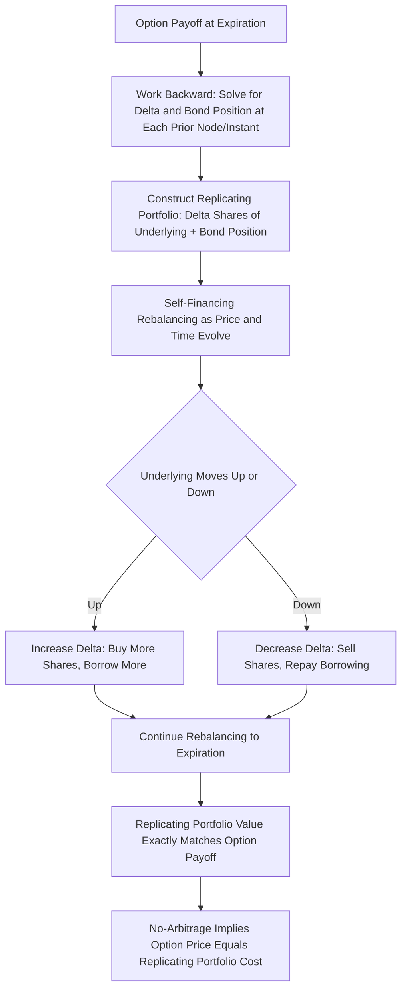

## Dynamic Replication of Option Payoffs

### Overview

Dynamic replication is the theoretical and practical foundation underlying option pricing: the idea that an option's payoff can be synthetically recreated by continuously trading a portfolio of the underlying asset and a risk-free bond, with the trading strategy adjusted according to the option's changing Delta. This replication argument is what allows options to be priced by no-arbitrage rather than by direct supply-and-demand or utility-based valuation, and it generalizes far beyond simple vanilla options into a framework for synthesizing arbitrary payoffs.

### The Core Replication Principle

**Key Points**

- A **self-financing trading strategy** in the underlying asset and a risk-free bond, rebalanced continuously according to the option's Delta, can exactly reproduce the option's terminal payoff under the Black-Scholes-Merton assumptions
- "Self-financing" means that after the initial cost of setting up the replicating portfolio, no additional cash is ever added or withdrawn — all subsequent rebalancing is funded purely by the existing portfolio's own value (buying more of the underlying is financed by borrowing, selling is financed by lending/repaying)
- Because the replicating portfolio and the option produce **identical payoffs in every possible future state**, the no-arbitrage principle dictates that they must have the **same price today** — this equivalence is the entire basis for the Black-Scholes-Merton pricing formula, not an independent assumption layered on top of it

### The Replicating Portfolio Construction

At any point in time, the replicating portfolio for a call option consists of:

$$\Pi_{replicating} = \Delta \times S - B$$

where:

- $\Delta \times S$ — a position of $\Delta$ shares of the underlying (long)
- $B$ — an amount borrowed at the risk-free rate (short the risk-free bond)

**Key Points**

- The specific quantities $\Delta$ and $B$ are continuously adjusted as $S$, $t$, and implicitly $\sigma$ evolve, always maintaining $\Pi_{replicating} = C$ (the theoretical option value) at every instant
- As the underlying rises, $\Delta$ increases, requiring the replicator to buy more shares — financed by borrowing more (increasing $B$)
- As the underlying falls, $\Delta$ decreases, requiring the replicator to sell shares — using the proceeds to pay down the borrowed amount (decreasing $B$)
- At expiration, the replicating portfolio's value exactly matches the option's payoff: $\max(S_T - K, 0)$ for a call

### Derivation Logic: From Replication to the PDE

**Key Points**

- Constructing a hedged portfolio (short one option, long $\Delta$ shares) that is instantaneously riskless, and requiring that riskless portfolio to earn the risk-free rate (no-arbitrage), directly yields the **Black-Scholes partial differential equation**:

$$\frac{\partial V}{\partial t} + rS\frac{\partial V}{\partial S} + \frac{1}{2}\sigma^2 S^2 \frac{\partial^2 V}{\partial S^2} = rV$$

- This PDE, combined with the appropriate boundary condition (the option's terminal payoff), has the closed-form Black-Scholes solution as its unique answer for European calls and puts
- The key conceptual insight is that **the replication argument and the PDE are two expressions of the same underlying idea** — dynamic replication is not merely a hedging technique applied *after* the fact to a price derived some other way; it is the mechanism that *generates* the price in the first place

### Replication Under Discrete Time (Binomial Model Intuition)

**Key Points**

- The **binomial option pricing model** (Cox-Ross-Rubinstein) provides the clearest intuitive illustration of replication in discrete time: at each node of the tree, a portfolio of $\Delta$ shares and a bond position can be constructed to exactly match the option's payoff in both the up-state and down-state at the next time step
- Solving for $\Delta$ and the bond position at each node, and working backward from the terminal payoffs to the present, recovers the option's price without ever needing to know the *actual* probability of up or down moves — only the **risk-neutral probability** implied by the no-arbitrage replication condition matters
- As the number of time steps in the binomial tree increases (time intervals shrink toward continuous time), the binomial model converges to the Black-Scholes continuous-time solution, illustrating how discrete replication becomes continuous replication in the limit

### Worked Example: One-Step Binomial Replication

**Example**

A stock currently trades at $S_0 = \$100$. Over one period, it will move to either $S_u = \$110$ (up) or $S_d = \$90$ (down). A call option with strike $K = \$100$ pays $C_u = \$10$ in the up state and $C_d = \$0$ in the down state. The risk-free rate over the period is 2%.

Step 1 — Solve for the replicating Delta (shares needed):

$$\Delta = \frac{C_u - C_d}{S_u - S_d} = \frac{10 - 0}{110 - 90} = \frac{10}{20} = 0.5$$

Step 2 — Solve for the bond position $B$ using the down-state (portfolio value must match option payoff):

$$\Delta \times S_d - B(1+r) = C_d$$

$$0.5 \times 90 - B(1.02) = 0$$

$$45 = 1.02B \implies B \approx 44.12$$

Step 3 — Verify with the up-state:

$$\Delta \times S_u - B(1+r) = 0.5 \times 110 - 44.12 \times 1.02 = 55 - 45.00 \approx 10 \checkmark$$

Step 4 — Compute the option price today (cost of the replicating portfolio):

$$C_0 = \Delta \times S_0 - B = 0.5 \times 100 - 44.12 = 50 - 44.12 = \$5.88$$

**Output**

The replicating portfolio — long 0.5 shares and borrowing $44.12 — exactly reproduces the option's payoff in both states, confirming the option's no-arbitrage price of **$5.88** without reference to any subjective probability of the stock going up or down.

### Replication of Arbitrary Payoffs Beyond Vanilla Options

**Key Points**

- The dynamic replication framework generalizes beyond simple calls and puts to **any payoff that is a function of the terminal (or path) of the underlying asset**, since the same continuous rebalancing logic applies regardless of the specific payoff shape
- **Exotic and path-dependent payoffs** (barriers, Asians, lookbacks) can, in principle, also be dynamically replicated, though the replicating strategy becomes more complex and may require additional instruments or more sophisticated Greeks (e.g., path-dependent Delta) to implement accurately
- **Static replication** is an alternative approach for certain payoffs (particularly some barrier and digital options), using a fixed portfolio of vanilla options assembled once rather than continuously rebalanced — this is preferred when available since it avoids the ongoing transaction costs and model risk of dynamic rebalancing, though it is only exactly achievable for specific payoff structures

### Static vs. Dynamic Replication

| Aspect | Dynamic Replication | Static Replication |
| --- | --- | --- |
| Rebalancing | Continuous (theoretically); frequent in practice | One-time portfolio construction, held to expiration |
| Transaction costs | Accumulate with each rebalance | Incurred once at inception |
| Applicability | Any payoff (in theory) | Limited to specific payoff structures (some barriers, digitals) |
| Model risk exposure | Ongoing (depends on hedge model at every rebalance) | Lower (fixed portfolio composition) |
| Practical complexity | High — requires continuous monitoring and execution | Lower once the static portfolio is identified |

**Key Points**

- Static replication for barrier options often uses put-call symmetry arguments or portfolios of vanilla options with carefully chosen strikes to match the barrier payoff at the barrier level, eliminating the need for continuous rebalancing of the hedge — though such constructions typically rely on specific assumptions (e.g., symmetric volatility smile) that may not hold exactly in practice **[Inference — static replication effectiveness depends on how well the assumed model conditions match actual market dynamics]**

### Practical Departures from Perfect Replication

**Key Points**

- **Discrete rebalancing** (as opposed to the theoretical continuous rebalancing assumed in the derivation) is the most immediate practical departure, introducing the hedging error discussed extensively in delta-hedging practice
- **Transaction costs** make continuous replication theoretically infinite in cost, forcing all practical replication strategies to accept some tracking error in exchange for finite trading costs
- **Model risk**: the replication strategy depends on the assumed dynamics of the underlying (e.g., constant volatility under Black-Scholes); if the true dynamics differ (stochastic volatility, jumps), the theoretically "correct" replicating strategy under the wrong model will fail to perfectly replicate the payoff even with continuous rebalancing
- **Market incompleteness**: when the underlying's true dynamics involve risk factors that cannot be hedged using only the underlying and a bond (e.g., an independent stochastic volatility process, or jump risk that cannot be hedged with continuous trading alone), **perfect replication becomes theoretically impossible**, not merely practically difficult — this is the formal definition of an incomplete market

### Replication and the Meaning of "Risk-Neutral" Pricing

**Key Points**

- The reason option pricing uses **risk-neutral probabilities** rather than the real-world (physical) probabilities of the underlying's movements is a direct consequence of the replication argument: since the option can be perfectly replicated using only the underlying and a risk-free bond, its price is *pinned down* by no-arbitrage alone, independent of any investor's risk preferences or the true probability of the underlying's future price movements
- This is why the option's expected payoff, discounted at the risk-free rate under the risk-neutral measure, gives the correct no-arbitrage price — the risk-neutral measure is precisely the probability measure under which the replicating strategy's cost equals the discounted expected payoff, not a claim about actual real-world probabilities
- This insight — that replication implies risk-neutral pricing — is one of the most conceptually important results in derivatives theory, distinguishing option pricing from other valuation approaches (like discounted cash flow analysis) that do require assumptions about risk preferences and real-world probabilities

### Visualizing the Replication Mechanism

### Binomial Replication Tree Structure (svg_diagram)

<svg xmlns="http://www.w3.org/2000/svg" viewBox="0 0 700 320">
\<style\>
.lbl { font-family: sans-serif; font-size: 13px; fill: #1a1a1a; }
.small { font-family: sans-serif; font-size: 11px; fill: #444; }
.node { fill: #eef3f7; stroke: #2471a3; stroke-width: 1.5; }
.edge { stroke: #888; stroke-width: 1.5; fill: none; }
\</style\>
<text x="180" y="20" class="lbl" font-weight="bold">One-Step Binomial Replication (svg_diagram)</text>
<circle cx="120" cy="160" r="35" class="node" />
<text x="90" y="155" class="small">S0=100</text>
<text x="95" y="170" class="small">C0=5.88</text>
<circle cx="500" cy="70" r="35" class="node" />
<text x="475" y="65" class="small">Su=110</text>
<text x="480" y="80" class="small">Cu=10</text>
<circle cx="500" cy="260" r="35" class="node" />
<text x="475" y="255" class="small">Sd=90</text>
<text x="480" y="270" class="small">Cd=0</text>
<path class="edge" d="M155,145 L465,80" />
<path class="edge" d="M155,175 L465,250" />
<text x="280" y="90" class="small">Up move</text>
<text x="280" y="240" class="small">Down move</text>
<text x="60" y="300" class="small">Replicating portfolio: 0.5 shares long, $44.12 borrowed — matches both outcomes exactly</text>
</svg>

### Practical Applications and Institutional Relevance

**Key Points**

- **Structured products and exotic derivatives desks** rely on dynamic replication concepts daily, decomposing complex payoffs into hedgeable components and managing the resulting Greeks as the underlying moves
- **Variance swap replication** is a well-known application: a variance swap payoff can be theoretically replicated using a static portfolio of vanilla options across a continuum of strikes combined with dynamic delta hedging of the underlying — a construction that underlies the calculation methodology of volatility indices like the VIX
- **Convertible bond arbitrage** and other relative-value strategies often implicitly rely on replication logic, decomposing a hybrid instrument into simpler replicable components (bond plus equity option) to identify mispricing
- The practical fidelity of any dynamic replication strategy — how closely realized hedging P&L tracks the theoretical payoff — depends on how well the assumed model (volatility, rate dynamics, absence of jumps) matches actual market behavior over the replication period, and this fidelity can degrade significantly during periods of market stress or regime change **[Inference]**

**Conclusion**

Dynamic replication is the theoretical bedrock of derivatives pricing: the insight that an option's payoff can be synthesized through continuous, self-financing trading in the underlying and a risk-free bond directly generates both the Black-Scholes PDE and the risk-neutral pricing framework. While perfect replication is an idealization broken by discrete trading, transaction costs, and model risk in practice, the replication argument remains the conceptual foundation for understanding why options are priced the way they are, and it extends — with varying degrees of practical fidelity — to exotic payoffs, variance swaps, and structured products well beyond simple vanilla options.

**Related Topics**

- The Binomial Option Pricing Model and Risk-Neutral Valuation
- Static Replication of Barrier and Digital Options
- Variance Swap Replication and the VIX Methodology
- Market Completeness and Incompleteness Under Stochastic Volatility
- Convertible Bond Arbitrage and Component Decomposition
- The Black-Scholes Partial Differential Equation Derivation
- Risk-Neutral vs. Real-World Probability Measures
- Path-Dependent Option Replication Challenges