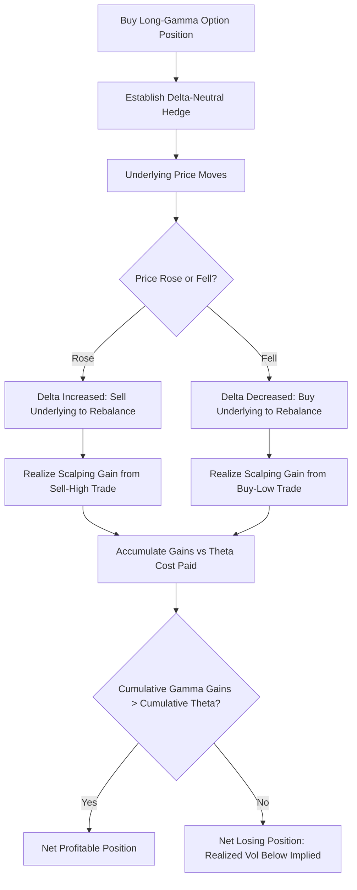

## Gamma Scalping and Rebalancing Frequency

### Overview

Gamma scalping is the practice of profiting from a long-gamma, delta-hedged options position by systematically buying the underlying as it falls and selling as it rises, capturing the difference between realized volatility and the implied volatility paid for the option. Rebalancing frequency is the central operational lever in gamma scalping: it determines how closely the strategy's realized P&L tracks its theoretical maximum, while directly trading off against transaction cost accumulation.

### The Mechanics of Gamma Scalping

**Key Points**

- A gamma scalper holds a **long option position** (long gamma) that is **delta-hedged** with an offsetting position in the underlying, so the portfolio starts approximately directionally neutral
- As the underlying price moves, the option's Delta changes (governed by Gamma), causing the hedge to become imbalanced — the scalper then trades the underlying to restore delta-neutrality
- Because Delta rises as price rises (for a long call/put combination with positive net Delta sensitivity) and falls as price falls, restoring the hedge requires **selling into rallies and buying into declines** — a systematic "sell high, buy low" pattern that generates trading profits purely from price oscillation, independent of the direction of the move
- This is the exact mirror image of the "buy high, sell low" cost borne by a short-gamma delta hedger (as discussed in delta hedging in practice)

### The Source of Gamma Scalping Profit

**Key Points**

- Gamma scalping profits accumulate from the **realized variance** of the underlying's price path during the holding period, captured through the repeated rebalancing trades
- The scalper simultaneously **pays Theta** for holding the long option position — Theta is the "cost" of maintaining long Gamma exposure, as established in the Gamma-Theta trade-off
- The strategy is profitable when **cumulative gamma-scalping trading gains exceed the cumulative Theta paid** — equivalently, when **realized volatility exceeds the implied volatility** at which the option was purchased (adjusted for the specific path and rebalancing methodology used)

### The Theoretical P&L Decomposition

For a delta-hedged long option position, the instantaneous P&L can be approximated as:

$$d\Pi \approx \frac{1}{2}\Gamma (dS)^2 + \Theta \, dt$$

**Key Points**

- The $\frac{1}{2}\Gamma(dS)^2$ term is always non-negative for a long-gamma position (since $\Gamma > 0$ and $(dS)^2 \geq 0$) — this is the gamma scalping gain from each price move
- The $\Theta \, dt$ term is negative for a long option position — this is the continuous cost of holding the position
- Summing (integrating) this relationship over the life of the option shows that total P&L depends on the **realized variance** of the underlying's path relative to the **implied variance** embedded in the option's price at purchase

### Worked Example: Simplified Gamma Scalping Cycle

**Example**

A trader buys an ATM straddle-like long-gamma position with $\Gamma = 0.05$ (per share, position-scaled) and daily Theta cost of $50. Over one trading day, the underlying moves from $100 to $104 in the morning, then back down to $99 by close (a round trip of price action).

Step 1 — Morning rebalance (price rises $100 → $104, a $4 move):

Gamma P&L contribution ≈ $\frac{1}{2} \times 0.05 \times 4^2 = \frac{1}{2} \times 0.05 \times 16 = 0.40$ (scaled to position size)

Step 2 — Afternoon rebalance (price falls $104 → $99, a $5 move):

Gamma P&L contribution ≈ $\frac{1}{2} \times 0.05 \times 5^2 = \frac{1}{2} \times 0.05 \times 25 = 0.625$ (scaled to position size)

Step 3 — Total gamma scalping gain for the day (scaled to position size, illustrative multiplier applied):

Assume position scaling brings the day's total gamma-driven gain to approximately $85 (combining both rebalancing legs at actual position size)

Step 4 — Net P&L after Theta cost:

$$\text{Net P\&L} = \$85 - \$50 = \$35$$

**Output**

The trader nets approximately **$35** for the day — the gamma scalping gains from the two rebalancing trades ($85) exceeded the day's theta decay cost ($50). This illustrates the core mechanic: **larger realized price swings within the day generate more gamma-scalping profit**, and profitability requires those swings to be large enough, in aggregate, to overcome the fixed theta cost.

### Rebalancing Frequency: The Central Trade-off

**Key Points**

- **More frequent rebalancing** captures gamma-scalping profit more precisely, since the $(dS)^2$ approximation becomes more accurate over smaller price increments, and less realized price movement "slips through" uncaptured between rebalances
- **More frequent rebalancing also increases cumulative transaction costs**, since every rebalancing trade incurs bid-ask spread and/or commission costs
- This creates a direct trade-off: **too infrequent rebalancing** under-captures the available gamma scalping profit (large moves between rebalances are only partially monetized, and reversals within a rebalancing interval are missed entirely), while **too frequent rebalancing** erodes profits through accumulated transaction costs, potentially turning a theoretically profitable strategy into a net loser

### Rebalancing Strategies in Practice

| Strategy | Description | Trade-off Profile |
| --- | --- | --- |
| Fixed time interval | Rebalance every fixed period (e.g., every hour, once daily) | Simple to implement; may miss intra-period reversals or over-trade in quiet periods |
| Fixed price threshold (band) | Rebalance only when underlying moves beyond a set percentage/dollar threshold | Adapts to actual volatility; avoids unnecessary trades in quiet markets |
| Delta threshold (band) | Rebalance only when position Delta drifts beyond a set band | Directly targets hedge accuracy rather than price movement per se |
| Continuous (theoretical) | Rebalance instantaneously at every price tick | Captures all gamma scalping profit; infinite transaction costs, not implementable |

**Key Points**

- **Threshold/band-based rebalancing** is widely used in practice precisely because it adapts to actual realized volatility — during quiet periods, wider price ranges are tolerated before triggering a rebalance (reducing unnecessary transaction costs), while during volatile periods, the band is crossed more frequently, capturing more of the available scalping profit exactly when there is more of it available
- The **optimal rebalancing frequency or band width** depends on the specific transaction cost structure, the option's Gamma profile, and the expected volatility-of-volatility of the underlying — there is no universal "correct" frequency, and the choice reflects a deliberate calibration decision by the trading desk **[Inference — optimal parameters are strategy- and market-specific, and are typically determined empirically or via cost-adjusted optimization models such as Leland's framework]**

### Realized vs. Implied Volatility: The Fundamental Bet

**Key Points**

- Gamma scalping is fundamentally a bet that **realized volatility will exceed implied volatility** paid at purchase, adjusted for the specific rebalancing methodology's ability to capture that realized volatility
- If realized volatility comes in **below** implied volatility, the gamma-scalping gains will be insufficient to cover the Theta cost, and the position will lose money overall, even though individual rebalancing trades may each be small gains
- The **volatility risk premium** (the well-documented empirical tendency for implied volatility to exceed subsequently realized volatility on average, across many markets and time periods) means that gamma scalping (a long-volatility strategy) faces a structural headwind on average — it is generally the **short-volatility, Theta-collecting side** of the trade that benefits from this premium over long time horizons, though any individual period can see realized volatility spike well above implied, rewarding the long-gamma scalper **[Inference — the VRP is a well-documented average tendency, not a certainty in any specific period]**

### Path Dependency of Gamma Scalping P&L

**Key Points**

- Gamma scalping P&L, in practice, is **path-dependent** in a way that pure realized variance alone does not fully capture — a smooth, steady trend of a given total magnitude generates less scalping profit than the same total price change achieved through choppy back-and-forth movement, because the latter triggers more rebalancing trades relative to net directional movement
- This means two periods with identical **total realized volatility** (as measured by standard deviation of returns) can produce meaningfully different gamma scalping P&L if the actual price paths differ in their oscillation pattern relative to the chosen rebalancing methodology
- Discrete rebalancing (as opposed to continuous) introduces additional path-dependency, since the specific rebalancing trigger (time-based vs. threshold-based) interacts with the actual sequence of price moves to determine exactly how much of the "true" realized variance is captured as scalping P&L

### Practical Considerations for Gamma Scalpers

**Key Points**

- **Position sizing** relative to available capital and risk limits must account for the Theta cost being paid daily, since a gamma scalping position with insufficient realized volatility will steadily bleed value even if no single day produces a large loss
- **Liquidity of the underlying** directly affects the practical transaction cost of each rebalancing trade — gamma scalping is more viable in highly liquid underlyings where bid-ask spreads are tight relative to the position size being traded
- **Multiple expirations and strikes** can be combined to construct a gamma-scalping book with a more diversified Gamma profile across the volatility surface, rather than concentrating all gamma exposure in a single option
- Behavior of gamma scalping P&L during periods of unusually persistent trending markets (low realized volatility of the sort that specifically disfavors long-gamma positions) versus choppy, mean-reverting markets (which favor long-gamma positions) can differ substantially, and desks running gamma scalping strategies typically monitor realized-vs-implied volatility spreads closely to size positions appropriately **[Inference]**

### Visualizing the Gamma Scalping Cycle

### Rebalancing Frequency vs Cost Trade-off (svg_diagram)

<svg xmlns="http://www.w3.org/2000/svg" viewBox="0 0 700 320">
\<style\>
.lbl { font-family: sans-serif; font-size: 13px; fill: #1a1a1a; }
.small { font-family: sans-serif; font-size: 11px; fill: #444; }
.axis { stroke: #888; stroke-width: 1; }
.hedgeerror { stroke: #c0392b; stroke-width: 2.5; fill: none; }
.txcost { stroke: #2471a3; stroke-width: 2.5; fill: none; }
.total { stroke: #27ae60; stroke-width: 2.5; fill: none; stroke-dasharray: 4,3; }
\</style\>
<text x="140" y="20" class="lbl" font-weight="bold">Rebalancing Frequency vs Cost Components (svg_diagram)</text>
<line x1="60" y1="270" x2="650" y2="270" class="axis" />
<line x1="60" y1="270" x2="60" y2="40" class="axis" />
<text x="250" y="295" class="small">Rebalancing Frequency (Low to High)</text>
<text x="15" y="150" class="small" transform="rotate(-90 15 150)">Cost / Error</text>
<path class="hedgeerror" d="M80,60 C200,90 350,180 620,255" />
<text x="420" y="130" class="small" fill="#c0392b">Hedging error (decreases with frequency)</text>
<path class="txcost" d="M80,255 C250,220 450,120 620,60" />
<text x="380" y="240" class="small" fill="#2471a3">Transaction costs (increase with frequency)</text>
<path class="total" d="M80,150 C200,100 350,95 450,110 C520,125 580,160 620,190" />
<text x="440" y="80" class="small" fill="#27ae60">Total cost (minimized at intermediate frequency)</text>
</svg>

### Practical Applications and Trading Context

**Key Points**

- **Volatility arbitrage funds and proprietary trading desks** run systematic gamma scalping strategies specifically to monetize perceived gaps between implied and realized volatility, often across diversified baskets of underlyings to reduce idiosyncratic path-dependency risk
- **Market makers** effectively perform a form of continuous gamma scalping as a byproduct of managing customer order flow, since their inventory naturally shifts between long and short gamma as they take on and offset positions
- **Options desks with structural long-gamma books** (e.g., from client hedging flow that leaves the desk net long options) can generate meaningful scalping revenue during volatile periods, partially offsetting the theta cost embedded in holding that inventory
- The choice between fixed-interval and threshold-based rebalancing, and the specific parameters chosen, materially affects realized strategy performance, and optimal calibration typically requires backtesting against realistic transaction cost assumptions specific to the traded instrument and market **[Inference]**

**Conclusion**

Gamma scalping operationalizes the theoretical link between Gamma and Theta into an active trading strategy, converting realized price volatility into trading gains through systematic delta-hedge rebalancing. Rebalancing frequency is the critical lever governing the strategy's effectiveness — too infrequent, and gamma-scalping profit is under-captured; too frequent, and transaction costs erode the very profits being sought — making the choice of rebalancing methodology (fixed-interval, threshold-based, or hybrid) a central determinant of real-world strategy performance beyond the underlying volatility view itself.

**Related Topics**

- The Gamma-Theta Trade-off and Black-Scholes PDE Relationship
- Realized vs. Implied Volatility and the Volatility Risk Premium
- Leland's Model: Optimal Hedging Under Transaction Costs
- Threshold-Based (Band) Rebalancing Strategy Design
- Path Dependency in Delta-Hedged Option P&L
- Volatility Arbitrage Fund Strategies
- Options Market Making Inventory and Gamma Exposure
- Variance Swaps as a Pure Realized-Volatility Exposure Alternative