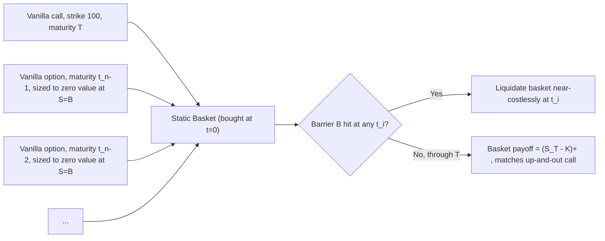

## Static Replication of Exotic Payoffs

### Overview

Static replication is a hedging methodology in which an exotic payoff is decomposed into a fixed portfolio of liquid, vanilla instruments — chosen once at inception — that reproduces the exotic's payoff (or risk profile) either exactly or approximately, without requiring rebalancing over the life of the trade. This stands in contrast to dynamic replication (delta hedging under a model), which requires continuous or discrete rebalancing of a hedge portfolio as the underlying moves and time passes.

The appeal of static replication is that it sidesteps model risk associated with continuous delta hedging (Greeks assumptions, transaction costs, jump risk, liquidity gaps) by constructing a hedge that, once put on, requires no further trading decisions tied to a pricing model. The classic theoretical foundation is the Breeden-Litzenberger (1978) result linking European option prices to the risk-neutral density, and the Carr-Madan (1998, 2001) framework for spanning arbitrary payoffs with a continuum of vanilla options.

### Theoretical Foundation

#### Breeden-Litzenberger Spanning

Any sufficiently smooth payoff function $f(S_T)$ at maturity $T$ can be spanned by a static position in the underlying, a bond, and a continuum of European calls and puts. The Carr-Madan spanning formula states:

$$f(S_T) = f(\kappa) + f'(\kappa)\,[(S_T - \kappa)^+ - (\kappa - S_T)^+] + \int_0^\kappa f''(K)(K-S_T)^+\,dK + \int_\kappa^\infty f''(K)(S_T-K)^+\,dK$$

for any reference point $\kappa$ (commonly the forward price). Discounting under the risk-neutral measure gives the price of the exotic as:

$$V_0 = f(\kappa)e^{-rT} + f'(\kappa)[F_0 e^{-rT} - \kappa e^{-rT}] + \int_0^\kappa f''(K)P(K)\,dK + \int_\kappa^\infty f''(K)C(K)\,dK$$

where $C(K)$ and $P(K)$ are market prices of calls and puts struck at $K$. This is the theoretical basis: any twice-differentiable payoff decomposes into a portfolio of a zero-coupon bond, forward, and a weighted continuum of strikes, where the weight at each strike is $f''(K)\,dK$ — the local curvature (second derivative) of the payoff.

**Key Points**

- The second derivative $f''(K)$ acts as the density of options needed at strike $K$
- In practice, only a discrete set of listed strikes exists, so the continuum integral is approximated by a finite sum ("strike discretization")
- Exact replication requires a continuum of strikes across $(0, \infty)$; real portfolios approximate this with a finite basket, introducing residual replication error

#### Distinction: Payoff Replication vs. Risk Replication

- **Exact static replication**: the hedge portfolio's payoff matches the exotic's payoff at every point of the state space at maturity (or at all relevant early-exercise/barrier-hit times). Achievable for certain payoff classes (e.g., digitals via call spreads, variance swaps via a log-contract).
- **Approximate/semi-static replication**: the hedge is rebalanced at a finite, pre-specified set of times or trigger events (not continuously), typically used for barrier and path-dependent options where exact static replication under general models is not achievable, but replication under specific model classes (e.g., the reflection principle under Black-Scholes with symmetric smiles) is.

### Static Replication of Common Exotic Payoffs

#### Digital (Binary) Options via Call/Put Spreads

A cash-or-nothing digital call paying $1 if $S_T > K$ is approximated by a tight call spread:

$$\text{Digital Call}(K) \approx \frac{1}{\epsilon}\left[C(K-\epsilon) - C(K+\epsilon)\right]$$

As $\epsilon \to 0$, this converges to $-\partial C/\partial K$ evaluated at $K$, consistent with Breeden-Litzenberger. In practice, banks use a market-standard $\epsilon$ (e.g., a "digital adjustment" or "pay-later" spread) reflecting the bid-offer and skew steepness around $K$, which also serves to price in the cost of hedging the discontinuous delta near the strike.

**Example**: A trader sells a digital call struck at $100 paying $1M if $S_T > 100$. Instead of delta-hedging a discontinuous payoff (which has unbounded delta/gamma exactly at the strike at expiry), they statically replicate with: long $\frac{1M}{\epsilon}$ call spreads between $100-\epsilon$ and $100+\epsilon$ (e.g., $\epsilon = 1$), purchased once and held to expiry. The replication is imperfect — residual risk is concentrated in the narrow band $[100-\epsilon, 100+\epsilon]$ where the linear call-spread payoff deviates from the step function.

#### Log Contract and Variance Swaps

A variance swap's floating leg (realized variance) can be statically replicated, under continuous monitoring and no-jump assumptions, by a **log contract**:

$$\mathbb{E}^{\mathbb{Q}}\left[\int_0^T \sigma_t^2\,dt\right] = \frac{2}{T}\left[\int_0^{F} \frac{1}{K^2}P(K)\,dK + \int_F^\infty \frac{1}{K^2}C(K)\,dK\right] e^{rT}$$

This is the Carr-Madan/Demeterfi-Derman-Kamal-Zou result: the log payoff $-\ln(S_T/F)$ has second derivative $1/K^2$, giving the weighting scheme for the strip of OTM options across all strikes. This is the theoretical basis for the VIX index construction (CBOE uses a discretized version of this formula on SPX options).

**Key Points**

- Requires a full strip of listed strikes (in practice, truncated at the available OTM wings)
- Assumes continuous monitoring of the underlying and no jumps; realized jumps introduce replication error relative to the theoretical variance swap payoff
- The delta-hedging component (the linear/forward term) plus the static option strip together replicate the variance swap; this is technically a "semi-static" strategy since the underlying-delta piece requires continuous rebalancing, while the option strip is static

#### Barrier Options

**Single Barrier — Reflection Principle (Symmetric Case)**: Under Black-Scholes with a flat volatility surface (or a symmetric smile around the barrier), a down-and-out call can be statically replicated using the **reflection principle**. For a down-and-out call with barrier $B < S_0$ and strike $K \geq B$:

$$C_{DO}(S_0, K, B) = C(S_0, K) - \left(\frac{S_0}{B}\right)^{1 - 2r/\sigma^2} C\left(\frac{B^2}{S_0}, K\right)$$

This can be implemented as a static portfolio: long a vanilla call struck at $K$, short a scaled quantity of a vanilla call struck at $K$ but with the underlying "reflected" through the barrier (in practice this reflected option isn't directly tradable, so this identity is more often used for **pricing** than literal replication; the tradable static replication uses a different construction below).

**Carr-Ellis-Gupta / Derman-Ergener-Kani Static Replication**: The practically tradable approach constructs a portfolio of vanilla options with different strikes and maturities such that the portfolio's value is exactly zero on the barrier at every monitoring time up to expiry (not just at $T$), and matches the exotic's payoff at $T$ conditional on no barrier hit. This is solved by matching value (and often the first derivative) of the vanilla basket to the barrier condition at a discrete set of times $t_1, \dots, t_n$ prior to $T$:

1. Start with a vanilla option (matching the terminal payoff) maturing at $T$.
2. At each earlier monitoring time $t_i$ (working backward from $T$), add a vanilla option maturing at $t_i$ with a notional and strike chosen so that the cumulative portfolio value is zero at the barrier level $B$ at time $t_i$.
3. Continue until $t_1$; the resulting basket, held statically, replicates the barrier option's payoff and — critically — has close to zero value at the barrier at each monitoring date, so it can be liquidated for near-zero cost if/when the barrier is breached (approximating the knock-out).

**Key Points**

- Exact only under restrictive model assumptions (flat vol, continuous monitoring, no dividends complicating the reflection); under smile-consistent models, the replication is approximate and requires periodic recalibration ("semi-static")
- Works well for single barriers; double barriers and barriers combined with strong path-dependency (e.g., Parisian options) are substantially harder and often have no clean static solution
- Sensitive to the shape of the implied volatility skew near the barrier — Carr-Ellis-Gupta static hedges are known to be more robust to smile risk than naive Black-Scholes delta hedging of barriers

#### Asian Options (Arithmetic Average)

Arithmetic-average Asian options generally have **no exact static replication** using vanilla options, because the arithmetic average of a lognormal process is not itself lognormal, and its distribution does not admit a closed-form spanning by standard calls/puts. Approaches used in practice://not static in the strict sense:

- **Geometric approximation**: replicate the (calculable, closed-form) geometric Asian analytically, then adjust for the arithmetic-geometric bias via moment matching or a correction term (semi-static/model-based, not a pure vanilla-option static hedge)
- **Basket of options on the running average**: only static if forward-starting average-strike instruments are themselves liquidly quoted, which they generally are not
- In practice, Asian options are typically hedged dynamically (delta/gamma hedging with model recalibration), not statically

This is an important negative case to document: static replication is payoff-class-dependent, not universal.

#### Forward-Starting and Cliquet-Type Payoffs

Certain cliquet/ratchet structures can be decomposed into a static strip of forward-starting options if such instruments trade, but forward-starting vanillas are rarely liquid, so practitioners more commonly use a **replicating portfolio of standard options with rolled strikes**, re-struck periodically — this is inherently semi-static (rebalanced at each reset date) rather than purely static.

### Semi-Static vs. Fully Static: A Taxonomy

| Payoff Type | Fully Static? | Typical Replication Approach |
| --- | --- | --- |
| Digital / binary | Approximate (call spread) | Vanilla call/put spread, fixed at inception |
| Log contract / variance swap | Semi-static | Option strip (static) + delta hedge (dynamic) |
| Single barrier (flat vol) | Exact under model assumption | Vanilla basket per Carr-Ellis-Gupta / Derman-Ergener-Kani |
| Double barrier | Rarely exact | Iterative vanilla basket, less robust |
| Arithmetic Asian | Not achievable exactly | Dynamic hedging or geometric-approximation proxy |
| Cliquet / forward-start | Semi-static | Periodically re-struck vanilla options |

### Practical Implementation Considerations

- **Strike discretization error**: real markets offer a finite strike ladder, so the theoretical continuum integral in Carr-Madan is approximated by a Riemann sum over listed strikes; wider strike spacing near the wings increases replication error for tail-sensitive payoffs (e.g., variance swaps, deep digitals)
- **Bid-offer and liquidity costs**: static hedges concentrated in OTM wings (deep digitals, variance swap replication) can be expensive to execute because far-OTM options are illiquid; this cost is typically embedded in the pricing via a replication-cost adjustment
- **Smile/skew sensitivity**: static replication formulas derived under Black-Scholes (flat vol) are biased when the actual implied volatility surface has skew or smile; more robust static hedges (Carr-Ellis-Gupta) are explicitly designed to be less sensitive to this, but perfect robustness only holds under specific symmetry assumptions
- **Model risk reduction, not elimination**: static replication reduces reliance on continuous delta-hedging assumptions (and thus transaction-cost/gap risk), but the initial construction of the replicating basket (choice of strikes, monitoring dates) is itself model-dependent — [Inference] the residual model risk is generally considered smaller in magnitude than that of pure dynamic hedging, though this is payoff- and market-regime-dependent

### Worked Example: Static Hedge for an Up-and-Out Call

Consider an up-and-out call, strike $K = 100$, barrier $B = 120$, maturity $T = 1$ year, discretely monitored monthly.

**Step 1**: At $T$, the payoff matches a vanilla call struck at 100 (since if the barrier is never breached, the payoff is $(S_T - 100)^+$, capped implicitly by the barrier never being hit).

**Step 2**: Working backward, at each monitoring date $t_i$, add a vanilla option (call or put, appropriately struck and signed) with maturity $t_i$, sized so that the portfolio value evaluated at $S = B = 120$ and $t = t_i$ sums to (approximately) zero — ensuring that, conditional on hitting the barrier at $t_i$, the remaining basket can be unwound near-costlessly.

**Step 3**: The resulting basket — one call at $T$ plus a series of shorter-dated options with strikes generally above or at the barrier — is purchased once at inception. No further trading occurs unless the barrier is hit, at which point the basket is liquidated (its value should be near zero at that point, approximating the knock-out feature).

### Advantages and Limitations Summary

**Key Points**

- **Advantages**: eliminates continuous rebalancing risk and associated transaction costs; reduces exposure to gamma/vega mis-specification from an incorrect dynamic model; hedge composition is transparent and auditable at inception; performs better across jumps and liquidity gaps than delta hedging, since no trading is required during stressed periods
- **Limitations**: only a subset of payoffs admit exact static replication; approximate replications carry residual basis risk concentrated near barriers/strikes; requires sufficiently liquid vanilla options across the needed strike/maturity grid, which may not exist for all underlyings; construction of the replicating basket is itself dependent on model assumptions (e.g., flat vol, continuous monitoring) that may not hold exactly in practice

### Related Topics

- Breeden-Litzenberger risk-neutral density extraction
- Carr-Madan payoff spanning formula (general derivation)
- Variance swap replication and the VIX methodology
- Carr-Ellis-Gupta static hedging of barrier options
- Derman-Ergener-Kani discrete static replication algorithm
- Dynamic delta-gamma-vega hedging (contrast case)
- Local volatility and stochastic volatility model impact on replication robustness
- Reflection principle and its breakdown under skewed volatility surfaces
- Semi-static hedging of cliquets and forward-starting options
- Transaction cost modeling in hedge portfolio construction