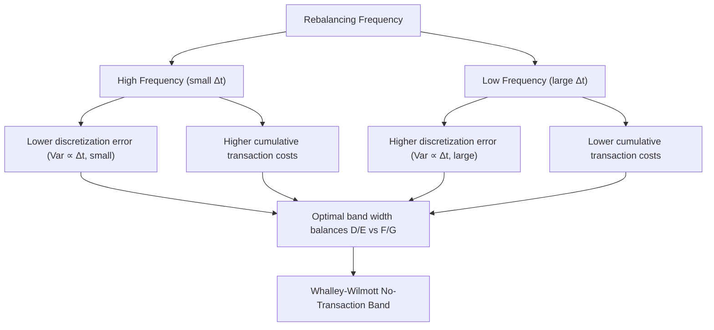

## Hedging Error and Transaction Costs

### Overview

Hedging error refers to the deviation between a theoretical hedge portfolio's performance and the actual replication of a derivative's payoff, arising from the gap between idealized continuous-time hedging assumptions (as in the Black-Scholes framework) and real-world constraints: discrete rebalancing, transaction costs, model misspecification, and discontinuous price movements. Transaction costs are a primary and unavoidable contributor to this error, since any rebalancing of a hedge portfolio incurs bid-offer spread, market impact, and financing costs. Together, these effects mean that a delta-hedged (or otherwise dynamically hedged) position almost never perfectly replicates the derivative's payoff in practice, and the residual P&L — often called **hedging slippage** or **replication error** — has both a systematic and a stochastic component.

### Sources of Hedging Error

#### Discrete Rebalancing (Discretization Error)

The Black-Scholes hedging argument assumes continuous rebalancing of the delta position. In practice, hedges are rebalanced at discrete intervals $\Delta t$ (e.g., daily, or at fixed delta bands). Between rebalancing dates, the underlying can move, leaving the hedge imperfectly matched. This creates a **discretization error** whose variance scales approximately with $\Delta t$:

$$\text{Var}(\text{hedging error}) \propto \Delta t$$

[Inference] more precisely, under the standard Black-Scholes-Merton discrete hedging analysis (Boyle-Emanuel 1980), the variance of the P&L from discrete delta hedging scales proportionally to the rebalancing interval, so halving the rebalancing frequency roughly halves the P&L variance, though the total transaction cost typically increases with rebalancing frequency, creating the fundamental trade-off discussed below.

#### Transaction Costs

Every rebalancing trade incurs cost, generally modeled as proportional to the trade size:

$$\text{Cost} = k \cdot S \cdot |\Delta_{\text{new}} - \Delta_{\text{old}}|$$

where $k$ is the proportional cost rate (reflecting bid-offer spread and/or commission). The **Leland (1985) model** is the canonical extension of Black-Scholes to incorporate proportional transaction costs: it shows that under discrete-time delta hedging with cost rate $k$ and rebalancing interval $\Delta t$, the hedging strategy is equivalent to using an **adjusted (Leland) volatility**:

$$\sigma_L^2 = \sigma^2\left(1 + \sqrt{\frac{2}{\pi}} \cdot \frac{k}{\sigma\sqrt{\Delta t}}\right)$$

This adjusted volatility is used in the Black-Scholes formula to price the option such that the expected hedging cost (including transaction costs) is covered. The intuition: transaction costs make hedging effectively "act like" a higher volatility, since more expensive rebalancing must be compensated for in the option premium.

**Key Points**

- Higher rebalancing frequency ($\Delta t \to 0$) reduces discretization error but increases cumulative transaction costs, since costs scale with the number of trades
- The Leland model assumes a fixed rebalancing frequency and proportional costs; it is a first-order correction, not an exact replication result — [Inference] more refined models (e.g., Whalley-Wilmott asymptotic band hedging) address the fact that Leland's naive scaling can lead to negative effective volatility if cost rates are miscalibrated relative to $\Delta t$
- There is a fundamental trade-off between transaction costs and hedging variance/error, formalized in optimal hedging models below

#### Model Misspecification

Even with continuous rebalancing and zero transaction costs, hedging error arises if the model used to compute the delta (and other Greeks) differs from the "true" process governing the underlying. Common sources:

- **Volatility misspecification**: using a constant or wrong implied volatility when the true process has stochastic or local volatility
- **Jump risk**: if the underlying can jump (as in Merton's jump-diffusion model or during market dislocations), continuous delta hedging cannot replicate the payoff — jumps produce hedging error even in the continuous-rebalancing limit, since the hedge is calibrated to diffusive risk only
- **Smile/skew misspecification**: hedging with Black-Scholes deltas when the market exhibits a volatility skew produces systematic hedging bias, since the "true" delta implied by a local or stochastic volatility model differs from the Black-Scholes delta at the same strike

#### Liquidity and Market Impact

Beyond the bid-offer spread captured in simple proportional-cost models, large rebalancing trades can move the market against the hedger (market impact), especially in less liquid underlyings or during stressed conditions. This is typically modeled with a cost function that is convex in trade size (e.g., quadratic impact), rather than purely linear/proportional as in Leland's model.

### Quantifying Hedging Error

#### P&L Decomposition (Greeks Attribution)

A standard way to analyze realized hedging error over a period is to decompose the P&L of a hedged position into Greek-attributed components:

$$\text{P\&L} \approx \Theta\,dt + \Delta\,dS + \frac{1}{2}\Gamma\,(dS)^2 + \text{Vega}\cdot d\sigma + \text{residual}$$

The **residual** term captures higher-order effects, discretization error, and any model misspecification not explained by first- and second-order Greeks. In a perfectly continuous, correctly-specified, cost-free Black-Scholes world, the residual is zero by construction (the classic "gamma P&L offsets theta" replication argument). In practice, the residual is the empirical measure of hedging error.

**Example**: A trader delta-hedges a long gamma position (e.g., a long straddle) daily. Over a week where realized volatility exceeds implied volatility, the trader profits from the gamma-scalping process — but if rebalancing is done at fixed times rather than continuously, and transaction costs are incurred on each rebalance, the realized P&L will differ from the theoretical $\frac{1}{2}\Gamma(dS)^2 - \Theta\,dt$ prediction by a discretization-and-cost residual, which can be positive or negative depending on the realized path.

#### Whalley-Wilmott Asymptotic Band Hedging

The **Whalley-Wilmott (1997)** model provides an asymptotically optimal hedging strategy under proportional transaction costs by defining a "no-transaction band" around the theoretical Black-Scholes delta. The hedger only rebalances when the actual delta exposure drifts outside this band, rather than rebalancing continuously or at fixed time intervals. The band half-width is derived to be:

$$H(S,t) \approx \left(\frac{3}{2} e^{-r(T-t)} k \frac{S^2 \Gamma_{BS}^2}{\lambda}\right)^{1/3}$$

where $\lambda$ is a risk-aversion parameter, $k$ is the transaction cost rate, and $\Gamma_{BS}$ is the Black-Scholes gamma. This approach explicitly balances the trade-off between transaction cost minimization (wider bands, less rebalancing) and hedging error minimization (narrower bands, more precise tracking), rather than assuming a fixed rebalancing schedule as in Leland's model.

**Key Points**

- The band widens where gamma is large (near-the-money, near expiry) — counterintuitively, this means *less* frequent rebalancing precisely where naive hedging intuition suggests more is needed, because the cost of frequent rebalancing in high-gamma regions is also highest
- This is a canonical example of "utility-based" or "risk-cost trade-off" hedging, contrasted with pure P&L-replication hedging

#### Delta-Band / Percentage-Band Rebalancing (Practitioner Heuristic)

In practice, many trading desks use a simpler heuristic: rebalance only when the delta moves by more than a fixed threshold (e.g., 5 delta points) or when the underlying moves by more than a fixed percentage. This is a practical approximation to the Whalley-Wilmott framework without solving the full asymptotic band equation.

### Transaction Cost Models: Summary Taxonomy

| Model | Cost Assumption | Rebalancing Rule | Key Output |
| --- | --- | --- | --- |
| Leland (1985) | Proportional to trade size | Fixed time interval $\Delta t$ | Volatility adjustment $\sigma_L$ |
| Whalley-Wilmott (1997) | Proportional to trade size | Asymptotic no-transaction band | Band width formula, optimal under utility |
| Hodges-Neuberger (1989) | Proportional/general | Utility-indifference optimal control | Numerically solved optimal hedge |
| Boyle-Vorst (1992) | Proportional, binomial setting | Discrete binomial rebalancing | Discrete-time replicating cost bound |

### Practical Risk Management Implications

- **P&L attribution and explain**: trading desks routinely reconcile daily hedging P&L against Greek-predicted P&L; unexplained residuals beyond a threshold trigger investigation into model risk, data errors, or unusual market behavior (e.g., jumps, gaps, or corporate actions)
- **Cost-aware hedging frequency**: high cost-rate underlyings (wide bid-offer, illiquid) justify wider no-transaction bands or less frequent rebalancing, accepting higher variance in exchange for lower expected costs
- **Gamma and vega risk limits**: since realized hedging error correlates with realized gamma exposure (the "gamma scalping" P&L) and vega exposure (realized vs. implied volatility mismatch), risk limits are often set directly on Greek exposures as a proxy for controlling expected hedging error
- **Jump risk overlays**: because continuous delta hedging cannot replicate jump risk, desks with significant jump exposure (e.g., single-name equity options around earnings, or credit-sensitive underlyings) often supplement delta hedging with static positions in out-of-the-money options to partially cover gap/jump scenarios, reducing reliance on pure dynamic hedging
- **Transaction cost pass-through in pricing**: the Leland-adjusted volatility (or a desk-specific equivalent add-on) is commonly embedded into the volatility surface used for pricing and initial hedge cost estimation, effectively charging the client for the expected cost of maintaining the hedge

### Illustrative Diagram: Hedging Error vs. Rebalancing Frequency Trade-off

### Worked Example: Leland Volatility Adjustment

A desk delta-hedges a 1-year at-the-money call daily ($\Delta t = 1/252$), with a proportional transaction cost rate $k = 0.1\%$ per trade, and true volatility $\sigma = 20\%$.

$$\sigma_L^2 = 0.20^2\left(1 + \sqrt{\frac{2}{\pi}}\cdot\frac{0.001}{0.20\sqrt{1/252}}\right) = 0.04\left(1 + 0.7979 \cdot \frac{0.001}{0.0126}\right) \approx 0.04 \times 1.0634 \approx 0.04254$$

$$\sigma_L \approx 20.6\%$$

The desk should price and hedge using approximately 20.6% volatility rather than the "true" 20%, embedding roughly a 63-basis-point-of-variance cushion to cover expected transaction costs from daily rebalancing over the option's life. [Inference] this is a stylized calculation illustrating the mechanism; actual desk practice typically calibrates cost add-ons empirically rather than relying purely on the closed-form Leland formula, since the formula assumes a fixed, known rebalancing frequency and proportional (not impact-based) costs.

**Key Points**

- Leland's adjustment increases with cost rate $k$ and decreases with $\sqrt{\Delta t}$ — more frequent rebalancing (smaller $\Delta t$) paradoxically *increases* the required volatility cushion in this formula, since it implies more total trades over the option's life
- This formula is model-specific to proportional costs and Black-Scholes dynamics; it does not extend cleanly to stochastic volatility or jump-diffusion settings

### Related Topics

- Leland's model and its extensions (Boyle-Vorst, Hodges-Neuberger)
- Whalley-Wilmott asymptotic no-transaction bands
- Gamma scalping P&L and realized-vs-implied volatility trading
- Jump-diffusion hedging and residual jump risk
- Local volatility vs. stochastic volatility hedge ratio divergence
- P&L attribution and Greeks-based explain frameworks
- Optimal hedging under utility functions (Hodges-Neuberger indifference pricing)
- Market impact and liquidity cost modeling in derivatives hedging
- Static and semi-static replication as alternatives to dynamic hedging
- Vega hedging and volatility risk management