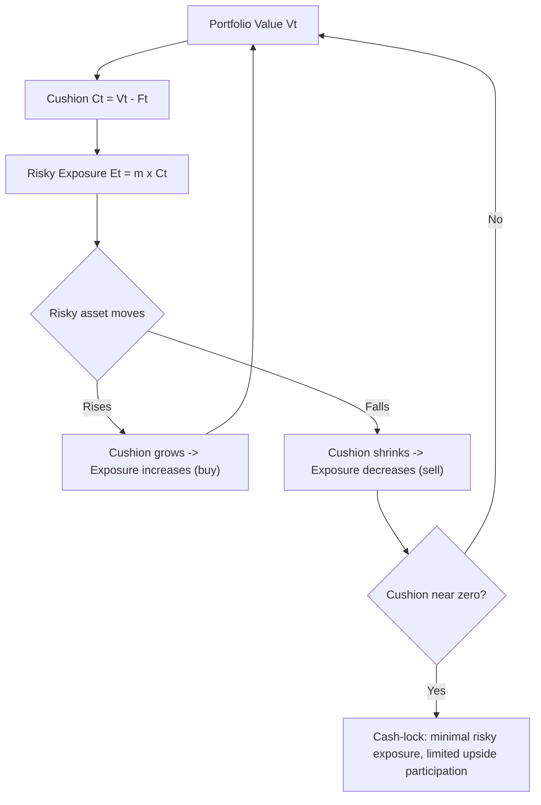

## Portfolio Insurance and Synthetic Puts

### Overview

Portfolio insurance is a hedging strategy designed to limit the downside risk of an equity (or other asset) portfolio while preserving upside participation, without necessarily purchasing actual put options. The most prominent technique, **Constant Proportion Portfolio Insurance (CPPI)** and its predecessor **Option-Based Portfolio Insurance (OBPI)** using **synthetic puts**, rose to prominence in the 1980s and are historically significant both as a hedging methodology and as a contributing factor in the 1987 stock market crash ("Black Monday"), where mechanical selling by portfolio insurance programs is widely believed to have amplified the downturn.

A **synthetic put** replicates the payoff of a protective put ($\max(K - S_T, 0)$ combined with holding the underlying, producing a payoff floor at $K$) by dynamically trading the underlying and a risk-free asset according to the Black-Scholes delta-hedging logic, rather than buying a listed put option. This is a direct application of dynamic replication theory to a portfolio-level hedging objective.

### Theoretical Basis: Replicating a Put via Delta Hedging

Under Black-Scholes, a European put with strike $K$ has delta:

$$\Delta_{\text{put}} = -N(-d_1) = N(d_1) - 1$$

where $d_1 = \frac{\ln(S/K) + (r + \sigma^2/2)T}{\sigma\sqrt{T}}$. A synthetic put is constructed by continuously (or discretely) rebalancing a position in the underlying and cash such that the combined position's sensitivity to $S$ matches $\Delta_{\text{put}}$ at every point in time. Equivalently, a **protective put strategy synthesized dynamically** holds:

$$\text{Stock position} = N(d_1) \times \text{Notional}$$

$$\text{Cash/bond position} = \text{remainder, earning } r$$

As $S$ falls toward $K$, $N(d_1)$ decreases, so the strategy sells stock and moves into cash — replicating the payoff-limiting behavior of a real put without ever purchasing one. This is the "portfolio insurance via synthetic put" or **OBPI (Option-Based Portfolio Insurance)** approach, originally formalized by Rubinstein and Leland (1981).

**Key Points**

- The synthetic put approach requires no options market at all — it can be implemented purely via futures, ETFs, or the cash underlying plus a risk-free instrument
- It inherits all the standard dynamic-replication hedging error sources: discretization error, transaction costs, and — critically — **gap/jump risk**, since the strategy assumes the underlying can be traded continuously without price discontinuities
- The strategy is inherently **pro-cyclical**: it mechanically sells into falling markets (to reduce delta) and buys into rising markets (to increase delta), which can exacerbate trend moves at scale — this dynamic is the central critique associated with the 1987 crash

### Constant Proportion Portfolio Insurance (CPPI)

CPPI is a related but distinct portfolio insurance technique that does not explicitly replicate an option payoff via Black-Scholes deltas, but instead uses a simple, model-independent rule based on a **cushion** and a **multiplier**.

#### Mechanics

Define:

- $V_t$ = total portfolio value at time $t$
- $F_t$ = the floor (minimum acceptable portfolio value, often the present value of a guaranteed amount, growing at the risk-free rate)
- $C_t = V_t - F_t$ = the cushion
- $m$ = the multiplier (a fixed constant, $m > 1$)

The exposure to the risky asset is set as:

$$E_t = m \times C_t$$

with the remainder $V_t - E_t$ invested in the risk-free asset (or floor-matching instrument, e.g., a zero-coupon bond maturing at the horizon with face value $F$). As the cushion grows (portfolio outperforms the floor), exposure increases proportionally; as the cushion shrinks (portfolio approaches the floor), exposure is reduced — mechanically similar in spirit to the synthetic put's delta reduction, but governed by a simple linear rule rather than an option-pricing formula.

**Example**: Portfolio value $V_0 = \$100$, floor $F_0 = \$90$ (guaranteeing 90% capital protection), multiplier $m = 3$. Cushion $C_0 = \$10$, so risky exposure $E_0 = 3 \times 10 = \$30$; the remaining $70 is in the risk-free asset. If the risky asset rises 10%, the risky sleeve grows to $33, portfolio value becomes $\$103$ (assuming risk-free leg roughly flat), cushion becomes $\$13$, and exposure is rebalanced up to $3 \times 13 = \$39$ — the strategy buys more of the risky asset ("buy high"). Conversely, if the risky asset falls, the cushion shrinks and exposure is cut ("sell low") — this is the trend-following, pro-cyclical character common to both CPPI and synthetic-put OBPI.

#### The Multiplier and Gap Risk

The multiplier $m$ determines aggressiveness. A key risk metric is the maximum single-period loss the risky asset can sustain before the cushion is wiped out (portfolio value hits the floor) **before rebalancing can occur** — this is **gap risk**, and it is the central risk CPPI strategies must manage:

$$\text{Max tolerable single-period drop} \approx \frac{1}{m}$$

If $m = 3$, a drop of roughly 33% or more in the risky asset between rebalancing points can push the portfolio value below the floor, since the strategy cannot rebalance fast enough to reduce exposure during the gap. This is structurally analogous to the jump-risk limitation of synthetic-put delta hedging — both strategies are vulnerable to discontinuous price moves that occur faster than the rebalancing mechanism can react.

**Key Points**

- Higher multipliers increase upside participation in stable/trending-up markets but increase gap risk in the event of a sudden crash
- CPPI does not require an option-pricing model or volatility input at all (a practical advantage over OBPI/synthetic puts, which require volatility estimates to compute $N(d_1)$)
- CPPI strategies are used extensively in structured products (e.g., "CPPI notes" on hedge fund indices, commodities, or equity baskets) to offer principal-protected exposure

### OBPI vs. CPPI: Comparison

| Dimension | OBPI (Synthetic Put) | CPPI |
| --- | --- | --- |
| Basis | Black-Scholes delta replication of a put | Linear cushion/multiplier rule |
| Requires volatility input | Yes ($N(d_1)$ depends on $\sigma$) | No |
| Payoff shape at maturity | Approximates put-protected payoff (concave floor) | Path-dependent; not a fixed option payoff, but floor-protected in continuous-rebalancing limit |
| Sensitivity to model misspecification | High (delta formula assumes Black-Scholes dynamics) | Lower (rule-based, though gap risk still model-relevant for calibrating $m$) |
| Gap/jump risk | Present (delta hedge breaks down on jumps) | Present (cushion can be breached between rebalances) |
| Historical association | 1987 crash (LOR portfolio insurance programs) | Widely used in structured retail/institutional notes |

### Path Dependency and the "Cash-Lock" Problem

A well-documented weakness of CPPI (and, to a lesser extent, dynamic OBPI) is **cash-lock** (or "cash-trap"): if the risky asset experiences a sharp early decline, the cushion can shrink close to zero, driving exposure $E_t = m \times C_t$ toward zero. Once the strategy is fully or near-fully in the risk-free asset, it has effectively no ability to participate in a subsequent market recovery, since there is no cushion left to lever up again. This is a form of **negative path dependency**: the final payoff depends not just on the terminal level of the underlying but on the path taken to get there — in sharp contrast to a real (or Black-Scholes-replicated) European put, whose payoff depends only on $S_T$.

**Key Points**

- Cash-lock is a structural risk unique to the discrete, path-dependent rebalancing mechanics of CPPI — it does not arise in a true static or continuously-replicated European put
- Some CPPI variants introduce a "gearing floor" or minimum re-risking mechanism to mitigate cash-lock, at the cost of added complexity and potential floor-breach risk
- This path dependency is a key reason portfolio insurance payoffs are *not* equivalent to simply buying a put, despite the "synthetic put" terminology — true equivalence only holds in the idealized continuous-rebalancing, no-gap limit

### The 1987 Crash and Systemic Risk Considerations

[Unverified] The prevailing explanation in the academic and regulatory post-mortem literature attributes a meaningful portion of the severity of the October 19, 1987 crash to portfolio insurance programs (predominantly OBPI/synthetic-put style, following the Leland-O'Brien-Rubinstein methodology) executing large, correlated sell orders in a falling market, which — combined with limited market depth and the inability of the futures market to absorb the selling pressure — created a feedback loop amplifying the decline. This episode remains the canonical cautionary case study for the systemic risks of mechanical, model-driven hedging strategies operating at scale, and it directly motivated:

- Circuit breakers and trading halts on major exchanges
- Increased regulatory scrutiny of program trading
- Continued academic interest in gap risk and the limits of dynamic replication under stressed, illiquid conditions

### Illustrative Diagram: CPPI Exposure Mechanism

### Practical Implementation Considerations

- **Rebalancing frequency**: like all dynamic replication strategies, CPPI/OBPI performance depends on how frequently the portfolio is rebalanced relative to market volatility; more frequent rebalancing reduces gap risk but increases transaction costs (see hedging error and transaction cost trade-offs)
- **Choice of floor and multiplier**: the floor is typically set based on a guarantee level required by the product mandate (e.g., a principal-protected note guaranteeing 90% of initial capital); the multiplier is calibrated based on the asset's historical volatility and the desired balance between gap-risk tolerance and upside participation
- **Use in structured products**: CPPI is a standard building block for principal-protected structured notes, where the note issuer manages the CPPI mechanics internally and the investor receives a floor-protected, participation-linked payoff
- **Volatility-controlled/target-volatility overlays**: modern portfolio insurance implementations often combine CPPI-style cushion logic with volatility-targeting overlays, scaling exposure inversely to realized or implied volatility as an additional risk control layer

### Related Topics

- Dynamic delta hedging and discrete rebalancing error
- Black-Scholes put-call parity and protective put payoff structure
- Gap risk and jump-diffusion models
- Structured note design: principal protection mechanisms
- Volatility targeting and risk-parity overlays
- The 1987 crash: market microstructure and circuit breaker regulation
- Path-dependent payoffs and their pricing challenges
- Static replication of exotic payoffs (contrast with dynamic OBPI/CPPI)
- Margin and leverage constraints in dynamic hedging strategies
- Option-based vs. constant-proportion approaches to capital guarantee products