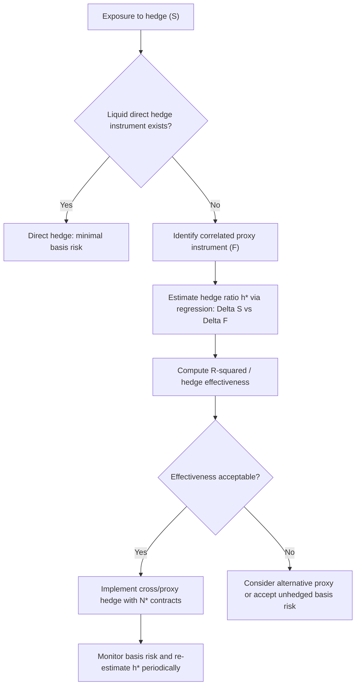

## Cross Hedging and Proxy Hedging

### Overview

Cross hedging and proxy hedging refer to hedging strategies in which the instrument used to hedge a risk exposure is not identical to the underlying exposure itself, but is a correlated or related instrument. This arises whenever a perfectly matching hedging instrument does not exist, is illiquid, or is prohibitively expensive to trade. Both terms are often used interchangeably in practice, though a useful distinction is:

- **Cross hedging**: hedging an exposure in one asset using a derivative or instrument written on a *different but correlated* asset (e.g., hedging jet fuel exposure with WTI crude oil futures, since no liquid jet fuel futures market exists at sufficient depth).
- **Proxy hedging**: a broader term, sometimes used specifically for hedging using a *statistically representative substitute* index, basket, or benchmark rather than the exact position (e.g., hedging a corporate bond portfolio's interest rate risk with Treasury futures, or hedging an illiquid single stock with a sector ETF).

Both techniques introduce **basis risk** — the risk that the hedge instrument and the underlying exposure do not move in perfect lockstep — as the central risk to be measured and managed.

### Theoretical Foundation: Minimum-Variance Hedge Ratio

The standard quantitative framework for cross/proxy hedging is the **minimum-variance hedge ratio**, derived from regressing changes in the spot exposure against changes in the hedging instrument. Given spot price changes $\Delta S$ and hedge instrument (futures/proxy) price changes $\Delta F$, the optimal hedge ratio $h^*$ minimizing the variance of the hedged portfolio is:

$$h^* = \rho_{S,F} \cdot \frac{\sigma_S}{\sigma_F}$$

where $\rho_{S,F}$ is the correlation between $\Delta S$ and $\Delta F$, and $\sigma_S$, $\sigma_F$ are their respective standard deviations. This is equivalently the slope coefficient $\beta$ from an OLS regression:

$$\Delta S = \alpha + \beta \Delta F + \epsilon$$

so $h^* = \beta$. The number of hedge contracts required is:

$$N^* = h^* \times \frac{\text{Value of position to be hedged}}{\text{Value of one hedge contract}}$$

**Key Points**

- The minimum-variance hedge ratio does not require $\rho = 1$; it is designed explicitly to minimize variance under imperfect correlation, which is the defining feature of cross/proxy hedging
- Hedge effectiveness is commonly measured by $R^2$ of the regression, equal to $\rho_{S,F}^2$ — the fraction of the spot price variance explained by (and thus hedgeable via) the proxy instrument
- The hedge ratio should be re-estimated periodically, since correlations between the exposure and the proxy instrument are not stable over time (correlation regime shifts are a primary risk in cross hedging)

### Basis Risk

**Basis** is defined as the difference between the spot price of the asset being hedged and the price of the hedging instrument:

$$\text{Basis} = S - F$$

In a pure hedge of an identical underlying (e.g., hedging a stock position with that same stock's futures), basis risk arises only from timing/convergence effects. In cross/proxy hedging, basis risk is structurally larger because $S$ and $F$ represent genuinely different assets, so the basis reflects not just a convergence-to-maturity effect but an ongoing, potentially time-varying spread driven by fundamental factors specific to each asset (e.g., quality differentials, regional supply-demand imbalances, credit spread differences).

**Example**: An airline hedges jet fuel consumption using WTI crude oil futures, since jet fuel futures are illiquid. The "crack spread" between jet fuel and WTI crude can widen or narrow independently of the level of crude prices (driven by refining capacity, seasonal demand for heating oil vs. jet fuel, and regional refinery outages). Even with a well-estimated hedge ratio $h^*$, the airline remains exposed to this crack-spread basis risk — a WTI hedge protects against the *crude oil component* of jet fuel price risk, but not against a widening jet-fuel-specific premium.

### Common Applications

#### Commodity Cross Hedging

- **Jet fuel via crude oil / heating oil futures**: airlines commonly hedge using WTI, Brent, or heating oil futures (heating oil futures are a closer proxy due to similar refined-product characteristics) due to limited jet fuel futures liquidity
- **Physical commodity grade mismatches**: hedging a specific grade or delivery location of a commodity (e.g., regional natural gas basis, specific crude oil grades like Bakken or Mars) using the more liquid benchmark contract (WTI, Henry Hub)

#### Fixed Income Cross Hedging

- **Corporate bond portfolios hedged with Treasury futures**: since single-name corporate bond futures are largely nonexistent, portfolios are commonly duration-hedged using Treasury futures, leaving residual **credit spread risk** (the corporate-Treasury spread) unhedged — this is a cross hedge of interest rate risk only, not credit risk
- **Swap-based hedging of loan portfolios**: using interest rate swaps to hedge floating-rate loan books when the loan reference rate (e.g., a proprietary or regional rate) differs from the swap's reference rate (e.g., SOFR)

#### Equity Cross Hedging

- **Single-stock exposure hedged with sector/index futures or ETFs**: when options or liquid derivatives on a specific stock are unavailable or too illiquid (e.g., small-cap or foreign-listed names), a beta-adjusted hedge using a correlated index or sector ETF is used. The hedge ratio here is essentially the stock's **beta** to the index:

$$N^* = \beta \times \frac{\text{Equity position value}}{\text{Index futures contract value}}$$

- **Cross-currency equity hedging**: hedging a foreign equity position's currency risk with FX forwards, which introduces a separate but related proxy-hedging problem if the exact currency pair or forward tenor needed isn't liquid

#### Volatility and Correlation Proxy Hedging

- Hedging single-stock volatility exposure with index volatility instruments (e.g., VIX futures) when single-name variance swaps are illiquid — this introduces basis risk from the idiosyncratic (non-market) component of the single stock's volatility, which the index-level hedge cannot capture

### Quantifying and Managing Basis Risk

#### Regression-Based Hedge Effectiveness Testing

Beyond computing $h^*$ and $R^2$ at inception, ongoing hedge effectiveness is typically monitored via:

$$\text{Hedge Effectiveness Ratio} = 1 - \frac{\text{Var}(\Delta S - h^* \Delta F)}{\text{Var}(\Delta S)}$$

A ratio close to 1 indicates the proxy hedge is capturing most of the exposure's variance; a low or declining ratio signals that the proxy relationship is breaking down (correlation regime shift) and the hedge ratio or instrument choice should be reassessed.

#### Rolling and Time-Varying Hedge Ratios

Because correlations between the exposure and the proxy instrument are rarely stable, practitioners often re-estimate $h^*$ using a rolling window (e.g., trailing 60 or 120 trading days) rather than a single static estimate, or apply more sophisticated time-varying approaches (e.g., GARCH-based dynamic conditional correlation models) to adapt the hedge ratio as market regimes shift. [Inference] the choice of estimation window involves a bias-variance trade-off familiar from other statistical hedging contexts — a longer window gives a more stable but potentially stale estimate, while a shorter window is more responsive but noisier.

### Accounting Considerations: Hedge Effectiveness Testing

For hedge accounting treatment under standards such as **IFRS 9** or **ASC 815 (US GAAP)**, cross hedges and proxy hedges face additional scrutiny because the hedging instrument does not exactly match the hedged item. Both frameworks require an entity to demonstrate an "economic relationship" between the hedged item and the hedging instrument (IFRS 9) or meet effectiveness thresholds (historically a 80–125% ratio under legacy ASC 815 bright-line testing, though ASC 815 has moved toward more principles-based effectiveness assessment in recent amendments). [Unverified] specific numerical thresholds and required documentation vary by jurisdiction and have evolved through standard updates, so current hedge accounting treatment for a specific cross-hedge relationship should be verified against the applicable accounting standard in force.

**Key Points**

- Failing hedge effectiveness tests can result in the hedge relationship being disqualified for hedge accounting treatment, forcing the hedging instrument's fair value changes to flow directly through P&L rather than being deferred/matched against the hedged item — a significant operational and reporting consideration distinct from the economic hedging performance itself
- Cross/proxy hedges generally require more robust documentation of the *economic rationale* for the correlation relationship, since the linkage between hedged item and hedging instrument is not definitionally exact

### Illustrative Diagram: Cross Hedge Construction Workflow

### Worked Example: Minimum-Variance Hedge Ratio Calculation

A portfolio manager holds $10M of a small-cap stock with no liquid options market. They hedge using S&P 500 index futures. Historical regression of the stock's daily returns against the index's daily returns gives $\beta = 1.3$ ($R^2 = 0.45$).

$$N^* = 1.3 \times \frac{\$10{,}000{,}000}{\text{Index futures contract value}}$$

If one E-mini S&P 500 futures contract has a notional value of $250,000, then:

$$N^* = 1.3 \times \frac{10{,}000{,}000}{250{,}000} = 52 \text{ contracts (short)}$$

The $R^2 = 0.45$ indicates only 45% of the stock's return variance is explained by the index — meaning 55% of the risk (idiosyncratic, stock-specific risk) remains unhedged even after implementing the minimum-variance cross hedge. This residual is the basis risk inherent to using a broad index as a proxy for a single, imperfectly correlated stock.

**Key Points**

- Low $R^2$ proxy hedges (as in this example) substantially reduce but do not eliminate risk; the manager must judge whether the remaining idiosyncratic risk is acceptable or whether a more targeted (but potentially costlier or illiquid) hedge instrument is warranted
- This example also illustrates why cross hedges are most effective for systematic/market risk components and structurally weakest against idiosyncratic risk specific to the hedged asset

### Related Topics

- Minimum-variance hedge ratio derivation and OLS regression hedging
- Basis risk in commodity futures markets (contango/backwardation effects)
- Hedge accounting standards: IFRS 9 vs. ASC 815 effectiveness testing
- Beta estimation and equity factor hedging
- Dynamic/time-varying hedge ratios (GARCH-DCC approaches)
- Crack spread and refining margin risk in energy hedging
- Credit spread risk in fixed income cross hedges
- Currency overlay and proxy FX hedging strategies
- Correlation breakdown risk during market stress
- Static replication of exotic payoffs (contrast: exact vs. approximate replication)