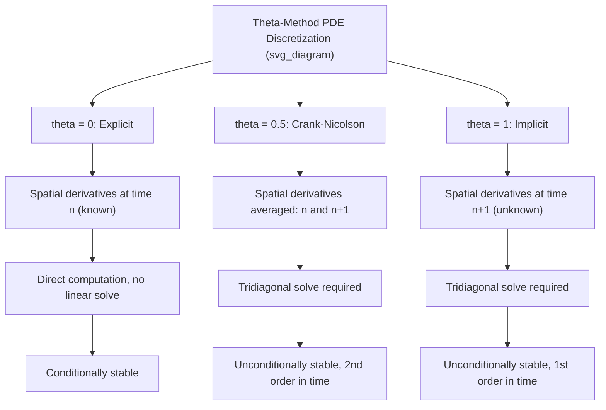

## Explicit Implicit and Crank Nicolson Schemes

### Overview

Explicit, implicit, and Crank-Nicolson schemes are finite difference methods for numerically solving the partial differential equations (PDEs) that govern derivative pricing — most commonly the Black-Scholes PDE and its generalizations. These schemes discretize both the underlying asset price (or a transformed state variable) and time into a grid, then approximate the PDE's derivatives with finite differences, converting the continuous PDE into a system of algebraic equations solved iteratively backward from the option's maturity to the valuation date.

The Black-Scholes PDE for a derivative price $V(S,t)$ is:

$$\frac{\partial V}{\partial t} + \frac{1}{2}\sigma^2 S^2 \frac{\partial^2 V}{\partial S^2} + rS\frac{\partial V}{\partial S} - rV = 0$$

with terminal condition $V(S,T) = \text{payoff}(S)$. Since this is solved backward in time from $T$ to $0$, it is convenient to substitute $\tau = T - t$ (time-to-maturity), converting the PDE into a forward-in-$\tau$ initial value problem. All three schemes discretize this PDE on a grid of $(S_i, \tau_n)$ points but differ in **which time level** the spatial derivatives are evaluated at, which fundamentally determines their stability, accuracy, and computational structure.

### Grid Setup and Notation

Define a grid with asset price steps $\Delta S$ (indices $i = 0, \dots, M$) and time steps $\Delta \tau$ (indices $n = 0, \dots, N$), with grid values $V_i^n \approx V(S_i, \tau_n)$. The spatial derivatives are approximated with central differences:

$$\frac{\partial V}{\partial S} \approx \frac{V_{i+1}^n - V_{i-1}^n}{2\Delta S}, \qquad \frac{\partial^2 V}{\partial S^2} \approx \frac{V_{i+1}^n - 2V_i^n + V_{i-1}^n}{(\Delta S)^2}$$

The time derivative is approximated with a forward difference:

$$\frac{\partial V}{\partial \tau} \approx \frac{V_i^{n+1} - V_i^n}{\Delta \tau}$$

The schemes differ in whether the spatial derivative terms (and hence the PDE) are evaluated at time level $n$ (known values, "old" time step) or $n+1$ (unknown values, "new" time step), or a weighted blend of both.

### Explicit Scheme

The explicit (forward-time, centered-space, FTCS) scheme evaluates all spatial derivatives at the known time level $n$:

$$\frac{V_i^{n+1} - V_i^n}{\Delta \tau} = \frac{1}{2}\sigma^2 S_i^2 \frac{V_{i+1}^n - 2V_i^n + V_{i-1}^n}{(\Delta S)^2} + rS_i\frac{V_{i+1}^n - V_{i-1}^n}{2\Delta S} - rV_i^n$$

Rearranging, each new-time-level value $V_i^{n+1}$ is computed directly as a weighted sum of known values at time $n$:

$$V_i^{n+1} = a_i V_{i-1}^n + b_i V_i^n + c_i V_{i+1}^n$$

where $a_i$, $b_i$, $c_i$ are coefficients derived from $\sigma$, $r$, $S_i$, $\Delta S$, $\Delta \tau$.

**Key Points**

- Computationally trivial: no linear system to solve, each new grid row is computed directly from the previous row via simple arithmetic
- **Conditionally stable**: stability requires the time step to satisfy a constraint tied to the spatial step (analogous to the CFL condition in general finite difference theory), approximately:

$$\Delta \tau \leq \frac{(\Delta S)^2}{\sigma^2 S_{\max}^2}$$

- This constraint is severe: halving $\Delta S$ (to improve spatial accuracy) requires quartering $\Delta \tau$, making the explicit scheme computationally expensive for fine spatial grids
- If the stability condition is violated, the scheme produces oscillating, diverging, or negative option prices — a well-known failure mode
- [Inference] in practice, the explicit scheme's stability constraint makes it rarely used for production option pricing systems where fine grids are needed for Greeks accuracy, though it remains pedagogically valuable and can be adequate for coarse or illustrative implementations

### Implicit Scheme

The (fully) implicit scheme evaluates all spatial derivatives at the *new*, unknown time level $n+1$:

$$\frac{V_i^{n+1} - V_i^n}{\Delta \tau} = \frac{1}{2}\sigma^2 S_i^2 \frac{V_{i+1}^{n+1} - 2V_i^{n+1} + V_{i-1}^{n+1}}{(\Delta S)^2} + rS_i\frac{V_{i+1}^{n+1} - V_{i-1}^{n+1}}{2\Delta S} - rV_i^{n+1}$$

This produces a system where each $V_i^{n+1}$ depends on its neighbors $V_{i-1}^{n+1}$ and $V_{i+1}^{n+1}$, also unknown — requiring the simultaneous solution of a **tridiagonal linear system** at each time step:

$$-a_i V_{i-1}^{n+1} + (1 - b_i) V_i^{n+1} - c_i V_{i+1}^{n+1} = V_i^n$$

This is efficiently solved using the **Thomas algorithm** (tridiagonal matrix algorithm, a specialized $O(M)$ Gaussian elimination for tridiagonal systems).

**Key Points**

- **Unconditionally stable**: no constraint links $\Delta \tau$ to $\Delta S$ for stability, allowing much coarser time stepping than the explicit scheme
- Computationally more expensive per time step (requires solving a tridiagonal system), but this cost is generally outweighed by the ability to take far larger time steps
- First-order accurate in time ($O(\Delta \tau)$) and second-order accurate in space ($O(\Delta S^2)$) — the same spatial accuracy as the explicit scheme, but with better temporal robustness at the cost of first-order (not second-order) time accuracy
- Standard choice for American option pricing via finite differences, since the tridiagonal solve step is straightforwardly combined with early-exercise constraint checks (projected SOR or the Brennan-Schwartz algorithm) at each time step

### Crank-Nicolson Scheme

The Crank-Nicolson scheme is an **average of the explicit and implicit schemes**, evaluating the spatial derivative terms as the arithmetic mean of their values at time levels $n$ and $n+1$:

$$\frac{V_i^{n+1} - V_i^n}{\Delta \tau} = \frac{1}{2}\left[\mathcal{L}V^n + \mathcal{L}V^{n+1}\right]$$

where $\mathcal{L}$ denotes the spatial differential operator (the diffusion, drift, and discounting terms of the PDE). Expanded, this also produces a tridiagonal system to solve at each step, but with a right-hand side that blends known values at time $n$ with the implicit structure at $n+1$:

$$-\frac{a_i}{2} V_{i-1}^{n+1} + \left(1 - \frac{b_i}{2}\right)V_i^{n+1} - \frac{c_i}{2}V_{i+1}^{n+1} = \frac{a_i}{2}V_{i-1}^n + \left(1 + \frac{b_i}{2}\right)V_i^n + \frac{c_i}{2}V_{i+1}^n$$

**Key Points**

- **Unconditionally stable** (like the implicit scheme) and **second-order accurate in both time and space** ($O(\Delta \tau^2, \Delta S^2)$) — this combination of unconditional stability and second-order time accuracy is Crank-Nicolson's primary advantage over both the explicit and fully implicit schemes
- Requires solving a tridiagonal system at each time step, similar computational cost per step to the implicit scheme
- **Known weakness**: Crank-Nicolson can produce spurious oscillations in the solution when the initial/terminal condition has a discontinuity or kink (e.g., the non-smooth payoff of a vanilla option at the strike, or especially digital/barrier option payoffs) — because the scheme's averaging can fail to sufficiently damp high-frequency error components introduced by the discontinuity
- A standard practical remedy is **Rannacher smoothing**: performing the first several time steps using the fully implicit scheme (which strongly damps oscillations due to its stronger numerical diffusion) before switching to Crank-Nicolson for the remaining steps, recovering smooth convergence while retaining Crank-Nicolson's overall second-order accuracy

### Stability and Accuracy Comparison

| Scheme | Stability | Time Accuracy | Space Accuracy | Linear System per Step |
| --- | --- | --- | --- | --- |
| Explicit | Conditional ($\Delta\tau \propto \Delta S^2$) | $O(\Delta\tau)$ | $O(\Delta S^2)$ | None (direct computation) |
| Implicit | Unconditional | $O(\Delta\tau)$ | $O(\Delta S^2)$ | Tridiagonal (Thomas algorithm) |
| Crank-Nicolson | Unconditional | $O(\Delta\tau^2)$ | $O(\Delta S^2)$ | Tridiagonal (Thomas algorithm) |

### General Theta-Method Formulation

All three schemes are special cases of a general **theta-method** ($\theta$-scheme):

$$\frac{V_i^{n+1} - V_i^n}{\Delta \tau} = \theta \, \mathcal{L}V^{n+1} + (1-\theta)\,\mathcal{L}V^n$$

- $\theta = 0$: explicit scheme
- $\theta = 1$: fully implicit scheme
- $\theta = 0.5$: Crank-Nicolson scheme

This unifying formulation is standard in numerical PDE textbooks and allows a single implementation to be parameterized across all three (and intermediate) schemes by varying $\theta \in [0,1]$. [Inference] von Neumann stability analysis shows the theta-method is unconditionally stable for $\theta \geq 0.5$ and conditionally stable for $\theta < 0.5$, consistent with the explicit ($\theta=0$, conditional) and implicit/Crank-Nicolson ($\theta \geq 0.5$, unconditional) cases above.

### Boundary Conditions

All three schemes require boundary conditions at the edges of the truncated $S$ grid ($S = 0$ and $S = S_{\max}$), since the PDE is solved on a finite domain approximating the semi-infinite $(0, \infty)$ range:

- **At $S = 0$**: for a call option, $V(0, \tau) = 0$; for a put, $V(0,\tau) = Ke^{-r\tau}$ (from the PDE degenerating at $S=0$)
- **At $S = S_{\max}$**: commonly a linearity/Neumann-type condition, e.g., $\frac{\partial^2 V}{\partial S^2} = 0$, or a Dirichlet condition matching the known asymptotic payoff behavior (e.g., $V \approx S - Ke^{-r\tau}$ for a call as $S \to \infty$)
- $S_{\max}$ is typically chosen as a multiple (e.g., 3–4x) of the strike or current spot to ensure boundary effects do not materially distort prices near the region of interest

### Handling American Options: Early Exercise Constraint

For American-style options, each scheme must additionally enforce the early-exercise constraint at every grid point and time step:

$$V_i^n \geq \text{payoff}(S_i)$$

For the explicit scheme, this is trivial: after computing $V_i^{n+1}$ directly, simply take $V_i^{n+1} = \max(V_i^{n+1}, \text{payoff}(S_i))$. For implicit and Crank-Nicolson schemes (which require solving a linear system), the constraint turns the problem into a **linear complementarity problem (LCP)**, typically solved via:

- **Projected SOR (Successive Over-Relaxation)**: an iterative solver that enforces the constraint at each iteration
- **Brennan-Schwartz algorithm**: an efficient direct method exploiting the tridiagonal structure specifically for American option LCPs, avoiding the need for full iterative SOR convergence

### Illustrative Diagram: Theta-Method Stencil Comparison

### Worked Example: Setting Up the Explicit Scheme Coefficients

For a European option under Black-Scholes with volatility $\sigma$, risk-free rate $r$, grid spacing $\Delta S$, $\Delta \tau$, and node $S_i = i\Delta S$, the explicit scheme coefficients (from matching terms in the discretized PDE) are:

$$a_i = \frac{\Delta \tau}{2}\left(\sigma^2 i^2 - ri\right), \qquad b_i = 1 - \Delta \tau\left(\sigma^2 i^2 + r\right), \qquad c_i = \frac{\Delta \tau}{2}\left(\sigma^2 i^2 + ri\right)$$

so that $V_i^{n+1} = a_i V_{i-1}^n + b_i V_i^n + c_i V_{i+1}^n$. For a numerically stable configuration with $\sigma = 0.25$, $S_{\max} = 4K$, $M = 100$ spatial steps: $\Delta S = 4K/100 = 0.04K$. The stability bound requires:

$$\Delta \tau \leq \frac{(\Delta S)^2}{\sigma^2 S_{\max}^2} = \frac{(0.04K)^2}{0.25^2 \times (4K)^2} = \frac{0.0016K^2}{0.25K^2} = 0.0064$$

For a 1-year option, this implies at least $N \geq 1/0.0064 \approx 157$ time steps — illustrating the fine time discretization the explicit scheme's stability constraint forces even for a moderately fine spatial grid, motivating the preference for implicit or Crank-Nicolson schemes in most practical implementations.

**Key Points**

- The stability constraint scales with $S_{\max}^2$ and $\sigma^2$, so higher volatility or wider grid domains tighten the explicit scheme's required time step further
- This worked example directly demonstrates why production pricing libraries default to implicit or Crank-Nicolson (with Rannacher smoothing) rather than the explicit scheme, despite the explicit scheme's implementation simplicity

### Related Topics

- Theta-method unification and von Neumann stability analysis
- Rannacher smoothing for handling payoff discontinuities
- Thomas algorithm for tridiagonal system solving
- Brennan-Schwartz algorithm and projected SOR for American options
- Linear complementarity problems (LCPs) in option pricing
- Grid transformation techniques (log-space grids, non-uniform grids near the strike)
- Finite difference methods for multi-factor PDEs (ADI schemes)
- Monte Carlo methods as an alternative numerical approach
- Convergence analysis and Richardson extrapolation for finite difference grids
- Boundary condition selection and truncation error at $S_{\max}$