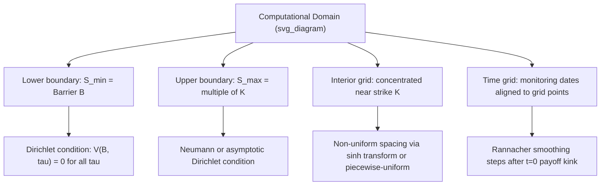

## Finite Difference Grids and Boundary Conditions

### Overview

The construction of the computational grid and the specification of boundary conditions are foundational design decisions in finite difference pricing of derivatives, directly determining the accuracy, stability, and computational efficiency of the numerical solution. While the choice of time-stepping scheme (explicit, implicit, Crank-Nicolson) governs how the PDE is marched through time, the **grid** — the discretization of the spatial (asset price) and temporal domains — and the **boundary conditions** — the values or constraints imposed at the edges of the truncated computational domain — govern how faithfully the finite, bounded numerical problem approximates the true, unbounded continuous PDE problem.

### Grid Construction Fundamentals

#### Domain Truncation

The Black-Scholes PDE is defined on the semi-infinite domain $S \in (0, \infty)$, but numerical solution requires a finite computational domain $S \in [0, S_{\max}]$ (or, for some formulations, $[S_{\min}, S_{\max}]$). This truncation introduces **truncation error**, distinct from the discretization error of the finite difference approximation itself.

- $S_{\max}$ is typically chosen as a multiple of the strike $K$ or the current spot $S_0$ — commonly $3$–$5\times K$ for vanilla options, though this should be increased for options with payoffs sensitive to extreme moves (e.g., far-OTM digitals, or underlyings with high volatility/fat tails)
- **Key trade-off**: increasing $S_{\max}$ reduces truncation error (the boundary condition's approximation is applied further from the region of interest) but, for a fixed number of grid points $M$, increases $\Delta S$ and thus increases spatial discretization error near the region of interest (typically near the strike, where the payoff has a kink and $\Gamma$ is largest)
- A common heuristic is to choose $S_{\max}$ such that the option's delta and gamma are negligible near the boundary (e.g., $S_{\max}$ several standard deviations, $\sigma\sqrt{T}$, above the strike)

**Key Points**

- Truncation error and discretization error are separate error sources; increasing $S_{\max}$ without proportionally increasing $M$ trades one for the other
- [Inference] a useful diagnostic in practice is to re-run pricing with $S_{\max}$ doubled (holding $\Delta S$ roughly fixed by also doubling $M$) and confirm the price near the region of interest is stable — if the price changes materially, $S_{\max}$ was too small

#### Uniform vs. Non-Uniform Grids

**Uniform grids** space nodes equally: $S_i = i \Delta S$ for $i = 0, \dots, M$. Simple to implement and analyze, but inefficient when the payoff has localized features (a kink at the strike, a barrier level) that require fine resolution in one region but not elsewhere.

**Non-uniform grids** concentrate nodes where accuracy is most needed — typically near the strike (where $\Gamma$ is largest and the payoff is non-smooth) and near any barrier levels (where the payoff has a discontinuity). Common constructions:

- **Piecewise-uniform grids**: finer spacing in a region around the strike/barrier, coarser spacing elsewhere, with matching conditions at the transition points
- **Concentrated/stretched grids** (e.g., hyperbolic sine transformation, following Tavella-Randall): a smooth transformation $S = S(\xi)$ maps a uniform grid in a transformed variable $\xi$ to a non-uniform grid in $S$ that automatically clusters points near the strike:

$$S(\xi) = K + c \cdot \sinh(\alpha \xi + \beta)$$

with parameters $c$, $\alpha$, $\beta$ chosen to control the concentration density around $K$

- **Log-transformed grids**: substituting $x = \ln(S)$ transforms the Black-Scholes PDE into one with constant coefficients (removing the $S$- and $S^2$-dependence in the drift and diffusion terms), which can simplify both the finite difference stencil and grid design, and naturally handles the $S=0$ boundary more gracefully since $x \to -\infty$ rather than a degenerate finite point

**Key Points**

- Non-uniform grids introduce additional complexity in the finite difference stencil derivation, since the standard central-difference formulas for equally-spaced points must be replaced by generalized formulas for unequal spacing (or the transformation approach is used, applying standard uniform-grid formulas in the transformed coordinate)
- For barrier options, grid design is particularly important: placing a grid line **exactly** on the barrier level is standard practice, since interpolating the barrier condition between grid points introduces additional error that can be significant for barrier-sensitive Greeks
- [Inference] non-uniform/concentrated grids generally allow a given level of accuracy to be achieved with fewer total grid points than a uniform grid, improving computational efficiency, though at the cost of implementation complexity

#### Time Grid Considerations

While the spatial grid gets most attention, the time grid also warrants design consideration:

- Time steps are often **finer near maturity** for American options and options with discrete features (dividends, discrete barrier monitoring dates), since these introduce localized non-smoothness in time
- **Rannacher smoothing** (see Explicit/Implicit/Crank-Nicolson schemes) is itself a time-grid design choice: using small implicit time steps immediately after any point of non-smoothness (at $\tau=0$ for the terminal payoff kink, or at each discrete monitoring/dividend date) before reverting to the standard (often larger) Crank-Nicolson steps
- Discrete dividend dates and discrete barrier monitoring dates should be placed **exactly on grid time points**, analogous to aligning spatial grid lines with barriers — this avoids interpolation error in time

### Boundary Conditions

Boundary conditions specify the PDE solution's behavior at the edges of the truncated domain, and are essential to close the system of equations (the finite difference stencil at boundary nodes cannot use the standard central-difference formula, since it would require a "ghost" node outside the domain).

#### Types of Boundary Conditions

**Dirichlet boundary conditions** directly specify the value of $V$ at the boundary:

$$V(S_{\min}, \tau) = g_1(\tau), \qquad V(S_{\max}, \tau) = g_2(\tau)$$

For a European call at $S=0$: $V(0,\tau) = 0$ (the option is worthless if the underlying is worthless, since it can never become ITM under geometric Brownian motion — $S=0$ is an absorbing state). At $S_{\max}$, a common choice for a call is the asymptotic behavior of a deep ITM call:

$$V(S_{\max}, \tau) \approx S_{\max} - Ke^{-r\tau}$$

reflecting that a deep ITM European call behaves like a forward contract (delta $\to 1$, and the put component of put-call parity becomes negligible).

**Neumann boundary conditions** specify the derivative of $V$ at the boundary, most commonly the "linearity" condition:

$$\frac{\partial^2 V}{\partial S^2}\bigg|_{S_{\max}} = 0$$

implying $V$ is locally linear near $S_{\max}$ — a reasonable approximation for a deep ITM call/put/most vanilla payoffs, and often simpler to implement in the finite difference stencil than a precise Dirichlet value, since it avoids needing an explicit closed-form asymptotic price.

**Key Points**

- The choice between Dirichlet and Neumann boundaries generally has limited impact on prices *near* the region of interest (near the strike) provided $S_{\max}$ is sufficiently far away — this is a direct consequence of the domain-of-dependence properties of parabolic PDEs, where boundary effects decay with distance and time
- For puts, the natural boundary is often $V(S_{\max}, \tau) = 0$ (a deep OTM put is worthless), the mirror case to the call's $S=0$ boundary
- Boundary condition choice becomes more consequential for options with payoffs that don't asymptote smoothly (e.g., some exotic structures), requiring more careful derivation of the correct asymptotic behavior

#### Barrier-Specific Boundary Conditions

For barrier options, the barrier level itself becomes an internal or domain-edge boundary condition:

- **Knock-out barriers**: $V(B, \tau) = 0$ for all $\tau$ (once the barrier is touched, the option is worthless) — this is naturally imposed by setting the grid domain to terminate exactly at the barrier (for a down-and-out, the grid's lower boundary is $S_{\min} = B$ rather than $S_{\min}=0$), turning what would otherwise be an internal condition into a domain-edge Dirichlet condition
- **Knock-in barriers**: typically priced via the in-out parity relationship (Knock-in + Knock-out = Vanilla), rather than solved directly with a barrier-specific boundary condition, since the knock-in payoff is contingent on a path event rather than a simple terminal condition
- **Double barriers**: require Dirichlet conditions at *both* $S_{\min} = B_{\text{lower}}$ and $S_{\max} = B_{\text{upper}}$, naturally bounding the domain without needing a separate truncation choice

**Key Points**

- Placing the barrier exactly on a grid line (rather than truncating the domain at an arbitrary multiple of $K$) is a natural and standard grid design simplification specific to barrier options, since the barrier already provides a natural, financially-motivated domain edge
- Discretely-monitored barriers (checked only at specific dates, not continuously) require the barrier condition to be applied only at those time-grid points, not at every time step — this is a key modeling distinction from continuously-monitored barriers, and requires the time grid to include the monitoring dates exactly (see Time Grid Considerations)

#### Boundary Conditions at $S = 0$: Degeneracy of the PDE

At $S=0$, the Black-Scholes PDE's diffusion and drift terms (proportional to $S$ and $S^2$) vanish, degenerating to:

$$\frac{\partial V}{\partial \tau} = -rV$$

This ODE has the closed-form solution $V(0,\tau) = V(0,0)e^{-r\tau}$, which is used directly as the exact boundary condition at $S=0$ rather than requiring a finite-difference approximation — a case where the PDE's own structure supplies an exact, closed-form boundary value.

### Grid Convergence and Richardson Extrapolation

Since finite difference solutions converge to the true PDE solution as $\Delta S, \Delta \tau \to 0$, a standard technique to both estimate and reduce discretization error is **Richardson extrapolation**: solving the problem on two (or more) grids of different resolution and combining the results to cancel the leading-order error term. For a scheme with error $O(\Delta S^2)$ (as in Crank-Nicolson), solving on a grid with spacing $\Delta S$ and again with spacing $\Delta S/2$, then extrapolating:

$$V_{\text{extrapolated}} = \frac{4 V_{\Delta S/2} - V_{\Delta S}}{3}$$

removes the leading $O(\Delta S^2)$ error term, yielding an estimate with reduced error — a standard practical technique for improving accuracy without a proportional increase in the finest grid's resolution alone.

**Key Points**

- Richardson extrapolation assumes the error has a known, consistent order (e.g., pure $O(\Delta S^2)$); if the discretization has additional error sources (e.g., unsmoothed discontinuities degrading Crank-Nicolson to a lower effective order locally), extrapolation is less reliable without first addressing those sources (e.g., via Rannacher smoothing)
- Grid convergence testing (successively refining the grid and confirming the price/Greeks stabilize) is a standard validation step in any finite difference pricing implementation, independent of whether extrapolation is used for the final production result

### Illustrative Diagram: Grid and Boundary Structure for a Down-and-Out Barrier Option

### Practical Implementation Considerations

- **Log-price transformation**: using $x = \ln(S)$ as the state variable is a common practical simplification, since it converts the Black-Scholes PDE's variable coefficients into constant coefficients, simplifying both the stencil derivation and handling of the (now naturally unbounded) $S=0$ boundary
- **Grid resolution guidelines**: [Inference] a commonly cited starting point in practitioner literature is on the order of 100–200 spatial nodes and a comparable or greater number of time steps for vanilla European/American options, with finer grids required for path-dependent or barrier-sensitive Greeks (particularly near the barrier, where gamma/vega can be highly localized) — exact requirements are payoff- and accuracy-tolerance-dependent and should be validated via grid convergence testing rather than relied upon as fixed rules
- **Coupling with the time-stepping scheme**: grid and boundary condition design is not independent of the choice of explicit/implicit/Crank-Nicolson scheme — for example, the explicit scheme's stability constraint (tied to $\Delta S$) interacts directly with grid resolution choices, while implicit and Crank-Nicolson schemes decouple this constraint, giving more design freedom for grid concentration
- **Validation against closed-form solutions**: wherever a closed-form solution exists (e.g., European vanillas, some single-barrier cases under flat volatility), grid and boundary condition choices should be validated by confirming the finite difference solution converges to the closed-form price as the grid is refined, before being extended to cases lacking closed-form benchmarks (American options, exotic path-dependencies)

### Related Topics

- Explicit, implicit, and Crank-Nicolson time-stepping schemes
- Rannacher smoothing and handling of non-smooth payoffs/monitoring dates
- Log-price transformation and constant-coefficient PDE reformulation
- ADI (Alternating Direction Implicit) schemes for multi-factor PDEs
- Richardson extrapolation and grid convergence analysis
- Barrier option pricing: continuous vs. discrete monitoring
- Linear complementarity problems and American option boundary handling
- Tavella-Randall and other non-uniform grid concentration techniques
- Dividend handling in finite difference schemes (discrete dividend jump conditions)
- Monte Carlo methods as an alternative to grid-based PDE solvers