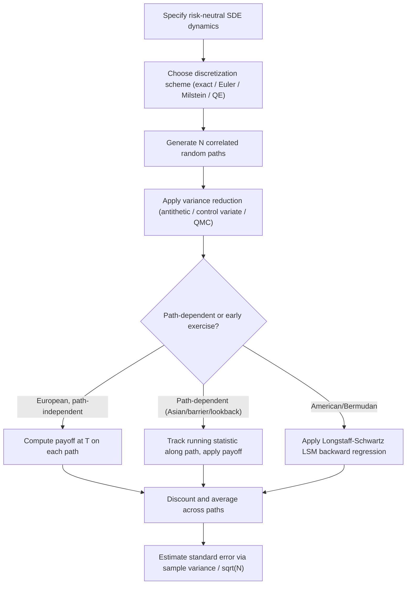

## Monte Carlo Simulation for Derivatives Pricing

### Overview

Monte Carlo simulation is a numerical method for derivatives pricing based on simulating many random sample paths of the underlying risk factor(s), computing the discounted payoff along each path, and averaging over all simulated paths to estimate the expected value under the risk-neutral measure. It is the standard computational tool for pricing derivatives whose payoffs depend on multiple underlying factors, path-dependency, or high-dimensional state spaces where finite difference (grid-based) PDE methods become computationally intractable due to the **curse of dimensionality**.

The foundational principle is the risk-neutral valuation formula:

$$V_0 = e^{-rT}\,\mathbb{E}^{\mathbb{Q}}[\text{payoff}(S_T, \text{path})]$$

Monte Carlo approximates this expectation by drawing $N$ independent sample paths $\{S^{(j)}\}_{j=1}^{N}$ under the risk-neutral measure $\mathbb{Q}$, computing the payoff on each, and averaging:

$$\hat{V}_0 = \frac{e^{-rT}}{N}\sum_{j=1}^{N} \text{payoff}(S^{(j)})$$

By the law of large numbers, $\hat{V}_0 \to V_0$ as $N \to \infty$, and by the central limit theorem, the standard error of the estimate scales as $O(1/\sqrt{N})$.

### Path Generation

#### Simulating Geometric Brownian Motion

Under the standard Black-Scholes assumption, the risk-neutral dynamics of the underlying are:

$$dS_t = rS_t\,dt + \sigma S_t\,dW_t$$

The exact (non-discretized) solution over a time step $\Delta t$ uses the closed-form lognormal transition:

$$S_{t+\Delta t} = S_t \exp\left[\left(r - \frac{\sigma^2}{2}\right)\Delta t + \sigma\sqrt{\Delta t}\,Z\right]$$

where $Z \sim N(0,1)$. Because this is an **exact** simulation of the GBM process at discrete time points (not an approximation), it introduces no discretization bias for path-independent, terminal-payoff-only options under constant-parameter Black-Scholes dynamics — a single time step from $0$ to $T$ suffices for European option pricing.

#### Discretization Schemes for General SDEs

For more general stochastic differential equations (stochastic volatility, local volatility, interest rate models) where an exact simulation scheme is unavailable, discretization schemes are required:

**Euler-Maruyama scheme**: the simplest discretization, applying a first-order Taylor expansion:

$$S_{t+\Delta t} = S_t + \mu(S_t, t)\Delta t + \sigma(S_t, t)\sqrt{\Delta t}\,Z$$

Has weak convergence order $O(\Delta t)$ and strong convergence order $O(\sqrt{\Delta t})$. Simple to implement but can introduce meaningful discretization bias for coarse time steps, particularly for processes with state-dependent volatility.

**Milstein scheme**: adds a correction term accounting for the derivative of the diffusion coefficient, improving strong convergence order to $O(\Delta t)$:

$$S_{t+\Delta t} = S_t + \mu\Delta t + \sigma\sqrt{\Delta t}\,Z + \frac{1}{2}\sigma\frac{\partial \sigma}{\partial S}\Delta t (Z^2-1)$$

Generally preferred over Euler-Maruyama when higher path accuracy is needed and the diffusion coefficient's derivative is tractable to compute.

**Key Points**

- Weak convergence measures the accuracy of the simulated distribution's moments/expectations (relevant for pricing); strong convergence measures pathwise accuracy (relevant for hedging/Greeks via pathwise methods and for multilevel Monte Carlo)
- For models without closed-form transition densities (e.g., the Heston stochastic volatility model, most local volatility specifications), the choice of discretization scheme and time step directly affects pricing bias, and this bias must be assessed via convergence testing (comparing prices across successively finer time grids)
- Specialized schemes exist for specific models where standard Euler/Milstein schemes perform poorly — for example, the **Andersen QE (Quadratic Exponential) scheme** for the Heston model addresses the risk of the variance process going negative under naive discretization

### Payoff Types and Path Dependency

Monte Carlo's core comparative advantage over finite difference PDE methods is its natural handling of **path-dependent payoffs** and **high-dimensional problems**:

- **Path-independent (European) payoffs**: $\text{payoff}(S_T)$ — Monte Carlo works but is generally not the preferred method here, since PDE/finite-difference or closed-form methods are typically faster and more accurate for single-factor European payoffs
- **Path-dependent payoffs**: Asian options (average price/strike), lookback options, barrier options with discrete/continuous monitoring, cliquets — Monte Carlo naturally accommodates these by recording the relevant path statistic (running average, running max/min, barrier-hit indicator) as each path is simulated
- **Multi-asset/high-dimensional payoffs**: basket options, rainbow options, worst-of/best-of structures — Monte Carlo's computational cost scales roughly linearly with the number of underlyings (via correlated multivariate simulation), whereas grid-based PDE methods scale exponentially with dimension (the curse of dimensionality), making Monte Carlo the practical choice beyond 2–3 factors

**Example**: Pricing a worst-of basket put option on 5 correlated equity indices requires simulating correlated paths for all 5 underlyings (via Cholesky decomposition of the correlation matrix applied to independent normal draws), computing the worst-performing index's terminal value on each path, and applying the put payoff. A 5-dimensional finite difference grid would require an infeasible number of grid points (e.g., $100^5 = 10^{10}$ nodes for 100 points per dimension), while Monte Carlo's cost scales only with the number of paths and the (linear, not exponential) cost of simulating 5 correlated processes per path.

### American/Early-Exercise Options: Least-Squares Monte Carlo (LSM)

Standard Monte Carlo naturally prices European-style (terminal-exercise) payoffs, since the expectation is a simple forward simulation and average. American-style early exercise is more challenging because the optimal exercise decision at each time requires comparing the immediate exercise value against the **continuation value** — the expected value of holding the option — which itself depends on future (as-yet-unsimulated-forward) information.

The **Longstaff-Schwartz (2001) Least-Squares Monte Carlo (LSM)** algorithm is the standard solution:

1. Simulate $N$ paths forward to maturity $T$
2. Working backward from $T$, at each exercise date $t_i$, restrict attention to paths that are currently in-the-money (candidates for exercise)
3. Regress the (discounted) realized continuation value (i.e., the value actually received on each path if not exercised at $t_i$) against a set of basis functions of the current state $S_{t_i}$ (commonly low-order polynomials, e.g., $1, S, S^2$, or Laguerre polynomials)
4. Use the fitted regression to estimate the continuation value at $t_i$ for each in-the-money path; compare to the immediate exercise value and determine the optimal exercise decision
5. Update the cash flow for each path accordingly and continue backward to $t_{i-1}$
6. Discount all resulting cash flows back to $t=0$ and average

**Key Points**

- LSM is a **regression-based approximation** to the true optimal exercise boundary; it does not solve for the exercise boundary exactly, so it introduces a (typically small, downward-biased) approximation error relative to the true American option value
- The choice of basis functions affects accuracy: too few basis functions underfit the continuation value (leading to suboptimal exercise decisions and downward-biased prices); too many can overfit and introduce noise, particularly with a limited number of paths
- LSM is the standard industry approach for American/Bermudan-style path-dependent derivatives (e.g., Bermudan swaptions, American-style basket options) where PDE grid methods are infeasible due to dimensionality
- [Inference] LSM's regression-based continuation value estimate is known in the literature to produce a low-biased price estimate (since suboptimal exercise from regression error can only reduce value relative to the true optimal policy), which has motivated dual/upper-bound methods (e.g., Andersen-Broadie) to bound the true price from both sides

### Variance Reduction Techniques

Because Monte Carlo's standard error scales as $O(1/\sqrt{N})$, reducing variance without proportionally increasing computational cost is a central practical concern. Standard techniques:

#### Antithetic Variates

For each simulated random draw $Z$, also compute the path using $-Z$, and average the two resulting payoffs. This exploits the negative correlation between paths driven by $Z$ and $-Z$ to reduce the variance of the payoff average, at essentially no additional random number generation cost (the antithetic path reuses the same draws, negated).

#### Control Variates

If a related derivative with a known closed-form (or otherwise low-variance, accurately known) price exists, its simulated estimate can be used to correct the target derivative's Monte Carlo estimate:

$$\hat{V}_{\text{target}}^{\text{CV}} = \hat{V}_{\text{target}} - \beta\left(\hat{V}_{\text{control}} - V_{\text{control}}^{\text{exact}}\right)$$

where $\beta$ is chosen (often via regression, analogous to the minimum-variance hedge ratio) to minimize the variance of the corrected estimator. A classic example: using a European vanilla option (priced exactly via Black-Scholes) as a control variate when pricing an Asian option via Monte Carlo, since the two payoffs are highly correlated.

#### Importance Sampling

Reweights the sampling distribution to sample more heavily from regions of the state space that contribute most to the payoff's expectation (e.g., the tail region relevant to a deep OTM option or a barrier level), then corrects with the appropriate likelihood ratio (Radon-Nikodym derivative) to maintain an unbiased estimator. Particularly effective for rare-event-sensitive payoffs (deep OTM options, low-probability barrier hits) where naive Monte Carlo would require an impractically large number of paths to achieve acceptable variance.

#### Stratified Sampling and Low-Discrepancy Sequences (Quasi-Monte Carlo)

Rather than drawing purely random samples, **quasi-Monte Carlo (QMC)** methods use deterministic, low-discrepancy sequences (e.g., Sobol or Halton sequences) designed to fill the sample space more evenly than random sampling, reducing the effective error rate to approach $O(1/N)$ (rather than $O(1/\sqrt{N})$) for suitably smooth, low-to-moderate-dimensional problems — though the theoretical convergence advantage of QMC can degrade in very high dimensions, and payoff discontinuities (e.g., digital or barrier payoffs) can also reduce QMC's practical advantage over standard Monte Carlo.

**Key Points**

- Variance reduction techniques do not change the estimator's expected value (unbiasedness is preserved for antithetic variates, control variates, and correctly-implemented importance sampling); they reduce the number of paths needed to achieve a target precision
- Combining multiple techniques (e.g., antithetic variates with a control variate) is common and can compound variance reduction benefits, though the combined gain is not always simply additive and should be empirically verified
- QMC methods generally lose their randomness-based statistical error estimates (standard confidence intervals from CLT don't directly apply), requiring alternative error estimation approaches (e.g., randomized QMC, which reintroduces limited randomization to enable variance/error estimation)

### Computing Greeks via Monte Carlo

Estimating sensitivities (Greeks) via Monte Carlo requires care, since naive finite-difference "bump and reprice" approaches (re-running the simulation with a perturbed input and differencing) can be noisy, particularly for higher-order Greeks (gamma) or discontinuous payoffs (digitals, barriers).

- **Bump-and-reprice (finite difference on the simulation)**: simplest approach, re-simulate with $S_0 \pm \Delta S$ and difference; using the **same random number seed** across the base and bumped simulations (common random numbers) substantially reduces the variance of the estimated Greek relative to using independent seeds
- **Pathwise differentiation method**: differentiates the payoff function directly with respect to the input parameter along each simulated path (where the payoff is differentiable), giving an unbiased, typically lower-variance Greek estimate without needing to re-simulate — but fails for discontinuous payoffs (e.g., digitals) where the pathwise derivative does not exist at the discontinuity
- **Likelihood ratio method**: differentiates the probability density (rather than the payoff) with respect to the parameter, producing an estimator that works even for discontinuous payoffs, at the cost of typically higher variance than pathwise differentiation when both are applicable

### Illustrative Diagram: Monte Carlo Pricing Workflow

### Worked Example: European Call via Monte Carlo with Variance Reduction

Price a European call: $S_0 = 100$, $K = 100$, $r = 5\%$, $\sigma = 20\%$, $T = 1$ year, using $N = 10{,}000$ paths with antithetic variates ($5{,}000$ independent $Z$ draws, each paired with its antithetic $-Z$).

For each draw $Z_j$:

$$S_T^{(j)} = 100\exp\left[(0.05 - 0.02)(1) + 0.20\sqrt{1}\,Z_j\right] = 100\exp[0.03 + 0.20 Z_j]$$

$$S_T^{(j,\text{anti})} = 100\exp[0.03 - 0.20 Z_j]$$

Each pair's averaged, discounted payoff:

$$\hat{V}^{(j)} = \frac{e^{-0.05}}{2}\left[\max(S_T^{(j)}-100, 0) + \max(S_T^{(j,\text{anti})}-100,0)\right]$$

The final estimate averages $\hat{V}^{(j)}$ over all $5{,}000$ pairs, with the sample standard deviation of the $\hat{V}^{(j)}$ values (not the raw per-path payoffs) used to compute the standard error — reflecting the reduced variance from antithetic pairing. The Black-Scholes closed-form price for this example is approximately $10.45, which the Monte Carlo estimate should converge toward, with the antithetic-variate standard error typically substantially smaller than a naive (non-antithetic) estimate using the same total number of underlying random draws.

**Key Points**

- This example is deliberately a case where closed-form pricing is available (Black-Scholes), useful for **validating** a Monte Carlo implementation's discretization, random number generation, and variance reduction machinery against a known answer before applying the same engine to genuinely path-dependent or high-dimensional payoffs lacking closed-form benchmarks
- The 95% confidence interval for the Monte Carlo estimate is $\hat{V}_0 \pm 1.96 \times \text{SE}$, where SE is the sample standard error of the payoff average — reporting this alongside the point estimate is standard practice to communicate numerical precision

### Related Topics

- Longstaff-Schwartz Least-Squares Monte Carlo for American/Bermudan options
- Variance reduction: antithetic variates, control variates, importance sampling, QMC
- Discretization schemes: Euler-Maruyama, Milstein, Andersen QE for Heston
- Pathwise and likelihood ratio methods for Monte Carlo Greeks
- Multilevel Monte Carlo (MLMC) for computational efficiency
- Curse of dimensionality and Monte Carlo vs. PDE method selection
- Correlated multi-asset simulation via Cholesky decomposition
- Finite difference grids and boundary conditions (contrast: PDE approach)
- Random number generation and pseudo-random vs. quasi-random sequences
- Convergence diagnostics and confidence interval reporting for simulation-based pricing