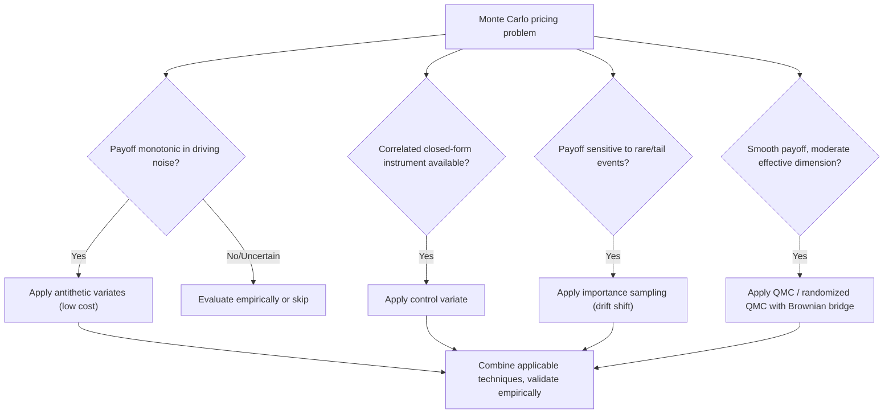

## Variance Reduction Techniques

### Overview

Variance reduction techniques are a class of methods used to reduce the standard error of Monte Carlo estimators without proportionally increasing the number of simulated paths, thereby improving computational efficiency for derivatives pricing. Since the standard error of a naive Monte Carlo estimator scales as $O(1/\sqrt{N})$ — meaning a 4x reduction in error requires a 16x increase in the number of paths $N$ — variance reduction is a central practical concern in any production Monte Carlo pricing engine, where computational budget is finite and pricing/risk calculations often must run within tight time constraints (e.g., intraday risk, real-time pricing).

All variance reduction techniques share a common goal: reduce $\text{Var}(\hat{V}_0)$ for a fixed computational budget (or equivalently, reduce the computational budget required to achieve a target precision), generally while preserving the estimator's unbiasedness (i.e., $\mathbb{E}[\hat{V}_0]$ remains equal to the true price).

### Antithetic Variates

#### Mechanism

For each simulated standard normal draw $Z$ used to generate a path, also generate the "antithetic" path using $-Z$. Both paths are valid, equally-likely realizations under the risk-neutral measure (since $Z$ and $-Z$ have the same distribution), but they are perfectly negatively correlated as random draws. The payoff estimator averages the pair:

$$\hat{V}^{(j)} = \frac{1}{2}\left[\text{payoff}(S^{(j)}(Z_j)) + \text{payoff}(S^{(j)}(-Z_j))\right]$$

The final price estimate averages $\hat{V}^{(j)}$ across all $N/2$ antithetic pairs (using $N/2$ independent normal draws total, each generating 2 paths, for $N$ total simulated paths).

#### Variance Reduction Condition

Antithetic variates reduce variance specifically when the payoff function, as a function of the underlying path, exhibits **negative correlation** between the payoff computed with $Z$ and the payoff computed with $-Z$. This holds when the payoff is a **monotonic function** of the underlying driving noise (e.g., a standard vanilla call or put, where a higher terminal $S_T$ from a positive $Z$ draw and a lower terminal $S_T$ from the corresponding $-Z$ draw produce payoffs that move in predictably opposite directions relative to their mean).

**Key Points**

- Antithetic variates are essentially free from a random-number-generation standpoint — the antithetic path reuses the same underlying draws, negated, so no additional random number generation cost is incurred for the "second" path in each pair
- The technique can fail to reduce (and in some cases can slightly increase) variance for payoffs that are **non-monotonic** or symmetric in a way that makes $Z$ and $-Z$ produce similar rather than offsetting payoffs (e.g., certain symmetric barrier or straddle-like structures where the payoff function is closer to even than odd in the driving noise)
- [Inference] in practice, antithetic variates are one of the most commonly implemented variance reduction techniques precisely because of this near-zero implementation and computational cost, even though the variance reduction magnitude is payoff-dependent and sometimes modest

### Control Variates

#### Mechanism

If a related instrument or payoff exists with a known, accurately-computed price $V_{\text{control}}^{\text{exact}}$ (typically a closed-form Black-Scholes price for a related vanilla option), its Monte Carlo estimate $\hat{V}_{\text{control}}$ (computed using the *same* simulated paths as the target derivative) can be used to correct the target estimator:

$$\hat{V}_{\text{target}}^{\text{CV}} = \hat{V}_{\text{target}} - \beta\left(\hat{V}_{\text{control}} - V_{\text{control}}^{\text{exact}}\right)$$

Since $\mathbb{E}[\hat{V}_{\text{control}}] = V_{\text{control}}^{\text{exact}}$, the correction term has expectation zero, so $\hat{V}_{\text{target}}^{\text{CV}}$ remains an unbiased estimator of the target derivative's price for any choice of $\beta$. The optimal $\beta$ minimizing the variance of $\hat{V}_{\text{target}}^{\text{CV}}$ is:

$$\beta^* = \frac{\text{Cov}(\hat{V}_{\text{target}}, \hat{V}_{\text{control}})}{\text{Var}(\hat{V}_{\text{control}})}$$

analogous in form to the minimum-variance hedge ratio (a regression coefficient). In practice, $\beta^*$ is estimated from the simulated sample itself (via OLS regression of target payoffs on control payoffs across the simulated paths), or a pilot simulation.

#### Choosing a Control Variate

The effectiveness of the control variate technique depends entirely on the correlation between the target and control payoffs — higher correlation yields greater variance reduction:

$$\text{Var}(\hat{V}_{\text{target}}^{\text{CV}}) = \text{Var}(\hat{V}_{\text{target}})(1 - \rho^2)$$

where $\rho$ is the correlation between the target and control payoff estimators. A perfectly correlated control ($\rho \to 1$) would in principle eliminate almost all variance; in practice, control variates for realistic exotic payoffs typically achieve $\rho$ well below 1, but the reduction can still be substantial.

**Example**: Pricing an arithmetic-average Asian call via Monte Carlo, using the corresponding **geometric-average** Asian call (which has a closed-form price under Black-Scholes, since the geometric average of lognormal variables is itself lognormal) as the control variate. Because arithmetic and geometric averages are highly correlated for the same underlying path set, this is one of the most effective and widely-used control variate applications in derivatives pricing, often reducing variance by an order of magnitude or more relative to naive Monte Carlo.

**Key Points**

- The control variate must be computed using the **same simulated paths** as the target derivative (not independently simulated), since the variance reduction relies on the pathwise correlation between target and control payoffs
- Multiple control variates can be used simultaneously (multiple regression of the target payoff on several control payoffs), further reducing variance when several correlated closed-form-priced instruments are available
- A poorly chosen control variate (low correlation with the target) provides negligible variance reduction while adding implementation complexity — control variate selection should be guided by structural similarity to the target payoff (matching payoff shape, matching underlying path-dependency type)

### Importance Sampling

#### Mechanism

Importance sampling addresses situations where the payoff's expectation is dominated by a region of the state space that has low probability under the original (risk-neutral) sampling measure — the classic case being deep out-of-the-money options, rare barrier hits, or tail-risk-sensitive payoffs, where naive Monte Carlo wastes most simulated paths on regions contributing zero or near-zero payoff.

The technique reweights the sampling distribution to a new measure $\tilde{\mathbb{Q}}$ under which the relevant region is sampled more frequently, then corrects the estimator using the **likelihood ratio** (Radon-Nikodym derivative) $\frac{d\mathbb{Q}}{d\tilde{\mathbb{Q}}}$ to maintain unbiasedness:

$$V_0 = e^{-rT}\,\mathbb{E}^{\tilde{\mathbb{Q}}}\left[\text{payoff}(S_T)\cdot\frac{d\mathbb{Q}}{d\tilde{\mathbb{Q}}}\right]$$

A common practical implementation for Black-Scholes-type dynamics is a **drift shift**: simulating paths under a shifted drift $\tilde{\mu}$ chosen so that terminal values land more frequently in the payoff-relevant region (e.g., shifting the drift upward when pricing a deep OTM call, so more simulated paths finish ITM), then weighting each path's payoff by the likelihood ratio between the original and shifted measures (a Girsanov-type exponential martingale correction).

**Example**: Pricing a deep OTM digital call with strike far above the current forward price. Under naive Monte Carlo, the vast majority of simulated paths finish OTM (payoff zero), and only a small fraction of paths — occurring with low probability — contribute nonzero payoff, leading to high relative variance in the estimator. Importance sampling shifts the simulation drift upward so a much larger fraction of paths finish ITM, then downweights each ITM path's contribution by the appropriate likelihood ratio to correct for the artificially increased ITM probability, substantially reducing the estimator's variance for the same number of paths.

**Key Points**

- Importance sampling requires care in choosing the shifted measure: a poorly chosen shift can *increase* variance relative to naive Monte Carlo if the likelihood ratio weights become highly variable (a large "weight variance" problem, particularly if the shift over- or under-corrects relative to the true payoff-relevant region)
- The theoretically optimal importance sampling measure is payoff-dependent and, in general, is not known in closed form, so practical implementations typically rely on heuristic or asymptotically-motivated shifts (e.g., shifting the drift so the shifted mean coincides with the payoff's exercise boundary) rather than a provably optimal measure
- Importance sampling is a technique most valuable for low-probability, high-impact-on-variance payoff regions — its benefit is comparatively small for at-the-money vanilla payoffs where the relevant probability mass is not concentrated in a rare tail region

### Stratified Sampling

#### Mechanism

Stratified sampling partitions the sample space (typically the domain of the underlying random draws, e.g., the unit interval for a uniform random number, or the real line for a normal draw) into disjoint strata, and ensures a pre-specified, deterministic number of samples are drawn from each stratum (rather than allowing this to be purely random, as in naive Monte Carlo, where stratum representation is itself random and can by chance be uneven).

For a normal draw $Z$ used to generate a path, stratification might divide the cumulative probability space $(0,1)$ into $K$ equal-probability strata, draw exactly $N/K$ uniform samples within each stratum (via inverse transform), and map each to a normal draw. This guarantees the sample evenly represents the full range of the distribution, including tail regions, reducing the sampling variance associated with by-chance clustering of draws.

**Key Points**

- Stratified sampling is most straightforwardly applied to a single (or low-dimensional) source of randomness; for high-dimensional problems (many time steps or many underlyings), stratifying every dimension becomes impractical, and is often combined with or superseded by other techniques (e.g., stratifying only the most influential dimension via a Brownian bridge construction, or using QMC sequences instead)
- Unlike antithetic variates and control variates, stratified sampling changes the sampling procedure itself rather than post-processing/correcting the estimator, requiring more careful implementation to preserve unbiasedness (proper weighting by stratum probability)

### Quasi-Monte Carlo (Low-Discrepancy Sequences)

#### Mechanism

Quasi-Monte Carlo (QMC) replaces pseudo-random number sequences with deterministic **low-discrepancy sequences** (e.g., Sobol sequences, Halton sequences, or lattice rules) explicitly designed to fill the multi-dimensional sample space more evenly than random sampling would, minimizing gaps and clustering. For sufficiently smooth integrands and low-to-moderate effective dimension, QMC methods achieve a convergence rate approaching $O(1/N)$ (or $O((\log N)^d/N)$ for $d$ effective dimensions), substantially better than standard Monte Carlo's $O(1/\sqrt{N})$ — meaning far fewer paths are needed to achieve a given precision.

**Key Points**

- QMC's theoretical convergence advantage depends on the integrand's smoothness and the problem's **effective dimension** (which can be much lower than the nominal dimension for many derivatives pricing problems, particularly when a Brownian bridge path construction concentrates the most influential randomness in the first few dimensions of the sequence) — this is a well-established practical technique for improving QMC performance on high-nominal-dimension path-dependent payoffs
- QMC loses the natural statistical error estimation available from standard Monte Carlo (since the sequence is deterministic, not random, the CLT-based confidence interval does not directly apply); **randomized QMC** (RQMC) — applying a random shift or scramble to the low-discrepancy sequence and averaging over several independent randomizations — restores the ability to estimate error via replication, while retaining most of QMC's variance/error reduction benefit
- QMC's advantage can degrade for payoffs with discontinuities (e.g., digital or barrier payoffs), since the smoothness assumptions underlying QMC's superior convergence rate are violated at the discontinuity — [Inference] in such cases the practical improvement over standard Monte Carlo may be smaller than the theoretical rate suggests, and combining QMC with a smoothing technique (e.g., conditional Monte Carlo on the discontinuous component) can help recover more of the theoretical benefit

### Comparison Summary

| Technique | Mechanism | Best Suited For | Key Limitation |
| --- | --- | --- | --- |
| Antithetic variates | Pair $Z$ and $-Z$ draws | Monotonic payoffs in driving noise | Limited/no benefit for non-monotonic payoffs |
| Control variates | Correct using a correlated, exactly-priced instrument | Payoffs with a structurally similar closed-form analog | Requires a suitable, highly-correlated control |
| Importance sampling | Reweight sampling toward payoff-relevant region | Rare-event/tail-sensitive payoffs (deep OTM, barriers) | Poor shift choice can increase variance |
| Stratified sampling | Force even representation across sample space strata | Low-dimensional randomness sources | Impractical in high dimensions |
| Quasi-Monte Carlo | Deterministic low-discrepancy sequences | Smooth, low effective-dimension problems | Degrades for discontinuous payoffs; loses standard error estimates (without RQMC) |

### Combining Techniques

In practice, production Monte Carlo pricing engines commonly combine multiple variance reduction techniques simultaneously — for example, antithetic variates combined with a control variate, or randomized QMC combined with a Brownian bridge path construction and a control variate. The combined variance reduction is not generally simply additive or multiplicative across techniques and should be validated empirically for the specific payoff and model being priced, since interactions between techniques (e.g., antithetic pairing interacting with control variate regression) can affect the realized combined benefit.

**Key Points**

- A standard diagnostic practice is to report the **variance reduction factor** — the ratio of naive Monte Carlo variance to the variance achieved with the technique(s) applied, for the same total computational cost — as a way of quantifying and communicating the efficiency gain
- [Inference] the choice and combination of variance reduction techniques used in practice is generally guided by the specific payoff structure, model dynamics, and required precision/speed trade-off of the pricing application, rather than a single universally optimal combination

### Illustrative Diagram: Variance Reduction Technique Selection

### Worked Example: Control Variate for Asian Option Pricing

Price an arithmetic-average Asian call ($S_0=100$, $K=100$, $r=5\%$, $\sigma=25\%$, $T=1$, monthly averaging) via Monte Carlo, using the geometric-average Asian call as a control variate.

**Step 1**: Simulate $N = 50{,}000$ paths (12 monthly steps each) under Black-Scholes.

**Step 2**: On each path, compute both the arithmetic-average payoff $\max(\bar{A}_{\text{arith}} - K, 0)$ and the geometric-average payoff $\max(\bar{A}_{\text{geo}} - K, 0)$, where $\bar{A}$ denotes the respective average of the 12 monthly observations.

**Step 3**: Compute the closed-form geometric Asian price $V_{\text{geo}}^{\text{exact}}$ using the known analytic formula (available because the geometric average of lognormal increments is itself lognormal under Black-Scholes).

**Step 4**: Estimate $\beta^*$ via regression of simulated arithmetic payoffs on simulated geometric payoffs across the 50,000 paths, then apply:

$$\hat{V}_{\text{arith}}^{\text{CV}} = \hat{V}_{\text{arith}} - \beta^*\left(\hat{V}_{\text{geo}} - V_{\text{geo}}^{\text{exact}}\right)$$

Because arithmetic and geometric averages of the same path are very highly correlated (typically $\rho > 0.99$ for moderate volatility and averaging frequency), the resulting variance reduction is substantial — [Inference] commonly cited as reducing standard error by a factor of 5–10x or more relative to naive Monte Carlo for the same number of paths, though the exact factor depends on volatility, averaging frequency, and moneyness.

**Key Points**

- This example illustrates the general principle that the best control variates arise from payoffs that are *structurally* similar to the target (same underlying path, same functional form of averaging) rather than merely statistically correlated by coincidence
- The technique generalizes directly to other path-dependent payoffs with a "nearby" closed-form analog — e.g., using a vanilla European option as a control variate for a barrier option, though the correlation (and hence variance reduction) is typically weaker than in the arithmetic/geometric Asian case

### Related Topics

- Monte Carlo simulation fundamentals and path generation schemes
- Longstaff-Schwartz Least-Squares Monte Carlo for American options
- Multilevel Monte Carlo (MLMC) as a complementary efficiency technique
- Brownian bridge construction for path simulation and QMC effective dimension reduction
- Closed-form geometric Asian option pricing formula
- Girsanov's theorem and measure change (theoretical basis for importance sampling)
- Sobol and Halton sequence construction for quasi-Monte Carlo
- Pathwise and likelihood ratio methods for Monte Carlo Greeks
- Finite difference grids as an alternative to Monte Carlo for low-dimensional problems
- Computational performance and parallelization of Monte Carlo pricing engines