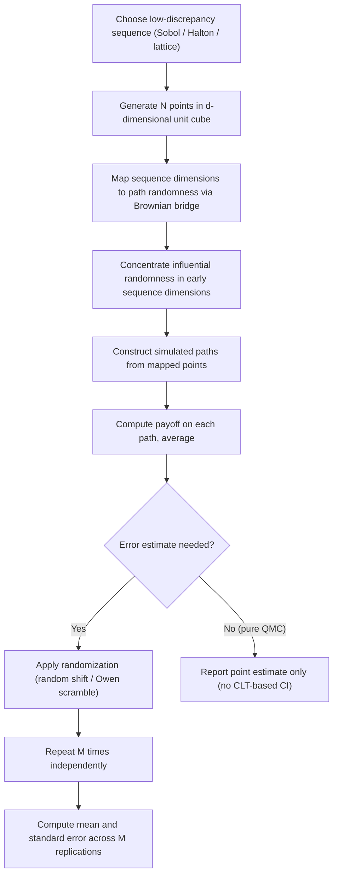

## Quasi Random Sequences and Low Discrepancy Methods

### Overview

Quasi-random sequences (also called low-discrepancy sequences) are deterministic point sets constructed to fill a multi-dimensional unit hypercube more uniformly than pseudo-random sampling, forming the basis of **quasi-Monte Carlo (QMC)** methods for derivatives pricing. Where standard Monte Carlo relies on pseudo-random number generators (PRNGs) that approximate statistical independence and can, by chance, produce clustering or gaps in the sample space, quasi-random sequences are explicitly engineered to minimize such clustering, measured formally via the concept of **discrepancy**. This improved uniformity translates into faster convergence for sufficiently well-behaved (smooth, low effective-dimension) pricing problems.

### Discrepancy: The Formal Measure of Uniformity

**Discrepancy** quantifies how far a set of $N$ points in the $d$-dimensional unit hypercube $[0,1]^d$ deviates from perfectly uniform coverage. The most common formal definition, **star discrepancy**, compares the actual fraction of points falling within any axis-aligned sub-box $[0, \mathbf{x})$ to the sub-box's volume:

$$D_N^* = \sup_{\mathbf{x} \in [0,1]^d} \left|\frac{A(\mathbf{x}; N)}{N} - \text{Vol}([0,\mathbf{x}))\right|$$

where $A(\mathbf{x};N)$ counts points falling in the sub-box. A sequence is called **low-discrepancy** if $D_N^*$ decays asymptotically as $O\left(\frac{(\log N)^d}{N}\right)$, substantially faster than the $O(N^{-1/2})$ typical of purely random point sets (as governed by the law of the iterated logarithm for random sequences).

The **Koksma-Hlawka inequality** connects discrepancy directly to integration error for a function $f$ of bounded variation $V(f)$ (in the Hardy-Krause sense):

$$\left|\frac{1}{N}\sum_{i=1}^N f(x_i) - \int_{[0,1]^d} f(x)\,dx\right| \leq V(f) \cdot D_N^*$$

This inequality is the theoretical foundation for QMC's improved convergence: since $D_N^*$ decays faster than $O(N^{-1/2})$ for low-discrepancy sequences, the integration error bound improves correspondingly — provided $f$ has finite variation, a condition that can be violated or degraded for discontinuous payoffs.

**Key Points**

- The Koksma-Hlawka bound is a *worst-case* deterministic bound, not a probabilistic guarantee like the Monte Carlo central limit theorem — it holds for the specific point set used, not "on average" across random draws
- The bound degrades (becomes less useful) as $d$ grows, since the $(\log N)^d$ term grows with dimension — this is the formal expression of QMC's practical dependence on the problem's **effective dimension** rather than its nominal dimension
- Bounded variation is not guaranteed for common derivatives payoffs (e.g., digital and barrier payoffs have jump discontinuities), which is why QMC's practical advantage for such payoffs is often smaller than its asymptotic theoretical rate would suggest

### Common Low-Discrepancy Sequence Constructions

#### Van der Corput and Halton Sequences

The **Van der Corput sequence** (1-dimensional) is constructed by reversing the digits of the index $n$ in a given base $b$: for $n$ with base-$b$ representation $n = \sum_k a_k b^k$, the sequence value is $\Phi_b(n) = \sum_k a_k b^{-k-1}$. This produces a sequence that fills the unit interval $[0,1]$ progressively more finely as $n$ increases, avoiding the clustering that can occur with random sampling.

The **Halton sequence** extends this to $d$ dimensions by using a different, typically coprime, base $b_j$ (commonly the first $d$ prime numbers) for each dimension $j$:

$$x_n = (\Phi_{b_1}(n), \Phi_{b_2}(n), \dots, \Phi_{b_d}(n))$$

**Key Points**

- Halton sequences are simple to construct and understand but suffer from **correlation between dimensions** as $d$ grows, particularly when higher prime bases are used for later dimensions — this degrades uniformity in high dimensions, a well-documented limitation
- Scrambled or leaped variants of the Halton sequence (e.g., using a permutation of digits, or skipping indices) are used in practice to mitigate this high-dimensional correlation issue

#### Sobol Sequences

**Sobol sequences** are constructed using a base-2 digital construction based on a set of "direction numbers" derived from primitive polynomials over the finite field $GF(2)$, combined via bitwise XOR operations. Sobol sequences are widely regarded as one of the most effective and widely-used low-discrepancy sequence families in quantitative finance applications, due to their good uniformity properties even in moderately high dimensions (hundreds of dimensions is common in practice, e.g., for path simulation with many time steps).

**Key Points**

- Sobol sequences require careful selection of direction numbers (initialization parameters) for each dimension to maintain good uniformity properties; standard, well-validated direction number sets (e.g., those from Joe and Kuo) are commonly used rather than constructing new ones from scratch
- Computationally efficient to generate via bitwise operations, making Sobol sequences practical for large-scale simulation
- [Inference] widely cited in the quantitative finance literature as the default choice for QMC-based derivatives pricing, generally outperforming Halton sequences in the moderate-to-high dimensional settings typical of path-dependent derivatives pricing (many time steps and/or many underlyings)

#### Lattice Rules

**Lattice rules** construct point sets based on a regular lattice structure defined by a generating vector, offering an alternative construction philosophy to digital sequences (Sobol, Halton). Good lattice rules require careful selection of the generating vector (often via computer search optimizing a discrepancy-related criterion) but can offer strong uniformity properties for specific classes of integrands.

### Effective Dimension and Path Construction

A critical practical concept for applying QMC to derivatives pricing is **effective dimension** — the number of dimensions that meaningfully drive the variability of the payoff, which can be much lower than the nominal dimension of the simulation problem (e.g., a path simulated with 252 daily time steps has nominal dimension 252, but the payoff's effective dimension may be much lower if only a few "directions" in that 252-dimensional space materially affect the payoff value).

#### Brownian Bridge Construction

The standard technique for reducing effective dimension is the **Brownian bridge** path construction, which reorders how the underlying Brownian path is built from the sequence of quasi-random draws:

1. Rather than generating the path sequentially in time (draw 1 → $t_1$, draw 2 → $t_2$, etc.), the Brownian bridge first uses the earliest (typically most uniformly well-distributed, lowest-discrepancy) dimensions of the quasi-random sequence to determine the terminal value $W_T$
2. Subsequent draws successively fill in the midpoints of the remaining intervals (bisecting the path), so each additional draw refines the path at a progressively finer time resolution
3. This concentrates the most influential source of path randomness (typically the terminal or coarse-scale path behavior, which dominates most payoff sensitivities) into the first few dimensions of the quasi-random sequence — precisely where Sobol/Halton sequences exhibit their best uniformity properties

**Key Points**

- The Brownian bridge construction does not change the statistical distribution of the simulated path (it remains a valid discretized Brownian motion); it only changes the *order* in which random draws are mapped to time points, which is invisible to standard Monte Carlo but materially improves QMC performance
- This technique is standard practice in QMC-based derivatives pricing and is a primary reason QMC can achieve strong practical performance on nominally high-dimensional (many time step) path simulations despite the Koksma-Hlawka bound's formal degradation with dimension
- **Principal component construction** is an alternative to the Brownian bridge with a similar goal (concentrating variance into early dimensions), constructing the path using the eigenvectors of the covariance matrix of the Brownian path, ordered by eigenvalue magnitude

### Randomized Quasi-Monte Carlo (RQMC)

A key practical limitation of pure QMC is the loss of statistical error estimation: because the sequence is deterministic, there is no natural sampling distribution from which to construct a confidence interval via the central limit theorem, unlike standard Monte Carlo. **Randomized QMC (RQMC)** addresses this by applying a random transformation to the low-discrepancy sequence while preserving its low-discrepancy structure, then repeating the randomization independently multiple times to enable statistical error estimation via replication.

Common randomization techniques:

- **Random shift**: adding a single random vector $\mathbf{U} \sim \text{Uniform}[0,1]^d$ to every point in the sequence (modulo 1), preserving the lattice/sequence structure while introducing randomness
- **Digital scrambling** (e.g., Owen scrambling for Sobol sequences): randomly permutes the digits of each coordinate in a structured way that preserves the sequence's low-discrepancy properties while introducing independence across randomizations

With $M$ independent randomizations, each producing an estimate $\hat{V}_m$, the final estimate and its standard error are computed via ordinary sample statistics across the $M$ replications:

$$\hat{V}_0 = \frac{1}{M}\sum_{m=1}^M \hat{V}_m, \qquad \text{SE} = \frac{s}{\sqrt{M}}$$

where $s$ is the sample standard deviation of the $M$ replicate estimates.

**Key Points**

- RQMC restores the ability to construct valid confidence intervals while typically retaining most of the variance reduction benefit of pure QMC, making it the practically preferred approach over unrandomized QMC in production risk/pricing systems that require documented error estimates
- The number of randomizations $M$ is typically kept modest (e.g., 10–30) relative to the number of points per randomization $N$, since the primary source of accuracy improvement remains the low-discrepancy structure within each randomization, not the number of randomizations itself

### QMC vs. Standard Monte Carlo: Practical Comparison

| Dimension | Standard Monte Carlo | Quasi-Monte Carlo |
| --- | --- | --- |
| Convergence rate (smooth integrand) | $O(N^{-1/2})$ | Up to $O(N^{-1})$ (theoretical, effective-dimension-dependent) |
| Error estimation | Natural via CLT | Requires randomization (RQMC) |
| Performance on discontinuous payoffs | Standard, unaffected by discontinuity type | Degraded relative to theoretical rate |
| High-dimensional performance | Dimension-independent rate (still $O(N^{-1/2})$) | Degrades with nominal dimension unless effective dimension is controlled (e.g., via Brownian bridge) |
| Implementation complexity | Low | Moderate to high (sequence generation, path construction, randomization) |

### Illustrative Diagram: QMC Path Construction and Randomization Workflow

### Worked Example: Sobol-Based QMC for a Basket Option

Price a 5-asset worst-of basket put via QMC. Nominal problem dimension with weekly monitoring over 1 year (52 steps) across 5 correlated assets is $52 \times 5 = 260$.

**Step 1**: Generate a 260-dimensional Sobol sequence of $N = 8{,}192$ points (Sobol sequences are commonly sized as powers of 2 for optimal uniformity properties in their standard construction).

**Step 2**: Apply a Brownian bridge construction *per asset* to order each asset's 52-dimensional block so the terminal and coarse-scale path values map to the earliest, best-distributed Sobol dimensions.

**Step 3**: Apply a Cholesky decomposition of the 5-asset correlation matrix to correlate the underlying Brownian increments across assets, applied to the Brownian-bridge-ordered normal variates (obtained via inverse transform of the Sobol-generated uniforms).

**Step 4**: Compute the worst-of basket put payoff on each of the 8,192 paths, average, and discount.

**Step 5**: For error estimation, repeat Steps 1–4 with $M = 20$ independent Owen-scrambled randomizations of the Sobol sequence, and compute the mean and standard error across the 20 replicate price estimates.

[Inference] Despite the nominal dimension of 260 being far beyond the dimension range where Sobol sequences alone (without Brownian bridge construction) would be expected to retain strong uniformity, the Brownian bridge's concentration of influential randomness into the early sequence dimensions is what allows QMC to still outperform standard Monte Carlo in this setting — this illustrates why path construction technique, not just sequence choice, is central to realizing QMC's practical benefit for path-dependent, multi-asset derivatives.

**Key Points**

- This example demonstrates the combination of three distinct techniques working together: sequence choice (Sobol), dimension reduction (Brownian bridge), and error estimation (Owen scrambling/RQMC) — each addressing a different aspect of the QMC implementation
- Without the Brownian bridge step, applying the raw 260-dimensional Sobol sequence directly to sequential time steps would likely yield substantially degraded uniformity and correspondingly weaker performance relative to standard Monte Carlo, underscoring that sequence choice alone is insufficient for effective QMC implementation

### Related Topics

- Monte Carlo simulation fundamentals and path generation
- Variance reduction techniques (antithetic variates, control variates, importance sampling)
- Brownian bridge and principal component path construction
- Koksma-Hlawka inequality and discrepancy theory
- Owen scrambling and other randomization schemes for Sobol sequences
- Effective dimension estimation for path-dependent payoffs
- Multilevel Monte Carlo as a complementary efficiency technique
- Correlated multi-asset simulation and Cholesky decomposition
- Longstaff-Schwartz LSM combined with QMC for American-style options
- Finite difference grid methods as an alternative for low-dimensional problems