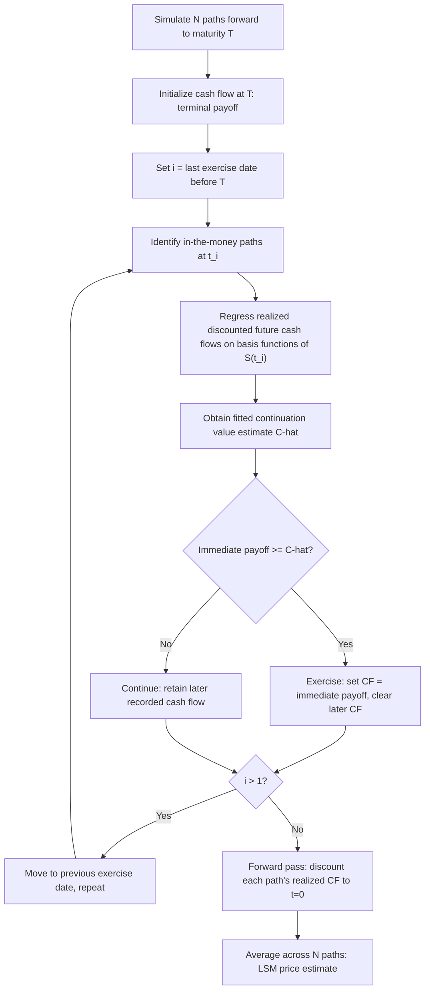

## Least Squares Monte Carlo for American Options

### Overview

Least Squares Monte Carlo (LSM) is a simulation-based algorithm for pricing American-style (and Bermudan-style) options — instruments with early-exercise features — using regression to approximate the continuation value at each exercise opportunity. Introduced by **Longstaff and Schwartz (2001)**, LSM resolved a longstanding practical obstacle to using Monte Carlo simulation for early-exercise derivatives: standard forward simulation naturally handles European (terminal-only) payoffs, but early exercise requires comparing immediate exercise value against the expected value of continuing to hold the option — a quantity that, in a purely forward simulation, depends on future information not yet known at the decision point.

LSM remains the standard industry method for pricing American/Bermudan options via simulation, particularly for high-dimensional problems (multiple underlyings, multiple risk factors) where grid-based finite difference PDE methods become computationally infeasible due to the curse of dimensionality.

### The Core Problem: Continuation Value Estimation

At any exercise date $t_i$ prior to maturity, the holder of an American option faces a choice: exercise immediately and receive the intrinsic payoff $h(S_{t_i})$, or continue holding the option, whose value is the **continuation value**:

$$C(S_{t_i}) = \mathbb{E}^{\mathbb{Q}}\left[e^{-r(t_{i+1}-t_i)} V(S_{t_{i+1}})\,\big|\, \mathcal{F}_{t_i}\right]$$

The optimal exercise policy is to exercise whenever the immediate payoff exceeds the continuation value: $h(S_{t_i}) \geq C(S_{t_i})$. The fundamental difficulty for forward Monte Carlo simulation is that $C(S_{t_i})$ is a *conditional expectation* — computing it exactly would require, for each simulated path, evaluating the expected future value given the current state, which is precisely the recursive/backward structure that dynamic programming (and PDE grid methods) naturally handle, but a single forward-simulated path does not directly provide.

LSM's key insight: **approximate the conditional expectation function $C(\cdot)$ via cross-sectional regression** across all simulated paths at each exercise date, using the *realized, already-simulated* future cash flows on each path as the regression target.

### The Longstaff-Schwartz Algorithm

#### Step-by-Step Procedure

1. **Forward simulation**: Simulate $N$ independent paths of the underlying(s) from $t=0$ to $T$ under the risk-neutral measure, recording the state at each exercise date $t_1, t_2, \dots, t_M = T$
2. **Terminal initialization**: At $t_M = T$, the cash flow on each path is simply the terminal payoff: $CF_j(t_M) = h(S_j(t_M))$
3. **Backward induction**: For $i = M-1, M-2, \dots, 1$:

   a. Identify the subset of paths that are **in-the-money** at $t_i$ (i.e., $h(S_j(t_i)) > 0$) — only these paths are candidates for early exercise and are used in the regression (out-of-the-money paths have no exercise decision to make)

   b. For each in-the-money path $j$, compute the **realized discounted future cash flow**: the discounted value of $CF_j$ at whichever later time it was realized (either from a prior exercise decision on that path, or the terminal payoff), discounted back to $t_i$

   c. **Regress** these realized discounted future cash flows against a set of basis functions of the current state $S_j(t_i)$ (e.g., $1, S, S^2$, or more sophisticated basis sets) via ordinary least squares, obtaining fitted regression coefficients

   d. Use the **fitted regression value** (not the realized cash flow itself) as the estimated continuation value $\hat{C}(S_j(t_i))$ for each in-the-money path

   e. Compare: if $h(S_j(t_i)) \geq \hat{C}(S_j(t_i))$, exercise at $t_i$ — set $CF_j(t_i) = h(S_j(t_i))$ and clear/overwrite any previously recorded later cash flow on that path (since exercising now precludes future cash flows on this path); otherwise, continue holding (the path's recorded cash flow remains whatever was set at the later date)
4. **Final valuation**: Discount each path's realized cash flow (recorded at whichever exercise date, if any, it was triggered, or the terminal date) back to $t=0$, and average across all $N$ paths to obtain the option price estimate

**Key Points**

- The critical conceptual step is using the **regression-fitted value**, not the raw realized future cash flow, as the continuation value estimate for the exercise decision — the raw realized cash flow on any individual path is a noisy, single-path realization, while the regression provides a smoothed, cross-sectional estimate of the *conditional expectation*
- Only in-the-money paths are used in the regression at each step, both because exercise is only ever relevant when the option has positive intrinsic value, and because restricting to ITM paths generally improves the regression's numerical properties (avoiding fitting the function shape in regions irrelevant to the exercise decision)
- The backward induction determines the *exercise policy*, but importantly, the final price is computed via a **forward** pass applying that policy — this distinguishes LSM from directly outputting a price at each backward step, and is part of why LSM produces a valid (if approximate) unbiased-in-the-limit estimator structure

### Basis Function Selection

The choice of regression basis functions is central to LSM's accuracy, since the algorithm approximates the true (unknown, generally nonlinear) continuation value function using a finite-dimensional function space.

**Common basis function choices**:

- **Polynomial basis**: $\{1, S, S^2, S^3, \dots\}$ — simplest, widely used, generally adequate for single-underlying American options with smooth payoffs
- **Laguerre polynomials**: used in Longstaff and Schwartz's original paper, chosen for favorable numerical properties (orthogonality with respect to an appropriate weighting) over the relevant domain
- **Basis functions of multiple state variables**: for multi-asset American/Bermudan options (e.g., basket options, or options where the state includes both the underlying and a stochastic volatility factor), basis functions extend to include cross-terms (e.g., $S_1 S_2$) and functions of each relevant state variable

**Key Points**

- Too few basis functions (underfitting) leads to a poorly-approximated continuation value, resulting in suboptimal exercise decisions and a downward-biased price estimate (since a wrong exercise policy applied consistently across all paths can only be suboptimal, never better than the true optimal policy)
- Too many basis functions (overfitting), particularly relative to the number of ITM paths available at a given exercise date, can introduce regression noise that similarly degrades the exercise decision quality — this is a standard bias-variance trade-off in the regression step
- [Inference] practitioner guidance generally suggests starting with a modest polynomial basis (e.g., degree 2–3) and testing convergence/stability as the basis is expanded, rather than assuming a larger basis is always strictly better, given the interaction with the number of simulated paths available for the regression at each step

### Bias Properties of LSM

LSM is known to produce a **low-biased** price estimator relative to the true American option value. The intuition: the regression-estimated continuation value is an *approximation* to the true continuation value function, so the resulting exercise policy is generally *suboptimal* relative to the true optimal exercise policy. Since the true optimal policy by definition maximizes the option holder's value, any suboptimal (but consistently applied) policy can only produce a value less than or equal to the true value — hence the low bias.

**Key Points**

- As the number of simulated paths $N \to \infty$ and the basis function space becomes sufficiently rich (approaching completeness in the relevant function space), the LSM estimator is understood in the literature to converge to the true American option value — [Inference] this convergence result underpins LSM's theoretical validity as an approximation method, though in any finite implementation, both a finite $N$ and a finite, necessarily incomplete basis function set contribute to the realized low bias
- The magnitude of the low bias in practice depends on basis function adequacy, the number of paths, and the complexity of the true continuation value function's shape — it is not a fixed, universally-sized bias
- This known low-bias property has motivated the development of complementary **upper-bound** methods (see below) to bound the true price from both sides, providing a validated confidence range around the true value rather than relying on the LSM point estimate alone

### Upper Bound Methods: The Andersen-Broadie Algorithm

Because LSM produces a low-biased estimate, a complementary technique is used in practice to obtain an **upper bound** on the true American option value, allowing practitioners to bracket the true price between a low-biased (LSM) and high-biased (dual/upper-bound) estimate.

The **Andersen-Broadie (2004) algorithm** (and related dual/martingale-based approaches building on Rogers (2002) and Haugh-Kogan (2004)) constructs an upper bound using a **duality** result: the American option price equals the minimum, over all martingales $M$, of the expected maximum of the payoff minus the martingale:

$$V_0 = \min_{M} \mathbb{E}\left[\max_{0 \leq t \leq T}\left(h(S_t) - M_t\right)\right]$$

Using the LSM-derived exercise policy (or its implied continuation value estimates) to construct an approximating martingale produces a valid upper bound estimator via nested (secondary) simulation at each exercise date, at substantially higher computational cost than the primal LSM estimate alone.

**Key Points**

- This "primal-dual" approach — LSM for the low-biased primal estimate, Andersen-Broadie or a related dual method for the high-biased estimate — is the standard framework in the literature and in practitioner risk-management contexts requiring validated price bounds for American-style derivatives, particularly for high-dimensional Bermudan products (e.g., Bermudan swaptions) where independent validation via PDE grid methods is infeasible
- The dual/upper-bound computation is materially more computationally expensive than the primal LSM estimate (due to the nested simulation requirement), so it is typically used for periodic validation or specific high-stakes valuations rather than as a routine daily pricing/risk calculation

### LSM for Multi-Asset and High-Dimensional Problems

LSM's primary practical advantage over PDE grid methods for American-style options is its favorable scaling with dimensionality:

- **PDE/finite difference methods**: computational cost grows exponentially with the number of state variables (underlyings, stochastic factors) — the curse of dimensionality — making grid methods impractical beyond roughly 2–3 factors
- **LSM**: computational cost scales primarily with the number of simulated paths and the number of basis functions (which itself may need to grow with dimensionality, but far less severely than a grid's exponential scaling), making LSM the practical standard for American/Bermudan-style options on multiple underlyings (e.g., American-style basket options, worst-of/best-of structures with early exercise) or under multi-factor models (e.g., American options under stochastic volatility, or Bermudan swaptions under multi-factor interest rate models)

**Example**: Pricing a Bermudan swaption (the right to enter an interest rate swap at any of several pre-specified exercise dates) under a multi-factor interest rate model (e.g., a 2- or 3-factor LIBOR market model or HJM framework) is a canonical LSM application in fixed income derivatives, since the underlying state space (multiple forward rates, multiple risk factors) is far too high-dimensional for a PDE grid approach, but is naturally handled by LSM's simulation-and-regression framework, using basis functions of the relevant swap rate(s) or forward rates at each exercise date.

### Illustrative Diagram: LSM Backward Induction Workflow

### Worked Example: LSM for a Single-Asset American Put

Price an American put: $S_0 = 40$, $K = 40$, $r = 6\%$, $\sigma = 20\%$, $T = 1$ year, with exercise permitted at 3 equally-spaced dates ($t_1 = 1/3$, $t_2 = 2/3$, $t_3 = 1$), using $N$ simulated paths and a basis of $\{1, S, S^2\}$.

**At $t_3 = T$**: cash flow on each path is $\max(K - S(t_3), 0)$.

**At $t_2$**: for paths where $S(t_2) < K$ (in-the-money for the put), regress the discounted $t_3$ cash flow (discounted back one period) against $\{1, S(t_2), S(t_2)^2\}$ using only those ITM paths. For each ITM path, compute the fitted continuation value from the regression coefficients, compare against the immediate exercise value $K - S(t_2)$, and set the exercise decision accordingly.

**At $t_1$**: repeat the same regression-and-comparison procedure, using each path's cash flow as recorded after the $t_2$ decision (either the $t_2$ exercise value if exercised there, or the $t_3$ terminal value discounted back, if not).

**Final step**: discount each path's realized cash flow (at whichever date it was set) back to $t=0$ and average across all $N$ paths.

[Inference] This is the canonical textbook example used in Longstaff and Schwartz's original paper (with slightly different specific parameters) to illustrate the algorithm's mechanics on a simple, easily-verified case; the resulting price should lie close to (but, due to the low-bias property, generally at or slightly below) the true American put value obtainable via a binomial tree or finite difference benchmark for the same parameters.

**Key Points**

- This worked example uses only 3 exercise dates for tractability of illustration; production Bermudan/American option pricing typically uses many more exercise dates (or continuous-exercise approximation via a fine discrete grid) to accurately approximate true American-style continuous exercise
- The regression at $t_1$ uses cash flows that may themselves reflect an *estimated* (not certain) exercise decision made at $t_2$ — this recursive dependency on earlier (in the backward sense) approximate decisions is inherent to the algorithm and is part of why basis function adequacy at every step, not just the final one, affects overall accuracy

### Related Topics

- Monte Carlo simulation fundamentals and path generation
- Finite difference PDE methods for American options (Brennan-Schwartz, projected SOR)
- Andersen-Broadie and dual/martingale upper-bound methods
- Bermudan swaption pricing under multi-factor interest rate models
- Basis function selection and regression diagnostics in simulation-based pricing
- Variance reduction techniques applied to LSM (control variates for early-exercise problems)
- Curse of dimensionality and method selection for high-dimensional derivatives
- Optimal stopping theory and dynamic programming foundations
- Quasi-Monte Carlo combined with LSM for path-dependent American options
- Convergence analysis: path count and basis function richness trade-offs