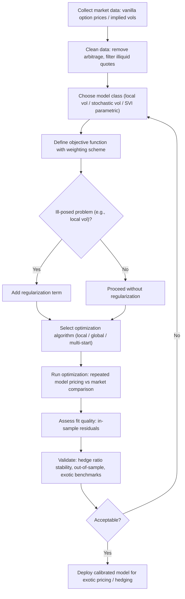

## Model Calibration and Fitting Techniques

### Overview

Model calibration is the process of determining a pricing model's parameters so that the model's theoretical prices match observed market prices of liquid instruments (typically vanilla options) as closely as possible, subject to a chosen error metric and optimization procedure. Calibration is distinct from **statistical estimation** (fitting a model to historical time-series data to estimate real-world, physical-measure parameters): calibration operates under the **risk-neutral measure**, fitting model parameters to current market-observed prices so the model can be used to price and hedge other (typically exotic or less liquid) instruments consistently with the market's current pricing of liquid, hedgeable instruments.

Calibration sits at the intersection of numerical optimization, PDE/Monte Carlo pricing (used repeatedly inside the calibration loop to generate model prices for comparison against market prices), and model risk management, since a poorly calibrated or poorly-specified model can produce systematically biased exotic option prices and hedge ratios even if the calibration technically "succeeds" in matching the vanilla option surface.

### The General Calibration Framework

#### Objective Function

Calibration is formulated as a numerical optimization problem: find model parameters $\theta$ that minimize the discrepancy between model-implied prices (or implied volatilities) and market-observed prices across a set of liquid calibration instruments:

$$\theta^* = \arg\min_{\theta} \sum_{i=1}^{n} w_i \left(V_i^{\text{model}}(\theta) - V_i^{\text{market}}\right)^2$$

where $V_i^{\text{market}}$ are observed market prices (or implied volatilities) for $n$ calibration instruments (typically a grid of vanilla options across strikes and maturities), $V_i^{\text{model}}(\theta)$ are the corresponding model prices given parameters $\theta$, and $w_i$ are weights reflecting the relative importance, liquidity, or reliability of each calibration point.

**Key Points**

- Calibrating to **implied volatilities** rather than raw prices is common practice, since implied volatility differences are more directly interpretable and comparable across strikes/maturities than raw price differences (which can vary by orders of magnitude across deep OTM vs. near-ATM options)
- Weighting schemes commonly emphasize liquid, near-the-money instruments (tighter bid-offer, more reliable market prices) over illiquid deep OTM/ITM options, or weight by vega (since price errors translate to implied volatility errors roughly inversely to vega, so vega-weighting can help equalize the calibration's sensitivity to price vs. volatility error across the surface)
- The choice of calibration instrument set (which strikes, which maturities) directly determines what aspects of the volatility surface the calibrated model will fit well versus poorly — a model calibrated only to short-dated options may perform poorly when used to price long-dated exotics, and vice versa

#### Well-Posedness and Regularization

Calibration problems in derivatives pricing are frequently **ill-posed** in the mathematical sense: multiple, quite different parameter sets can produce nearly identical fits to the observed market prices (non-uniqueness), and small changes in market data can produce large, unstable changes in the calibrated parameters (sensitivity/instability). This is a particularly well-documented issue for **local volatility surface calibration** (see below), where the calibration problem is a genuinely ill-posed inverse problem in the mathematical sense.

**Regularization techniques** address ill-posedness by adding a penalty term to the objective function that discourages implausible or overly complex parameter configurations:

$$\theta^* = \arg\min_{\theta} \left[\sum_i w_i\left(V_i^{\text{model}}(\theta) - V_i^{\text{market}}\right)^2 + \lambda \cdot R(\theta)\right]$$

where $R(\theta)$ penalizes some measure of roughness, complexity, or deviation from a prior/reference parameter set, and $\lambda$ controls the trade-off between fit quality and regularization strength. Common regularization approaches include **Tikhonov regularization** (penalizing the squared deviation from a prior parameter set or the squared norm of parameter derivatives, encouraging smoothness) and **entropy-based regularization** (penalizing deviation from a reference/prior distribution).

**Key Points**

- The regularization strength $\lambda$ itself typically requires calibration or judgment (e.g., via cross-validation, the L-curve method, or practitioner experience) — too little regularization leaves the ill-posedness problem largely unaddressed; too much regularization can degrade the fit to observed market prices beyond an acceptable tolerance
- [Inference] regularization choices materially affect the resulting exotic option prices and hedge ratios derived from the calibrated model, even when multiple regularization choices produce visually similar fits to the vanilla surface — this is a recognized source of model risk in local volatility and other ill-posed calibration settings

### Calibration Approaches by Model Class

#### Black-Scholes Implied Volatility "Calibration"

The simplest case: for each individual vanilla option (a single strike/maturity pair), Black-Scholes has exactly one free parameter ($\sigma$), so "calibration" reduces to inverting the Black-Scholes formula to find the implied volatility matching the observed market price — a one-dimensional root-finding problem (commonly solved via Newton-Raphson or Brent's method), not a genuine multi-parameter optimization. This produces the **implied volatility surface** itself (volatility as a function of strike and maturity), rather than a single global model calibration.

#### Local Volatility Calibration (Dupire's Equation)

**Dupire's formula** provides a closed-form (in principle) way to derive the local volatility function $\sigma_{\text{loc}}(S,t)$ directly from the full continuum of European option prices $C(K,T)$ across all strikes and maturities:

$$\sigma_{\text{loc}}^2(K,T) = \frac{\frac{\partial C}{\partial T} + rK\frac{\partial C}{\partial K}}{\frac{1}{2}K^2\frac{\partial^2 C}{\partial K^2}}$$

In principle, this formula uniquely determines a local volatility surface exactly reproducing the entire observed vanilla option price surface (assuming that surface is arbitrage-free and sufficiently smooth). In practice, this is a severely ill-posed numerical problem: the formula requires numerically differentiating a discretely-sampled, noisy market price surface (twice, in the denominator's second derivative with respect to strike), which dramatically amplifies noise present in the input data.

**Practical implementations** therefore typically avoid direct application of Dupire's formula to raw market data, instead using one of:

- **Parametric implied volatility surface fitting first** (e.g., SVI — see below), then applying Dupire's formula analytically to the smooth, arbitrage-free parametric surface rather than noisy raw market quotes
- **Optimization-based local volatility calibration**: directly optimizing the local volatility surface (often parameterized on a grid with regularization) to match market prices via repeated PDE pricing inside the optimization loop, rather than via the closed-form Dupire formula
- **Trinomial/implied tree methods** (e.g., Derman-Kani, Rubinstein): constructing a discrete tree with node transition probabilities calibrated to match market option prices, providing a discretized analog to the continuous local volatility surface

**Key Points**

- Local volatility calibration, even when successful in matching the vanilla surface, is known in the literature to produce **unrealistic forward volatility dynamics** — the local volatility model implies future implied volatility surfaces that flatten out over time in a way not generally consistent with observed market behavior, a well-documented limitation motivating stochastic and stochastic-local volatility model extensions
- The requirement for smooth, arbitrage-free input data (no calendar or butterfly arbitrage in the input surface) means practical local volatility calibration workflows typically include an arbitrage-checking/cleaning step on the raw market data before calibration

#### Stochastic Volatility Model Calibration (e.g., Heston)

Stochastic volatility models (Heston, SABR, and others) have a small number of structural parameters (e.g., Heston has 5: initial variance $v_0$, mean-reversion speed $\kappa$, long-run variance $\theta$, volatility-of-volatility $\xi$, and correlation $\rho$) that must be jointly calibrated to fit the observed volatility surface as closely as possible, typically via nonlinear least-squares optimization since these models generally lack the closed-form parameter-to-price mapping.

The **Heston model** benefits from a semi-closed-form pricing formula (via Fourier/characteristic function methods, e.g., the Carr-Madan FFT approach or the COS method), which allows fast repeated pricing of vanilla options during the optimization loop — a substantial practical advantage over models requiring full Monte Carlo or PDE pricing at each optimization iteration.

**Key Points**

- Because stochastic volatility models have far fewer free parameters than a full local volatility surface, they are generally *less* prone to the ill-posedness/overfitting concerns of local volatility calibration, but correspondingly have *less flexibility* to exactly match every point of an observed volatility surface — the calibrated fit will generally show some residual error even at the optimal parameters, unlike local volatility's (in principle) exact fit
- Parameter identifiability can still be a practical concern: certain parameter combinations (e.g., $\xi$ and $\rho$ in Heston) can exhibit near-flat regions in the objective function (multiple parameter combinations producing similar fit quality), requiring careful optimization diagnostics and potentially additional constraints or priors
- **SABR** (Stochastic Alpha Beta Rho) is particularly popular for interest rate derivatives (caps/floors, swaptions) due to its closed-form asymptotic implied volatility approximation (Hagan et al. 2002), which allows near-instantaneous calibration to a single smile via simple parameter fitting rather than requiring iterative numerical pricing

#### Parametric Implied Volatility Surface Models (SVI)

The **SVI (Stochastic Volatility Inspired)** parameterization, introduced by Gatheral, is a widely-used parametric functional form for fitting a smooth, (in its "raw" and "SVI-JW" arbitrage-free variants) no-arbitrage implied total variance smile at a single maturity:

$$w(k) = a + b\left(\rho(k-m) + \sqrt{(k-m)^2 + \sigma^2}\right)$$

where $w(k)$ is the total implied variance (implied volatility squared times time-to-maturity) as a function of log-moneyness $k$, and $a, b, \rho, m, \sigma$ are the five SVI parameters fitted per maturity slice via least-squares.

**Key Points**

- SVI is primarily a **smoothing and interpolation tool** for the implied volatility surface itself, rather than a full stochastic model of the underlying's dynamics — it does not by itself provide a consistent model for pricing exotic, path-dependent derivatives, but is widely used as an input/pre-processing step (e.g., feeding a clean, arbitrage-free surface into Dupire's local volatility formula, or as the calibration target surface for a stochastic volatility model fit)
- Ensuring no calendar-spread arbitrage across maturities (each SVI slice must be consistent with adjacent maturity slices) requires additional constraints beyond fitting each maturity slice independently — this is a well-documented practical consideration in SVI implementation

### Numerical Optimization Techniques

Calibration is, at its core, a numerical optimization problem, and the choice of optimization algorithm affects both computational efficiency and the likelihood of finding a good (ideally global, or at least a good local) minimum of a generally non-convex objective function.

**Local optimization methods**:

- **Levenberg-Marquardt**: a standard choice for nonlinear least-squares calibration problems, blending gradient descent and Gauss-Newton approaches, generally efficient when a reasonable starting point is available and the objective function is reasonably well-behaved near the optimum
- **BFGS / L-BFGS (quasi-Newton methods)**: general-purpose gradient-based optimizers, commonly used when analytic or efficiently-computable gradients of the objective function (with respect to model parameters) are available

**Global optimization methods** (used when the objective function may have multiple local minima, or when a good starting point is not available):

- **Differential evolution, genetic algorithms, simulated annealing**: population-based or stochastic search methods that explore the parameter space more broadly than local gradient-based methods, at higher computational cost
- A common practical compromise is a **multi-start local optimization**: running a local optimizer (e.g., Levenberg-Marquardt) from multiple different starting points across the parameter space and selecting the best resulting fit, balancing computational cost against the risk of converging to a poor local minimum

**Key Points**

- [Inference] the choice between local and global optimization approaches in practice typically depends on the specific model's objective function landscape (how prone it is to multiple local minima), the availability of good initial parameter guesses (e.g., from a previous day's calibration, used as a warm-start), and the computational budget available for the calibration run (e.g., calibration performed once daily for end-of-day risk vs. calibration needed intraday for real-time pricing)
- Gradient computation cost matters materially for calibration speed: models with semi-closed-form pricing (e.g., Heston via Fourier methods) allow efficient numerical or even analytic gradient computation, while models requiring full Monte Carlo or PDE pricing at each objective function evaluation make gradient computation (especially via finite-difference bumping of each parameter) substantially more expensive

### Calibration Quality Assessment and Model Risk

**Key Points**

- **In-sample fit quality**: the residual error between model and market prices at the calibration instruments themselves — a necessary but not sufficient condition for a "good" calibration, since a model can fit the calibration instruments well while still producing poor exotic option prices or unstable hedge ratios (a central model risk concern)
- **Out-of-sample / hedging performance**: assessing how well a calibrated model's implied hedge ratios (Greeks) perform in practice (e.g., via backtesting delta-hedging P&L), or how stable calibrated parameters are from one calibration date to the next — large day-to-day parameter jumps can indicate an unstable, poorly-regularized, or misspecified calibration
- **Cross-validation against exotic benchmark prices**: where available (e.g., broker quotes or consensus pricing services for certain exotic structures), comparing the calibrated model's exotic prices against independent benchmarks provides an important check beyond vanilla-surface fit quality alone
- Model risk management frameworks at financial institutions typically require documented calibration methodology, regular recalibration monitoring, and independent validation of calibration stability and exotic pricing reasonableness — this is a standard component of model governance for any pricing model used in production

### Illustrative Diagram: Calibration Workflow

### Worked Example: Heston Calibration to an Equity Volatility Surface

Calibrate the Heston model to a set of SPX-style vanilla option implied volatilities across 5 maturities (1M, 3M, 6M, 1Y, 2Y) and 7 strikes per maturity (35 total calibration points), using vega-weighted least squares.

**Step 1**: Obtain market implied volatilities and convert to prices (or work directly in implied-volatility space with model-implied volatilities computed by inverting Heston-model prices via Black-Scholes formula inversion).

**Step 2**: Initialize parameters with reasonable starting values (e.g., $v_0 = \theta = $ current ATM implied variance, $\kappa = 2$, $\xi = 0.3$, $\rho = -0.7$, reflecting typical equity-index stylized facts: negative spot-vol correlation, moderate vol-of-vol).

**Step 3**: Use the Heston semi-closed-form (characteristic function / FFT) pricing formula to compute model prices for all 35 calibration points at each optimization iteration.

**Step 4**: Run Levenberg-Marquardt (or a similar local optimizer) minimizing vega-weighted squared implied volatility errors, potentially with multiple random starting points to check for consistency of the resulting optimum.

**Step 5**: Assess the resulting fit — [Inference] typical Heston fits to a full equity index vol surface across many maturities often show visibly larger residual errors in the very short-dated wings (since Heston's diffusive dynamics without jumps generally struggle to generate the steep short-dated skew often observed in equity index markets) even at the optimal parameters, illustrating the structural fit limitations discussed above.

**Key Points**

- This example illustrates why calibration quality assessment must go beyond a single aggregate error metric — examining residuals by maturity/strike bucket reveals *where* the model's structural limitations manifest, informing whether the chosen model class is adequate for the intended pricing/hedging application
- A poor short-dated fit specifically might be judged acceptable if the exotic derivatives to be priced with this calibrated model are all longer-dated, or unacceptable if short-dated exotic structures are also in scope — calibration adequacy is use-case-dependent, not an absolute pass/fail property of the model

### Related Topics

- Dupire's local volatility formula and implied tree methods
- SVI and other parametric implied volatility surface models
- Heston, SABR, and other stochastic volatility model structures
- Regularization techniques for ill-posed inverse problems
- Fourier/characteristic function pricing methods (Carr-Madan, COS method)
- Arbitrage-free volatility surface construction and cleaning
- Stochastic-local volatility (SLV) models as a calibration compromise
- Numerical optimization algorithms: Levenberg-Marquardt, global search methods
- Model risk management and validation frameworks
- Hedge ratio stability and backtesting as calibration quality metrics