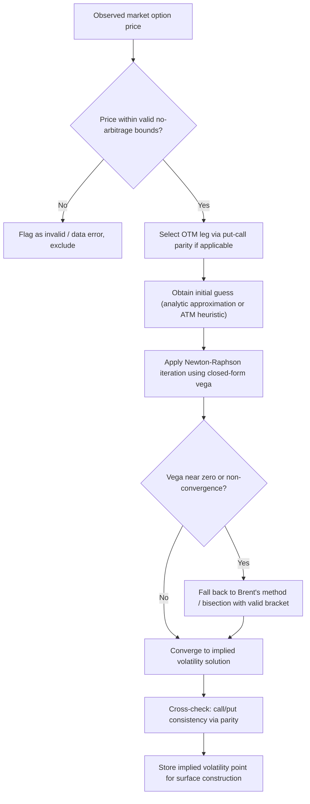

## Extracting Implied Volatility From Market Prices

### Overview

Extracting implied volatility from market prices is the process of numerically inverting an option pricing formula to determine the volatility input that, when supplied to the model, reproduces an observed market price. Because option pricing formulas such as Black-Scholes are monotonically increasing functions of volatility but have no closed-form inverse, implied volatility extraction is fundamentally a **root-finding problem**, solved numerically for each observed option price. Implied volatility is the market's single most widely used and quoted risk metric for options, serving as the common language for quoting, comparing, and risk-managing option prices across strikes, maturities, and even across different underlyings.

### The Inversion Problem

#### Formal Statement

Given an observed market price $V^{\text{market}}$ for a European option with known strike $K$, maturity $T$, spot $S_0$, and risk-free rate $r$, implied volatility $\sigma_{\text{imp}}$ is defined as the value of $\sigma$ satisfying:

$$V^{\text{BS}}(S_0, K, T, r, \sigma_{\text{imp}}) = V^{\text{market}}$$

where $V^{\text{BS}}$ is the Black-Scholes pricing formula. Since $V^{\text{BS}}$ is a transcendental function of $\sigma$ with no algebraic inverse, $\sigma_{\text{imp}}$ must be found numerically.

#### Existence and Uniqueness

The Black-Scholes price is a **strictly monotonically increasing function of $\sigma$** for $\sigma > 0$ (since vega, $\frac{\partial V}{\partial \sigma}$, is strictly positive for any option with positive time value). This monotonicity guarantees that, provided the observed market price lies within the theoretically achievable range — between the option's intrinsic value (as $\sigma \to 0$) and the underlying's spot price scaled appropriately (as $\sigma \to \infty$) — a unique implied volatility solution exists. This existence-and-uniqueness property is what makes the root-finding problem well-posed and is the theoretical foundation for all standard implied volatility extraction algorithms.

**Key Points**

- If an observed market price lies below the option's theoretical intrinsic/lower-bound value (a potential data or arbitrage issue) or implausibly high relative to the underlying's price, no valid implied volatility solution exists — this is an important data-quality check that should precede or be embedded in any implied volatility extraction routine
- Monotonicity in $\sigma$ holds under Black-Scholes' standard assumptions (positive time value, standard payoff structure); some exotic payoff structures can, in principle, have pricing formulas that are non-monotonic in volatility, requiring more careful numerical treatment, though this is not a concern for standard vanilla options

### Numerical Root-Finding Methods

#### Newton-Raphson Method

The most widely used method for implied volatility extraction, exploiting the fact that Black-Scholes vega — the derivative needed for Newton-Raphson iteration — has a simple closed-form expression. Given a current volatility estimate $\sigma_n$, the update rule is:

$$\sigma_{n+1} = \sigma_n - \frac{V^{\text{BS}}(\sigma_n) - V^{\text{market}}}{\text{Vega}(\sigma_n)}$$

where $\text{Vega}(\sigma) = S_0 \sqrt{T}\, \phi(d_1) e^{-qT}$ (for a dividend yield $q$), and $\phi(\cdot)$ is the standard normal density. Because both the price and its derivative (vega) have fast, closed-form expressions under Black-Scholes, Newton-Raphson typically converges to high precision within a small number of iterations (often 3–6) for well-behaved starting points.

**Key Points**

- Newton-Raphson's quadratic convergence rate (once sufficiently close to the true root) makes it substantially faster than simple bisection-type methods for this problem, which is a primary reason it is the default choice in most production implied volatility solvers
- **Vega degeneracy near expiry or deep in/out-of-the-money**: vega approaches zero for options that are deep ITM/OTM or very close to expiry, causing the Newton-Raphson update to become numerically unstable (division by a near-zero vega can produce large, erratic steps) — this is the primary failure mode requiring safeguards (see below)
- A reasonable **initial guess** (e.g., using an analytic approximation formula, or simply a typical at-the-money volatility level as a starting point) improves both convergence speed and robustness, particularly for options far from at-the-money

#### Bisection and Brent's Method

**Bisection** is a robust, guaranteed-to-converge (given monotonicity and a valid bracketing interval) but comparatively slow method: repeatedly halving an interval known to contain the root based on the sign of the pricing error at the midpoint. Convergence is linear (roughly one additional correct digit every ~3.3 iterations), substantially slower than Newton-Raphson's quadratic convergence, but bisection cannot fail to converge (given a valid initial bracket) regardless of vega behavior, unlike Newton-Raphson.

**Brent's method** combines the robustness of bisection with the speed of faster methods (inverse quadratic interpolation and secant steps), automatically falling back to bisection when faster steps would leave the bracketing interval or fail to make sufficient progress. This hybrid approach is widely regarded as a robust general-purpose root-finder and is commonly used as a fallback or default choice when Newton-Raphson's convergence is unreliable (e.g., for the vega-degenerate cases noted above).

**Key Points**

- Bisection and Brent's method require an initial **bracketing interval** $[\sigma_{\text{low}}, \sigma_{\text{high}}]$ known to contain the root (i.e., where the pricing errors at the two endpoints have opposite signs) — establishing a valid, sufficiently wide bracket is a necessary preliminary step
- A common robust practical implementation uses Newton-Raphson as the primary method for speed, with a safeguard that switches to bisection or Brent's method if a Newton-Raphson step would leave a known valid bracket or fails to converge within a reasonable number of iterations — this "safeguarded Newton" approach balances speed and robustness

#### Closed-Form and Analytic Approximations

Several closed-form approximations to implied volatility exist, useful either as a fast standalone estimate or as a high-quality initial guess to accelerate Newton-Raphson convergence:

- **Brenner-Subrahmanyam approximation**: a simple at-the-money approximation, $\sigma_{\text{imp}} \approx \sqrt{2\pi/T}\cdot(V^{\text{market}}/S_0)$, reasonably accurate only very close to at-the-money and for short-to-moderate maturities
- **Corrado-Miller approximation**: a more refined closed-form approximation extending reasonable accuracy somewhat away from at-the-money
- **Polynomial/rational approximations** (e.g., variants building on the Jäckel "Let's Be Rational" approach): highly accurate, closed-form (non-iterative) rational approximations designed to match Black-Scholes implied volatility to very high precision across the full range of strikes and maturities without requiring iterative root-finding at all

**Key Points**

- [Inference] the Jäckel-style rational approximation approach (published as "Let's Be Rational," 2015) is widely regarded in practitioner and quantitative literature as achieving machine-precision-level accuracy without any iteration, making it attractive for high-frequency implied volatility extraction (e.g., real-time market data processing, large-scale surface construction) where the computational cost of iterative Newton-Raphson across millions of quotes would be material
- Simple approximations (Brenner-Subrahmanyam) are generally unsuitable as final production-quality implied volatility values given their limited accuracy range, but remain useful as fast initial guesses for an iterative refinement step

### Handling Numerical Edge Cases

#### Vega Degeneracy (Deep ITM/OTM, Near Expiry)

As noted, vega approaches zero for deep in-the-money or out-of-the-money options and for options very close to expiry, since these options have little remaining time value sensitivity to volatility. This causes:

- Newton-Raphson instability (large, erratic steps from dividing by near-zero vega)
- Reduced practical meaningfulness of the implied volatility itself, since a wide range of volatility values may produce nearly identical (and nearly intrinsic-value) prices — the implied volatility becomes poorly identified by the market price in this regime, independent of the numerical method's convergence behavior

**Practical mitigation**: many practitioner implementations impose minimum vega/moneyness/time-to-expiry thresholds below which implied volatility is either not computed, computed via a more robust (bisection/Brent) method exclusively, or flagged as low-confidence/unreliable in downstream volatility surface construction.

#### Arbitrage Violations and Invalid Market Prices

If a quoted market price violates a static no-arbitrage bound (e.g., a call price below its intrinsic value $\max(S_0 - Ke^{-rT}, 0)$, or a call price above the spot price itself), no valid (real, positive) implied volatility exists. Robust implied volatility extraction should detect and explicitly flag such cases (e.g., due to stale quotes, data errors, or genuinely crossed/illiquid markets) rather than allowing the root-finding algorithm to fail silently or return a nonsensical result.

**Key Points**

- Data cleaning and arbitrage-bound checking is a standard pre-processing step in any production volatility surface construction pipeline, applied before implied volatility extraction is attempted on each quote
- Wide bid-offer spreads in illiquid options can produce a correspondingly wide range of "valid" implied volatilities (computed separately from bid and ask prices) — reporting or using a bid-ask implied volatility spread, rather than treating a single mid-price implied volatility as fully precise, is standard practice for illiquid strikes/maturities

### Put-Call Parity and Consistency Checks

**Put-call parity** provides an important consistency check and, in some cases, a practical shortcut for implied volatility extraction:

$$C - P = S_0 e^{-qT} - Ke^{-rT}$$

Since put-call parity holds model-independently (as a static replication/no-arbitrage result, not dependent on Black-Scholes assumptions), the implied volatility extracted from a call and from its corresponding put (same strike, same maturity) should, under standard Black-Scholes assumptions, be **identical** if both market prices are consistent with each other and with put-call parity. Material divergence between call-implied and put-implied volatility at the same strike/maturity typically signals a data quality issue (stale quotes, unsynchronized bid/ask timestamps) or, in genuinely observed cases, a market friction (e.g., funding/repo cost asymmetries, or dividend/borrow-cost uncertainty affecting the two legs differently).

**Key Points**

- In practice, extracting implied volatility from the **more liquid** of the call/put pair at a given strike (typically OTM options are more liquid/reliable than their ITM counterpart at the same strike, since ITM options carry more intrinsic value and proportionally less informative time-value pricing) is standard practice, using put-call parity to translate if needed rather than relying on a potentially less reliable ITM quote directly
- This OTM-preference convention is a standard practitioner heuristic for constructing a clean, liquidity-weighted implied volatility surface from raw option chain data

### Illustrative Diagram: Implied Volatility Extraction Workflow

### Worked Example: Newton-Raphson Implied Volatility Extraction

Extract the implied volatility for a European call: $S_0 = 100$, $K = 105$, $T = 0.5$, $r = 4\%$, observed market price $V^{\text{market}} = 3.50$.

**Initial guess**: $\sigma_0 = 0.20$ (a typical starting point).

**Iteration 1**: Compute $V^{\text{BS}}(\sigma_0 = 0.20)$ and $\text{Vega}(\sigma_0)$ using the standard Black-Scholes formulas. Suppose this gives $V^{\text{BS}} = 3.09$ and $\text{Vega} = 26.8$ (illustrative values). Update:

$$\sigma_1 = 0.20 - \frac{3.09 - 3.50}{26.8} = 0.20 + \frac{0.41}{26.8} \approx 0.2153$$

**Iteration 2**: Recompute $V^{\text{BS}}(\sigma_1 = 0.2153)$ and $\text{Vega}(\sigma_1)$; suppose this gives $V^{\text{BS}} = 3.48$, $\text{Vega} = 26.5$. Update:

$$\sigma_2 = 0.2153 - \frac{3.48-3.50}{26.5} \approx 0.2153 + 0.00075 \approx 0.2161$$

**Iteration 3**: Repeat; the price error shrinks to within a chosen tolerance (e.g., $10^{-6}$), and the algorithm terminates, reporting $\sigma_{\text{imp}} \approx 0.216$ (21.6%).

**Key Points**

- This worked example illustrates the typical rapid convergence of Newton-Raphson for a moderately OTM option with meaningful vega — convergence to high precision within 3–4 iterations is standard behavior in well-behaved cases
- [Inference] the illustrative intermediate values shown are representative of typical Newton-Raphson convergence behavior for this type of option but are not computed from exact Black-Scholes formula evaluations in this text; a production implementation would compute $d_1$, $d_2$, and the resulting price/vega precisely via the standard closed-form expressions at each iteration

### Related Topics

- The Black-Scholes formula and its closed-form Greeks (vega derivation)
- Volatility smile and skew construction from extracted implied volatilities
- SVI and other parametric volatility surface fitting techniques
- Put-call parity and static no-arbitrage bounds
- The Jäckel "Let's Be Rational" rational approximation method
- Arbitrage-free volatility surface construction and cleaning
- Model calibration and fitting techniques (broader calibration context)
- Vega and Greeks behavior near expiry and extreme moneyness
- Bid-ask spread treatment in volatility surface construction
- American option implied volatility (additional complexity from early-exercise premium)