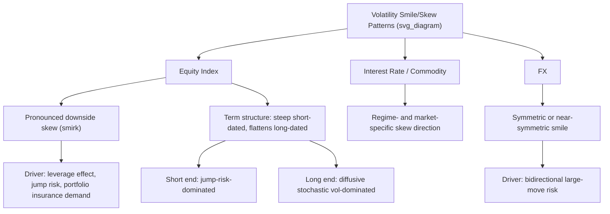

## The Volatility Smile and Skew

### Overview

The volatility smile and skew refer to the empirically observed pattern in which implied volatility, extracted from market option prices across different strikes (for a fixed maturity), is **not constant** — contradicting the Black-Scholes model's core assumption of a single, constant volatility parameter applicable to all strikes and maturities. Instead, plotting implied volatility against strike (or, more commonly, against a standardized measure of moneyness) typically reveals a systematic curve: a "smile" (higher implied volatility for both deep OTM and deep ITM strikes relative to at-the-money) or a "skew"/"smirk" (implied volatility that rises predominantly on one side, most commonly the downside for equity index options). This pattern is one of the most well-documented and practically important empirical departures from the Black-Scholes framework, motivating the entire field of volatility surface modeling and stochastic/local volatility model development.

### Empirical Patterns by Asset Class

#### Equity Index Skew ("The Smirk")

Equity index options (e.g., S&P 500/SPX) since the **1987 crash** have consistently exhibited a pronounced **downside skew**: implied volatility rises as strike decreases (OTM puts trade at meaningfully higher implied volatility than OTM calls of equivalent moneyness distance). This asymmetric pattern is often called a "smirk" or "skew" rather than a symmetric "smile," reflecting the fact that the OTM put side rises much more steeply than the OTM call side flattens or even continues to decline.

[Unverified] The prevailing explanation in the academic and practitioner literature attributes the post-1987 equity skew primarily to two related factors: (1) elevated demand for OTM put protection (portfolio insurance, tail-risk hedging) following the 1987 crash's demonstration of the possibility of severe, rapid market declines, and (2) the **leverage effect** — the well-documented negative correlation between equity returns and volatility, whereby falling equity prices mechanically increase a firm's financial leverage, which is associated with higher subsequent volatility, providing a fundamentals-based rationale (beyond pure supply/demand for protection) for why downside strikes should carry higher implied volatility.

#### FX Volatility Smile

Foreign exchange options markets more commonly exhibit a **symmetric or near-symmetric smile** (higher implied volatility on both OTM put and OTM call sides relative to at-the-money), rather than the pronounced one-sided skew typical of equity indices. This reflects the different risk dynamics of currency pairs, where large moves can plausibly occur in either direction (a currency can both sharply appreciate or depreciate) without the same asymmetric "crash risk" dynamic dominant in equity markets. The FX market's standard quoting convention — risk reversals (measuring skew) and butterflies/strangles (measuring smile curvature) at standardized delta points (e.g., 25-delta) — is itself built around this empirically observed smile shape.

#### Interest Rate and Commodity Volatility Surfaces

Interest rate options (caps/floors, swaptions) and commodity options exhibit smile/skew patterns that vary by market and regime — for example, interest rate skew direction has historically varied depending on the prevailing rate environment and market expectations about future rate direction, while commodity markets (e.g., oil) can exhibit skew reflecting supply-disruption risk (upside price spikes) rather than the downside-dominant pattern typical of equities. [Inference] the specific skew shape and its economic drivers are generally understood to be market- and regime-specific rather than following a single universal pattern across all asset classes, in contrast to the more consistently-observed equity index downside skew.

### Standard Parameterizations of Moneyness

To compare skew/smile shapes consistently across different spot levels, maturities, and even across underlyings, implied volatility is typically plotted against a standardized moneyness measure rather than raw strike:

- **Log-moneyness**: $k = \ln(K/F)$, where $F$ is the forward price — centers the smile around zero at-the-money-forward
- **Standardized moneyness (Black-Scholes $d_2$-based)**: $k/(\sigma\sqrt{T})$, which additionally normalizes for the option's maturity and volatility level, useful for comparing skew shapes across different maturities on a common scale
- **Delta-based moneyness**: quoting implied volatility as a function of the option's Black-Scholes delta (e.g., "25-delta put," "10-delta call") rather than strike — standard convention in FX markets and increasingly common elsewhere, since delta provides a moneyness measure that automatically adjusts for both spot level and volatility level

**Key Points**

- Delta-based quoting is particularly convenient in practice because it directly corresponds to commonly-traded option structures (risk reversals, butterflies constructed at standard delta points) and facilitates consistent comparison of skew/smile shape across different market conditions and time periods
- The choice of moneyness parameterization affects how the smile/skew *appears* visually and how naturally certain parametric models (e.g., SVI, which is typically expressed in log-moneyness) fit the data, though the underlying economic information content is equivalent across parameterizations

### Quantifying Skew: Risk Reversals and Butterflies

Two widely used, standardized metrics summarize the smile/skew shape at a given maturity using a small number of liquidly-traded strike points (commonly the 25-delta and 10-delta points, plus at-the-money):

**Risk reversal**: the implied volatility difference between an OTM call and an OTM put at symmetric delta points, measuring the **direction and magnitude of skew**:

$$\text{RR}_{25} = \sigma_{25\Delta\text{-call}} - \sigma_{25\Delta\text{-put}}$$

A negative 25-delta risk reversal (as typically observed for equity indices) indicates the OTM put trades at higher implied volatility than the OTM call — the downside skew described above.

**Butterfly (or "smile strength")**: the average of the OTM call and OTM put implied volatilities relative to at-the-money, measuring the **curvature/convexity** of the smile independent of its directional skew:

$$\text{BF}_{25} = \frac{\sigma_{25\Delta\text{-call}} + \sigma_{25\Delta\text{-put}}}{2} - \sigma_{\text{ATM}}$$

A positive butterfly indicates a genuine "smile" shape (both wings elevated relative to ATM), while a butterfly near zero with a strongly negative risk reversal indicates a more purely "skewed" (monotonic) shape rather than a symmetric smile.

**Example**: A trading desk quotes SPX 1-month options with ATM implied volatility of 15%, 25-delta put implied volatility of 18%, and 25-delta call implied volatility of 13.5%. This gives a risk reversal of $13.5\% - 18\% = -4.5\%$ (pronounced downside skew) and a butterfly of $(13.5\%+18\%)/2 - 15\% = 0.75\%$ (modest additional curvature beyond the linear skew component) — consistent with the typical equity index "smirk" pattern where skew dominates over pure smile curvature.

**Key Points**

- Risk reversals and butterflies are themselves standard, directly-tradable option structures (a risk reversal is long a call and short a put, or vice versa; a butterfly combines ATM and OTM strikes), so these quoted quantities have direct market-observable prices, not just derived/computed statistics
- These metrics provide a compact, standardized way to track how skew and smile curvature evolve over time (e.g., risk reversal steepening ahead of an anticipated event, reflecting increased hedging demand or expected asymmetric risk)

### Theoretical Explanations for the Smile/Skew

#### Leverage Effect and Asymmetric Volatility Dynamics

As noted, the negative correlation between equity returns and subsequent realized volatility (the leverage effect, alternatively explained via the volatility feedback effect in some formulations) is a commonly cited fundamentals-based driver of equity downside skew. Stochastic volatility models with negative spot-volatility correlation (e.g., Heston with $\rho < 0$) generate a downside-skewed implied volatility smile consistent with this empirical pattern, providing a model-based (rather than purely supply/demand-based) explanation.

#### Jump Risk

Models incorporating downward price jumps (e.g., Merton's jump-diffusion model, or more general jump-diffusion and Lévy process models) naturally generate skew, since the possibility of a sudden, discontinuous downward price move increases the risk-neutral probability weight in the far left tail of the terminal price distribution, which is precisely what elevated OTM put implied volatility reflects. [Inference] jump risk and stochastic volatility (with negative correlation) are generally understood as complementary rather than competing explanations, and models combining both (e.g., stochastic volatility with jumps, "SVJ" models such as Bates' model) are commonly used to better match both the overall skew level and its term structure behavior (see below) than either mechanism alone.

#### Supply and Demand / Hedging Flows

Beyond the fundamentals-based explanations above, a purely market-microstructure-based explanation attributes skew (particularly its post-1987 emergence and persistence) to structural demand for downside protection — institutional investors' persistent demand for OTM put options (portfolio insurance, tail hedging) creates sustained buying pressure that elevates OTM put implied volatility relative to what pure risk-neutral dynamics alone might imply, especially to the extent options dealers who sell this protection face capital or risk constraints that prevent them from fully arbitraging away the resulting price/volatility premium.

### Term Structure of Skew

The skew (and smile) shape is **not static across maturities** — it typically evolves systematically as maturity increases:

- **Short-dated skew** tends to be steeper (in percentage-implied-volatility terms per unit of standardized moneyness) than long-dated skew, a pattern broadly consistent with jump-risk-dominated explanations (jump risk is proportionally more significant for short horizons, since diffusive/Gaussian dynamics have less time to "spread out" the distribution) and with observed market behavior around specific near-term risk events (earnings, macro data releases)
- **Long-dated skew** tends to flatten (though rarely disappears entirely), reflecting the diminishing relative importance of short-term jump risk and the increasing dominance of diffusive, mean-reverting stochastic volatility dynamics over longer horizons
- This maturity-dependent evolution of skew is a key stylized fact that any candidate volatility model (local vol, stochastic vol, jump-diffusion, or combinations) must be assessed against — models that fit a single maturity's skew well can still fail to capture the correct **term structure** of skew evolution across maturities simultaneously

**Key Points**

- The term structure of skew is a primary discriminating test between competing model classes: pure diffusive stochastic volatility models (e.g., Heston) often struggle to simultaneously match both a steep short-dated skew and its correct flattening pattern at longer maturities without the addition of a jump component
- Practitioners routinely examine both the "smile at a point in time across maturities" and "the same maturity's smile through time" (skew dynamics/evolution) as complementary diagnostics of market conditions and model adequacy

### Illustrative Diagram: Skew Shape by Asset Class and Maturity

### Practical Implications for Pricing and Risk Management

- **Exotic option pricing sensitivity**: exotic payoffs with significant sensitivity to the shape of the terminal distribution's tails (e.g., digital options, barrier options, deep OTM structures) can be materially mispriced by a flat-volatility Black-Scholes assumption; correctly capturing skew is essential for reasonable exotic pricing, motivating local/stochastic volatility model use even for otherwise "simple" exotic structures
- **Vega and vanna risk**: because implied volatility varies systematically with strike, an option's exposure to changes in the *overall level* of implied volatility (vega) and to changes in the *skew/smile shape* (vanna, and related second-order Greeks) become distinct, separately-managed risk exposures on any options trading desk — a portfolio can be vega-neutral (flat exposure to a parallel shift in the vol surface) while still carrying material skew risk
- **Skew as a market-implied risk indicator**: risk reversal levels and their changes over time are commonly monitored by market participants as a real-time indicator of shifting hedging demand, perceived tail risk, or market sentiment — a steepening risk reversal ahead of a known event (e.g., an election, a central bank meeting) is a standard, widely-tracked signal
- **Model selection consequences**: the specific shape, level, and term structure of the observed skew directly inform which model class (local volatility, stochastic volatility, jump-diffusion, or hybrid) is appropriate for a given pricing/hedging application, as discussed in model calibration methodology

### Related Topics

- Local volatility calibration and Dupire's equation (fitting the observed smile exactly)
- Stochastic volatility models: Heston, SABR, and correlation-driven skew generation
- Jump-diffusion and Lévy process models for skew and tail risk
- Risk reversal and butterfly quoting conventions in FX markets
- SVI parametric fitting of the implied volatility smile
- Term structure of implied volatility and skew evolution
- Vanna and volga: second-order Greeks related to skew/smile exposure
- The 1987 crash and its role in the emergence of persistent equity skew
- Extracting implied volatility from market prices (prerequisite methodology)
- Portfolio insurance and structural put-buying demand as a skew driver