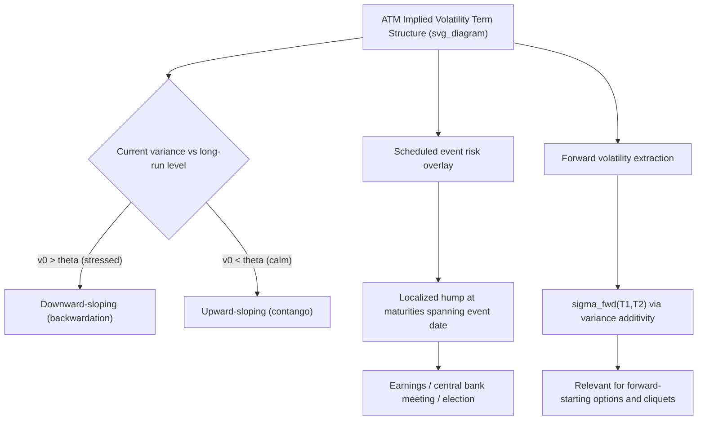

## Term Structure of Implied Volatility

### Overview

The term structure of implied volatility describes how at-the-money (or fixed-moneyness) implied volatility varies as a function of time to maturity, holding strike/moneyness convention fixed. Together with the strike dimension (smile/skew), the maturity dimension forms the second principal axis of the full implied volatility surface. The term structure reflects the market's expectations about how volatility will evolve over different horizons and is shaped by distinct economic and statistical drivers than the strike dimension — most notably, mean reversion of volatility, scheduled event risk, and the aggregation properties of variance over time.

### Empirical Shapes of the Term Structure

#### Upward-Sloping (Contango)

An upward-sloping term structure — longer-dated implied volatility higher than short-dated — is the most commonly observed shape in **calm, low-volatility market regimes**. This reflects the market's expectation that current low realized/implied volatility is not permanent and that volatility is likely to mean-revert upward over longer horizons, combined with generally greater model and estimation uncertainty (and hence risk premium) for longer-dated forecasts.

#### Downward-Sloping (Backwardation)

A downward-sloping (inverted) term structure — short-dated implied volatility higher than long-dated — typically emerges during **periods of market stress or elevated near-term uncertainty**, such as immediately before or during a crisis, a major anticipated event, or a sharp market selloff. This reflects the market pricing in elevated near-term risk that is expected to subside (mean-revert downward) once the immediate source of uncertainty resolves, while longer-dated volatility remains anchored closer to its longer-run average level.

**Key Points**

- The VIX term structure (constructed from SPX option-implied variance across maturities) is the most widely monitored real-world example of this phenomenon: contango (upward-sloping) is the "normal"/majority-of-time state, while backwardation (downward-sloping, often called "inversion") is closely watched as a signal of acute market stress, since the VIX term structure inverting has historically coincided with major volatility events (e.g., the 2008 financial crisis, the 2020 COVID selloff, and various other acute stress episodes)
- [Inference] the persistence of contango as the more commonly observed state in calm markets is broadly consistent with volatility risk premium research showing implied volatility tends to exceed subsequently realized volatility on average — a related but analytically distinct concept from the term structure shape itself
- Term structure shape is not static and can shift between contango and backwardation multiple times within a single market cycle as conditions evolve, making it a dynamically monitored indicator rather than a fixed structural feature of any given underlying

### Volatility Mean Reversion and Term Structure Shape

Stochastic volatility models (e.g., Heston) explicitly incorporate **mean reversion** of the instantaneous variance process toward a long-run level $\theta$, governed by the mean-reversion speed parameter $\kappa$:

$$dv_t = \kappa(\theta - v_t)\,dt + \xi\sqrt{v_t}\,dW_t$$

This mean-reversion structure directly generates a term structure of variance (and hence implied volatility) that depends on the relationship between the current instantaneous variance $v_0$ and the long-run level $\theta$:

- If $v_0 > \theta$ (current variance elevated above its long-run average — a stressed state), the model-implied term structure will be **downward-sloping**, as expected future variance mean-reverts down toward $\theta$
- If $v_0 < \theta$ (current variance below its long-run average — a calm state), the model-implied term structure will be **upward-sloping**, as expected future variance mean-reverts up toward $\theta$

The expected integrated variance under Heston-type mean reversion has a closed-form expression:

$$\mathbb{E}^{\mathbb{Q}}\left[\frac{1}{T}\int_0^T v_t\,dt\right] = \theta + (v_0 - \theta)\cdot\frac{1-e^{-\kappa T}}{\kappa T}$$

As $T \to \infty$, this expression converges to $\theta$ (the long-run variance level), while as $T \to 0$, it converges to $v_0$ (the current instantaneous variance) — directly producing the term structure shapes described above as a natural consequence of the model's mean-reversion dynamics.

**Key Points**

- This closed-form relationship is a standard diagnostic and calibration tool: given an observed term structure of ATM implied volatility, the implied $\kappa$ (speed of mean reversion) and $\theta$ (long-run level) can, in principle, be inferred, though in practice this is typically done jointly with the rest of the Heston parameter set (including skew-generating parameters $\rho$, $\xi$) via full surface calibration rather than the term structure in isolation
- A steeper observed term structure slope (in either direction) implies, within the Heston framework, either a larger gap between $v_0$ and $\theta$, a faster mean-reversion speed $\kappa$, or both — the term structure alone cannot uniquely separate these two effects without additional information (e.g., from the skew or from historical variance dynamics)

### Event Risk and Term Structure "Humps"

Beyond the smooth mean-reversion-driven shapes described above, the term structure frequently exhibits **localized humps or kinks** at specific maturities corresponding to known, scheduled events with material expected impact on the underlying:

- **Corporate earnings announcements**: single-stock implied volatility term structures commonly show a pronounced hump at the maturity bucket containing the next earnings date, reflecting the market's pricing of the discrete jump risk associated with the earnings release itself, superimposed on the smoother "background" term structure
- **Central bank meetings and macroeconomic data releases**: index and rates volatility term structures can show similar localized elevation around FOMC meetings, major data releases (e.g., CPI, employment reports), or geopolitical events with known future resolution dates
- **Elections and referenda**: equity index and FX volatility term structures have historically shown pronounced humps around major election or referendum dates, reflecting anticipated event-driven volatility

**Example**: A single stock with an earnings announcement scheduled in 6 weeks might show ATM implied volatility of 25% for a 1-month option (maturing before earnings), 38% for a 2-month option (spanning the earnings date), and 28% for a 3-month option (also spanning earnings, but with the event's contribution diluted by more surrounding "normal" trading days) — the hump appears specifically in the maturity buckets that straddle the event date, then diminishes for maturities extending well beyond it as the event's proportional contribution to total variance shrinks.

**Key Points**

- These localized humps are a direct consequence of the **additivity of variance** (not volatility) over non-overlapping time intervals under standard assumptions — the elevated implied volatility for option maturities spanning an event reflects the event's disproportionate contribution to total variance over what may otherwise be a short-dated option, a mechanical/actuarial effect layered on top of any smooth mean-reversion-driven term structure shape
- This event-driven structure motivates **variance decomposition techniques** (see below) used to separate the smooth "background" or "base" volatility term structure from discrete event-specific contributions, which is important both for accurately pricing options with maturities spanning multiple events and for extracting a market-implied estimate of the event's expected volatility impact in isolation

### Forward Volatility and Variance Additivity

Because **variance** (not volatility) aggregates additively over non-overlapping time periods under standard risk-neutral pricing assumptions (a consequence of the quadratic variation properties of the driving Brownian/Ito process), the term structure of implied volatility can be decomposed into implied **forward volatility** between any two maturities:

$$\sigma_{\text{fwd}}(T_1, T_2) = \sqrt{\frac{\sigma_{T_2}^2 T_2 - \sigma_{T_1}^2 T_1}{T_2 - T_1}}$$

where $\sigma_{T_1}$ and $\sigma_{T_2}$ are the (ATM, or fixed-moneyness) implied volatilities at maturities $T_1 < T_2$. This forward volatility represents the market-implied volatility for the period *between* $T_1$ and $T_2$, extracted from the two spot-starting implied volatility quotes — directly analogous to extracting forward interest rates from a term structure of spot rates.

**Example**: If 3-month ATM implied volatility is 18% ($T_1 = 0.25$) and 6-month ATM implied volatility is 20% ($T_2 = 0.5$), the implied forward volatility for the 3-to-6-month period is:

$$\sigma_{\text{fwd}} = \sqrt{\frac{(0.20)^2(0.5) - (0.18)^2(0.25)}{0.5-0.25}} = \sqrt{\frac{0.02 - 0.0081}{0.25}} = \sqrt{0.0476} \approx 21.8\%$$

This forward volatility of approximately 21.8% is higher than both the 3-month (18%) and 6-month (20%) spot-starting implied volatilities, illustrating how an upward-sloping term structure implies an even more steeply elevated *forward* volatility for the later period specifically — a standard and important distinction between the spot-starting term structure directly observed and the forward volatility implied between two points on it.

**Key Points**

- Forward volatility extraction is essential for pricing **forward-starting options and cliquet structures**, whose payoffs depend on volatility realized over a future period rather than from today, making the forward (not spot-starting) volatility the economically relevant quantity for such structures
- The variance additivity relationship underlying this decomposition is a model-independent, static no-arbitrage-type result under standard assumptions (though it can be affected by the presence of jumps or specific model dynamics in more nuanced ways), distinguishing it from model-dependent term structure shape explanations (e.g., the Heston mean-reversion formula above, which is model-specific)

### Term Structure and Skew Interaction: Total Volatility Surface Dynamics

The term structure and skew dimensions of the volatility surface are not independent — as noted in the discussion of skew, **skew steepness typically varies systematically with maturity** (steeper at short maturities, flattening at longer maturities), meaning the full surface's evolution over the maturity dimension involves both the ATM level (term structure proper) and the skew shape changing together. Models used to jointly capture both dimensions (stochastic volatility with jumps, or multi-factor stochastic volatility models) are generally assessed on their ability to simultaneously match observed term structure shape, skew level, and the interaction between the two (skew term structure) — a more demanding joint calibration target than either dimension considered in isolation.

**Key Points**

- [Inference] this joint term-structure/skew interaction is a primary reason single-factor stochastic volatility models (like standard Heston) are sometimes considered insufficiently flexible for demanding, multi-maturity exotic pricing applications, motivating multi-factor extensions (e.g., two-factor stochastic volatility models with different mean-reversion speeds) that can more independently control the short-end and long-end behavior of both the term structure and skew term structure simultaneously

### Illustrative Diagram: Term Structure Shapes and Drivers

### Practical Implications for Pricing and Risk Management

- **Calendar spread trading**: term structure shape and its expected evolution (e.g., anticipated flattening as an event date approaches and passes) directly inform relative-value trading strategies across maturities (calendar spreads, term structure steepeners/flatteners), distinct from directional or skew-based option strategies
- **Event volatility extraction**: isolating the market-implied volatility contribution of a specific scheduled event (e.g., "what does the option market expect for the earnings-day move specifically") via variance decomposition is a standard practitioner technique, useful both for relative-value assessment (is the implied event move rich or cheap relative to historical realized event moves) and for pricing instruments spanning the event
- **VIX and volatility index term structure as a market signal**: the shape of the VIX futures term structure specifically (contango vs. backwardation) is one of the most closely monitored real-time indicators of market stress across the broader financial industry, extending beyond options-specific trading desks to macro and cross-asset risk management
- **Model selection for multi-maturity exotic pricing**: any exotic structure with cash flows or triggers spanning multiple maturities (cliquets, forward-starting options, multi-callable structures) requires a model capable of correctly capturing not just a single maturity's smile but the full joint term-structure-and-skew dynamics, making term structure fit an essential (not merely secondary) calibration target for such products

### Related Topics

- Heston and other stochastic volatility models: mean reversion parameterization
- Forward volatility and forward-starting option pricing
- The volatility smile and skew (strike dimension of the surface)
- VIX index construction and VIX futures term structure
- Variance swap replication and term structure of variance
- Cliquet and forward-starting option structures
- Model calibration to the joint term-structure/skew surface
- Event-driven volatility and earnings volatility decomposition
- Multi-factor stochastic volatility models
- Calendar spread and term structure relative-value trading strategies