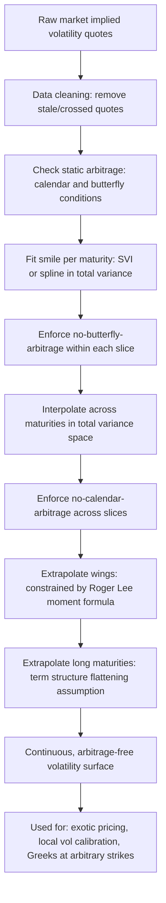

## Volatility Surface Construction and Interpolation

### Overview

Volatility surface construction is the process of transforming a discrete, finite set of market-observed implied volatility quotes (across a limited grid of strikes and maturities) into a continuous, smooth, and arbitrage-free function of strike and maturity that can be queried at any arbitrary point needed for pricing or risk management. This requires both **interpolation** (estimating values between observed quotes) and, frequently, **extrapolation** (estimating values beyond the observed range), all while satisfying the mathematical constraints that a legitimate, arbitrage-free volatility surface must obey. This is a foundational practical step underlying nearly all downstream derivatives pricing and risk activities — local volatility calibration, exotic option pricing, and Greeks calculation for strikes/maturities not directly quoted in the market all depend on having access to a well-constructed, continuous surface.

### The Raw Data Problem

#### Sparse and Irregular Market Data

Market-observed implied volatility quotes exist only at a finite, often irregularly-spaced set of strikes and maturities — typically the strikes and maturities of listed, exchange-traded options (which follow standardized strike/expiry conventions) supplemented by OTC broker quotes at specific delta points (e.g., 10-delta, 25-delta, ATM) for standard tenors. This raw data set is:

- **Discrete**: a finite grid, not a continuous function
- **Irregular**: strike spacing and available maturities often differ across the surface, and available strikes typically cluster more densely near at-the-money (where liquidity concentrates) and sparsely in the wings
- **Noisy**: subject to bid-offer spreads, stale quotes, and potential data errors, particularly for illiquid strikes/maturities
- **Potentially arbitrage-violating in raw form**: due to bid-offer noise and imperfect synchronization across quotes, the raw data set may contain small violations of no-arbitrage constraints that must be addressed before or during surface construction

**Key Points**

- The quality and density of raw market data varies enormously by underlying and market: major equity indices and highly liquid FX pairs typically have dense, reliable quote grids, while single-name equities, less liquid FX crosses, and many commodity/rate underlyings may have only a handful of reliable quote points, requiring the interpolation/extrapolation methodology to do more of the "work" in constructing a usable full surface
- Data cleaning (removing stale, crossed, or clearly erroneous quotes) is a necessary pre-processing step that should precede formal surface construction, since fitting a smooth surface to unclean data can propagate data errors into otherwise well-behaved regions of the fitted surface

### No-Arbitrage Constraints on the Surface

A legitimate implied volatility surface must satisfy several static no-arbitrage conditions, violations of which imply the existence of a risk-free arbitrage opportunity using only vanilla options:

#### Calendar Spread Arbitrage (Monotonicity in Total Variance)

**Total implied variance** $w(K,T) = \sigma(K,T)^2 \cdot T$ must be **non-decreasing in maturity** for any fixed strike (or, more precisely, for any fixed value of an appropriately normalized moneyness measure across maturities, since the relevant strike for a fixed moneyness itself shifts with the forward price at each maturity):

$$w(K, T_2) \geq w(K, T_1) \quad \text{for } T_2 > T_1$$

A violation means a calendar spread (long the longer-dated option, short the shorter-dated option at matching strike/moneyness) could, under certain constructions, be assembled at negative cost with a non-negative payoff in all states — a static arbitrage.

#### Butterfly Spread Arbitrage (Convexity in Strike)

Option prices (not implied volatilities directly) must be **convex in strike** at any fixed maturity — this is the strike-dimension analog of the no-arbitrage requirement, directly related to the Breeden-Litzenberger result that the second derivative of the call price with respect to strike must be non-negative (since it represents, up to discounting, a probability density):

$$\frac{\partial^2 C}{\partial K^2} \geq 0$$

Violations imply a butterfly spread (long one unit each of two surrounding strikes, short two units of the middle strike) could be assembled at negative cost with a non-negative payoff — a static arbitrage. Because implied volatility is a nonlinear transform of price, a smooth-looking implied volatility curve can still correspond to a price curve that violates this convexity condition if not constructed carefully, making this a non-trivial constraint to enforce directly in implied-volatility space.

**Key Points**

- These two conditions (calendar and butterfly arbitrage-freedom) are the standard, most commonly enforced static no-arbitrage constraints in practical volatility surface construction, though additional, more subtle constraints exist (e.g., related to the surface's behavior at extreme strikes, discussed under extrapolation below)
- Enforcing arbitrage-freedom is not merely a theoretical nicety: a surface violating these conditions, when used as input to a local volatility calibration (via Dupire's formula) or other downstream pricing model, can produce negative or complex-valued local volatilities, pricing errors, or other numerical pathologies — arbitrage-freedom is a practical prerequisite for the surface to be usable, not just theoretically elegant

### Interpolation Methodologies

#### Strike-Dimension Interpolation: Parametric Approaches

**SVI (Stochastic Volatility Inspired) parameterization** (introduced by Gatheral) is among the most widely used parametric forms for fitting a smooth, well-behaved total variance smile at each individual maturity slice:

$$w(k) = a + b\left(\rho(k-m) + \sqrt{(k-m)^2+\sigma^2}\right)$$

fitted via least-squares to the observed market total variance points at that maturity, with $k$ denoting log-moneyness. As discussed under smile/skew, SVI's five parameters ($a,b,\rho,m,\sigma$) provide substantial flexibility to fit typical observed smile shapes while, in its "no-arbitrage" variants (raw SVI with appropriate parameter constraints, or the SVI-JW reparameterization), guaranteeing the fitted single-maturity slice is free of butterfly arbitrage by construction.

**Key Points**

- SVI fits each maturity slice independently by default; ensuring **calendar-spread arbitrage-freedom across maturities** requires additional constraints linking the parameters of adjacent maturity slices (e.g., ensuring the fitted total variance curves do not cross), which is a well-documented additional step beyond naive independent per-maturity SVI fitting
- Parametric approaches like SVI offer the advantage of a compact, smooth, analytically well-behaved functional form (useful for computing derivatives needed in local volatility calibration) at the cost of being constrained to whatever smile shapes the parametric family can represent — genuinely unusual or highly irregular market smile shapes may not be well-captured by a 5-parameter form

#### Strike-Dimension Interpolation: Non-Parametric Approaches

**Cubic spline interpolation** (in implied volatility, total variance, or price space) fits piecewise cubic polynomials between observed data points, ensuring smoothness (continuity of value, first, and second derivatives) at the "knot" points (the observed strikes). Unlike parametric forms, splines can, in principle, exactly fit every observed data point, but require additional care to avoid introducing spurious oscillations (particularly with irregularly-spaced or sparse strike grids) or arbitrage violations, since a spline fitted purely for smoothness does not automatically guarantee the convexity-in-strike condition required for butterfly-arbitrage-freedom.

**Key Points**

- Interpolating in **total variance space** rather than raw implied volatility is generally preferred for both strike and maturity dimensions, since total variance's additivity properties (see term structure discussion) make it the more natural, well-behaved quantity for interpolation, particularly across the maturity dimension
- [Inference] a common practical compromise combines the strengths of both approaches: using a parametric form like SVI to obtain a smooth, arbitrage-free base fit, potentially supplemented by a non-parametric adjustment or correction term to better match specific observed data points the parametric form alone does not fit closely enough, particularly in unusual market conditions

#### Maturity-Dimension Interpolation

Interpolation across the maturity dimension (between two constructed/fitted smile slices at adjacent observed maturities) is most commonly performed in **total variance space**, exploiting variance's additive properties:

$$w(K, T) = w(K, T_1) + \frac{T-T_1}{T_2-T_1}\left[w(K,T_2)-w(K,T_1)\right]$$

for $T_1 < T < T_2$ — a linear interpolation in total variance (equivalent to assuming constant *forward* variance between the two observed maturities), which is a standard, simple, and calendar-arbitrage-preserving interpolation scheme provided the two endpoint slices themselves satisfy $w(K,T_2) \geq w(K,T_1)$.

**Key Points**

- Linear interpolation in total variance is simple and guarantees no calendar arbitrage is introduced between the two fitted endpoint slices (since it directly respects and interpolates between two already-monotonic total variance levels), but it implies a **flat/constant forward volatility** between the two maturities — a simplifying assumption that may not capture genuine features like an anticipated event-driven hump occurring between the two observed maturity points (see term structure discussion)
- More sophisticated maturity interpolation techniques exist to better capture known event-driven term structure features (e.g., incorporating a specific hump adjustment around a known earnings or event date falling between two standard observed maturities), reflecting the practical importance of correctly capturing such known, scheduled volatility events discussed under term structure

### Extrapolation Beyond the Observed Data Range

#### Strike Extrapolation (Wings)

Beyond the range of directly observed/liquid strikes (very deep OTM options), the surface must be extrapolated using some assumed functional behavior, since no market data directly constrains the fit there. Common approaches:

- **Constant extrapolation**: holding implied volatility (or total variance slope) flat beyond the last observed strike — simple but can produce unrealistic behavior and, more importantly, is not automatically consistent with the theoretical requirement that implied volatility cannot grow too fast in the wings (specifically, the **Roger Lee moment formula** constrains the asymptotic slope of the total variance smile as strike approaches zero or infinity, based on the number of finite moments the terminal distribution possesses)
- **Parametric extrapolation** (e.g., extending the fitted SVI wings, which have a known, controlled asymptotic linear-in-total-variance behavior in log-moneyness by construction): generally preferred over ad hoc extrapolation precisely because SVI's functional form has well-understood, controllable extreme-strike behavior

**Key Points**

- The **Roger Lee moment formula** provides a rigorous theoretical bound on how steeply implied volatility (specifically, total variance as a function of log-moneyness) can grow in the extreme wings, given assumptions about the number of finite moments of the underlying's terminal risk-neutral distribution — extrapolation schemes that violate this bound imply the existence of moments that cannot exist given the assumed tail behavior, a subtle but important theoretical consistency check
- Wing extrapolation choices, despite applying to strikes with little or no direct market liquidity, can materially affect prices of instruments sensitive to extreme tail behavior (deep OTM digitals, variance swap replication requiring the full strike continuum) — this is a genuine practical consequence of an otherwise seemingly academic extrapolation choice

#### Maturity Extrapolation

Extrapolating beyond the longest observed/liquid maturity (e.g., pricing a 10-year option when liquid quotes only extend to 5 years) typically relies on an assumed long-run behavior — commonly, assuming the term structure of ATM implied volatility flattens toward a long-run level (consistent with the mean-reversion-driven term structure behavior discussed previously), combined with an assumption about how skew flattens (or doesn't) at very long maturities.

**Key Points**

- [Inference] extrapolation beyond the reliably liquid maturity range is generally understood in practitioner contexts to carry meaningfully more model risk than interpolation within the observed range, since there is comparatively little direct market discipline constraining the extrapolated region — this motivates conservative, well-documented extrapolation assumptions and, where material, additional reserving or valuation adjustment practices for long-dated exotic exposures relying on extrapolated surface regions

### Illustrative Diagram: Volatility Surface Construction Pipeline

### Worked Example: Constructing a Two-Maturity Surface Segment

Given market quotes at $T_1 = 1$ month and $T_2 = 3$ months for a single underlying, at strikes corresponding to 10-delta put, 25-delta put, ATM, 25-delta call, 10-delta call:

**Step 1**: Fit SVI to the $T_1$ slice's 5 observed total variance points, obtaining parameters $(a_1,b_1,\rho_1,m_1,\sigma_1)$; repeat independently for the $T_2$ slice, obtaining $(a_2,b_2,\rho_2,m_2,\sigma_2)$.

**Step 2**: Check that the fitted $T_1$ and $T_2$ total variance curves do not cross at any log-moneyness value within the relevant range — if they do, recalibrate with an explicit calendar-arbitrage-avoidance constraint linking the two fits (e.g., a joint optimization rather than fully independent per-slice fits).

**Step 3**: For a desired maturity $T = 2$ months (between the two observed maturities), interpolate total variance linearly between the two fitted slices at each strike/log-moneyness value of interest.

**Step 4**: For a strike beyond the 10-delta points (deep wings) at either maturity, apply the SVI-implied wing extrapolation from the fitted parameters, checking consistency with the Roger Lee moment bound for the assumed tail heaviness of the underlying's distribution.

**Step 5**: The resulting continuous surface segment (spanning 1–3 months and the full strike range needed) is now queryable at any arbitrary strike/maturity combination for pricing purposes, e.g., feeding directly into a Dupire local volatility calculation or an exotic option's PDE/Monte Carlo pricing engine.

**Key Points**

- This worked example illustrates the standard combination of parametric per-slice fitting (SVI), variance-space maturity interpolation, and constrained wing extrapolation that characterizes typical production volatility surface construction methodology
- Each step (per-slice fit, cross-maturity consistency check, interpolation, extrapolation) introduces its own potential source of model risk and requires independent validation — a well-constructed surface is the product of a multi-stage pipeline, not a single fitting step, and errors or poor choices at any stage can propagate into downstream pricing

### Related Topics

- SVI and other parametric implied volatility smile models
- The volatility smile and skew: empirical patterns and drivers
- Term structure of implied volatility and forward volatility extraction
- Dupire's local volatility formula and its dependence on a clean surface
- The Roger Lee moment formula and wing extrapolation constraints
- Breeden-Litzenberger risk-neutral density extraction (convexity/butterfly link)
- Static replication and no-arbitrage bounds on option prices
- Model calibration and fitting techniques (broader context)
- Extracting implied volatility from market prices (prerequisite raw data)
- Data cleaning and quote filtering methodologies for derivatives markets