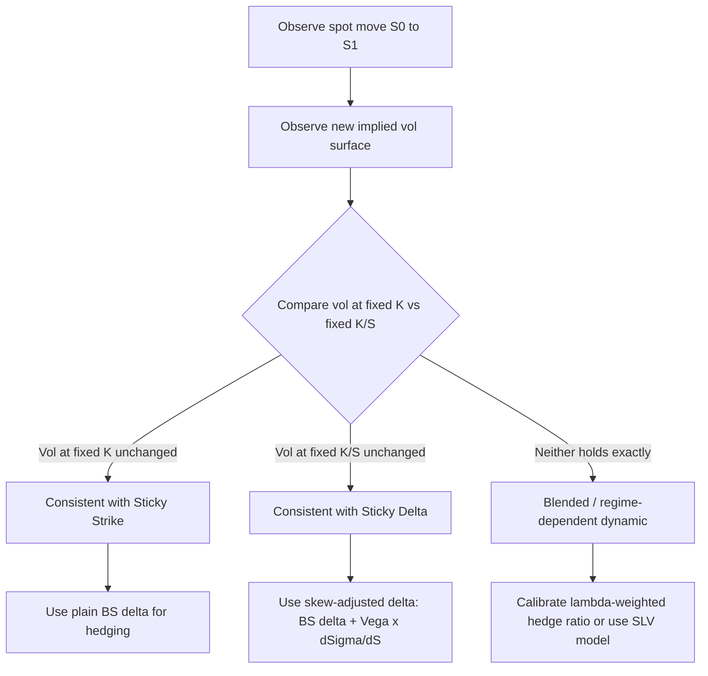

## Sticky Strike Versus Sticky Delta Dynamics

### Overview

Sticky strike and sticky delta are the two canonical "rules of thumb" traders use to describe how an implied volatility surface reshapes itself as the underlying spot price moves. Neither is a rigorous model of volatility dynamics; both are heuristics for translating a static, calibrated surface at time $t$ into a hypothesized surface at time $t + \Delta t$ after a spot move. The choice between them materially changes the **hedge ratios** (delta, and especially the vega-adjusted "shadow delta") computed off the surface, which is why the distinction sits at the core of practical vol-surface risk management.

### The Core Problem

A volatility surface $\sigma(K, T)$ is calibrated at spot $S_0$. When spot moves to $S_1$, the market re-quotes option prices, implying a new surface $\sigma'(K, T)$. The question is: **what is the relationship between the old surface and the new one?**

This matters because Black-Scholes delta,

$$\Delta_{BS} = \frac{\partial C}{\partial S}\bigg|_{\sigma \text{ fixed}}$$

assumes $\sigma$ is constant as $S$ moves. In reality, $\sigma$ is a function of $S$ (through moneyness), so the *true* sensitivity of the option price to spot is

$$\Delta_{true} = \frac{\partial C}{\partial S} + \frac{\partial C}{\partial \sigma} \cdot \frac{\partial \sigma}{\partial S}$$

The second term — the correction — is entirely determined by which "sticky" regime you assume governs the surface's response to spot.

### Sticky Strike Rule

**Definition:** Implied volatility for a given **absolute strike** $K$ remains unchanged as spot moves. The surface is indexed by strike, and it does not move when spot moves.

$$\sigma(K, T) = \text{constant with respect to } S$$

**Interpretation:** An option struck at $K = 100$ has the same implied vol whether spot is at 95, 100, or 105. The smile/skew curve is "pinned" to the strike axis and does not translate with spot.

**Consequence for moneyness:** Since moneyness $m = K/S$ changes as $S$ moves while $K$ is fixed, an option's *effective position on the smile* shifts. If spot falls, a fixed-strike option that was ATM becomes OTM (from the call side) — its implied vol updates to whatever value sits at that *strike*, not at that *moneyness*.

**Delta adjustment:** Because $\partial \sigma / \partial S = 0$ by construction (vol at a fixed $K$ doesn't move with $S$), sticky strike is the assumption **consistent with plain Black-Scholes delta**. Under pure sticky strike:

$$\Delta_{true} = \Delta_{BS}$$

No skew-correction term is needed — this is why sticky-strike is often the implicit default when practitioners quote "BS delta" without further qualification.

**When sticky strike tends to hold empirically:**

- Range-bound, low-realized-volatility regimes
- Markets where strike-level supply/demand (e.g., large fixed structured-note strikes, barrier levels) anchors vol at specific $K$
- Shorter time horizons where the smile shape is sticky due to hedging flow concentrated at specific strikes

### Sticky Delta Rule

**Definition:** Implied volatility for a given **moneyness** (equivalently, a given delta or a given ratio $K/S$) remains unchanged as spot moves. The surface translates *with* spot — it is indexed by moneyness/delta, not by absolute strike.

$$\sigma(K/S, T) = \text{constant}, \quad \text{i.e.} \quad \sigma(K, T) = f\left(\frac{K}{S}, T\right)$$

**Interpretation:** The 25-delta put always has the same implied vol, regardless of where spot is. As spot moves, the *entire smile curve shifts laterally* to keep the same shape relative to the new spot.

**Consequence:** An option at fixed strike $K$ will see its implied vol *change* as spot moves, because its moneyness $K/S$ changes and the surface enforces a fixed vol-to-moneyness mapping.

**Delta adjustment:** Under sticky delta, $\partial \sigma / \partial S \neq 0$. Differentiating $\sigma = f(K/S)$ with respect to $S$ at fixed $K$:

$$\frac{\partial \sigma}{\partial S} = -\frac{K}{S^2} f'\left(\frac{K}{S}\right) = -\frac{K}{S} \cdot \frac{1}{S} f'(m)$$

This feeds into the **skew-adjusted delta** (sometimes called "practitioner delta" or "smile-adjusted delta"):

$$\Delta_{skew} = \Delta_{BS} + \text{Vega} \cdot \frac{\partial \sigma}{\partial S}$$

For a typical equity index with negative skew (puts more expensive than calls, $f'(m) < 0$ for the put wing), this correction **increases the magnitude of put delta and decreases call delta** relative to BS delta — a well-documented empirical adjustment in equity index options markets.

**When sticky delta tends to hold empirically:**

- Trending or directional markets where the "regime" of relative moneyness matters more than absolute price level
- FX markets, which quote natively in delta space (25-delta risk reversal, 25-delta butterfly) rather than strike space — sticky delta is closer to the market convention itself
- Longer time horizons and structurally persistent skews (e.g., equity index skew driven by persistent leverage/crashophobia effects, which scale with moneyness, not absolute price)

### Side-by-Side Comparison

| Aspect | Sticky Strike | Sticky Delta |
| --- | --- | --- |
| Fixed axis | Absolute strike $K$ | Moneyness $K/S$ (or delta) |
| Surface behavior on spot move | Stays in place (indexed to $K$) | Translates with spot |
| $\partial \sigma / \partial S$ at fixed $K$ | $0$ | Nonzero, sign follows skew slope |
| Consistent hedge delta | Plain BS delta | Skew/smile-adjusted delta |
| Natural habitat | Equity single names, strike-anchored flow | FX (delta-quoted), trending regimes |
| Typical short-vol implication | Vol doesn't reprice with spot | Vol reprices with spot — bigger P&L swings on gamma near skew |

### Diagram: Surface Response to a Spot Move (svg_diagram)

<svg xmlns="http://www.w3.org/2000/svg" viewBox="0 0 760 420" font-family="sans-serif">
<text x="380" y="24" text-anchor="middle" font-size="16" font-weight="bold">Sticky Strike vs Sticky Delta (svg_diagram)</text>

<text x="180" y="48" text-anchor="middle" font-size="13" font-weight="bold">Sticky Strike</text>

<line x1="60" y1="200" x2="330" y2="200" stroke="black" stroke-width="1.5" />

<line x1="60" y1="200" x2="60" y2="70" stroke="black" stroke-width="1.5" />

<text x="195" y="218" text-anchor="middle" font-size="11">Strike (K)</text>

<text x="30" y="140" text-anchor="middle" font-size="11" transform="rotate(-90 30 140)">Implied Vol</text>

<path d="M 90 150 Q 195 90 300 150" stroke="#2b6cb0" stroke-width="2.5" fill="none" />
<text x="90" y="165" font-size="10" fill="#2b6cb0">t0 smile</text>

<line x1="195" y1="200" x2="195" y2="90" stroke="#718096" stroke-width="1" stroke-dasharray="4,3" />
<text x="195" y="212" font-size="10" text-anchor="middle" fill="#718096">S0</text>

<line x1="250" y1="200" x2="250" y2="115" stroke="#c53030" stroke-width="1" stroke-dasharray="4,3" />
<text x="250" y="212" font-size="10" text-anchor="middle" fill="#c53030">S1</text>
<text x="130" y="80" font-size="10" fill="#c53030">smile unchanged</text>
<path d="M100 60 Q 195 45 290 60" stroke="none" />

<path d="M 195 235 L 250 235" stroke="#c53030" stroke-width="1.5" marker-end="url(#arrow)" />
<text x="222" y="250" font-size="9" text-anchor="middle" fill="#c53030">spot moves</text>

<text x="580" y="48" text-anchor="middle" font-size="13" font-weight="bold">Sticky Delta</text>

<line x1="460" y1="200" x2="730" y2="200" stroke="black" stroke-width="1.5" />

<line x1="460" y1="200" x2="460" y2="70" stroke="black" stroke-width="1.5" />

<text x="595" y="218" text-anchor="middle" font-size="11">Strike (K)</text>

<text x="430" y="140" text-anchor="middle" font-size="11" transform="rotate(-90 430 140)">Implied Vol</text>

<path d="M 490 150 Q 595 90 700 150" stroke="#2b6cb0" stroke-width="2.5" fill="none" />
<text x="490" y="165" font-size="10" fill="#2b6cb0">t0 smile</text>

<path d="M 545 150 Q 650 90 755 150" stroke="#c53030" stroke-width="2.5" fill="none" stroke-dasharray="6,3" />
<text x="700" y="170" font-size="10" fill="#c53030">t1 smile (shifted)</text>

<line x1="595" y1="200" x2="595" y2="90" stroke="#718096" stroke-width="1" stroke-dasharray="4,3" />
<text x="595" y="212" font-size="10" text-anchor="middle" fill="#718096">S0</text>
<line x1="650" y1="200" x2="650" y2="90" stroke="#718096" stroke-width="1" stroke-dasharray="4,3" />
<text x="650" y="212" font-size="10" text-anchor="middle" fill="#718096">S1</text>
<path d="M 595 235 L 650 235" stroke="#c53030" stroke-width="1.5" marker-end="url(#arrow)" />
<text x="622" y="250" font-size="9" text-anchor="middle" fill="#c53030">spot moves</text>
<text x="380" y="290" text-anchor="middle" font-size="11" font-style="italic">
Left: vol at fixed K unchanged. Right: entire curve translates so vol at fixed moneyness is unchanged.
</text>
</svg>

### Worked Example

Assume an equity index at $S_0 = 4000$. Its implied vol surface for 1-month options exhibits negative skew: ATM vol is 18%, and the 90% moneyness put (strike $K = 3600$) trades at 22% implied vol.

**Sticky strike scenario:** Spot drops to $S_1 = 3600$. Under sticky strike, the vol *at strike 3600* is still 22% (unchanged — the vol didn't move because $K$ didn't move). But now strike 3600 is ATM. So the *ATM vol has jumped* from 18% to 22% purely mechanically, without any smile reshaping — spot simply moved into a region of the (unchanged) strike-indexed curve where vol was already higher.

**Sticky delta scenario:** Spot drops to $S_1 = 3600$. Under sticky delta, the *ATM vol* (i.e., vol at 100% moneyness) is still 18%, because the whole curve translated with spot. The vol *at the fixed strike 3600* (now ATM) is 18%, not 22% — a full 4-vol-point difference from the sticky-strike prediction.

**Skew delta correction (approximate):** Suppose a 1-month, $K=3600$ put has Vega $\approx 4.5$ (vol points to price, per 1 vol point) and BS delta $\approx -0.30$. Empirically, over that 400-point spot move (10%), the vol at fixed moneyness stayed flat under sticky delta, giving an effective skew slope over the relevant strike range of roughly $\frac{22\% - 18\%}{4000-3600} \approx -0.01$ vol points per index point (i.e., $\partial\sigma/\partial K \approx -0.0001$ per point, translating to a nontrivial $\partial \sigma/\partial S$ term via the chain rule under the sticky-delta assumption). Plugging into

$$\Delta_{skew} = \Delta_{BS} + \text{Vega} \cdot \frac{\partial \sigma}{\partial S}$$

produces a put delta more negative than $-0.30$ — i.e., **sticky delta implies larger-magnitude put deltas** than plain BS/sticky-strike delta for a negatively skewed market. This is the standard qualitative result quoted on equity index desks. [Inference: the specific numeric magnitude above is illustrative arithmetic from the assumed inputs, not a market-calibrated figure.]

### Local Volatility as a Third Regime

It's useful to locate sticky strike and sticky delta relative to a **local volatility model** (Dupire), which is often mischaracterized as "the" dynamically consistent alternative:

- Local vol is **not** a market convention but a specific no-arbitrage model that *exactly reprices* the current smile while implying its own, internally consistent dynamics for how the smile evolves as spot moves.
- For a typical downward-sloping equity skew, local vol models imply that as spot **falls**, the local vol surface flattens the *future* smile (skew tends to roughly halve in the local vol framework relative to the current smile) — a dynamic sometimes summarized as "local vol overpredicts the flattening of skew" relative to what is observed empirically.
- Empirically, real-market skew dynamics tend to sit **between** sticky strike and sticky delta, and local vol's implied dynamic is often considered too extreme (too "sticky-strike-like" in its future-smile-flattening behavior) compared to observed market behavior — this observation underlies the development of stochastic and local-stochastic volatility (LSV) models. [Inference: the relative positioning of these regimes is a widely cited qualitative pattern in vol-surface literature, not a universal law holding across all asset classes and regimes.]

### Sticky Local Volatility / Hybrid Rules

Practitioners also use blended heuristics:

- **Sticky-delta-plus-a-drift term:** parametrize skew evolution as a weighted combination, $\sigma_{t+1}(K) = \lambda \cdot \sigma_{sticky-strike}(K) + (1-\lambda) \cdot \sigma_{sticky-delta}(K)$, calibrating $\lambda$ to historical realized skew dynamics.
- **Sticky local volatility (SLV) surfaces:** in stochastic-local-vol models, the local component is often recalibrated to make the *joint* model reproduce a chosen blend of sticky-strike/sticky-delta dynamics for hedging purposes, decoupling the pricing calibration from the hedging-delta calibration.

### Practical Implications for Hedging and Risk

- **Vega hedging** is directly affected: under sticky delta, a spot move induces vol changes at every fixed strike, which shows up as spurious "vega P&L" if a desk is marking vega using a sticky-strike assumption while the market is actually behaving in a sticky-delta manner (or vice versa).
- **Gamma/vanna interaction:** the correction term $\text{Vega} \times \partial\sigma/\partial S$ is exactly the **vanna** exposure of the position, scaled by the assumed skew dynamic. Books with large vanna exposure are the most sensitive to which sticky-rule assumption governs re-hedging.
- **Delta hedge slippage:** if the true market dynamic is sticky delta but a trader hedges using plain BS (sticky-strike-consistent) delta, the realized hedge error accumulates directionally with the sign of the skew and the direction of spot moves — this is a commonly cited driver of skew-related hedging P&L in skewed markets (equity index puts, in particular).
- **Model risk disclosure:** many trading desks explicitly tag which sticky-rule convention their smile-adjusted Greeks use, since risk reports computed under different assumptions are not directly comparable.

### Sticky-Rule Diagnostics from Market Data (Mermaid)

### Key Points

- Sticky strike: vol fixed by absolute strike; consistent with plain BS delta; $\partial\sigma/\partial S = 0$.
- Sticky delta: vol fixed by moneyness/delta; requires a skew-adjusted delta; $\partial\sigma/\partial S \neq 0$ and typically amplifies put deltas under negative skew.
- The skew-adjustment term is mathematically identical to a vanna-scaled correction.
- Local volatility models imply their own, often more extreme, skew-flattening dynamic distinct from both heuristics.
- Real markets are typically a blend; the "correct" regime is asset-class- and regime-dependent (FX skews closer to sticky delta by convention; some equity single-name behavior closer to sticky strike over short horizons).

**Related Topics**

- Vanna and Volga: definitions and their role in the skew-adjusted delta correction
- Local Volatility (Dupire) Model and Its Implied Forward Skew Dynamics
- Stochastic Volatility Models (SABR, Heston) and Their Native Sticky-Rule Behavior
- Stochastic-Local Volatility (SLV) Hybrid Models
- Risk Reversals and Butterflies as Skew/Smile Parametrizations in FX
- Practitioner (Smile-Adjusted) Delta vs Black-Scholes Delta
- Backtesting Sticky-Rule Assumptions Against Historical Skew Data
- Vega Bucketing and Skew/Smile Risk Reporting Conventions