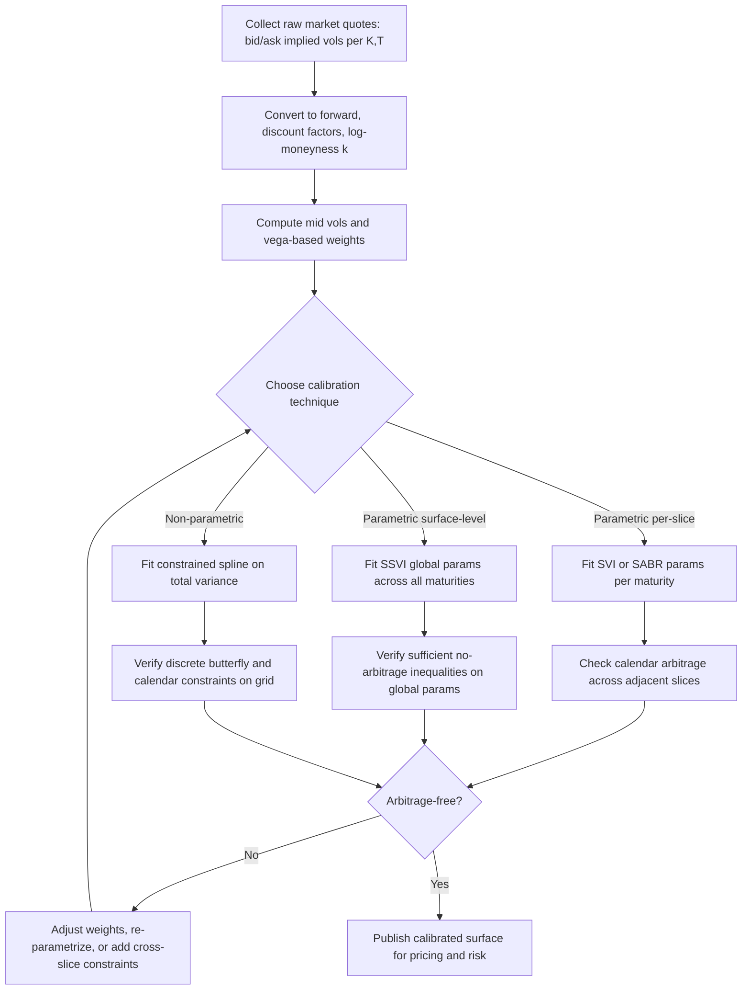

## Volatility Surface Calibration Techniques

### Overview

Volatility surface calibration is the process of fitting a set of parameters — either a **parametric functional form** or a **non-parametric grid/spline** — to observed option market prices (quoted as implied volatilities) such that the resulting surface (a) reprices the input quotes to within acceptable tolerance, (b) satisfies the no-arbitrage conditions (calendar, butterfly, wing-growth), and (c) behaves reasonably under interpolation/extrapolation to strikes and maturities not directly quoted. Calibration technique choice is a trade-off between **fit quality**, **arbitrage-freeness by construction**, **stability under quote updates**, and **computational cost**, and the right choice differs materially between an equity index desk, an FX desk, and an exotics/structuring desk pricing off local or stochastic volatility.

### The Calibration Problem, Formally

Given a set of market-observed implied volatilities $\{\sigma_i^{mkt}\}$ at strikes/maturities $\{(K_i, T_i)\}$, calibration solves:

$$\hat{\theta} = \arg\min_{\theta} \sum_i w_i \left( \sigma(K_i, T_i; \theta) - \sigma_i^{mkt} \right)^2 \quad \text{subject to arbitrage constraints}$$

where $\theta$ is the parameter vector of the chosen surface model, and $w_i$ are weights (often vega-weighted, so illiquid deep-wing quotes with tiny vega don't dominate the objective purely due to raw vol-difference magnitude).

**Two broad calibration philosophies:**

1. **Parametric slice-by-slice or surface-level models** (SVI, SABR, SSVI) — fit a small number of interpretable parameters per maturity slice or across the whole surface.
2. **Non-parametric / semi-parametric interpolation** (splines on total variance, kernel smoothing, local regression) — fit a flexible curve/surface directly to quotes with shape constraints imposed to preserve arbitrage-freeness.

### Parametric Technique: SVI (Stochastic Volatility Inspired)

**Raw SVI parametrization** of total implied variance as a function of log-moneyness $k = \ln(K/F)$:

$$w(k) = a + b\left(\rho(k-m) + \sqrt{(k-m)^2 + \sigma^2}\right)$$

Five parameters per slice: $a$ (overall level), $b$ (angle/slope of wings), $\rho$ (skew/rotation, $-1 \leq \rho \leq 1$), $m$ (horizontal shift), $\sigma$ (ATM curvature).

**Calibration procedure:**

1. For each maturity slice, minimize weighted squared error between $w(k;\theta)$ and market total variance at quoted strikes.
2. Enforce **static arbitrage constraints** directly on the parameters where closed-form conditions exist (e.g., $b(1+|\rho|) \leq 4/T$ is a commonly cited sufficient condition to keep the slice's wings from breaching Lee's moment bound — checked alongside, not instead of, direct evaluation of Gatheral's $g(k) \geq 0$ condition across the slice).
3. Check the **calendar condition** across adjacent maturities *after* per-slice fitting — raw SVI does not guarantee this automatically, which is the main motivation for SSVI (below).

**Practical notes:**

- The optimization is non-convex in $(a,b,\rho,m,\sigma)$ jointly; a common robust procedure fixes $m, \sigma$ on an outer grid/search loop and solves the remaining $(a,b,\rho)$ sub-problem, which is quasi-convex, at each outer point — this is the standard "quasi-explicit" calibration approach associated with Zeliade's SVI calibration methodology.
- Initial guesses matter significantly given the non-convexity; poor starting points can converge to local minima with unstable wing behavior.

### Parametric Technique: SSVI (Surface SVI)

**Motivation:** Raw SVI is fit slice-by-slice, so nothing prevents adjacent slices from crossing (calendar arbitrage). SSVI parametrizes the *entire surface* with a shared functional form across maturities, guaranteeing calendar consistency under stated parameter conditions.

**Form (Gatheral-Jacquier):**

$$w(k,\theta_T) = \frac{\theta_T}{2}\left(1 + \rho \varphi(\theta_T) k + \sqrt{(\varphi(\theta_T) k + \rho)^2 + (1-\rho^2)}\right)$$

where $\theta_T$ is the ATM total variance term structure (fit directly from ATM quotes) and $\varphi(\theta)$ is a chosen function (e.g., power-law $\varphi(\theta) = \eta \theta^{-\gamma}$) governing how the wing steepness evolves with maturity.

**Calibration procedure:**

1. Fit $\theta_T$ directly to the ATM variance term structure (usually near-exact, since ATM vols are the most liquid points).
2. Fit the remaining global parameters ($\rho$, $\eta$, $\gamma$ in the power-law case) jointly across all maturities by minimizing total weighted squared error across the whole surface at once.
3. Verify the sufficient no-arbitrage conditions on $\varphi$ and $\rho$ (Gatheral-Jacquier give explicit sufficient inequalities relating $\eta$, $\gamma$, and $\rho$) which, if satisfied, guarantee no calendar and no butterfly arbitrage across the entire fitted surface — a major practical advantage over raw per-slice SVI.

**Trade-off:** Fewer effective degrees of freedom than independent per-slice SVI, so SSVI can underfit idiosyncratic per-maturity smile features (e.g., event-driven term structure kinks around earnings/central bank dates) that raw SVI would capture more precisely.

### Parametric Technique: SABR

**Form** (for the implied vol at fixed maturity, Hagan's asymptotic expansion):

$$\sigma_{SABR}(K,F) \approx \frac{\alpha}{(FK)^{(1-\beta)/2}} \cdot \left[1 + \left(\frac{(1-\beta)^2}{24}\ln^2\frac{F}{K} + \ldots \right)\right] \cdot \frac{z}{\chi(z)}$$

with four parameters: $\alpha$ (ATM vol level), $\beta$ (backbone/skew-of-skew, often fixed by convention, e.g., $\beta=1$ for lognormal-like or $\beta=0.5$ for CIR-like), $\rho$ (spot-vol correlation, drives skew), $\nu$ (vol-of-vol, drives smile curvature/wings).

**Calibration procedure:**

1. $\beta$ is frequently **fixed by market convention** (e.g., $\beta = 1$ common in some rates/FX contexts) rather than calibrated, since $\alpha$ and $\beta$ are poorly jointly identified from a single smile — fixing $\beta$ improves calibration stability.
2. Remaining $(\alpha, \rho, \nu)$ calibrated per maturity slice via least-squares against quoted vols.
3. SABR is calibrated **per slice independently** by default — like raw SVI, it has no automatic guarantee of calendar consistency across slices unless imposed as an additional cross-slice constraint or via a full SABR term-structure extension.

**Known limitation:** Hagan's original asymptotic formula can itself produce arbitrageable prices (negative implied densities) deep in the wings for extreme parameter combinations — a well-documented issue that has motivated exact/PDE-based SABR density calculation methods (e.g., via the Hagan-Kumar-Lesniewski-Woodward corrected expansions or fully numerical solving of the SABR PDE) for surfaces requiring wing accuracy in exotics pricing. [Verified: this asymptotic-formula arbitrage limitation is well documented in the SABR literature.]

### Non-Parametric Technique: Constrained Spline on Total Variance

**Procedure:**

1. Interpolate $w(k)$ (not raw $\sigma$) using cubic or tension splines across quoted log-moneyness points at each maturity.
2. Impose convexity constraints directly in the spline-fitting optimization (quadratic-programming formulation with second-derivative sign constraints at knot points) to guarantee the discrete butterfly condition holds between quotes.
3. Interpolate/extrapolate across maturities in $w(k,T)$ space with monotonicity in $T$ enforced at each fixed $k$ node (often via a monotone interpolant like PCHIP applied along the maturity axis).

**Trade-off:** Highly flexible (can fit essentially any well-behaved quoted smile shape exactly), but:

- Extrapolation behavior beyond the quoted range is less controlled/interpretable than a parametric form's asymptotic wing behavior.
- More prone to overfitting noisy quotes (wide bid-ask illiquid wings) if convexity constraints aren't tight enough.
- Generally more computationally expensive to re-calibrate intraday at high frequency than a low-dimensional parametric fit.

### Calibration Workflow (Common Across Techniques)

### Objective Function Design and Weighting

- **Vega weighting:** weight each quote's squared error by its market vega, so calibration effort concentrates on strikes where price sensitivity to vol (and thus P&L sensitivity to a bad fit) is highest — standard practice to avoid a fit that looks good in vol-space but poorly reprices liquid, high-vega options.
- **Bid-ask weighting:** weight inversely to quoted bid-ask width, so illiquid wide-spread quotes (typically deep OTM) don't dominate the fit.
- **Regularization:** an explicit penalty term on parameter roughness or deviation from a prior (e.g., yesterday's calibrated parameters) is commonly added to control day-to-day parameter jumpiness — important for stable Greeks (particularly vanna/volga) that depend on the surface's local curvature and would otherwise be excessively sensitive to small quote noise.

### Calibration Quality Diagnostics

| Diagnostic | What It Checks |
| --- | --- |
| Repricing error (RMSE in vol space, weighted) | Basic goodness-of-fit to input quotes |
| Discrete butterfly test on fitted curve | Local arbitrage-freeness (Condition 2 from surface arbitrage) |
| $w(k,T)$ monotonicity across maturities | Calendar arbitrage-freeness (Condition 1) |
| Wing slope vs. Lee's moment bound | Extrapolation safety for exotics pricing |
| Local volatility surface sanity (no negative/NaN values) | Combined diagnostic — catches subtle butterfly/calendar failures the discrete tests might miss between grid points |
| Day-over-day parameter stability | Practical stability for risk management, avoiding artificial Greek jumps from noisy re-calibration |

### Choosing a Technique in Practice

| Context | Typical Choice | Rationale |
| --- | --- | --- |
| Equity index vanilla options desk | SSVI or per-slice SVI with calendar constraint | Robust, interpretable, arbitrage conditions well studied |
| FX vanilla desk (quoted in delta/RR/BF) | SABR (or vanna-volga for a quick smile from 3 pillar quotes) | Matches market's native delta/vol quoting convention |
| Rates/swaption vol surfaces | SABR (often $\beta$ fixed by convention) | Long-standing market standard, closed-form-ish density |
| Exotics/structured desk needing precise deep-wing behavior | Non-parametric spline with tight convexity constraints, or PDE-solved SABR | Precise extrapolation control matters more than parameter parsimony |
| High-frequency intraday re-calibration | Low-dimensional parametric (SABR/SVI) | Computational speed and parameter stability |

### Vanna-Volga: A Fast Approximate Calibration Technique

Distinct from full surface fitting, **vanna-volga** is a widely used FX-market technique to interpolate a smile from just three liquid pillar quotes (ATM, 25-delta risk reversal, 25-delta butterfly):

$$\sigma(K) \approx \sigma_{ATM} + \text{(weighted combination of vanna and volga cost adjustments derived from the three pillar instruments)}$$

It is not a full parametric surface-fitting technique but a practical market-standard method to produce a smile consistent with the three most liquid FX vol quotes, commonly used for quick indicative pricing before a fuller SABR/SSVI calibration is run. [Verified: vanna-volga is a long-standing, well-documented FX market practice; the exact weighting formula has several published variants and is intentionally omitted here in favor of the conceptual description, since implementation details vary by desk convention.]

### Worked Example: Two-Step SSVI Calibration Sketch

Suppose ATM total variance is observed at three maturities:

| T (years) | ATM $w = \sigma_{ATM}^2 T$ |
| --- | --- |
| 0.25 | 0.0090 |
| 0.50 | 0.0170 |
| 1.00 | 0.0320 |

**Step 1 — term structure fit:** these three $\theta_T$ points are essentially taken as given (near-exact fit to ATM, since ATM is the most liquid point at every maturity); monotonicity ($0.0090 < 0.0170 < 0.0320$) already satisfies the basic calendar-consistency requirement at $k=0$.

**Step 2 — global skew/wing fit:** minimize total weighted squared error across all strikes at all three maturities simultaneously over $(\rho, \eta, \gamma)$ in the chosen $\varphi(\theta) = \eta\theta^{-\gamma}$ specification. Because $\rho$ and $\varphi$ are shared across all maturities, a single joint optimization (rather than three independent per-slice fits) is run — this is what mechanically enforces the shared-shape, calendar-consistent structure, rather than the calendar consistency being checked and rejected post-hoc as it would be with independently-fit raw SVI slices.

### Key Points

- Calibration is constrained least-squares fitting of a surface model to market quotes, subject to no-arbitrage constraints, not simply unconstrained curve fitting.
- SVI, SABR, and SSVI are the dominant parametric families; SSVI's key advantage is a built-in cross-maturity (calendar) consistency guarantee that per-slice SVI/SABR lack by default.
- Non-parametric constrained splines on total variance offer maximum flexibility but weaker extrapolation control and higher overfitting risk on illiquid quotes.
- Vega-weighting and regularization toward prior-day parameters are standard practical additions to the raw least-squares objective, primarily to stabilize day-to-day Greeks.
- Post-calibration arbitrage diagnostics (discrete butterfly test, calendar monotonicity, local-vol sanity check) should always be run regardless of which technique is used — none of the standard techniques guarantee arbitrage-freeness with zero further verification in every edge case.

**Related Topics**

- SVI and SSVI Parametrizations of the Volatility Surface
- Arbitrage-Free Surface Conditions
- SABR Model Dynamics and Parameter Interpretation
- Vanna-Volga Pricing and Smile Construction in FX
- Local Volatility Construction from a Calibrated Implied Surface
- Stochastic-Local Volatility (SLV) Model Calibration
- Weighted Least-Squares and Regularization Techniques in Financial Model Calibration
- Term Structure Modeling of ATM Implied Volatility