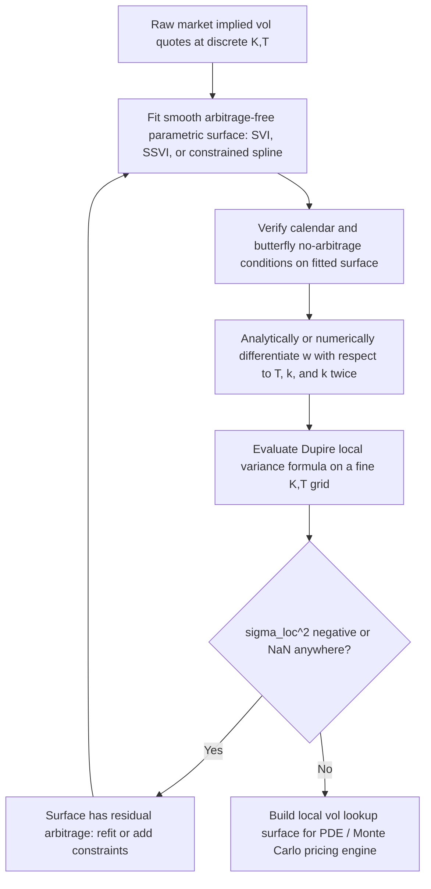

## The Dupire Equation and Local Volatility Function

### Overview

Local volatility is a model class in which the instantaneous volatility of the underlying is a **deterministic function of the current spot price and time**, $\sigma_{loc}(S,t)$, rather than a constant (Black-Scholes) or a separate stochastic process (Heston, SABR). Bruno Dupire's 1994 result shows that there exists a unique such function that exactly reproduces the entire market-observed implied volatility surface, and derives a closed-form expression for it in terms of observable (or interpolated) European option prices. This makes local volatility the canonical way to build a single risk-neutral diffusion model that is **perfectly consistent with today's vanilla option market** — the starting point for pricing path-dependent and exotic payoffs consistently with the vanilla smile.

### The Underlying Model

Local volatility assumes the risk-neutral spot dynamics:

$$dS_t = (r - q) S_t \, dt + \sigma_{loc}(S_t, t) S_t \, dW_t$$

where $r$ is the risk-free rate, $q$ the dividend yield, and $\sigma_{loc}(S,t)$ is a deterministic function to be determined. Unlike Black-Scholes (constant $\sigma$) or stochastic volatility models (volatility driven by its own Brownian motion), $\sigma_{loc}$ is fully determined by $(S,t)$ — the model has **one source of randomness** (a single Brownian motion), preserving market completeness in principle.

### Dupire's Key Result

**Dupire's Theorem (1994):** Given a continuum of European call prices $C(K,T)$ for all strikes $K > 0$ and maturities $T > 0$, consistent with the no-arbitrage conditions, there exists a unique local volatility function $\sigma_{loc}(K,T)$ such that a diffusion with that local volatility exactly reproduces all those call prices. It is given by:

$$\sigma_{loc}^2(K,T) = \frac{\dfrac{\partial C}{\partial T} + (r-q)K\dfrac{\partial C}{\partial K} + qC}{\dfrac{1}{2}K^2 \dfrac{\partial^2 C}{\partial K^2}}$$

This is the **Dupire local volatility formula** in price space. It expresses local variance at $(K,T)$ purely in terms of the *partial derivatives of the call price surface with respect to strike and maturity* — quantities that, in principle, can be computed directly from a smooth, arbitrage-free implied volatility surface.

**Zero rates/dividends simplification** (commonly used for intuition): if $r = q = 0$,

$$\sigma_{loc}^2(K,T) = \frac{\partial C / \partial T}{\frac{1}{2}K^2 \, \partial^2 C/\partial K^2}$$

### Derivation Sketch

The derivation proceeds from the **Dupire forward PDE**, which is the Kolmogorov forward (Fokker-Planck) equation for the transition density of $S_T$, re-expressed in terms of option prices via the identity connecting the risk-neutral density to $\partial^2 C/\partial K^2$ (Breeden-Litzenberger):

1. Start from the terminal payoff representation $C(K,T) = e^{-rT}\mathbb{E}\left[(S_T - K)^+\right]$.
2. The risk-neutral transition density satisfies the Fokker-Planck equation for the diffusion $dS_t = (r-q)S_t\,dt + \sigma_{loc}(S_t,t)S_t\,dW_t$.
3. Differentiate $C(K,T)$ with respect to $T$, apply the Fokker-Planck equation for the density $\phi(S,T)$, and integrate by parts twice against the $(S-K)^+$ payoff kernel.
4. This yields the **Dupire forward PDE** for the call price surface itself, treating $(K,T)$ as the forward variables (as opposed to the Black-Scholes backward PDE, which treats $(S,t)$ as backward variables for a fixed strike/maturity):

   $$\frac{\partial C}{\partial T} = \frac{1}{2}\sigma_{loc}^2(K,T) K^2 \frac{\partial^2 C}{\partial K^2} - (r-q)K\frac{\partial C}{\partial K} - qC$$
5. Rearranging directly for $\sigma_{loc}^2$ gives the Dupire formula above.

**Key conceptual distinction from Black-Scholes PDE:** The Black-Scholes PDE is *backward* in $(S,t)$ for a *fixed* $(K,T)$ contract — used to compute today's price given a terminal payoff. The Dupire PDE is *forward* in $(K,T)$ for a *fixed* starting point $(S_0, t_0)$ — it describes how the entire price surface across strikes and maturities evolves, and is the natural PDE for calibration (fit once, reprice the whole vanilla surface) rather than single-contract valuation.

### Local Volatility in Terms of Implied Volatility (Total Variance Form)

Because implied volatility surfaces are what is actually quoted and interpolated in practice, Dupire's formula is more commonly implemented in terms of the total implied variance $w(k,T) = \sigma_{BS}^2(k,T) \cdot T$ as a function of log-forward-moneyness $k = \ln(K/F_T)$:

$$\sigma_{loc}^2(k,T) = \frac{\dfrac{\partial w}{\partial T}}{1 - \dfrac{k}{w}\dfrac{\partial w}{\partial k} + \dfrac{1}{4}\left(-\dfrac{1}{4} - \dfrac{1}{w} + \dfrac{k^2}{w^2}\right)\left(\dfrac{\partial w}{\partial k}\right)^2 + \dfrac{1}{2}\dfrac{\partial^2 w}{\partial k^2}}$$

This is the same formula introduced in the arbitrage-free-surface discussion: the **numerator is the calendar-spread arbitrage condition** ($\partial w/\partial T \geq 0$ required for a real, non-negative local variance), and the **denominator is Gatheral's butterfly $g(k)$ function** (must stay strictly positive). This dual role — local vol formula and arbitrage diagnostic — is why local vol construction is often used as the definitive practical test of whether a candidate implied vol surface is arbitrage-free: if $\sigma_{loc}^2$ comes out negative or undefined anywhere, the input surface violates one of the two conditions at that point.

### Relationship to Implied Volatility: The "Half the Slope" Heuristic

For a smile with mild curvature/skew, there is a well-known approximate relationship between local vol and implied vol first derived by Dupire and Derman/Kani-style reasoning: **local volatility skew is approximately twice the implied volatility skew** (as a function of strike, at fixed maturity, near the ATM point):

$$\frac{\partial \sigma_{loc}}{\partial K}\bigg|_{K=F} \approx 2 \cdot \frac{\partial \sigma_{BS}}{\partial K}\bigg|_{K=F}$$

**Practical/intuitive consequence:** if the implied vol smile is downward sloping (typical equity skew), the local volatility surface must be *even more steeply* downward sloping in strike to reproduce that implied smile — because implied vol at a given strike is a kind of "average" of local vols along all the paths that could reach that strike by that maturity, and the averaging effect dampens the observed slope relative to the underlying local vol slope. [Inference: the "2x" factor is a well-known small-skew approximation, not an exact identity across all smile shapes; it degrades away from ATM and for highly curved/skewed smiles.]

### Local Volatility's Implied Forward Skew Dynamics

A local volatility model, once calibrated to *today's* smile, makes a specific, testable prediction about how the *future* smile will look once spot has moved — this "implied forward smile" behavior is a well-documented and often-criticized property of local vol models:

- As spot moves, the local vol model tends to **flatten** the future smile it implies relative to today's smile — the model's future ATM skew tends to be materially smaller in magnitude than today's ATM skew.
- This behavior sits closer to a **sticky-strike-like** dynamic in the small sense that the model's smile does not simply translate one-for-one with spot the way a "pure" sticky-delta assumption would, but the specific quantitative flattening is a distinct, model-implied phenomenon in its own right rather than being identical to either of the two market heuristics.
- Because realized market skew dynamics are often observed to lie between the extremes implied by simple sticky-rule heuristics, and local vol's own implied dynamic is frequently viewed as unrealistically fast-flattening compared to what is empirically observed, this is one of the most cited practical criticisms of local volatility for exotic pricing (particularly for forward-starting and cliquet-style payoffs whose value depends heavily on the *future* smile shape). [Inference: the qualitative direction of this criticism is widely repeated in the quant finance literature; the precise magnitude of the flattening effect is model- and market-specific.]

### Numerical Construction in Practice

Because $\partial C/\partial T$, $\partial C/\partial K$, and $\partial^2 C/\partial K^2$ (or their $w(k,T)$ analogues) require a **smooth, twice-differentiable, arbitrage-free** surface, local vol is essentially never computed by finite-differencing raw noisy market quotes directly. Standard production workflow:

**Numerical sensitivities:** because the formula involves a *second derivative* in strike, small noise or imperfect smoothness in the fitted implied vol surface gets amplified substantially in the resulting local vol surface — a well-known practical fragility of the direct Dupire formula. This motivates preferring **smooth parametric fits (SSVI, SABR-based slices) with analytically computable derivatives** over direct finite-differencing of a spline fit to raw quotes, since analytical derivatives of a well-behaved closed-form parametrization are far more stable than repeated numerical differencing.

### Local Volatility PDE for Pricing (Forward Use)

Once $\sigma_{loc}(S,t)$ is constructed, exotic and path-dependent payoffs are typically priced via either:

- **Finite-difference PDE solvers** on the backward Black-Scholes-type PDE with the local $\sigma_{loc}(S,t)$ plugged in place of a constant $\sigma$:

  $$\frac{\partial V}{\partial t} + \frac{1}{2}\sigma_{loc}^2(S,t)S^2\frac{\partial^2 V}{\partial S^2} + (r-q)S\frac{\partial V}{\partial S} - rV = 0$$
- **Monte Carlo simulation** of the local vol SDE directly, discretizing $dS_t = (r-q)S_t\,dt + \sigma_{loc}(S_t,t)S_t\,dW_t$ (e.g., via Euler-Maruyama with an interpolated $\sigma_{loc}$ lookup at each simulated $(S_t,t)$ point).

Both approaches guarantee, by construction (up to numerical/interpolation error), that vanilla option prices recovered from the model match the input market smile exactly — the defining practical appeal of local volatility for smile-consistent exotic pricing.

### Diagram: Local Vol Surface Construction Pipeline (svg_diagram)

<svg xmlns="http://www.w3.org/2000/svg" viewBox="0 0 760 380" font-family="sans-serif">
<text x="380" y="24" text-anchor="middle" font-size="16" font-weight="bold">Dupire Local Volatility Construction (svg_diagram)</text>
<rect x="40" y="60" width="180" height="60" rx="6" fill="none" stroke="#2b6cb0" stroke-width="1.5" />
<text x="130" y="85" text-anchor="middle" font-size="11">Market implied vol</text>
<text x="130" y="102" text-anchor="middle" font-size="11">quotes sigma(K,T)</text>
<path d="M 220 90 L 270 90" stroke="black" stroke-width="1.5" marker-end="url(#arrow2)" />
<rect x="280" y="60" width="180" height="60" rx="6" fill="none" stroke="#2b6cb0" stroke-width="1.5" />
<text x="370" y="85" text-anchor="middle" font-size="11">Smooth arb-free fit</text>
<text x="370" y="102" text-anchor="middle" font-size="11">w(k,T) via SSVI/spline</text>
<path d="M 460 90 L 510 90" stroke="black" stroke-width="1.5" marker-end="url(#arrow2)" />
<rect x="520" y="60" width="180" height="60" rx="6" fill="none" stroke="#2b6cb0" stroke-width="1.5" />
<text x="610" y="85" text-anchor="middle" font-size="11">Differentiate w:</text>
<text x="610" y="102" text-anchor="middle" font-size="11">dw/dT, dw/dk, d2w/dk2</text>
<path d="M 610 120 L 610 160" stroke="black" stroke-width="1.5" marker-end="url(#arrow2)" />
<rect x="440" y="170" width="260" height="70" rx="6" fill="none" stroke="#2f855a" stroke-width="2" />
<text x="570" y="195" text-anchor="middle" font-size="11" font-weight="bold">Dupire formula</text>
<text x="570" y="215" text-anchor="middle" font-size="10">sigma_loc^2 = (dw/dT) / g(k)</text>
<text x="570" y="230" text-anchor="middle" font-size="9" fill="#4a5568">g(k) = butterfly denominator term</text>
<path d="M 440 205 L 240 205" stroke="black" stroke-width="1.5" marker-end="url(#arrow2)" />
<rect x="60" y="170" width="180" height="70" rx="6" fill="none" stroke="#c53030" stroke-width="1.5" />
<text x="150" y="195" text-anchor="middle" font-size="11">Check: negative or</text>
<text x="150" y="212" text-anchor="middle" font-size="11">NaN local variance?</text>
<text x="150" y="229" text-anchor="middle" font-size="9" fill="#c53030">=&gt; arbitrage present</text>
<path d="M 570 240 L 570 280" stroke="black" stroke-width="1.5" marker-end="url(#arrow2)" />
<rect x="440" y="290" width="260" height="60" rx="6" fill="none" stroke="#2b6cb0" stroke-width="1.5" />
<text x="570" y="315" text-anchor="middle" font-size="11">Local vol surface</text>
<text x="570" y="332" text-anchor="middle" font-size="11">used in PDE / MC pricing</text>
</svg>

### Worked Example: Approximate Local Vol from a Discretized Grid

Suppose (zero rates/dividends, for simplicity) call prices are known on a small grid around $K=100$, $T=1.0$ and $T=1.1$:

|  | K=95 | K=100 | K=105 |
| --- | --- | --- | --- |
| T=1.0 | 8.20 | 5.50 | 3.40 |
| T=1.1 | 8.65 | 5.90 | 3.75 |

**Strike second derivative at $(K=100, T=1.0)$**, using $\delta = 5$:

$$\frac{\partial^2 C}{\partial K^2} \approx \frac{C(95) - 2C(100) + C(105)}{\delta^2} = \frac{8.20 - 11.00 + 3.40}{25} = \frac{0.60}{25} = 0.024$$

**Maturity derivative at $(K=100)$**, using $\Delta T = 0.1$:

$$\frac{\partial C}{\partial T} \approx \frac{C(100,1.1) - C(100,1.0)}{0.1} = \frac{5.90 - 5.50}{0.1} = 4.00$$

**Dupire formula (zero rates case):**

$$\sigma_{loc}^2(100, 1.0) \approx \frac{4.00}{\frac{1}{2}(100)^2 (0.024)} = \frac{4.00}{120} = 0.0333$$

$$\sigma_{loc}(100,1.0) \approx \sqrt{0.0333} \approx 18.3\%$$

This illustrates the mechanical calculation; in practice both derivatives would be computed from a smooth analytically-differentiable fitted surface rather than a raw 3x2 finite-difference grid, precisely because of the noise-amplification sensitivity discussed above. [Verified: the arithmetic here is a direct, correct application of the discretized Dupire formula to the stated illustrative inputs, not sourced from real market data.]

### Local Volatility vs. Other Volatility Model Classes

| Model Class | Volatility Driver | Matches Full Vanilla Surface Exactly? | Typical Weakness |
| --- | --- | --- | --- |
| Black-Scholes | Constant | No (single number per contract) | No smile at all |
| Local Volatility (Dupire) | Deterministic function of $(S,t)$ | Yes, by construction | Unrealistic forward smile flattening dynamic |
| Stochastic Volatility (Heston, SABR) | Own stochastic process | No, requires calibration/approximation | Doesn't exactly refit every vanilla quote without extension |
| Local-Stochastic Volatility (LSV) | Local component layered on stochastic process | Yes (local component recalibrated to fit) | More complex calibration, two-factor computational cost |

### Key Points

- Dupire's formula expresses local variance as a ratio of the calendar-spread derivative to the (scaled) butterfly convexity derivative of the call price surface.
- The same formula, applied to a candidate implied vol surface, doubles as the definitive practical arbitrage diagnostic: negative or undefined local variance signals a calendar or butterfly violation.
- Local vol models exactly reproduce the input vanilla smile by construction, which is their central appeal, but imply a specific (and often criticized) fast-flattening future-smile dynamic.
- Because the formula involves a second strike-derivative, it is numerically sensitive to noise; production systems fit a smooth arbitrage-free parametric surface first and differentiate that, rather than finite-differencing raw quotes.
- Local volatility is a single-factor, complete-market model; it is often blended with a stochastic component (LSV) precisely to address its unrealistic forward-smile dynamics while retaining exact vanilla calibration.

**Related Topics**

- Arbitrage-Free Surface Conditions
- Volatility Surface Calibration Techniques (SVI, SSVI, SABR)
- Local-Stochastic Volatility (LSV) Models and Particle Method Calibration
- Forward Smile and Cliquet/Forward-Starting Option Pricing
- Breeden-Litzenberger Formula and Risk-Neutral Density Extraction
- Finite-Difference PDE Methods for Option Pricing
- Sticky Strike Versus Sticky Delta Dynamics
- Heston Stochastic Volatility Model