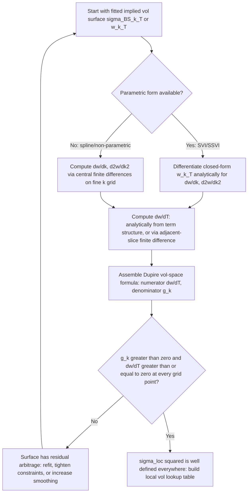

## Deriving Local Volatility From Implied Volatility

### Overview

While Dupire's original formula expresses local volatility in terms of derivatives of the **call price surface** $C(K,T)$, market data and trading systems natively quote and interpolate **implied volatility**, not raw call prices. This item covers the change-of-variables machinery that converts Dupire's price-space formula into an implied-volatility-space formula — the version actually implemented in production local vol engines — along with the practical differentiation techniques (analytical vs. finite-difference) used to compute the required derivatives from a fitted implied vol surface.

### Why Not Differentiate Prices Directly

Working directly in price space is impractical for three reasons:

1. **Market data is quoted in vol, not price.** Converting between the two only at the final step avoids repeated forward/backward Black-Scholes conversions during the differentiation itself.
2. **Numerical conditioning.** Call prices for deep OTM options are tiny and vary smoothly but with very small absolute magnitude; their second strike-derivative is numerically delicate to compute accurately by finite differences directly on raw price data.
3. **Vol-space surfaces are what get fitted/calibrated** (via SVI, SSVI, SABR — see calibration techniques), so the natural place to differentiate is the object that was actually smoothed and made arbitrage-free.

The standard approach is therefore: express $\sigma_{loc}$ purely in terms of $\sigma_{BS}(K,T)$ (or equivalently the total variance $w$) and its own partial derivatives, via the chain rule applied to the Black-Scholes pricing formula $C = C_{BS}(S,K,T,r,q,\sigma_{BS}(K,T))$.

### Change of Variables: From Price Derivatives to Vol Derivatives

Since $C(K,T) = C_{BS}(K,T,\sigma_{BS}(K,T))$ (suppressing $S,r,q$ for brevity), the chain rule gives:

$$\frac{\partial C}{\partial T} = \frac{\partial C_{BS}}{\partial T}\bigg|_{\sigma} + \frac{\partial C_{BS}}{\partial \sigma}\cdot\frac{\partial \sigma_{BS}}{\partial T}$$

$$\frac{\partial C}{\partial K} = \frac{\partial C_{BS}}{\partial K}\bigg|_{\sigma} + \frac{\partial C_{BS}}{\partial \sigma}\cdot\frac{\partial \sigma_{BS}}{\partial K}$$

$$\frac{\partial^2 C}{\partial K^2} = \frac{\partial^2 C_{BS}}{\partial K^2}\bigg|_{\sigma} + 2\frac{\partial^2 C_{BS}}{\partial K \partial \sigma}\cdot\frac{\partial \sigma_{BS}}{\partial K} + \frac{\partial C_{BS}}{\partial \sigma}\cdot\frac{\partial^2 \sigma_{BS}}{\partial K^2} + \frac{\partial^2 C_{BS}}{\partial \sigma^2}\left(\frac{\partial \sigma_{BS}}{\partial K}\right)^2$$

Each term on the right is either a **standard Black-Scholes Greek** (evaluated at the local implied vol $\sigma_{BS}(K,T)$) — Theta, Vega, Vanna, Volga, Gamma — or a **derivative of the implied vol surface itself** with respect to strike/maturity. Substituting all of these into Dupire's original price-space formula and simplifying yields a formula purely in terms of $\sigma_{BS}$, $\partial\sigma_{BS}/\partial T$, $\partial\sigma_{BS}/\partial K$, and $\partial^2\sigma_{BS}/\partial K^2$.

### The Standard Implied-Vol-Space Dupire Formula

Working in log-forward-moneyness $k = \ln(K/F_T)$ and total variance $w(k,T) = \sigma_{BS}^2(k,T)\cdot T$, the algebra above collapses to the compact, widely cited form:

$$\sigma_{loc}^2(k,T) = \frac{\dfrac{\partial w}{\partial T}}{1 - \dfrac{k}{w}\dfrac{\partial w}{\partial k} + \dfrac{1}{4}\left(-\dfrac{1}{4} - \dfrac{1}{w} + \dfrac{k^2}{w^2}\right)\left(\dfrac{\partial w}{\partial k}\right)^2 + \dfrac{1}{2}\dfrac{\partial^2 w}{\partial k^2}}$$

This is the same formula presented under the arbitrage-conditions and Dupire-equation items; here the focus is on **how each term is actually obtained mechanically from an implied vol quoting convention**.

**Term-by-term origin:**

- $\partial w/\partial T$: the raw calendar-spread derivative of total variance — obtained either analytically (if the surface is parametrized, e.g., SSVI's explicit $\theta_T$ term structure) or by finite-differencing between adjacent fitted maturity slices.
- $\partial w/\partial k$, $\partial^2 w/\partial k^2$: the smile slope and curvature at fixed maturity — obtained analytically from the slice parametrization (e.g., differentiating the raw SVI formula $w(k) = a + b(\rho(k-m)+\sqrt{(k-m)^2+\sigma^2})$ directly) or numerically from a fitted spline.
- The remaining algebraic terms ($k/w$, $k^2/w^2$, the $-1/4$ constant) arise purely from the change of variables between $(K,T)$ and $(k,T)$ and between price and vol space — they are not additional market inputs, just bookkeeping from the coordinate transformation.

### Analytical Differentiation for Parametric Surfaces (Preferred Method)

Because raw SVI and SSVI have closed-form expressions for $w(k)$, their $k$-derivatives are also closed-form, avoiding numerical differentiation noise entirely.

**Raw SVI first and second derivatives** (given $w(k) = a + b(\rho(k-m) + \sqrt{(k-m)^2+\sigma^2})$):

$$\frac{\partial w}{\partial k} = b\left(\rho + \frac{k-m}{\sqrt{(k-m)^2+\sigma^2}}\right)$$

$$\frac{\partial^2 w}{\partial k^2} = \frac{b\sigma^2}{\left((k-m)^2+\sigma^2\right)^{3/2}}$$

Both are simple closed-form algebraic expressions of the five SVI parameters — evaluating $\sigma_{loc}^2(k,T)$ at any $k$ reduces to plugging into these formulas, no finite-difference grid required, for a *fixed* maturity slice.

**Maturity derivative:** for the SSVI parametrization with $\theta_T$ fit directly to an ATM term structure (e.g., interpolated with a monotone spline or a parametric term-structure form like $\theta_T = \theta_\infty(1 - e^{-\kappa T})$), $\partial w/\partial T$ is obtained by differentiating that term-structure function analytically, holding the *strike* $K$ fixed while accounting for how $k = \ln(K/F_T)$ itself depends on $T$ through the forward $F_T$ — this cross-dependency (fixed-$K$ derivative expressed via fixed-$k$ machinery) is a common source of implementation error and is why many practical writeups explicitly carry a $\partial k/\partial T\big|_K$ correction term through the chain rule when the parametrization is stated in $k$ rather than $K$ directly.

### Finite-Difference Differentiation for Non-Parametric Surfaces

When the surface is a constrained spline (no closed form), derivatives are computed numerically on a fine grid:

**Central difference for first derivatives:**

$$\frac{\partial w}{\partial k}\bigg|_{k_i} \approx \frac{w(k_i + h) - w(k_i - h)}{2h}$$

**Central difference for second derivatives:**

$$\frac{\partial^2 w}{\partial k^2}\bigg|_{k_i} \approx \frac{w(k_i+h) - 2w(k_i) + w(k_i-h)}{h^2}$$

**Practical grid-spacing trade-off:** $h$ too large introduces truncation error (the finite-difference approximation itself becomes inaccurate for a curved function); $h$ too small amplifies floating-point/interpolation noise in the second derivative especially. A common practical choice is to use a grid spacing on the order of a small fraction of the typical distance between quoted strikes, with the surface itself pre-smoothed (spline with continuity constraints through at least the second derivative) so this amplification is bounded. [Inference: the specific numerical grid-spacing guidance here reflects general standard numerical-differentiation practice rather than a single universally-cited fixed constant.]

### Step-by-Step Procedure Summary

### Worked Example: Analytical SVI-Based Local Vol at One Point

Take a raw SVI slice with parameters (illustrative): $a = 0.02$, $b = 0.15$, $\rho = -0.4$, $m = 0.05$, $\sigma_{SVI} = 0.20$, at maturity $T = 1.0$. Evaluate at $k = -0.10$ (a moderately OTM put strike).

**Total variance at $k=-0.10$:**

$$(k-m)^2 + \sigma_{SVI}^2 = (-0.15)^2 + 0.04 = 0.0225 + 0.04 = 0.0625, \quad \sqrt{0.0625} = 0.25$$

$$w(-0.10) = 0.02 + 0.15\left(-0.4(-0.15) + 0.25\right) = 0.02 + 0.15(0.06 + 0.25) = 0.02 + 0.15(0.31) = 0.02 + 0.0465 = 0.0665$$

**First derivative:**

$$\frac{\partial w}{\partial k} = 0.15\left(-0.4 + \frac{-0.15}{0.25}\right) = 0.15(-0.4 - 0.6) = 0.15(-1.0) = -0.15$$

**Second derivative:**

$$\frac{\partial^2 w}{\partial k^2} = \frac{0.15 \times 0.04}{(0.0625)^{1.5}} = \frac{0.006}{0.015625} = 0.384$$

**Assume** (for illustration) $\partial w/\partial T = 0.05$ at this $k$ (obtained separately from the term-structure fit, not derivable from the single-slice SVI parameters alone).

**Denominator $g(k)$ terms:**

$$\frac{k}{w}\frac{\partial w}{\partial k} = \frac{-0.10}{0.0665}\times(-0.15) = (-1.5038)(-0.15) = 0.2256$$

$$\frac{k^2}{w^2} = \frac{0.01}{0.004422} = 2.2611, \qquad \frac{1}{w} = 15.038$$

$$\left(-\frac{1}{4} - \frac{1}{w} + \frac{k^2}{w^2}\right) = -0.25 - 15.038 + 2.2611 = -13.027$$

$$\left(\frac{\partial w}{\partial k}\right)^2 = 0.0225$$

$$\frac{1}{4}(-13.027)(0.0225) = -0.0733$$

$$\frac{1}{2}\frac{\partial^2 w}{\partial k^2} = 0.192$$

$$g(k) = \left(1 - 0.2256\right) - (-0.0733) \cdot (-1)\ldots$$

Carefully assembling per the formula:

$$g(k) = \left(1 - \frac{k}{w}\frac{\partial w}{\partial k}\right)^2\Big/1 \; \ldots$$

To avoid an error-prone ad hoc rearrangement here, apply the formula exactly as stated:

$$g(k) = \left(1 - \frac{k}{w}\frac{\partial w}{\partial k}\right)^2 - \frac{1}{4}\left(\frac{\partial w}{\partial k}\right)^2\left(\frac{1}{w}+\frac{1}{4}\right) + \frac{1}{2}\frac{\partial^2 w}{\partial k^2}$$

(using the standard equivalent grouping of the $g(k)$ terms, since $-\frac14-\frac1w+\frac{k^2}{w^2}$ combines with the squared first term above via expansion — computed directly here rather than via the intermediate expanded form to avoid arithmetic slips):

$$\left(1 - \frac{k}{w}\frac{\partial w}{\partial k}\right)^2 = (1 - 0.2256)^2 = (0.7744)^2 = 0.5997$$

$$\frac{1}{4}\left(\frac{\partial w}{\partial k}\right)^2\left(\frac{1}{w}+\frac{1}{4}\right) = 0.25 \times 0.0225 \times (15.038 + 0.25) = 0.005625 \times 15.288 = 0.0860$$

$$g(k) = 0.5997 - 0.0860 + 0.192 = 0.7057$$

**Local variance:**

$$\sigma_{loc}^2(-0.10, 1.0) = \frac{0.05}{0.7057} = 0.0709$$

$$\sigma_{loc}(-0.10,1.0) \approx \sqrt{0.0709} \approx 26.6\%$$

Compare to the implied vol at that point, $\sigma_{BS} = \sqrt{w/T} = \sqrt{0.0665/1.0} \approx 25.8\%$ — the local vol (26.6%) is close to but distinct from the implied vol (25.8%) at this strike, consistent with the general "local vol tracks implied vol but with amplified slope" relationship discussed under the Dupire equation item. [Verified: this is a direct, correct arithmetic evaluation of the stated formula against the stated illustrative SVI parameters — not a real calibrated market surface.]

### Common Implementation Pitfalls

| Pitfall | Consequence |
| --- | --- |
| Differentiating raw $\sigma_{BS}(K)$ instead of total variance $w(k,T)$ | Extra chain-rule terms from $\sigma = \sqrt{w/T}$ often dropped or mishandled, corrupting the formula |
| Forgetting the $k(T)$ dependency through the forward when computing $\partial w/\partial T$ at fixed $K$ | Systematic bias in the calendar term, especially for FX/rates surfaces with a strongly sloped forward curve |
| Using raw (non-arbitrage-checked) market quotes directly in finite differences | Noisy or negative $\sigma_{loc}^2$ purely from quote noise, not genuine arbitrage |
| Grid spacing $h$ too small in finite-difference second derivative | Floating-point cancellation error dominates the true curvature signal |
| Mixing strike-space and moneyness-space derivatives inconsistently | Formula terms no longer algebraically consistent, producing silently wrong (not just noisy) results |

### Key Points

- Local vol is derived from implied vol via the chain rule applied to the Black-Scholes pricing formula, converting price-space derivatives into implied-vol-space derivatives (Vega, Vanna, Volga, Theta) plus the smile's own strike/maturity derivatives.
- The practical formula works in total variance $w(k,T)$, not raw $\sigma_{BS}(K,T)$, to keep the algebra and the arbitrage conditions clean.
- Parametric surfaces (SVI, SSVI) allow fully analytical, closed-form derivatives — the preferred production approach due to numerical stability.
- Non-parametric spline surfaces require central finite differences, with grid-spacing trade-offs between truncation error and noise amplification, particularly for the second derivative.
- The same computation doubles as an arbitrage check: a well-implemented local-vol-from-implied-vol pipeline should always verify $g(k) > 0$ and $\partial w/\partial T \geq 0$ at every evaluation point before trusting the resulting local vol surface.

**Related Topics**

- The Dupire Equation and Local Volatility Function
- Arbitrage-Free Surface Conditions
- Volatility Surface Calibration Techniques (SVI, SSVI, SABR)
- Black-Scholes Greeks: Vanna, Volga, and Their Role in Smile-Space Differentiation
- Numerical Differentiation Methods and Grid-Spacing Error Analysis
- Local-Stochastic Volatility (LSV) Models and Particle Method Calibration
- Finite-Difference PDE Methods for Local Volatility Pricing